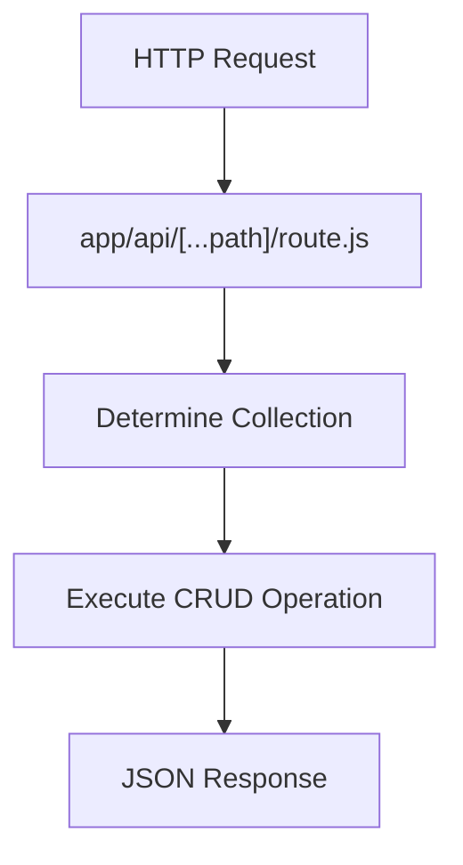
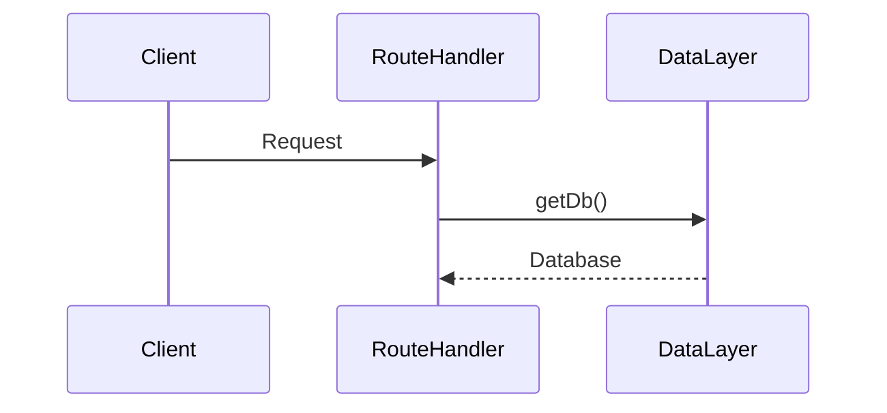
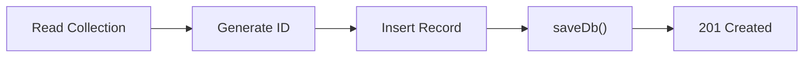
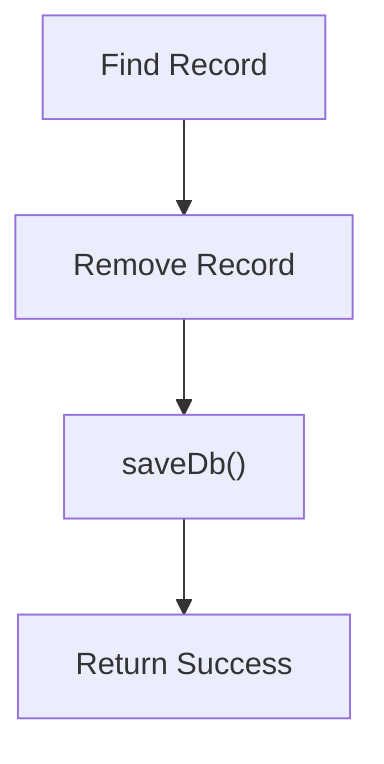
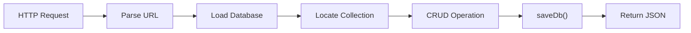

# Building Greymatter API Server with Next.js 16

## Part 5 – Implementing the Generic CRUD Engine

In the previous chapter, we designed the architecture for Greymatter's Generic CRUD Engine. We learned how a single Route Handler can serve every collection without requiring individual controllers.

In this chapter, we'll begin implementing that design.

By the end of this chapter, Greymatter will expose its first fully functional REST API capable of creating, reading, updating, and deleting records from **any collection** stored in the database.

This chapter marks an important milestone—the project evolves from a collection of supporting components into a working API server.

---

# Learning Objectives

After completing this chapter you will be able to:

* Build a dynamic Route Handler
* Parse REST paths
* Handle HTTP methods
* Read request bodies
* Return JSON responses
* Connect Route Handlers to the Data Layer
* Implement a reusable CRUD engine

---

# Building One API for Everything

Unlike traditional REST applications, Greymatter has only one CRUD Route Handler.

Create the following directory:

```text
app/api/[...path]/
```

Inside it create:

```text
route.js
```

This Route Handler becomes responsible for every REST request.

---

# Why a Catch-All Route?

The App Router allows dynamic route segments.

Using:

```text
[...path]
```

means every request under `/api` is routed through the same file.

For example:

| Request            | Path Array          |
| ------------------ | ------------------- |
| `/api/users`       | `["users"]`         |
| `/api/users/5`     | `["users","5"]`     |
| `/api/posts`       | `["posts"]`         |
| `/api/products/18` | `["products","18"]` |

Instead of dozens of Route Handlers, we only need one.



---

# Anatomy of a Request

Every incoming request provides four important pieces of information.

| Information  | Example      |
| ------------ | ------------ |
| HTTP Method  | GET          |
| Collection   | users        |
| Record ID    | 15           |
| Query String | `_sort=name` |

These values determine how the request should be processed.

---

# Parsing the URL

Suppose the client sends:

```text
GET /api/users/5
```

The Route Handler receives:

```text
path[0] = users

path[1] = 5
```

This immediately tells us:

* collection = users
* record = 5

No routing table is necessary.

---

# Loading the Database

Every request begins the same way.



The Route Handler never reads `db.json` directly.

Instead it asks the Data Layer for the current database.

This keeps persistence isolated.

---

# Finding the Collection

Suppose the database looks like this.

```json
{
  "users": [],
  "posts": [],
  "products": []
}
```

If the request targets:

```text
/api/posts
```

the Route Handler simply selects:

```text
database.posts
```

If the collection doesn't exist, the API returns:

```http
404 Not Found
```

---

# GET Requests

GET has two modes.

## List Records

```http
GET /api/users
```

Returns every record in the collection.

---

## Retrieve a Single Record

```http
GET /api/users/7
```

The Route Handler searches for:

```text
id == 7
```

If found:

```http
200 OK
```

Otherwise:

```http
404 Not Found
```

---

# POST Requests

POST creates a new record.

Example:

```http
POST /api/users
```

Body:

```json
{
  "name": "Alice",
  "email": "alice@example.com"
}
```

The CRUD engine:

1. Reads the collection.
2. Finds the highest existing ID.
3. Generates the next ID.
4. Inserts the record.
5. Saves the database.
6. Returns the new object.



Automatic ID generation keeps the API simple for clients.

---

# PUT Requests

PUT replaces an existing object.

Example:

```http
PUT /api/users/3
```

The existing record is completely overwritten.

Every field should be supplied.

---

# PATCH Requests

PATCH updates only selected fields.

Example:

```json
{
    "email": "alice@newdomain.com"
}
```

The Route Handler merges the supplied properties into the existing object.

This is useful for editing a single value without replacing the whole document.

---

# DELETE Requests

Deleting follows the same workflow.



If the record does not exist:

```http
404 Not Found
```

---

# Saving Changes

Every operation that modifies data eventually calls:

```javascript
await saveDb(database)
```

Notice something important.

The CRUD engine doesn't know whether the data is stored in:

* db.json
* Vercel Blob Storage

It simply asks the Data Layer to persist the changes.

---

# Complete Request Lifecycle

Every CRUD operation follows the same pattern.



Whether the request is GET, POST, PUT, PATCH, or DELETE, the overall lifecycle remains consistent.

---

# Why This Design Scales

Suppose tomorrow a developer creates a new collection:

```json
{
  "books": []
}
```

Immediately, the API supports:

```text
GET    /api/books
POST   /api/books
GET    /api/books/1
PUT    /api/books/1
PATCH  /api/books/1
DELETE /api/books/1
```

No JavaScript code changes.

No new controllers.

No routing configuration.

This is one of Greymatter's greatest strengths.

---

# Error Handling

A robust API should return meaningful responses.

| Situation          | Response                  |
| ------------------ | ------------------------- |
| Collection missing | 404 Not Found             |
| Record missing     | 404 Not Found             |
| Invalid JSON       | 400 Bad Request           |
| Unsupported method | 405 Method Not Allowed    |
| Unexpected error   | 500 Internal Server Error |

Returning consistent status codes makes the API predictable for frontend applications.

---

# Testing the API

After implementing the Route Handler, test it using curl.

Retrieve all users.

```bash
curl http://localhost:3000/api/users
```

Create a new user.

```bash
curl -X POST http://localhost:3000/api/users \
-H "Content-Type: application/json" \
-d '{"name":"Alice"}'
```

Retrieve the created record.

```bash
curl http://localhost:3000/api/users/1
```

Delete the record.

```bash
curl -X DELETE http://localhost:3000/api/users/1
```

These four commands verify the entire CRUD lifecycle.

---

# Exercises

1. Create the catch-all Route Handler.
2. Parse the collection name from the URL.
3. Implement GET.
4. Implement POST.
5. Implement PUT.
6. Implement PATCH.
7. Implement DELETE.
8. Return appropriate HTTP status codes.
9. Test every operation with curl.
10. Commit your work to Git.

---

# Summary

In this chapter, we transformed Greymatter into a working REST API.

Using a single catch-all Route Handler, we implemented a Generic CRUD Engine capable of serving any collection stored in the database. Every request follows the same lifecycle: parse the URL, load the database, locate the collection, perform the requested operation, persist any changes through the Data Layer, and return a JSON response.

This architecture eliminates the need for resource-specific controllers, making the application compact, maintainable, and highly extensible.

---

# Next Up

In **Part 6 – Advanced Query Features**, we'll enhance the API with powerful querying capabilities inspired by JSON Server. We'll implement sorting, pagination, embedded relationships, filtering, and search, allowing frontend developers to prototype realistic applications without writing custom backend code.
