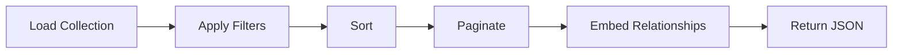
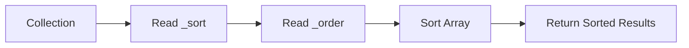
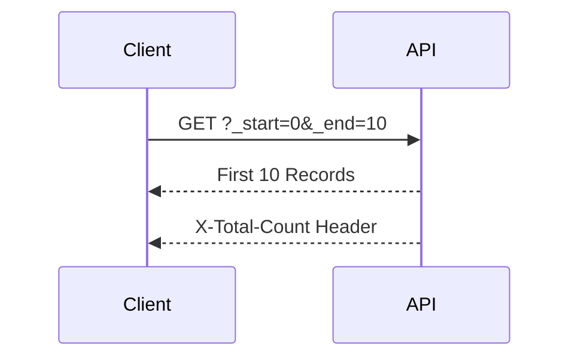
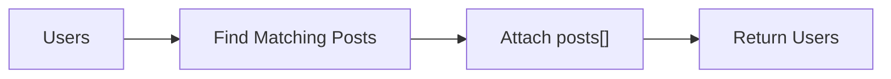
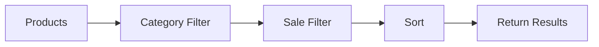
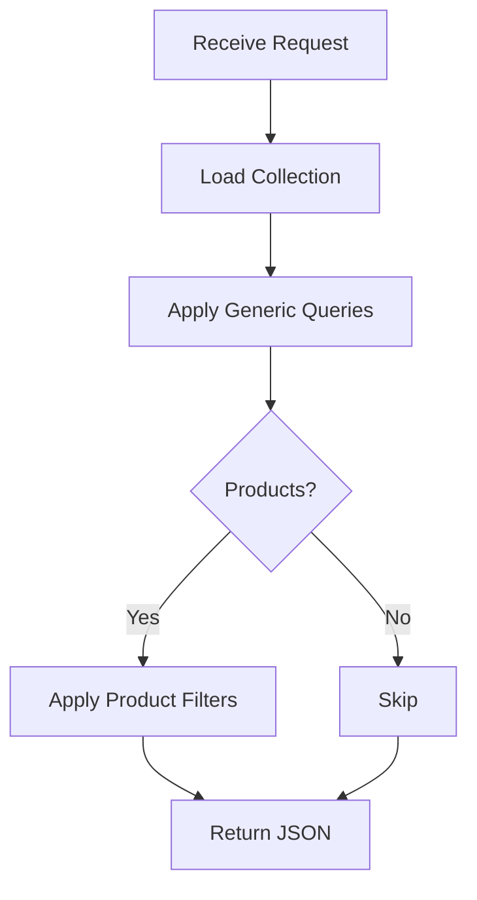

# Building Greymatter API Server with Next.js 16

## Part 6 – Advanced Query Features

Up to this point, Greymatter provides a complete CRUD API. Clients can create, retrieve, update, and delete records from any collection.

While this is sufficient for many applications, modern frontends typically require more sophisticated data retrieval. They need to sort records, paginate results, search collections, and retrieve related data.

In this chapter, we'll extend our Generic CRUD Engine with powerful query capabilities inspired by JSON Server while maintaining a clean, generic architecture.

By the end of this chapter, your API will support:

* Sorting
* Pagination
* Relationship embedding
* Collection filtering
* Product searching
* Specialized endpoints

---

# Learning Objectives

After completing this chapter you will be able to:

* Parse query parameters
* Sort collections
* Paginate results
* Embed related resources
* Filter datasets
* Build collection-specific extensions
* Keep a generic API extensible

---

# Why Query Parameters?

Returning an entire collection is rarely enough.

Imagine a collection containing 50,000 users.

```http
GET /api/users
```

Returning every record would:

* Waste bandwidth
* Increase response times
* Slow browsers
* Make pagination impossible

Instead, REST APIs use query parameters to modify responses.

Example:

```http
GET /api/users?_sort=name&_order=asc&_start=0&_end=20
```

---

# Query Processing Pipeline

Greymatter processes every request using the same pipeline.



Each stage transforms the dataset before it is returned.

---

# Reading Query Parameters

Next.js exposes query parameters through the request URL.

Example request:

```http
GET /api/users?_sort=name&_order=desc
```

The Route Handler extracts:

| Parameter | Value  |
| --------- | ------ |
| `_sort`   | `name` |
| `_order`  | `desc` |

Every query feature begins by reading these values.

---

# Sorting Results

Sorting allows clients to request ordered data.

Example:

```http
GET /api/users?_sort=name
```

returns:

```text
Alice
Bob
Charlie
David
```

Descending order:

```http
GET /api/users?_sort=name&_order=desc
```

returns:

```text
David
Charlie
Bob
Alice
```

---

# Sorting Workflow



Sorting occurs in memory before the response is sent.

The underlying database is never modified.

---

# Pagination

Large datasets should be returned in smaller pages.

Greymatter supports JSON Server style pagination.

Example:

```http
GET /api/users?_start=0&_end=10
```

This returns:

Records:

```text
0
↓

9
```

instead of the entire collection.

---

# X-Total-Count

When pagination is used, Greymatter also returns:

```http
X-Total-Count: 342
```

This allows frontend applications to calculate:

* total pages
* current page
* remaining pages

without downloading the entire dataset.

---

# Pagination Workflow



This makes pagination simple for frontend frameworks.

---

# Embedding Relationships

One of Greymatter's most useful features is relationship embedding.

Suppose the database contains:

```json
{
  "users": [],
  "posts": []
}
```

Each post contains:

```text
userId
```

Instead of making two API calls, clients can request:

```http
GET /api/users?_embed=posts
```

---

# Embedded Response

The API transforms:

```json
{
    "id": 1,
    "name": "Alice"
}
```

into:

```json
{
    "id": 1,
    "name": "Alice",
    "posts": [
        ...
    ]
}
```

Every matching post is automatically included.

---

# Relationship Workflow



Embedding removes the need for multiple client requests.

---

# User Sub-Resources

Greymatter also supports nested resources.

Example:

```http
GET /api/users/1/posts
```

The API automatically returns:

```text
All posts where:

userId == 1
```

This pattern follows common REST conventions.

---

# Collection Filtering

Some collections require custom behavior.

The Products collection supports filtering.

Example:

```http
GET /api/products?category=electronics
```

returns only products in that category.

---

# Searching Products

Clients can search product names and descriptions.

```http
GET /api/products?search=laptop
```

The search is:

* case insensitive
* partial matching
* generic across searchable fields

---

# Sale Filtering

Retrieve discounted products.

```http
GET /api/products?sale=true
```

Only products currently on sale are returned.

---

# Product Sorting

Products support simplified sorting.

Example:

```http
GET /api/products?sort=-price
```

The minus sign indicates descending order.

```text
Highest Price

↓

Lowest Price
```

---

# Combining Features

Query parameters may be combined.

Example:

```http
GET /api/products?category=electronics&sale=true&sort=-price
```

Processing order:



This produces predictable responses.

---

# Generic vs Specialized Features

Most query features are generic.

They work for every collection.

| Feature  | Generic |
| -------- | ------- |
| `_sort`  | ✓       |
| `_order` | ✓       |
| `_start` | ✓       |
| `_end`   | ✓       |
| `_embed` | ✓       |

Some features belong only to certain collections.

| Feature    | Collection |
| ---------- | ---------- |
| `category` | products   |
| `sale`     | products   |
| `search`   | products   |
| `sort`     | products   |

This keeps the API flexible without making the generic engine overly complex.

---

# Complete Request Lifecycle

Every query request follows the same process.



Notice that specialized logic is applied only when necessary.

---

# Testing Query Features

Sort users.

```bash
curl "http://localhost:3000/api/users?_sort=name&_order=desc"
```

Paginate users.

```bash
curl "http://localhost:3000/api/users?_start=0&_end=5"
```

Embed posts.

```bash
curl "http://localhost:3000/api/users?_embed=posts"
```

Search products.

```bash
curl "http://localhost:3000/api/products?search=wireless"
```

Filter products.

```bash
curl "http://localhost:3000/api/products?category=electronics&sale=true&sort=-price"
```

These examples exercise every major query feature in the API.

---

# Code Walkthrough

In the production Greymatter codebase, the catch-all Route Handler performs query processing after it has loaded the requested collection but before returning the response.

The implementation follows a pipeline:

1. Load the collection from the data layer.
2. Apply generic filters (`_sort`, `_order`, `_start`, `_end`, `_embed`).
3. Detect whether the request targets a collection with specialized behavior (such as `products`).
4. Apply any collection-specific filtering.
5. Return the transformed dataset.

By keeping generic and specialized logic separate, the code remains easy to maintain while allowing individual collections to expose richer functionality.

---

# Exercises

1. Implement `_sort`.
2. Add `_order`.
3. Implement `_start` and `_end`.
4. Return the `X-Total-Count` header.
5. Add `_embed`.
6. Implement `/api/users/:id/posts`.
7. Add product search.
8. Add product category filtering.
9. Add sale filtering.
10. Test combinations of query parameters.

---

# Summary

In this chapter, we transformed Greymatter from a simple CRUD server into a feature-rich mock API suitable for real frontend development.

We added sorting, pagination, relationship embedding, nested resources, and collection-specific filters while preserving the simplicity of the Generic CRUD Engine. By processing requests through a predictable query pipeline, the API remains both powerful and maintainable.

These capabilities allow frontend applications to simulate realistic production APIs without requiring a custom backend implementation.

---

# Next Up

In **Part 7 – Building the Administration API**, we'll create the endpoints that power the Greymatter dashboard. You'll implement collection management, dataset uploads, preset loading, downloads, and storage reset operations—the administrative features that make Greymatter more than just a REST API.
