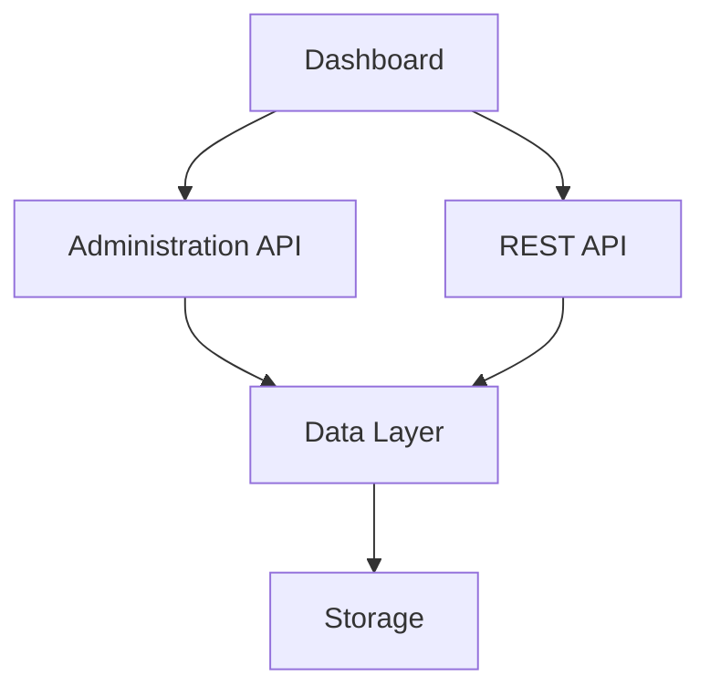
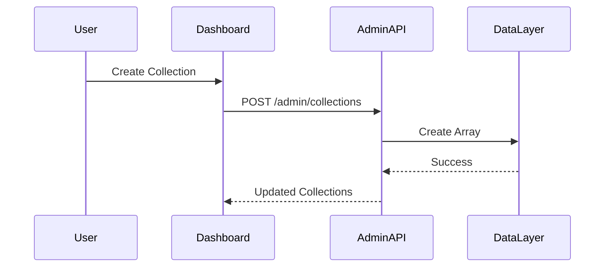
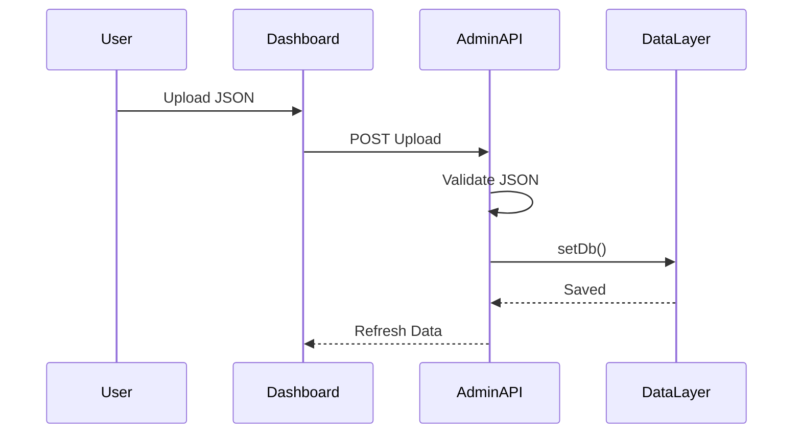
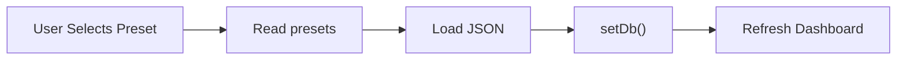
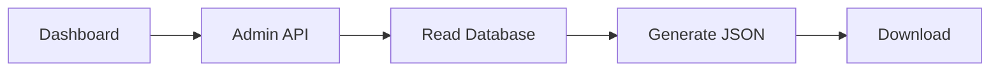
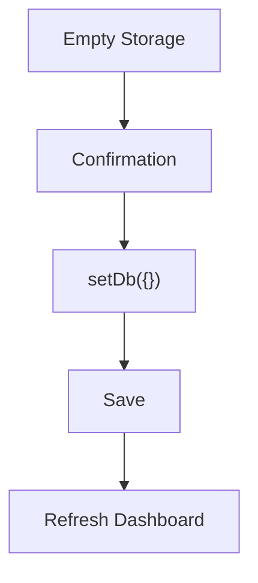

# Building Greymatter API Server with Next.js 16

## Part 7 – Building the Administration API

In the previous chapter, we enhanced our Generic CRUD Engine with sorting, pagination, embedded relationships, and collection-specific queries.

Although the REST API is now feature complete, Greymatter still lacks one of its defining features—a browser-based administration interface.

Rather than requiring developers to edit `db.json` manually, Greymatter exposes a dedicated **Administration API** that powers the dashboard.

This separation keeps the public REST API clean while providing powerful management capabilities.

By the end of this chapter you will have:

* A dedicated Administration API
* Collection management
* Dataset upload support
* Preset loading
* Dataset download
* Storage reset
* Dashboard integration points

---

# Learning Objectives

After completing this chapter you will be able to:

* Separate public and administrative APIs
* Build management endpoints
* Handle file uploads
* Import and export datasets
* Reset application state
* Design APIs specifically for administrative tasks

---

# Why Separate the Administration API?

The REST API is intended for applications.

Examples include:

```text
GET /api/users

POST /api/products

PATCH /api/orders/15
```

The dashboard, however, performs a different set of operations.

It needs to:

* Upload datasets
* Create collections
* Delete collections
* Download collections
* Load presets
* Reset storage

These operations do not belong in the public REST API.

Instead, they are grouped under a dedicated Administration API.

---

# Overall Architecture



Notice that both APIs share the same Data Layer.

Only their responsibilities differ.

---

# Administration Endpoints

Greymatter exposes several management endpoints.

| Endpoint                                      | Purpose                       |
| --------------------------------------------- | ----------------------------- |
| `/admin/upload`                               | Import a dataset              |
| `/admin/download`                             | Export collections            |
| `/admin/presets`                              | Load demo datasets            |
| `/admin/collections`                          | Create and delete collections |
| `/admin/reset` *(or equivalent reset action)* | Clear all stored data         |

Together, these endpoints provide everything required by the dashboard.

---

# Public API vs Administration API

It is important to distinguish between the two.

| Public REST API         | Administration API            |
| ----------------------- | ----------------------------- |
| CRUD operations         | Manage datasets               |
| Used by applications    | Used by dashboard             |
| Operates on records     | Operates on collections       |
| Stable public interface | Internal management interface |

This separation follows good API design principles.

---

# Creating Collections

A collection is simply a new array inside the database.

Suppose the administrator creates:

```text
reviews
```

The database changes from:

```json
{}
```

to:

```json
{
  "reviews": []
}
```

Immediately, the Generic CRUD Engine exposes:

```text
GET /api/reviews

POST /api/reviews

PUT /api/reviews/:id

PATCH /api/reviews/:id

DELETE /api/reviews/:id
```

No routing changes are required.

---

# Collection Creation Workflow



The dashboard can immediately begin using the new collection.

---

# Deleting Collections

Deleting a collection removes the entire dataset.

Example:

```text
users
```

is removed from:

```json
{
  "users": [],
  "posts": []
}
```

leaving:

```json
{
  "posts": []
}
```

Every endpoint associated with the deleted collection automatically disappears.

---

# Uploading Datasets

One of Greymatter's most useful features is replacing the database with an uploaded JSON document.

Example:

```json
{
  "users": [
    {
      "id": 1,
      "name": "Alice"
    }
  ],
  "posts": [
    {
      "id": 1,
      "title": "Hello"
    }
  ]
}
```

The uploaded document becomes the new database.

---

# Upload Workflow



Notice that uploads replace the entire dataset.

This makes importing demo projects extremely simple.

---

# Loading Presets

Greymatter ships with predefined datasets stored in:

```text
presets/
```

Example:

```text
presets/

├── full-demo.json

├── ecommerce.json

└── blog.json
```

Selecting a preset loads the corresponding JSON document and replaces the current database.

---

# Preset Loading Workflow



The workflow is almost identical to uploading a file.

---

# Downloading Data

Greymatter supports exporting datasets.

Users can download:

* a single collection
* the complete database

Downloads make it easy to:

* create backups
* share datasets
* reuse test data
* distribute demo projects

---

# Download Workflow



No data is modified during this process.

---

# Empty Storage

Sometimes developers need a completely clean environment.

Instead of deleting collections individually, the dashboard can clear the database.

Result:

```json
{}
```

All collections disappear.

The dashboard immediately reflects the new state.

---

# Reset Workflow



This operation is irreversible.

---

# Dashboard Communication

The dashboard never edits storage directly.

Instead it communicates exclusively through the Administration API.

```mermaid
flowchart LR

Dashboard

-->

Administration API

-->

Data Layer

-->

Storage
```

This keeps all business logic on the server.

---

# Why Not Modify db.json Directly?

Editing storage from the browser would create several problems.

* Security issues
* Duplicate business logic
* Difficult validation
* Inconsistent behaviour

By routing every operation through the Administration API, Greymatter ensures:

* validation
* consistent responses
* proper persistence
* reusable server-side logic

---

# Code Walkthrough

In the production codebase, the dashboard never manipulates the database directly.

Instead, every administrative action triggers an HTTP request.

Examples include:

* Create Collection
* Delete Collection
* Upload Dataset
* Load Preset
* Download Collection
* Empty Storage

Each endpoint performs validation before calling the Data Layer.

Ultimately, every operation ends with one of three persistence methods:

```javascript
await getDb()

await saveDb()

await setDb()
```

Because all persistence is centralized, the dashboard remains independent of the storage implementation.

---

# Testing the Administration API

Typical administrative operations include:

Create a collection.

```bash
curl -X POST http://localhost:3000/admin/collections \
-H "Content-Type: application/json" \
-d '{"name":"reviews"}'
```

Delete a collection.

```bash
curl -X DELETE "http://localhost:3000/admin/collections?name=reviews"
```

Load a preset.

```text
POST /admin/presets
```

Upload a dataset.

```text
POST /admin/upload
```

Download a collection.

```text
GET /admin/download
```

---

# Exercises

1. Create the Administration API directory.
2. Implement collection creation.
3. Implement collection deletion.
4. Implement dataset upload.
5. Implement preset loading.
6. Implement dataset download.
7. Implement empty storage.
8. Verify that every operation updates the dashboard.
9. Confirm that every mutation persists through the Data Layer.
10. Commit your work to Git.

---

# Summary

In this chapter, we built the Administration API that powers the Greymatter dashboard.

Rather than extending the public REST API with management functionality, we created a dedicated set of endpoints responsible for collection management, uploads, downloads, presets, and storage maintenance.

This separation keeps the architecture clean while allowing the dashboard to provide a rich, browser-based management experience.

The Administration API, together with the Generic CRUD Engine, forms the two primary interfaces into the Greymatter platform.

---

# Next Up

In **Part 8 – Building the Dashboard**, we'll move to the frontend and create the browser interface that interacts with both the REST API and the Administration API. You'll build the status indicator, collection cards, dataset browser, Quick Start guide, upload controls, preset loader, and download tools that make Greymatter easy to use without writing a single API request by hand.
