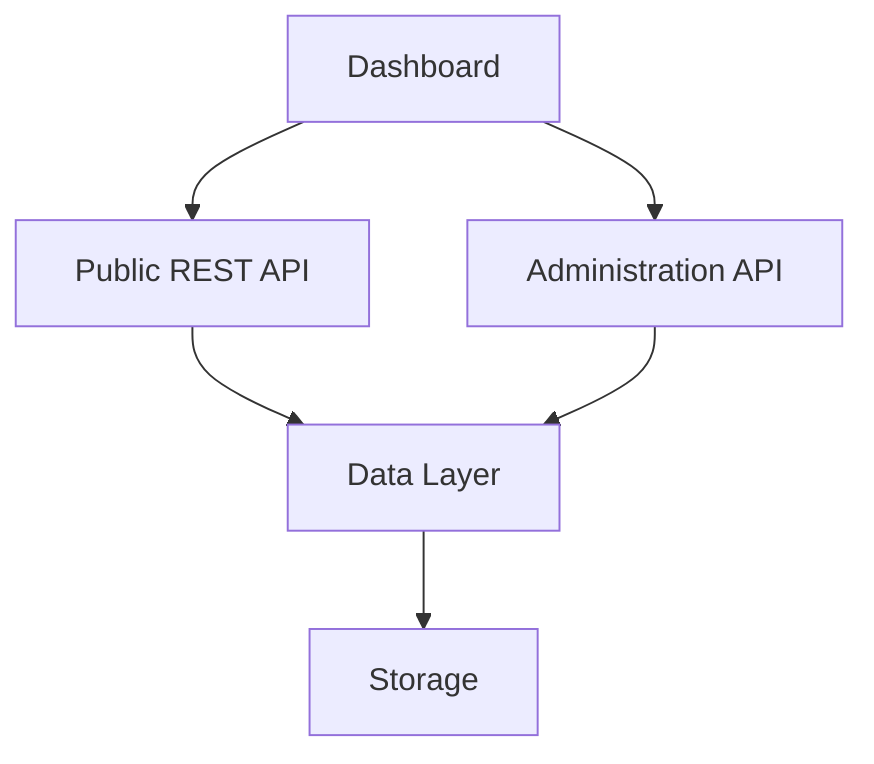
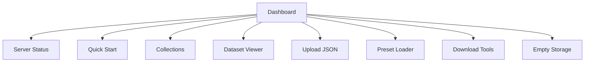
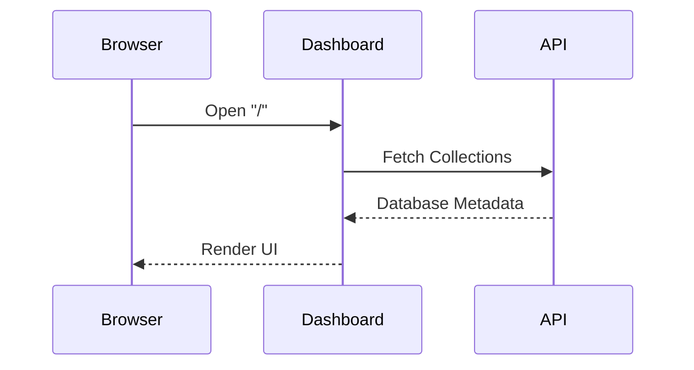
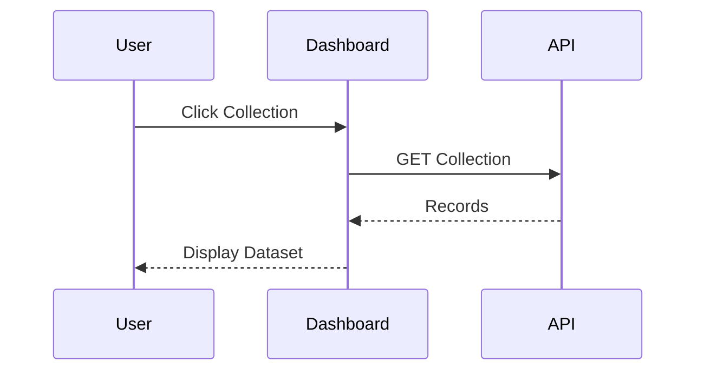
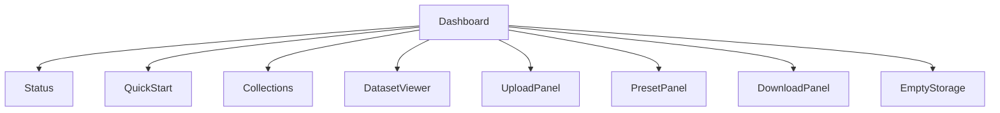
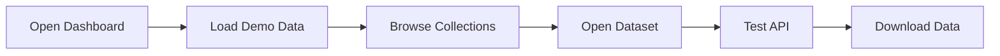

# Building Greymatter API Server with Next.js 16

## Part 8 – Building the Dashboard

In the previous chapter, we built the Administration API that manages collections, uploads, presets, downloads, and storage operations.

Although every feature is now accessible through HTTP requests, manually using `curl` quickly becomes tedious. Greymatter solves this by providing a modern browser-based dashboard that communicates with both the Public REST API and the Administration API.

In this chapter, we'll build the dashboard—the feature that transforms Greymatter from a REST API into a complete developer tool.

By the end of this chapter you will have:

* A responsive administration dashboard
* Server status monitoring
* Collection browser
* Quick Start guide
* Dataset viewer integration
* Upload and preset controls
* Download tools
* Automatic UI refresh after mutations

---

# Learning Objectives

After completing this chapter you will be able to:

* Build a modern administrative interface
* Connect React components to REST APIs
* Organize a dashboard into reusable sections
* Manage application state
* Refresh data after server-side mutations
* Design an intuitive developer experience

---

# Why Build a Dashboard?

Many mock API servers require developers to:

* Edit JSON files manually
* Restart the server
* Remember API endpoints
* Use command-line tools

Greymatter removes these obstacles by providing a browser interface where every common operation is only a click away.

The dashboard makes the server approachable for developers, testers, educators, and students alike.

---

# Dashboard Architecture

The dashboard communicates with two independent APIs.



The dashboard never accesses storage directly.

---

# Dashboard Layout

The completed dashboard consists of several independent sections.



Each section performs one clearly defined responsibility.

---

# The Server Status Card

The first component users see is the server status.

It provides immediate feedback that the API is running.

Typical information includes:

* Online / Offline status
* Base API URL
* Number of collections
* Available endpoints

Example:

```text
● Online

http://localhost:3000/api
```

This gives developers confidence that the server is ready.

---

# Loading Dashboard Data

When the dashboard loads, it retrieves the current state of the database.



Every visible section depends on this initial request.

---

# The Quick Start Guide

The Quick Start section provides ready-to-use API examples.

For example:

```bash
curl http://localhost:3000/api/users
```

```bash
curl http://localhost:3000/api/products
```

The examples are generated dynamically from the available collections.

If the database contains:

```text
users
posts
comments
```

the dashboard automatically displays commands for all three.

No manual configuration is required.

---

# Conditional Rendering

Some dashboard components appear only when they are useful.

For example:

| Component        | Hidden When            |
| ---------------- | ---------------------- |
| Quick Start      | No collections exist   |
| Collection Cards | Database is empty      |
| Dataset Viewer   | No collection selected |

This keeps the interface clean and uncluttered.

---

# Collection Cards

Each collection is displayed as a card.

Example:

```text
Users

Records: 42

[Open]

[Download]

[Delete]
```

The cards provide quick access to the most common operations.

---

# Rendering Collections

```mermaid
flowchart LR

Database

-->

Collection List

-->

Collection Cards

-->

Dashboard
```

Each card is generated dynamically.

Creating a new collection immediately adds a new card.

Deleting one removes it automatically.

---

# Selecting a Collection

Clicking a collection card opens the Dataset Viewer.



No page reload is required.

---

# Upload Controls

The dashboard provides two methods for importing data.

* Upload a JSON file
* Paste JSON directly

Both methods ultimately call:

```text
POST /admin/upload
```

The uploaded dataset replaces the existing database.

---

# Preset Loader

Greymatter includes predefined datasets.

The dashboard allows users to load them with a single click.

```mermaid
flowchart LR

User

-->

Choose Preset

-->

Administration API

-->

Load Dataset

-->

Refresh Dashboard
```

No manual file management is required.

---

# Download Tools

The dashboard supports two download operations.

## Download Collection

Exports one collection.

Example:

```text
users.json
```

---

## Download All

Exports every collection.

Example:

```text
users.json

posts.json

products.json
```

These downloads make it easy to create backups or share datasets.

---

# Empty Storage

The Empty Storage button resets the application.

Before clearing the database, the dashboard asks for confirmation.

```mermaid
flowchart TD

Click Button

-->

Confirmation

-->

Clear Database

-->

Refresh Dashboard
```

After completion:

* Collections disappear
* Dataset Viewer closes
* Quick Start is hidden

The dashboard immediately reflects the empty state.

---

# Refreshing the Dashboard

One of Greymatter's design goals is that users should never need to refresh their browser manually.

Every successful mutation follows the same pattern.

```mermaid
flowchart LR

User Action

-->

Administration API

-->

Data Updated

-->

Refresh Dashboard

-->

Update Components
```

Whether users:

* upload data
* create collections
* delete collections
* load presets

the dashboard refreshes automatically.

---

# React Component Structure

As the dashboard grows, dividing it into reusable components keeps the code manageable.

A simplified component hierarchy looks like this.



Each component has a single responsibility.

---

# Managing State

The dashboard maintains several pieces of state.

Examples include:

| State               | Purpose                      |
| ------------------- | ---------------------------- |
| Collections         | Available datasets           |
| Selected Collection | Current dataset              |
| Records             | Data displayed in the viewer |
| Loading             | Display progress indicators  |
| Error               | Display validation messages  |

Keeping state centralized simplifies updates after API calls.

---

# Code Walkthrough

In the production Greymatter application, the dashboard is implemented as a React application using the Next.js App Router.

When the page loads, it:

1. Retrieves the current collections.
2. Displays the server status.
3. Renders collection cards.
4. Generates Quick Start examples.
5. Waits for user interaction.

Every button on the dashboard triggers an HTTP request rather than modifying state directly.

After the request succeeds, the dashboard refreshes its data from the server to ensure the UI always reflects the current database.

This server-first approach avoids inconsistencies between the browser and the persisted data.

---

# User Workflow

A typical development session follows this sequence.



This workflow demonstrates how the dashboard and API complement each other.

---

# Exercises

1. Create the dashboard home page.
2. Display server status.
3. Render collection cards dynamically.
4. Generate Quick Start commands.
5. Connect Upload JSON to the Administration API.
6. Connect Load Preset.
7. Implement Download.
8. Implement Download All.
9. Add Empty Storage confirmation.
10. Refresh the dashboard automatically after every successful mutation.

---

# Summary

In this chapter, we built the browser interface that makes Greymatter a practical development tool.

Rather than requiring developers to work directly with JSON files or command-line utilities, the dashboard provides a clean, responsive interface for managing datasets, testing APIs, and administering the application.

By separating presentation from business logic and relying entirely on the Public REST API and Administration API, the dashboard remains lightweight while accurately reflecting the current state of the server.

---

# Next Up

In **Part 9 – Building the Dataset Viewer**, we'll focus on one of the dashboard's most useful features. You'll implement a paginated data viewer capable of displaying records from any collection, navigating large datasets, switching collections dynamically, and keeping the displayed data synchronized with every change made through the API or dashboard.
