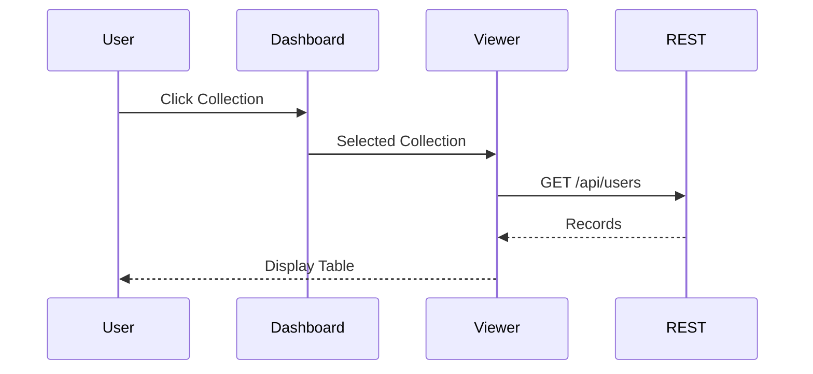
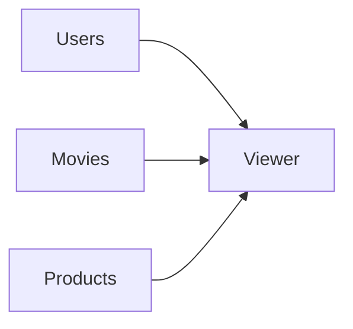
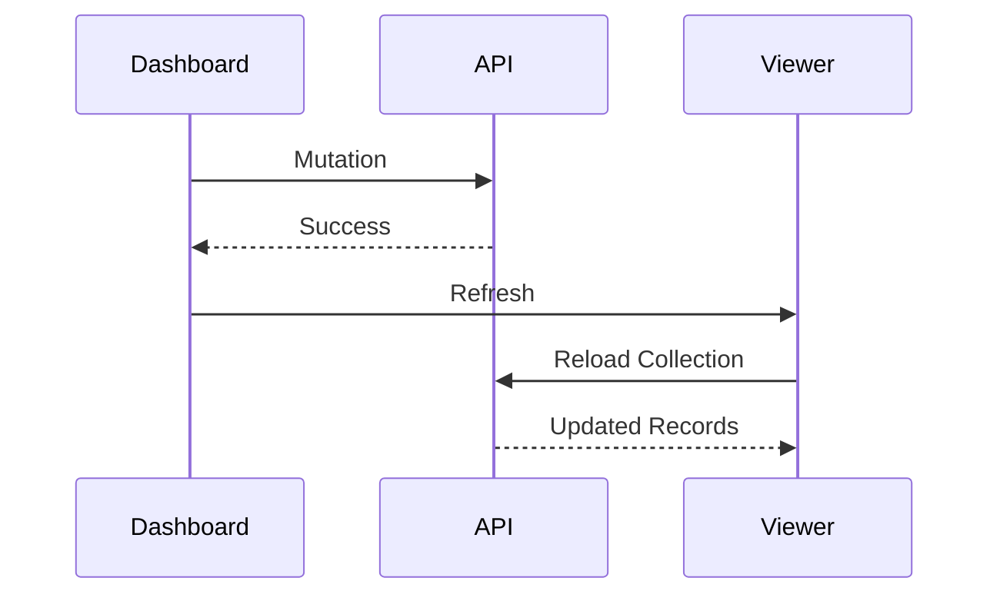

# Building Greymatter API Server with Next.js 16

## Part 9 – Building the Dataset Viewer

In the previous chapter, we built the Greymatter dashboard and connected it to both the Public REST API and the Administration API.

The dashboard can now display collections, upload datasets, load presets, and manage storage. However, users still cannot inspect the actual records inside a collection.

In this chapter, we'll build one of Greymatter's most useful features—the **Dataset Viewer**.

The Dataset Viewer allows developers to browse records stored in any collection directly from the browser without making manual API requests.

By the end of this chapter you will have:

* A reusable Dataset Viewer component
* Dynamic collection loading
* Pagination
* JSON record rendering
* Collection switching
* Automatic refresh after mutations

---

# Learning Objectives

After completing this chapter you will be able to:

* Display arbitrary JSON datasets
* Build reusable React components
* Paginate large collections
* Manage component state
* Render dynamic table structures
* Synchronize the UI with the backend

---

# Why a Dataset Viewer?

Mock API servers often expose data only through REST endpoints.

For developers, this means repeatedly using:

* curl
* Postman
* Insomnia
* Browser Developer Tools

to inspect stored data.

Greymatter improves the development experience by making datasets visible directly in the browser.

---

# Viewer Architecture

The Dataset Viewer sits between the dashboard and the REST API.

```mermaid
flowchart LR

Dashboard

-->

Dataset Viewer

-->

REST API

-->

Data Layer

-->

Storage
```

Unlike the Administration API, the Dataset Viewer retrieves data using the same public API consumed by frontend applications.

---

# Selecting a Collection

The Dataset Viewer remains hidden until a collection is selected.

Clicking a collection card changes the current selection.



The viewer updates without refreshing the page.

---

# Dynamic Collection Loading

Because Greymatter supports unlimited collections, the Dataset Viewer cannot be hardcoded for a particular schema.

Instead, it builds itself dynamically.

For example, selecting:

```text
users
```

requests:

```http
GET /api/users
```

Selecting:

```text
movies
```

requests:

```http
GET /api/movies
```

The component works with every collection.

---

# Determining Table Columns

Collections may contain completely different fields.

Example:

Users

```json
{
  "id": 1,
  "name": "Alice",
  "email": "alice@example.com"
}
```

Products

```json
{
  "id": 1,
  "name": "Laptop",
  "price": 1499,
  "sale": true
}
```

Instead of defining columns manually, the Dataset Viewer inspects the records and generates columns automatically.

---

# Dynamic Table Generation

```mermaid
flowchart LR

Records

-->

Inspect Keys

-->

Generate Columns

-->

Render Table
```

This allows the same component to display any dataset.

---

# Handling Large Collections

Some collections may contain thousands of records.

Rendering every record would:

* Increase memory usage
* Slow the browser
* Make navigation difficult

Instead, the Dataset Viewer displays one page at a time.

---

# Pagination

Greymatter displays up to **50 records per page**.

```text
Page 1

Records 1–50
```

```text
Page 2

Records 51–100
```

Navigation controls include:

* Previous
* Next

These controls remain disabled when additional pages are unavailable.

---

# Pagination Workflow

```mermaid
flowchart LR

Load Records

-->

Calculate Pages

-->

Display Current Page

-->

Previous / Next
```

Only the visible page is rendered.

---

# Viewing JSON Values

Datasets often contain nested structures.

Example:

```json
{
  "id": 1,
  "name": "Alice",
  "address": {
    "city": "Singapore",
    "country": "Singapore"
  }
}
```

Rather than attempting to flatten every object, the Dataset Viewer renders nested values as formatted JSON.

This keeps the component generic.

---

# Empty Collections

If a collection contains no records, the viewer displays a friendly message.

```text
No records found.
```

Instead of rendering an empty table.

This provides a better user experience.

---

# Switching Collections

Users can switch between collections instantly.



Every selection triggers a new API request.

The previous dataset is discarded and replaced with the new one.

---

# Automatic Refresh

Whenever data changes, the Dataset Viewer updates automatically.

Examples include:

* Creating a record
* Deleting a record
* Uploading a dataset
* Loading a preset
* Emptying storage

---

# Refresh Workflow



The viewer always reflects the latest persisted data.

---

# Component Responsibilities

The Dataset Viewer has a single responsibility:

**Display records.**

It does **not**:

* Create records
* Delete records
* Modify collections
* Upload files

Those tasks belong to the dashboard and Administration API.

This separation keeps components simple and reusable.

---

# State Management

The Dataset Viewer maintains only a small amount of state.

| State               | Purpose              |
| ------------------- | -------------------- |
| Selected Collection | Current dataset      |
| Records             | Current page of data |
| Current Page        | Pagination           |
| Loading             | Display progress     |
| Error               | Display failures     |

Everything else is retrieved from the server.

---

# Error Handling

Common situations include:

| Situation          | Display              |
| ------------------ | -------------------- |
| Collection missing | Collection not found |
| Empty collection   | No records found     |
| Network failure    | Unable to load data  |
| Server error       | Try again later      |

Providing meaningful feedback helps users diagnose problems quickly.

---

# Code Walkthrough

In the production Greymatter codebase, the Dataset Viewer is implemented as a reusable React component.

Its workflow is straightforward:

1. Receive the selected collection name.
2. Request records from the Public REST API.
3. Determine the table columns from the returned data.
4. Render the current page of records.
5. Refresh automatically whenever the dashboard detects a successful mutation.

Because the viewer relies entirely on the Public REST API, it never needs to know where or how data is stored.

This keeps the component independent of both the Data Layer and the storage implementation.

---

# User Workflow

A typical interaction with the Dataset Viewer looks like this.

```mermaid
flowchart LR

Open Dashboard

-->

Select Collection

-->

Load Records

-->

Browse Pages

-->

Switch Collection

-->

Load New Records
```

The entire workflow occurs without reloading the browser.

---

# Testing the Dataset Viewer

Verify the following behaviour:

* Select different collections.
* Confirm that the table updates.
* Browse multiple pages.
* Upload a new dataset.
* Ensure the viewer refreshes automatically.
* Delete a collection.
* Verify the viewer closes if the selected collection no longer exists.

These tests confirm that the Dataset Viewer stays synchronized with the server.

---

# Exercises

1. Build the Dataset Viewer component.
2. Load records from the Public REST API.
3. Generate table columns dynamically.
4. Implement pagination.
5. Add Previous and Next navigation.
6. Display nested objects as formatted JSON.
7. Handle empty collections gracefully.
8. Refresh automatically after mutations.
9. Test with multiple collections.
10. Commit your work to Git.

---

# Summary

In this chapter, we built the Dataset Viewer—the primary interface for exploring stored data in Greymatter.

Rather than relying on external tools such as Postman or curl, developers can inspect collections directly from the browser. By generating table structures dynamically, supporting pagination, and synchronizing automatically with the backend, the Dataset Viewer remains generic enough to display any collection while providing a fast and intuitive browsing experience.

Together with the dashboard, it completes the core user interface of the Greymatter platform.

---

# Next Up

In **Part 10 – Importing and Exporting Data**, we'll implement Greymatter's data portability features. You'll build JSON uploads, clipboard paste support, preset loading, single-collection downloads, and complete database exports, making it easy to move datasets between projects and development environments.
