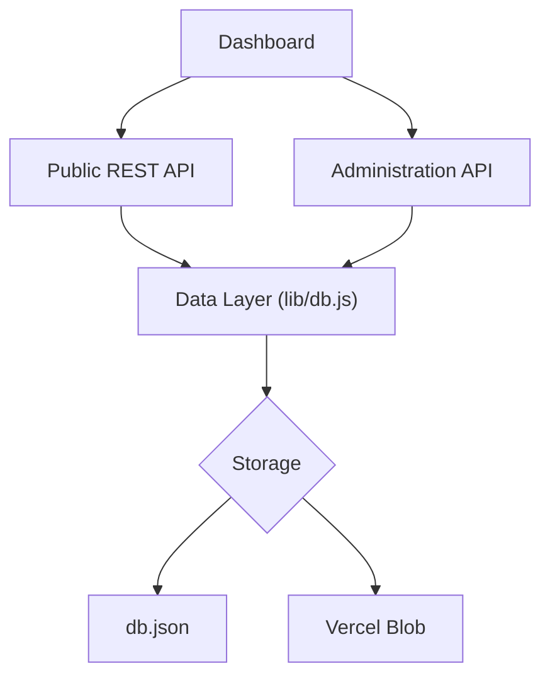
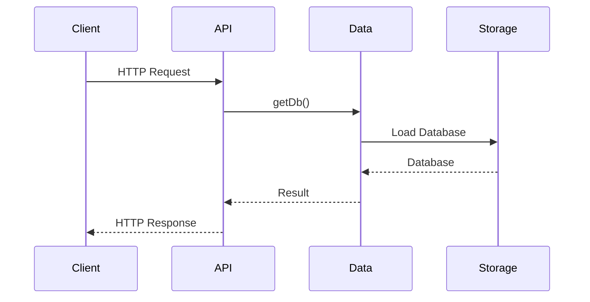

# Appendix A – Project Structure

Throughout this tutorial we've built Greymatter incrementally, evolving it from a simple local mock API into a cloud-ready Next.js application capable of running both locally and on Vercel.

This appendix provides an overview of the final project structure and explains the purpose of each major directory.

---

# Final Project Structure

```text
greymatter-api-server/
│
├── app/
│   ├── admin/
│   │   ├── collections/
│   │   ├── empty/
│   │   ├── list/
│   │   ├── load-preset/
│   │   ├── status/
│   │   └── upload/
│   │
│   ├── api/
│   │   ├── [...path]/
│   │   ├── health/
│   │   ├── products/
│   │   └── users/
│   │       └── [id]/posts/
│   │
│   ├── globals.css
│   ├── layout.js
│   └── page.js
│
├── docs/
│
├── lib/
│   └── db.js
│
├── presets/
│
├── test-data/
│
├── db.json
│
├── README.md
├── package.json
├── next.config.js
└── jsconfig.json
```

Although the project is relatively small, each directory has a clearly defined responsibility.

---

# Overall Architecture



The application is organized into four logical layers:

* Presentation Layer
* API Layer
* Data Layer
* Storage Layer

Each layer depends only on the layer beneath it.

---

# app/

The `app/` directory contains the Next.js application.

It includes:

* the dashboard
* Route Handlers
* application layout
* global styling

This directory represents both the presentation layer and the HTTP API layer.

---

# app/page.js

The application's home page.

This page renders the Greymatter dashboard.

The dashboard provides:

* Server status
* Quick Start guide
* Collection browser
* Dataset Viewer
* Upload tools
* Preset loader
* Download tools
* Empty storage controls

The dashboard communicates exclusively through HTTP endpoints.

It never reads or writes storage directly.

---

# app/layout.js

Defines the root application layout shared by every page.

Typical responsibilities include:

* HTML shell
* metadata
* global styling
* page structure

---

# app/globals.css

Contains global styles used throughout the dashboard.

---

# app/api/

The `app/api` directory contains the **Public REST API**.

It exposes every collection as a REST resource.

Example endpoints include:

```text
GET /api/users

GET /api/posts

GET /api/products
```

The API is responsible for:

* CRUD operations
* query processing
* pagination
* sorting
* embedded resources

---

# app/api/[...path]/

This is Greymatter's Generic CRUD Engine.

Instead of creating one Route Handler for every collection, every request is processed by this catch-all route.

Examples include:

```text
GET /api/users

GET /api/books

POST /api/orders

DELETE /api/products/4
```

The Route Handler determines:

* collection
* record ID
* HTTP method

at runtime.

This allows Greymatter to support unlimited collections without additional routing.

---

# app/api/products/

Provides product-specific query features.

Examples include:

* category filtering
* sale filtering
* search
* price sorting

This endpoint demonstrates how collection-specific behaviour can coexist alongside the Generic CRUD Engine.

---

# app/api/users/[id]/posts/

Implements a nested resource.

Example:

```text
GET /api/users/1/posts
```

Returns all posts belonging to a specific user.

This demonstrates parent-child relationships within the API.

---

# app/api/health/

Provides operational information about the server.

Example response:

```json
{
  "status": "ok",
  "timestamp": "...",
  "entities": {
    "users": 12,
    "posts": 41
  }
}
```

The dashboard uses this endpoint to determine server health.

---

# app/admin/

The `app/admin` directory contains the Administration API.

Unlike the Public REST API, these endpoints manage the application itself.

Responsibilities include:

* collection management
* uploads
* preset loading
* storage management
* dashboard support

---

# app/admin/status/

Returns dashboard status information.

The dashboard uses this endpoint during initialization.

---

# app/admin/list/

Returns the list of available collections.

This endpoint populates:

* collection cards
* Quick Start examples
* Dataset Viewer

---

# app/admin/collections/

Creates and deletes collections.

Example operations include:

* Create a collection
* Delete a collection

Because collections are data, creating one immediately creates a new REST endpoint.

---

# app/admin/upload/

Imports a JSON dataset.

Supported methods include:

* file upload
* pasted JSON

Uploads replace the current database.

---

# app/admin/load-preset/

Loads one of the bundled datasets stored in the `presets/` directory.

Examples include:

* full-demo
* users-only
* movies-only

---

# app/admin/empty/

Removes every collection from storage.

After completion the dashboard refreshes automatically.

---

# lib/

The `lib` directory contains Greymatter's shared business logic.

Currently the project contains a single module.

```text
lib/

└── db.js
```

---

# lib/db.js

This is the application's Data Layer.

Every read and write operation passes through this module.

Typical operations include:

* `getDb()`
* `saveDb()`
* `setDb()`

The rest of the application never interacts with storage directly.

One of the key responsibilities of `db.js` is abstracting the storage provider.

During local development it reads and writes `db.json`.

When deployed to Vercel, it transparently switches to Vercel Blob Storage.

This abstraction allows the remainder of the application to remain unchanged regardless of where the data is stored.

---

# presets/

Contains reusable datasets.

Current presets include:

```text
full-demo.json
movies-only.json
users-only.json
```

These can be loaded directly from the dashboard.

---

# test-data/

Contains sample datasets used for development and testing.

Current contents include:

```text
books.json
```

This directory is useful for testing uploads and validating API behaviour.

---

# docs/

Project documentation is maintained separately from the application source.

Current documentation includes:

* Architecture Guide
* API Guide
* Deployment Guide
* Tutorial
* User Guide
* Software Requirements Document
* Testing Guide
* Release Notes

Keeping documentation together makes the repository easier to maintain.

---

# db.json

During local development this file stores the application's data.

Example:

```json
{
  "users": [],
  "posts": [],
  "products": []
}
```

When running on Vercel, the same logical database is stored in Vercel Blob Storage.

---

# Request Lifecycle

Every request follows the same general flow.



This simple flow is used by both the Public REST API and the Administration API.

---

# Key Architectural Principles

Greymatter is built around several core design principles.

### Generic CRUD

Collections are treated as data rather than code.

Adding a collection automatically exposes a REST endpoint.

---

### Separation of Concerns

The application separates:

* Dashboard
* Public API
* Administration API
* Data Layer
* Storage

Each module has a clearly defined responsibility.

---

### Storage Independence

Business logic never depends on a specific storage provider.

Changing from `db.json` to Vercel Blob required changes only within `lib/db.js`.

---

### Serverless Ready

The application runs unchanged in both local and serverless environments.

This makes Greymatter suitable for development, demonstrations, education, and cloud deployment.

---

# Architecture Summary

The completed Greymatter platform consists of:

* A Next.js dashboard
* A Generic REST API
* An Administration API
* A reusable Data Layer
* Dynamic collection management
* Local and cloud storage support

Although the implementation is intentionally lightweight, it demonstrates many of the architectural patterns used in larger production systems, including layered architecture, abstraction, separation of concerns, and reusable service design.
