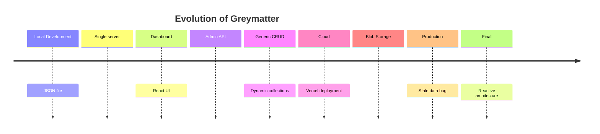
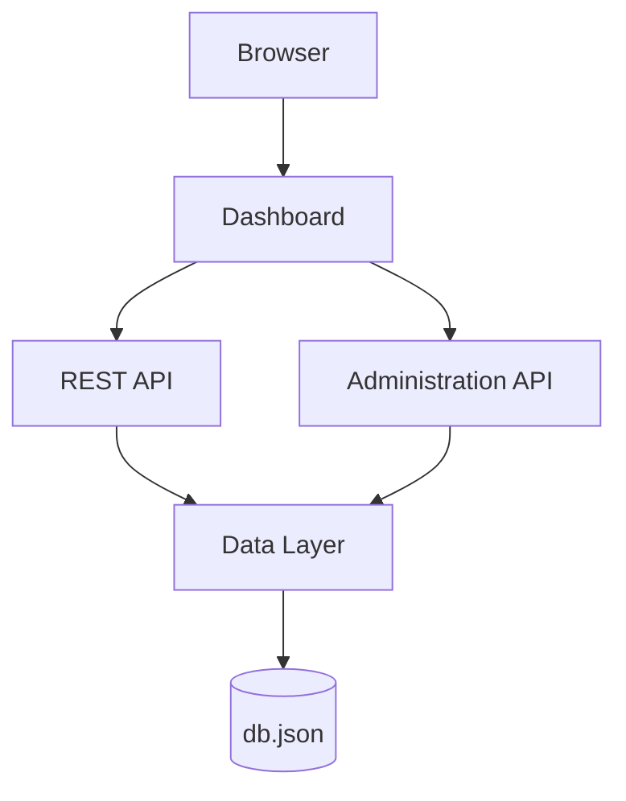

# Appendix B  
# Case Study: Engineering Greymatter API for the Cloud

> *Designing a Serverless Mock API Platform for Production*

## Introduction

Most software tutorials end once the application works.

Professional software engineering begins **after** the application works.

Moving software from a developer’s laptop into production often exposes behaviors that were never visible during local development. In Greymatter’s case, the transition from a local JSON-backed app to a cloud-deployed, serverless, blob-backed system revealed a stale-read bug that only appeared in production. [vercel](https://vercel.com/docs/vercel-blob)

This appendix documents that journey end to end: discovering the bug, reproducing it, forming hypotheses, testing assumptions, trying several fixes, and ultimately redesigning part of the architecture so the system became simpler and more reliable. [react](https://react.dev/reference/react/useState)

## Evolution of Greymatter

Greymatter did not begin as a cloud platform.

It started as a local development tool, then grew into a browser-based dashboard with an administration API, then evolved into a more generic CRUD system for dynamic collections, and finally moved onto Vercel with Blob storage backing the data layer. The bug discussed in this appendix emerged only after that cloud migration, which is why the local version looked correct for so long. [vercel](https://vercel.com/storage/blob)



## Original Architecture

The original system was layered and easy to understand.

The browser used the dashboard, the dashboard called both the public REST API and the administration API, and both APIs relied on the same underlying data layer and JSON file. That design worked well locally because every request lived in the same process and the same filesystem, so reads and writes stayed tightly synchronized. [vercel](https://vercel.com/storage/blob)



Each layer had a clear responsibility.

The dashboard handled user interaction and rendering. The REST API served application data. The administration API handled edits and maintenance operations. The data layer isolated file access so the rest of the application did not need to know whether data came from JSON, a database, or an object store. [react](https://react.dev/reference/react/useState)

## Why Local Worked

Local development hid the problem for several reasons.

There was a single process, so writes and reads happened in a predictable order. The filesystem was shared, so the updated file was visible immediately to the same running app. There were no multiple instances, no propagation delay, no CDN layer, and no distributed storage behavior to expose timing issues. [vercel](https://vercel.com/docs/vercel-blob)

In other words, local development created the illusion that “save” and “read” were effectively the same instant. That assumption held in a single-process environment, but it became unreliable once the app moved to serverless infrastructure and blob-backed storage. [vercel](https://vercel.com/docs/vercel-blob)

## Enter Serverless

Serverless changes the shape of the system.

Instead of one long-lived server handling all requests, each request may be processed by an independent function instance, and requests can be routed to different instances over time. That means there is no guarantee that the function handling a write is the same one handling the subsequent read, and there is no shared in-memory state to lean on. [vercel](https://vercel.com/blog/functions-tab)

```text
Traditional

Client
  ↓
Server
  ↓
Database
```

```text
Serverless

Client
  ↓
Load Balancer
  ↓
Lambda A
Lambda B
Lambda C
  ↓
Blob
```

That difference matters because the application had quietly depended on a local, stateful assumption: after a write, the next read would see the new data immediately. In serverless systems, that assumption is much weaker, especially when the persistence layer is an object store with its own caching behavior. [vercel](https://vercel.com/blog/functions-tab)

## Understanding Blob Storage

Blob storage is not a database.

It is not a filesystem either.

It is an object store: you put objects in, get objects out, and rely on the storage platform’s rules for replication, caching, and visibility. [vercel](https://vercel.com/storage/blob)

Vercel Blob is designed as a fast object storage service, and public blob URLs are cached in both Vercel’s CDN and the browser cache. The documentation also notes that cache behavior can take up to 60 seconds to update behind a blob URL, which is exactly the kind of delay that can produce a stale read after a write. [vercel](https://vercel.com/docs/vercel-blob/public-storage)

That means the storage model is excellent for serving files and public assets, but it is not equivalent to an immediately consistent application database. [vercel](https://vercel.com/docs/vercel-blob/public-storage)

## First Signs of Trouble

The bug surfaced in a very ordinary way.

A user clicked “Load Demo,” the UI stayed on the old data, and nothing obvious happened. Clicking again often made the new data appear, which made the issue feel intermittent and therefore difficult to trust. That kind of symptom is especially dangerous because it looks like a UI problem, a network glitch, or a bad user action before it looks like a system design issue. [vercel](https://vercel.com/docs/vercel-blob)

The important clue was that the failure was not permanent.

The same action sometimes worked on the second try, which suggested the problem was timing-related rather than logically incorrect. That made the investigation focus on freshness, propagation, and the path between the write and the subsequent read. [vercel](https://vercel.com/docs/vercel-blob/public-storage)

## Reproducing the Bug

The investigation started with simple questions.

Was the write failing? Was the response wrong? Was the dashboard ignoring the result? Was the data layer returning stale content? Each hypothesis was tested against the actual behavior of the deployed system rather than assumptions carried over from local development. [react](https://react.dev/reference/react/useState)

The key realization was that the operation sequence mattered more than the operation itself.

A write would complete successfully, but the dashboard would immediately issue another request to fetch the updated state. In production, that second request could arrive before the updated blob contents had fully propagated through cache and delivery layers. The result was a perfectly valid response that still contained old data. [vercel](https://vercel.com/docs/vercel-blob/public-storage)

## Root Cause Analysis

The root cause was a stale read after write.

The application wrote updated data to Blob storage, then immediately issued a read request expecting the new state to be visible right away. But public blob content is cached, and Vercel documents that cache updates can take up to 60 seconds behind a blob URL. So the sequence could look like this: [vercel](https://vercel.com/docs/vercel-blob/public-storage)

```text
Write
  ↓
Blob
  ↓
Replication / Cache Update
  ↓
Read
  ↓
Old data
```

This was not a failure of React and not a random frontend bug.

It was a distributed-system visibility problem caused by assuming that a write and a subsequent read would always observe the same state immediately. That assumption is safe in some local or strongly consistent setups, but it is not safe for cached object storage. [vercel](https://vercel.com/docs/vercel-blob)

## Why Reload Failed

The first instinct was to refresh the page.

That seemed reasonable because a reload forces the UI to re-request everything from scratch. But a reload does not fix stale upstream data if the read path still reaches cached or not-yet-updated blob content. In other words, a page refresh can make the interface feel more “fresh” without actually solving the data visibility problem. [vercel](https://vercel.com/docs/vercel-blob/public-storage)

A full reload also resets client state unnecessarily.

It discards the current React tree, causes extra network traffic, and makes the UI behave more like a document than an application. React’s state model is specifically designed to let the interface update in place instead of relying on page reloads. [react](https://react.dev/reference/react/useState)

## React State

React state was the correct place to solve the UI side of the problem.

React’s `useState` hook stores component state and updates it for the next render, not the current one. When you call a setter like `setCollections`, React schedules a re-render, and the screen updates from the new state on the next render cycle. That makes state the natural place to show freshly returned data without forcing a full-page reload. [react](https://react.dev/reference/react/useState)

This is also why the response from the API matters so much.

If the server returns the updated collections directly, the dashboard can store them immediately in component state and render the new result in the same interaction flow. That keeps the UI responsive while avoiding a second read that might still be stale. [react](https://react.dev/reference/react/useState)

## Cache Busting

Cache busting was another plausible fix.

Adding a timestamp or unique query parameter, such as `?t=timestamp`, can force browsers and some intermediaries to treat the request as unique. That can help when the main problem is client-side caching. But it does not solve the deeper issue if the underlying blob content itself has not finished propagating. [vercel](https://vercel.com/docs/vercel-blob/public-storage)

So cache busting can reduce one class of freshness bugs, but it cannot guarantee immediate visibility after a write in a cached blob system. [vercel](https://vercel.com/docs/vercel-blob/public-storage)

## Retry Logic

Retries were worth considering because eventual visibility is often a timing problem.

A retry loop with backoff can help when a read may become correct after a short delay. For example, a request can be attempted again after 100 ms, then 200 ms, then 400 ms, and so on. That pattern is useful when you want to tolerate temporary inconsistency rather than fail immediately.

But retries are still a workaround.

They improve resilience, yet they preserve the inefficient design of writing first and then hoping a read will eventually confirm the new state. The better solution is to remove the unnecessary read entirely when possible. [vercel](https://vercel.com/docs/vercel-blob/public-storage)

## Final Insight

The most important lesson was architectural.

Instead of doing this:

```text
POST
  ↓
GET
```

the API should do this:

```text
POST
  ↓
Response contains data
```

That change matters because the server already knows the authoritative updated state at the end of the write operation. If the response includes that state, the dashboard does not need to fetch it again immediately, and the stale-read problem disappears at the interaction level. [react](https://react.dev/reference/react/useState)

This is the clearest example in the appendix of a system becoming better not by adding complexity, but by removing an unnecessary round trip.

## API Redesign

The old API only confirmed success.

```json
{
  "success": true
}
```

The redesigned API returned the updated collections as well.

```json
{
  "success": true,
  "collections": [
    ...
  ]
}
```

That redesign made the endpoint more useful and more truthful.

A successful write should ideally return the data the client needs next, especially when the next step is just to refresh local UI state. Returning the updated collections turns the mutation endpoint into a single source of truth for the immediate user action. [react](https://react.dev/reference/react/useState)

## Dashboard Redesign

The dashboard also became simpler.

The old flow depended on a mutation followed by a reload and then another read:

```text
POST
  ↓
reload
  ↓
GET
```

The new flow updates local state directly:

```text
POST
  ↓
setCollections()
  ↓
Done
```

This is a much better fit for React, because UI state is meant to be updated from the result of an interaction, not reconstructed by reloading the entire page. The code became easier to reason about, and the user experience improved at the same time. [react](https://react.dev/reference/react/useState)

## Before and After

| Before | After |
| --- | --- |
| Two requests | One request |
| Reload page | Update React state |
| Possible stale read | No stale read |
| Multiple Lambdas | Single Lambda |
| Two Blob reads | One Blob write |

The difference is bigger than performance.

The after version has a clearer contract: once the server says the write succeeded, the client already has the updated data it needs. That reduces ambiguity, removes an unnecessary read path, and makes the dashboard feel immediate. [vercel](https://vercel.com/docs/vercel-blob/public-storage)

## Engineering Lessons

This bug taught several durable lessons.

Distributed systems do not behave like single-process local apps, even when the code looks almost identical. Consistency is a property of the whole system, not just the function you wrote. Serverless increases the importance of clear state boundaries because there is no shared memory to hide design weaknesses. [github](https://github.com/orgs/vercel/discussions/2772)

It also reinforced an API design principle: if the server already has the updated truth, return it.

That principle reduces coupling between the write path and the read path and makes the frontend more deterministic. It also fits well with a lightweight CQRS mindset, where commands can return the read model the UI needs immediately instead of forcing a second request. [react](https://react.dev/reference/react/useState)

## Design Patterns Used

Greymatter API’s revised architecture naturally aligns with several patterns.

The repository-style data module isolates storage access behind a small interface, so the rest of the app does not care whether the backing store is JSON, Blob storage, or something else. The administration API acts like a facade by presenting a simplified surface over the underlying data operations. The dashboard uses state management in the React sense, where the UI is driven by state snapshots and updated through setters rather than page reloads. [react](https://react.dev/reference/react/useState)

The layered architecture is especially valuable here.

It keeps storage concerns, API concerns, and UI concerns separate, which made the cloud migration easier to reason about. When the bug appeared, the layer boundaries also helped identify whether the issue belonged to the client, the API, or the storage system. [vercel](https://vercel.com/docs/vercel-blob)

## Looking Forward

There are several natural next steps for Greymatter API.

A real database would provide stronger application-level consistency guarantees than blob storage for mutable data. Redis or Edge Config could help with fast reads, depending on the access pattern. WebSockets or streaming could support live updates, while background jobs could handle heavier synchronization work. Authentication, authorization, OpenAPI generation, and a plugin architecture would make the platform more production-ready and easier to extend. [vercel](https://vercel.com/docs/vercel-blob)

The deeper takeaway is that the final architecture should match the data model.

If the app is truly managing mutable application state, then the storage layer should be chosen for that purpose rather than treating object storage like a database. Greymatter API’s evolution made that distinction visible in a very practical way. [vercel](https://vercel.com/docs/vercel-blob)
