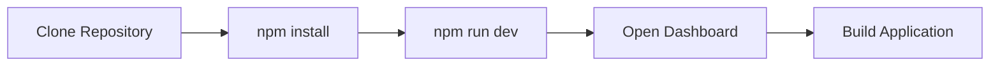
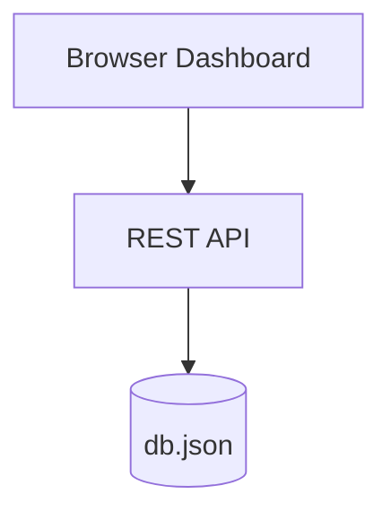
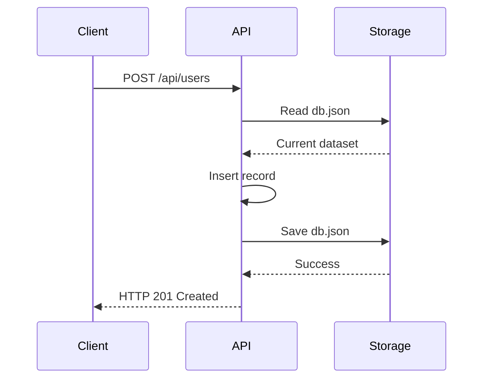
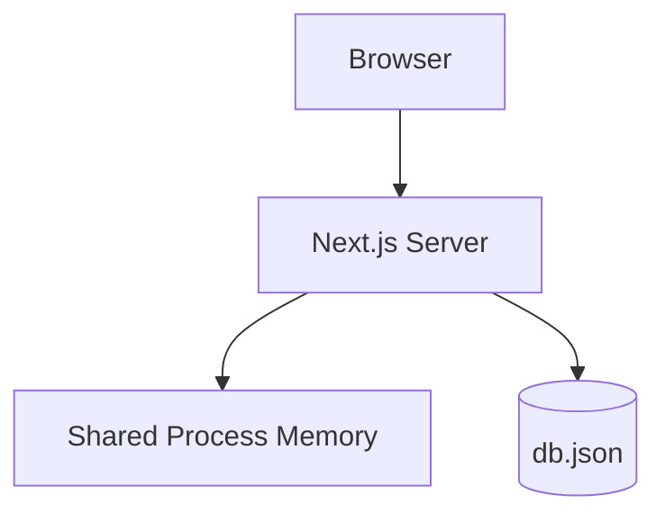
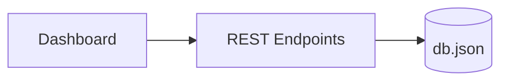

## Chapter 1 — How Greymatter API Started

Every successful software system begins with a problem to solve.

For Greymatter API, the problem was surprisingly common.

Frontend developers frequently need a backend before the real backend exists.

During the early stages of a project, user interfaces often progress much faster than server-side development. Waiting for a production API delays frontend work, while building temporary mock servers repeatedly wastes valuable development time.

Existing solutions solved part of the problem.

Some generated static JSON responses.

Others required complex configuration files.

Many lacked an administrative interface for creating, editing, or inspecting data.

Greymatter API was created to fill that gap.

Its design goals were intentionally modest.

* Start in seconds.
* Require no database installation.
* Expose REST endpoints automatically.
* Allow datasets to be managed through a browser.
* Persist data between application restarts.
* Be simple enough for beginners to understand.

These goals shaped every architectural decision that followed.

---

# The Original Vision

Rather than building another full-featured backend framework, Greymatter API was designed as a lightweight development companion.

Developers should be able to clone the repository, install the dependencies, start the application, and immediately begin consuming a REST API.

The workflow was intended to be as straightforward as possible.



Within a few minutes, a frontend application could communicate with a functioning REST service without requiring any additional infrastructure.

That simplicity became one of the project's defining characteristics.

---

# Choosing Simplicity Over Complexity

Many modern web applications begin by selecting a database.

PostgreSQL.

MySQL.

MongoDB.

Redis.

SQLite.

Each database introduces additional considerations:

* installation
* configuration
* credentials
* schema migrations
* backups
* administration
* deployment

For a mock API server, these requirements were unnecessary.

The application needed persistence, but not relational queries, transactions, or advanced indexing.

A single JSON document was sufficient.

Instead of introducing an external database, Greymatter API stored its entire dataset inside a single file.

```text
db.json
```

Every collection became a property within that document.

For example:

```json
{
  "users": [
    {
      "id": 1,
      "name": "Alice"
    }
  ],
  "posts": [
    {
      "id": 1,
      "title": "Introducing Greymatter API",
      "userId": 1
    }
  ]
}
```

The structure is immediately understandable.

Collections are arrays.

Records are JSON objects.

Relationships are represented using identifiers such as `userId`.

There is nothing hidden behind SQL statements or ORM abstractions.

---

# The First Architecture

The original architecture consisted of only three major components.



Although simple, this architecture satisfied every original requirement.

The browser provided the user interface.

The REST API exposed CRUD operations.

The JSON file provided persistent storage.

Every request followed exactly the same path.

1. Receive an HTTP request.
2. Read the current dataset.
3. Perform the requested operation.
4. Save the updated dataset.
5. Return a response.

No additional infrastructure was required.

---

# A Typical Request

Creating a new record illustrates the complete lifecycle.



Every operation followed the same pattern.

Reading records omitted the write step.

Updating and deleting records followed the same overall flow.

The implementation remained consistent across every endpoint.

---

# Dynamic Collections

One feature distinguished Greymatter API from many other mock servers.

Collections were not predefined.

Instead, every top-level property inside the dataset automatically became a REST resource.

For example,

```json
{
  "books": [],
  "movies": [],
  "orders": [],
  "employees": []
}
```

immediately produced the following endpoints.

```text
/api/books
/api/movies
/api/orders
/api/employees
```

No routes needed to be added.

No controllers needed to be written.

No configuration files needed updating.

The application generated REST resources dynamically.

This capability made Greymatter API remarkably flexible.

Adding a collection instantly expanded the API surface.

---

# Why the Design Worked

Several characteristics made the original implementation particularly effective.

## One Process

Everything executed inside a single Node.js process.



Every request shared:

* the same runtime
* the same filesystem
* the same memory space
* the same application state

This eliminated an entire class of synchronization problems.

---

## Immediate Visibility

Suppose a client creates a new record.

The server writes the updated dataset to disk.

Moments later, another request reads the file.

Because both operations occur within the same environment, the second request immediately observes the newly written data.

From the developer's perspective, updates appear instantaneous.

This behavior feels natural because local applications rarely expose the timing complexities found in distributed systems.

---

## Minimal Infrastructure

Another advantage was the remarkably small operational footprint.

Running Greymatter API required only:

* Node.js
* npm
* the project source code

There was no need for:

* database servers
* container orchestration
* environment-specific configuration
* cloud services
* external storage

For teaching, experimentation, and rapid prototyping, this simplicity proved invaluable.

---

# The Browser Dashboard

The browser dashboard completed the development experience.

Rather than editing JSON manually, developers could manage datasets visually.

The dashboard allowed users to:

* create collections
* delete collections
* browse records
* upload JSON files
* load demonstration datasets
* download collections
* inspect API endpoints

Conceptually, the dashboard acted as a client of the REST API.



Importantly, the dashboard never manipulated the storage directly.

Every operation flowed through the same REST interface available to external applications.

This kept the architecture consistent and ensured that the dashboard exercised exactly the same code paths as any other API client.

---

# An Elegant Development Tool

Looking back, the original architecture appears almost trivial.

That is precisely why it was successful.

It focused on solving one problem well rather than attempting to become a general-purpose backend platform.

Developers could understand the entire system within an hour.

The codebase remained approachable.

The behavior was predictable.

Most importantly, everything worked exactly as expected during local development.

At this stage, there was little reason to question the underlying architectural assumptions.

Those assumptions had never been challenged.

---

> **Engineering Insight**
>
> Simplicity is not the absence of capability—it is the elimination of unnecessary capability. Greymatter API succeeded because its initial architecture solved the problem it was designed to solve without introducing infrastructure that developers neither needed nor wanted.

---

# Looking Ahead

The architecture you've just seen was perfectly suited to a local development environment.

It relied on assumptions that were entirely reasonable:

* one application process
* one filesystem
* one persistent data source
* immediate visibility of updates
* no network between the application and its storage

Those assumptions held true on every developer's computer.

The moment Greymatter API moved to the cloud, however, each of them began to change.

The next chapter explores how deployment to Vercel transformed the execution model of the application and why software that behaves flawlessly on a laptop can exhibit entirely different characteristics in a serverless production environment.
