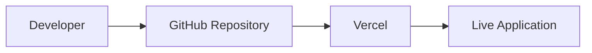
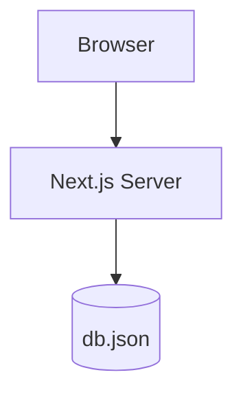
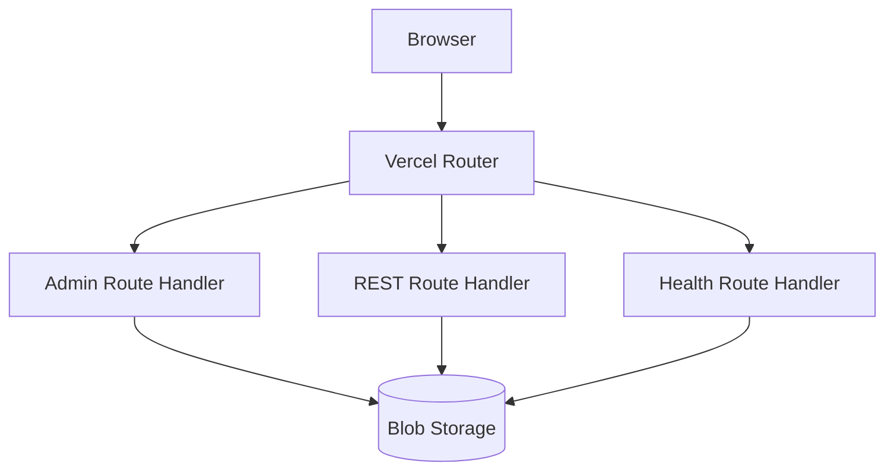
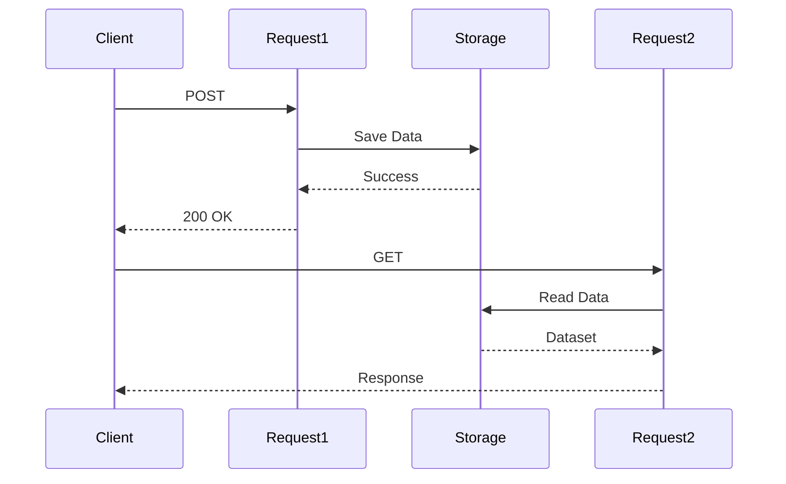
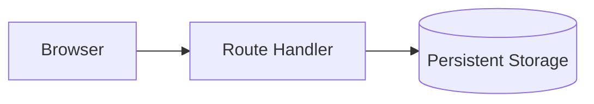

# Chapter 2 — Moving to the Cloud

The original architecture of Greymatter API was deliberately simple.

Everything executed inside a single Node.js process.

The application owned its filesystem.

The database lived in `db.json`.

Every request read and wrote the same file.

Every subsequent request immediately saw the updated data.

For local development, this architecture was ideal.

Unfortunately, software rarely stays confined to a developer's laptop.

As Greymatter API matured, users wanted more than a local development tool.

They wanted to:

* deploy demonstrations
* share mock APIs with teammates
* integrate the server into CI/CD pipelines
* host training environments
* build frontend applications against a publicly accessible API

These new requirements changed one fundamental assumption:

**the application would no longer run on a single computer.**

---

# Why Deploy to Vercel?

Because Greymatter API is built with the Next.js App Router, Vercel was the natural deployment platform.

It provides:

* native support for Next.js
* automatic deployments from GitHub
* globally distributed infrastructure
* serverless Route Handlers
* HTTPS by default
* automatic scaling
* integrated Blob Storage

From a developer's perspective, deployment became almost effortless.



Instead of managing servers, developers simply pushed their changes to GitHub.

Vercel handled everything else.

At least, that was the promise.

---

# The Illusion of "Nothing Changed"

From the outside, Greymatter API appeared identical after deployment.

The dashboard still looked the same.

The REST endpoints still behaved the same.

Collections still appeared under:

```text
/api/users
/api/posts
/api/products
```

The administrative interface still provided:

* Upload JSON
* Load Preset
* Create Collection
* Delete Collection
* Download Data

Nothing about the user experience suggested that the underlying execution model had changed.

Internally, however, almost everything had changed.

---

# A Traditional Web Server

The original version behaved like a conventional Node.js application.



One application.

One runtime.

One filesystem.

Every request was processed by the same server.

Every request saw the same application state.

---

# A Serverless Application

After deployment, Greymatter API no longer executed as one continuously running server.

Instead, each request could be handled independently.



Notice the difference.

There is no single server process.

Instead, multiple route handlers execute independently.

Each request may execute inside a different runtime.

That architectural difference is the foundation of everything that follows.

---

# Understanding Route Handlers

In the App Router, every endpoint is implemented as a Route Handler.

For example:

```text
app/
└── api/
    ├── health/
    │   └── route.js
    ├── products/
    │   └── route.js
    └── [...path]/
        └── route.js

app/
└── admin/
    ├── upload/
    ├── empty/
    ├── collections/
    ├── load-preset/
    └── status/
```

Each directory represents an HTTP endpoint.

Each `route.js` file exports handlers such as:

* `GET`
* `POST`
* `PUT`
* `PATCH`
* `DELETE`

This organization keeps the API modular and easy to extend.

It also means each endpoint can execute independently.

---

# One Request Does Not Know About Another

This is perhaps the biggest conceptual shift.

A traditional server often gives the impression that requests share the same application.

A serverless platform does not make that guarantee.

Conceptually, requests behave more like this.



Notice that **Request 2** is not a continuation of **Request 1**.

It is a completely separate execution.

Nothing from the first request is automatically available to the second.

---

# Stateless Computing

Serverless platforms are designed around a simple principle:

> Every request should be able to execute independently.

This is known as **stateless execution**.

A request cannot safely assume:

* another request executed previously
* memory is shared
* variables still exist
* cached objects remain available
* the same runtime will be reused

Instead, every request begins by reconstructing the state it needs.

For Greymatter API, that state is the current dataset.

---

> **Engineering Insight**
>
> Stateless does **not** mean that an application has no data.
>
> It means that data is not stored in the memory of the application between requests.
>
> Persistent state must live in an external storage system that every request can access.

---

# Separating Storage from Compute

The move to serverless naturally separates two concepts that were previously combined.

## Compute

Handles requests.

Runs JavaScript.

Performs CRUD operations.

Returns HTTP responses.

## Storage

Persists data.

Survives application restarts.

Can be shared across multiple serverless functions.

The relationship looks like this.



This separation is fundamental to cloud-native software.

Compute becomes disposable.

Storage becomes permanent.

---

# Updating the Data Layer

Because the application could no longer depend on the local filesystem in production, the storage layer had to become abstract.

Rather than reading files directly throughout the application, Greymatter API centralized all persistence inside:

```text
lib/db.js
```

Instead of writing code like:

```javascript
fs.readFile(...)
```

the rest of the application now calls:

```javascript
await getDb()
```

Likewise,

instead of:

```javascript
fs.writeFile(...)
```

the application calls:

```javascript
await saveDb(data)
```

This abstraction provides an important benefit.

The rest of the codebase no longer needs to know *where* the data is stored.

Today it may be:

* `db.json`
* Vercel Blob Storage

Tomorrow it could become:

* PostgreSQL
* SQLite
* MongoDB
* Amazon S3
* Cloudflare R2

The application code remains unchanged.

Only the implementation inside `lib/db.js` evolves.

---

# A Small Change with Large Consequences

From a code perspective, the migration seemed surprisingly minor.

A handful of filesystem calls were replaced with helper functions.

Most of the REST API remained unchanged.

The dashboard required almost no modification.

Everything compiled successfully.

The application deployed without errors.

At first glance, the migration appeared complete.

In reality, the application's execution model had changed profoundly.

The code still behaved correctly.

The assumptions behind that code no longer did.

---

# Comparing the Two Architectures

The difference between local development and production can be summarized in a single table.

| Local Development               | Cloud Deployment               |
| ------------------------------- | ------------------------------ |
| Single Node.js process          | Multiple serverless functions  |
| Local filesystem                | External object storage        |
| Shared memory                   | Stateless execution            |
| Immediate local file visibility | Distributed storage visibility |
| One runtime                     | Many independent runtimes      |
| Direct disk access              | Storage abstraction layer      |

Notice that very little of the application's **business logic** changed.

Almost every difference lies in the surrounding infrastructure.

This is a common pattern in software engineering.

Applications often outgrow their original deployment model long before they outgrow their business logic.

---

# Key Takeaways

Before moving to the next chapter, several important architectural ideas have emerged.

* Deploying to the cloud changes the execution environment, even when the application code changes very little.
* Serverless functions are independent request handlers rather than a continuously running server.
* Stateless execution requires persistent data to live outside application memory.
* Abstracting the storage layer allows the application to evolve without rewriting the REST API.
* Infrastructure changes can expose assumptions that were invisible during local development.

At this point, Greymatter API had successfully become a cloud-native application.

Unfortunately, one subtle assumption from the original design still remained.

That assumption would soon reveal itself as a production-only bug that could not be reproduced on a developer's laptop.

The next chapter examines the first symptoms of that problem and explains why diagnosing it proved far more difficult than anyone initially expected.
