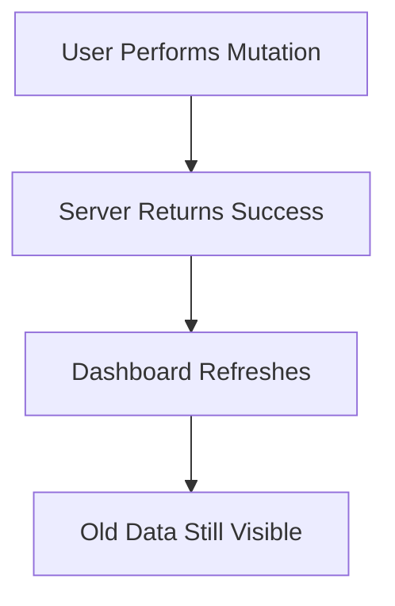
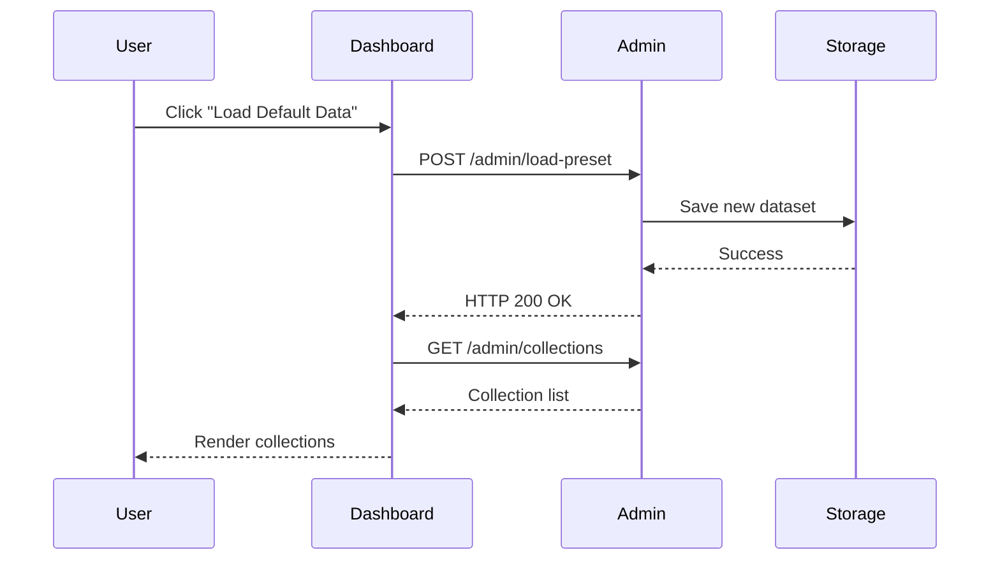
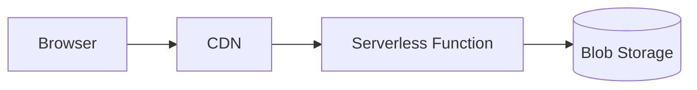

## Chapter 3 — The Stale Data Problem

One of the most important lessons in software engineering is that **the most difficult bugs are often the ones that cannot be reproduced consistently**.

Greymatter API provided an excellent example.

For weeks, the application had behaved exactly as expected during development.

Every feature worked.

Every CRUD operation succeeded.

The dashboard updated correctly.

Collections appeared immediately after they were created.

Deleting a collection removed it from the interface.

Uploading a dataset replaced the previous data.

Loading a preset worked every time.

Unit testing, manual testing, and exploratory testing all suggested that the application was production-ready.

Then it was deployed.

---

# A Curious Production Bug

Almost immediately, users began reporting something unusual.

The application wasn't crashing.

There were no JavaScript exceptions.

No HTTP 500 errors appeared.

No stack traces were generated.

Instead, users described behavior like this:

> "I clicked **Load Default Data**, but nothing changed."

Another reported:

> "I deleted a collection, but it's still there."

Another:

> "Uploading a JSON file succeeds, but I still see the previous dataset."

The reports had one thing in common.

The mutation appeared successful.

The user interface did not.

---

# The Symptoms

Although the reports sounded different, they all followed the same general pattern.



Notice something interesting.

The operation itself succeeded.

The server responded successfully.

Only the subsequent view of the data appeared incorrect.

That distinction would become extremely important.

---

# The Inconsistent Nature of the Bug

The most frustrating aspect of the issue was its inconsistency.

Sometimes everything worked perfectly.

Sometimes it did not.

For example:

| Operation         | Expected Result         | Observed Result                            |
| ----------------- | ----------------------- | ------------------------------------------ |
| Load preset       | Demo data appears       | Sometimes old data remained                |
| Upload JSON       | New collections appear  | Occasionally previous collections remained |
| Delete collection | Collection disappears   | Sometimes still visible                    |
| Empty storage     | Dashboard becomes empty | Previous collections occasionally remained |

Even stranger...

Repeating exactly the same operation often succeeded.

```text
Click once
    ↓
Old data

Click again
    ↓
Correct data
```

Intermittent failures are notoriously difficult to diagnose.

Unlike deterministic bugs, they often suggest problems involving:

* timing
* synchronization
* networking
* caching
* concurrency
* distributed systems

---

# Local Development Could Not Reproduce It

The development team attempted the obvious first step.

Reproduce the issue locally.

Every attempt failed.

Creating collections worked.

Deleting records worked.

Uploading datasets worked.

Loading presets worked.

Repeated testing produced identical results.

The application behaved flawlessly.

This immediately suggested something important.

The bug was **environment-dependent**.

If identical code behaves differently in different environments, the difference is usually not the business logic.

It is the execution environment.

---

> **Engineering Insight**
>
> When a bug appears only after deployment, resist the temptation to immediately blame the application code. The execution environment—including storage systems, networking, caching, and request routing—can fundamentally change how otherwise correct code behaves.

---

# Initial Assumptions

Like many debugging sessions, the investigation began with several reasonable assumptions.

Perhaps the dashboard wasn't refreshing.

Perhaps React state wasn't updating correctly.

Perhaps the uploaded dataset wasn't being parsed.

Perhaps the mutation endpoint wasn't saving the data.

Each explanation seemed plausible.

Each turned out to be incorrect.

---

# Following a Typical Request

To understand what was happening, it helps to examine the sequence of events.

When a user loaded a preset, the workflow looked approximately like this.



At first glance, everything appeared perfectly reasonable.

The mutation completed successfully.

The dashboard then requested the updated collections.

Finally, the interface refreshed.

Nothing looked suspicious.

---

# The Critical Observation

Eventually, one observation changed the direction of the investigation.

The mutation endpoints were always returning success.

Furthermore, inspecting the storage confirmed that the data had actually been written.

The write operation was correct.

The persistence layer was correct.

Only the data returned by the subsequent request appeared to be wrong.

That immediately narrowed the search.

The problem was no longer:

> "Why isn't the data being saved?"

The problem became:

> "Why doesn't the next request always see the updated data?"

That is a very different question.

---

# Eliminating Possibilities

The engineering process now became one of elimination.

## Could React Be Responsible?

The dashboard simply rendered whatever data it received.

React was unlikely to invent stale data.

---

## Could JSON Parsing Be Failing?

The uploaded datasets were valid.

Repeated uploads produced identical files.

Parsing was not the issue.

---

## Could the Mutation Fail Silently?

Logging confirmed that:

* data was loaded
* mutations completed
* storage was updated
* responses returned successfully

The server-side logic was behaving correctly.

---

## Was the Browser Using Cached Responses?

This possibility could not be ignored.

Modern browsers aggressively cache resources when possible.

However, browser caching alone could not explain why repeated requests often returned different results.

The investigation continued.

---

# Looking Beyond the Browser

The production deployment introduced several components that did not exist locally.

For example:



Locally, requests traveled only a few centimeters—from browser to local server to local disk.

In production, requests crossed multiple systems.

Each additional component introduced new timing characteristics.

Each became a potential source of stale data.

---

# The Turning Point

The investigation reached a turning point when the team stopped asking:

> "Why is the dashboard wrong?"

and started asking:

> "How many independent requests are involved?"

The answer was surprisingly revealing.

Loading a preset did **not** consist of one request.

It consisted of two.

1. A mutation request that wrote new data.
2. A second request that immediately attempted to read that data.

That second request became the focus of the investigation.

If it observed stale state, the dashboard would faithfully display stale information—even though the mutation itself had succeeded.

The user interface was not broken.

It was accurately rendering the response it received.

The question now became:

**Why could a successful write be followed immediately by an apparently stale read?**

The answer lay not in React, nor in the REST API itself, but in the fundamental characteristics of distributed storage and serverless execution.

Those topics form the subject of the next chapter.
