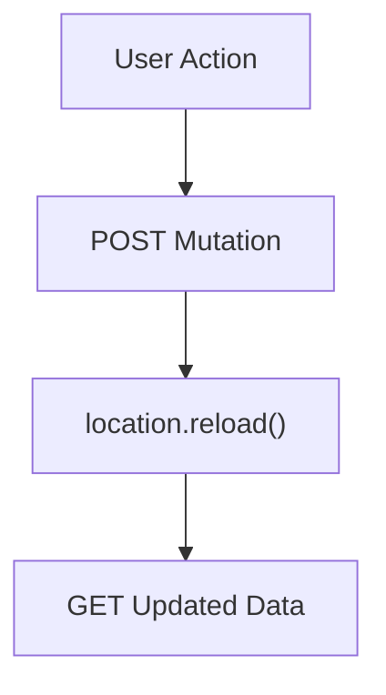
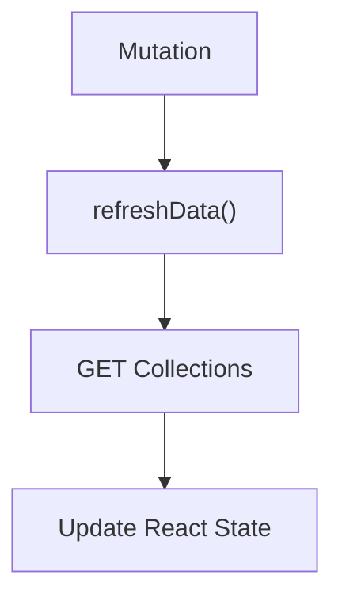
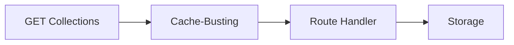
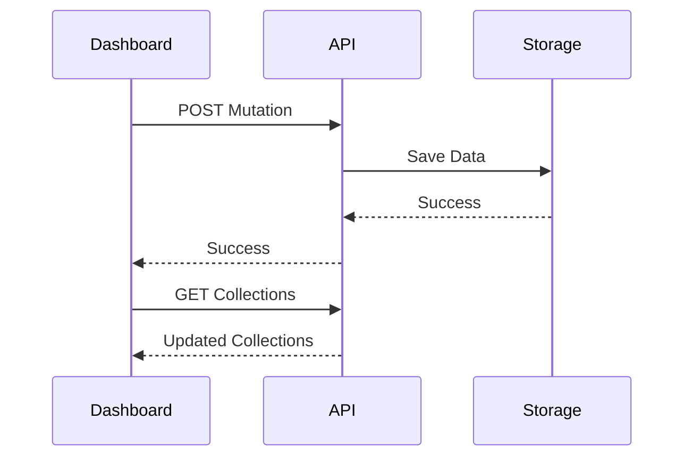
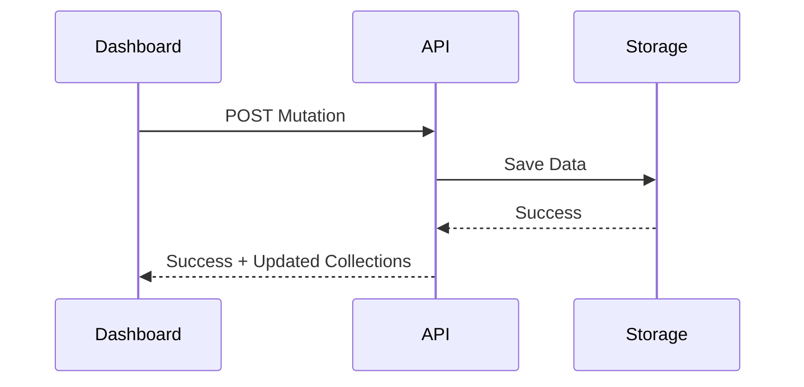

# Part IV — The Investigation

## Chapter 5 — Evaluating the Possible Solutions

By this stage, the engineering team understood the problem.

The mutation endpoints were working correctly.

The dashboard was working correctly.

The data layer was persisting changes successfully.

The issue was no longer **whether** data was being saved.

The issue was **how the client obtained the updated state immediately after a successful mutation.**

This distinction changed the entire investigation.

Instead of searching for programming errors, the team began evaluating architectural alternatives.

Each potential solution was tested against three criteria:

* Would it solve the stale data problem?
* Would it improve the overall architecture?
* Would it remain reliable in a distributed serverless environment?

Several approaches were considered.

Some provided partial improvements.

Only one eliminated the underlying problem entirely.

---

# Candidate Solution 1 — Reload the Entire Page

The original implementation relied heavily on a familiar web development pattern.

After completing a mutation, simply reload the browser.



The logic seemed straightforward.

1. Perform the mutation.
2. Reload the page.
3. Allow the application to initialize again.
4. Display the latest data.

This approach works surprisingly well for traditional multi-page applications.

Unfortunately, Greymatter API is built using React.

Reloading the page introduced several disadvantages.

## Advantages

* Very simple to implement.
* Guarantees the application starts from a clean state.
* Easy for beginners to understand.

## Disadvantages

* Reloads every component.
* Re-downloads unnecessary resources.
* Discards all React state.
* Produces a slower user experience.
* Still performs an additional GET request.

Most importantly...

It **did not eliminate the stale read**.

The page still depended on a second request immediately after the write.

---

# Candidate Solution 2 — Refresh React State

The next iteration removed the page reload.

Instead of restarting the application, the dashboard refreshed only the necessary data.

Conceptually the flow became:



This represented a significant improvement.

The interface became noticeably smoother.

React components no longer restarted.

Navigation state remained intact.

Animations remained uninterrupted.

From the user's perspective, the dashboard felt far more responsive.

Yet the architecture still contained exactly the same dependency.

Write...

then immediately perform another read.

The timing issue still existed.

---

# Candidate Solution 3 — Cache Busting

The next hypothesis focused on caching.

Perhaps browsers or intermediary caches were serving stale responses.

Several techniques were evaluated.

Examples included:

```javascript
fetch(url, {
  cache: "no-store"
})
```

and

```text
/admin/collections?t=1700000000000
```

where a timestamp forces a unique URL.

Conceptually:



These techniques reduced the likelihood of cached responses.

However, they addressed only one layer of the request path.

They could not eliminate visibility delays elsewhere in the system.

---

> **Engineering Insight**
>
> Cache busting is an effective technique when browser or intermediary caching is the primary cause of stale responses.
>
> It cannot solve architectural problems that originate from the application's overall request flow.

---

# Candidate Solution 4 — Retry Logic

If the second request occasionally observed stale data, perhaps waiting briefly before trying again would help.

The dashboard could implement logic similar to:

```text
Mutation

↓

Read

↓

Old Data?

↓

Wait

↓

Read Again
```

This pattern is common in distributed systems.

A brief delay often allows propagation to complete.

Retries improve resilience.

They also introduce trade-offs.

## Advantages

* Simple to implement.
* Handles temporary visibility delays.
* Improves reliability.

## Disadvantages

* Adds latency.
* Generates additional requests.
* Complicates client logic.
* Still depends on eventual consistency.

Retries acknowledge that the second request might fail.

They do not eliminate the second request.

---

# Candidate Solution 5 — Delay Before Reading

Another variation simply introduced a fixed pause.

```text
POST

↓

Wait 500 ms

↓

GET Collections
```

The assumption was that storage propagation would complete during the delay.

Although effective in many situations, this approach suffers from obvious problems.

How long should the delay be?

100 milliseconds?

500 milliseconds?

One second?

Five seconds?

Any fixed delay is ultimately a guess.

Short delays occasionally fail.

Long delays unnecessarily slow the application.

Waiting became another workaround rather than a true solution.

---

# Looking at the Bigger Picture

By this stage, a pattern had emerged.

Every proposed solution shared one assumption.

```text
Mutation

↓

Read Again
```

Some approaches made the read faster.

Others made it safer.

Others made it more reliable.

None questioned whether the read was necessary.

That observation changed everything.

---

# Challenging the Architecture

Good engineering often begins with a deceptively simple question.

Instead of asking:

> **How can we improve the second request?**

the team asked:

> **Why is there a second request at all?**

That question immediately shifted the focus from infrastructure to API design.

The server already possessed the updated dataset.

The mutation had already completed successfully.

The server therefore knew exactly what the client would ask for next.

Why make the client ask again?

---

# Returning the Updated State

Consider the original sequence.



Notice that the dashboard requires **two** network requests.

Now consider a slightly different design.



The second request disappears completely.

Nothing needs to be synchronized.

Nothing needs to be refreshed.

Nothing needs to be re-read.

The authoritative state is already available.

---

# A Better API Contract

The original mutation endpoints returned only confirmation.

For example:

```json
{
  "success": true
}
```

That response confirmed the operation succeeded.

It did **not** provide the information the dashboard immediately needed.

The revised design returned both confirmation and the updated collection list.

```json
{
  "success": true,
  "collections": [
    "users",
    "posts",
    "products"
  ]
}
```

The response became significantly more useful.

Instead of merely acknowledging success, it provided the client with the next application state.

---

# Why This Is Better

This redesign produced several immediate benefits.

## Fewer Requests

One HTTP request disappeared entirely.

## Lower Latency

The dashboard updated immediately after the mutation response.

## Better User Experience

The interface felt instantaneous.

## Simpler Client Code

No refresh function.

No retry logic.

No artificial delays.

No synchronization concerns.

## Better Cloud Architecture

The client no longer depended on an immediate read-after-write sequence.

The design became naturally resilient to distributed execution.

---

> **Best Practice**
>
> Mutation endpoints should return enough information for the client to update its local state without immediately performing another request.
>
> This reduces network traffic, simplifies client logic, and avoids many synchronization problems common in distributed systems.

---

# Key Takeaways

The investigation revealed an important engineering lesson.

Every proposed workaround attempted to improve the existing workflow.

The final solution improved the architecture itself.

Instead of making the second request more reliable, Greymatter API eliminated the need for the second request altogether.

That seemingly small design decision transformed the dashboard from a read-after-write application into a reactive client driven directly by authoritative server responses.

In the next chapter, we'll examine how this redesign was implemented throughout the dashboard and administration API, and why the resulting architecture is both simpler and more reliable than the original implementation.
