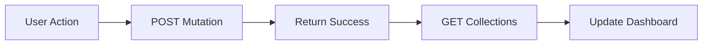
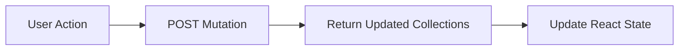
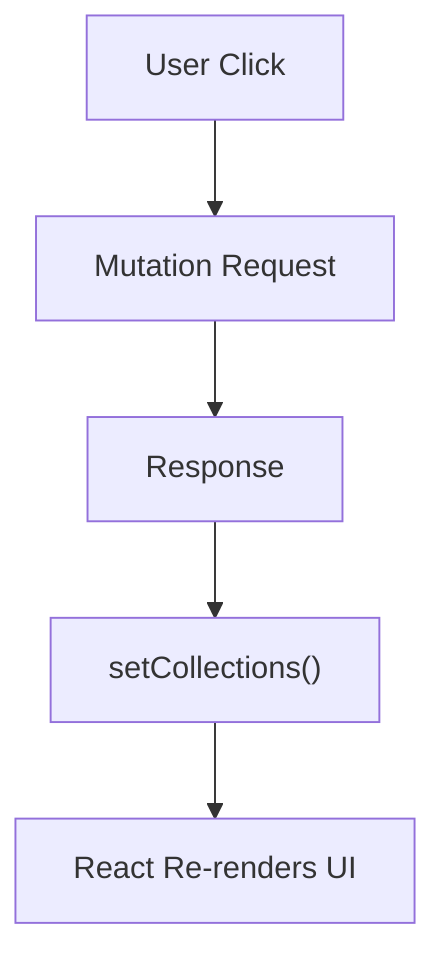
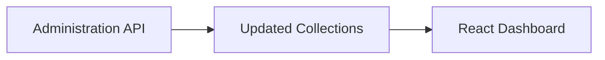

# Chapter 6 — Refactoring the Architecture

By the time the investigation concluded, the engineering team understood two important facts.

First, the application itself was not broken.

Second, the architecture could be improved.

Rather than treating stale reads as an unavoidable characteristic of distributed systems, Greymatter API adopted a different philosophy.

> **Design the API so the client never needs the second read.**

That decision resulted in one of the simplest—and most effective—architectural improvements made during the evolution of Greymatter API.

---

# The Original Workflow

Originally, every administrative operation followed the same sequence.



For example:

* Create Collection
* Delete Collection
* Upload JSON
* Load Preset
* Empty Storage

Every one of these operations required an immediate follow-up request.

Although simple, this approach introduced an unnecessary dependency on distributed storage visibility.

---

# Identifying the Real Requirement

The dashboard did not actually need to perform another GET request.

It needed only one thing:

**the updated list of collections.**

That information already existed on the server immediately after the mutation completed.

There was no reason to ask for it again.

This realization completely changed the API design.

---

# Returning Application State

Instead of returning:

```json
{
  "success": true
}
```

the administration endpoints now return:

```json
{
  "success": true,
  "collections": [
    {
      "name": "users",
      "count": 25
    },
    {
      "name": "posts",
      "count": 120
    },
    {
      "name": "products",
      "count": 42
    }
  ]
}
```

Notice the difference.

The response now contains exactly what the dashboard requires.

No additional request is necessary.

---

# The New Workflow

The redesigned workflow became much shorter.



The dashboard updates immediately.

No reload.

No refresh.

No synchronization request.

No stale read.

---

# Before and After

The difference is surprisingly small.

## Before

```text
User clicks button

↓

POST

↓

200 OK

↓

GET collections

↓

Render UI
```

## After

```text
User clicks button

↓

POST

↓

200 OK + Updated Collections

↓

Render UI
```

One network request disappeared.

So did the production bug.

---

# Refactoring the Dashboard

The dashboard itself became much simpler.

Originally, a mutation looked something like this.

```javascript
await fetch(...);

await refreshData();
```

The mutation succeeded.

Then another request was made.

After the redesign, the dashboard instead performs:

```javascript
const result = await response.json();

setCollections(result.collections);
```

React immediately updates the interface.

The browser never asks the server for information it already possesses.

This follows one of React's fundamental principles:

> **Update the UI from state, not from page reloads.**

---

# Eliminating `location.reload()`

Earlier versions of the dashboard occasionally relied on:

```javascript
location.reload();
```

Although effective, reloading an entire application is expensive.

It forces the browser to:

* recreate the page
* rebuild React
* reload components
* repeat API requests
* discard application state

Replacing page reloads with state updates produced several improvements.

* Faster UI
* Less network traffic
* Better responsiveness
* Simpler code
* Better user experience

The application now behaves like a modern React application rather than a traditional multi-page website.

---

# Refactoring the Administration API

The dashboard was only half of the story.

The server also changed.

Instead of merely confirming success, each administrative endpoint became responsible for returning the new application state.

Conceptually the route handler became:

```text
Read Dataset

↓

Modify Dataset

↓

Save Dataset

↓

Generate Collection List

↓

Return JSON Response
```

The response now represents the current truth of the application.

This creates a much stronger contract between client and server.

---

# A Better API Contract

The administration API now follows a simple philosophy.

Every mutation should return enough information for the client to update itself immediately.

This principle has several advantages.

## Predictability

The client always knows what to display next.

---

## Fewer Requests

The application performs less network traffic.

---

## Lower Latency

Users see updates immediately.

---

## Better Scalability

Fewer requests reduce load on the server.

---

## Better Reliability

Removing the extra GET request also removes an entire synchronization problem.

---

# Updating React State

The dashboard now follows a predictable pattern.



Notice something important.

The browser never asks:

> "What changed?"

The server already answered that question.

---

# Single Source of Truth

This redesign reinforces another important architectural principle.

The server remains the authoritative source of truth.

The dashboard simply reflects the state returned by the server.



There is no guessing.

No reconstruction.

No synchronization logic.

The server computes the new state once.

The client renders it.

---

# Benefits Beyond the Bug

Although the redesign originated from a production issue, its benefits extended much further.

The resulting architecture is:

* easier to understand
* easier to maintain
* easier to extend
* easier to test
* more efficient
* more cloud-friendly

Perhaps most importantly, the dashboard now behaves correctly regardless of whether the storage layer is:

* `db.json`
* Vercel Blob Storage
* PostgreSQL
* MongoDB
* Amazon S3
* Cloudflare R2

The UI no longer depends on storage timing.

---

# An Architectural Principle

One lesson from this refactoring applies far beyond Greymatter API.

When a client performs a mutation, the server already knows the resulting state.

Instead of forcing the client to ask again, return that state immediately.

This simple idea:

* removes unnecessary requests,
* reduces latency,
* simplifies client code,
* improves reliability,
* and naturally supports distributed systems.

It is a small change in implementation, but a significant improvement in architecture.

---

# Key Takeaways

The stale data issue was ultimately solved not by changing React, nor by changing Blob Storage, nor by changing Vercel.

It was solved by changing the conversation between the client and the server.

The old conversation was:

> "I changed something. Can you tell me what the data looks like now?"

The new conversation became:

> "I changed something. Here is the new state."

That subtle change eliminated an entire network request, simplified the dashboard, strengthened the API contract, and produced an architecture that is better suited to modern cloud-native applications.

In the final part of this appendix, we'll step back from the implementation details and examine the broader architectural lessons that Greymatter API teaches about designing software for serverless environments.
