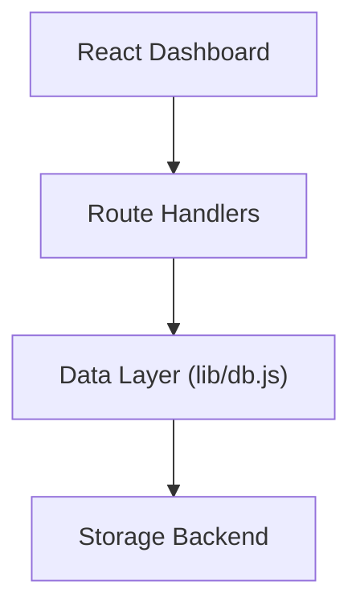
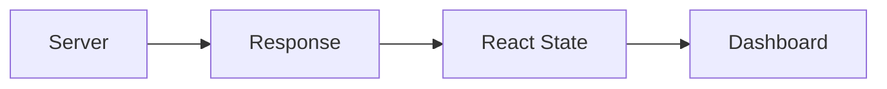

# Part VI — Lessons for Every Developer

## Chapter 7 — Architectural Lessons

Every software project teaches lessons.

Some lessons are about programming.

Others are about debugging.

The most valuable lessons, however, are about **thinking differently**.

Greymatter API began life as a small educational project—a lightweight mock REST API backed by a single JSON file.

By the end of its evolution, it had become something much more interesting.

It had become a practical case study in modern cloud architecture.

The production issue that motivated this appendix was eventually resolved.

The stale data problem disappeared.

The dashboard became more responsive.

The API became simpler.

The codebase became easier to understand.

Yet those achievements were not the most important outcome.

The real value lay in the architectural principles that emerged during the investigation.

---

# Lesson 1 — Design for the Environment You Run In

One of the easiest mistakes developers make is assuming that software behaves identically everywhere.

Locally, Greymatter API executed inside a single Node.js process.

Production was fundamentally different.

Instead of one server, there were multiple independent serverless functions.

Instead of a local filesystem, there was distributed object storage.

Instead of immediate file visibility, there was eventual consistency.

The application code had not changed very much.

The execution environment had changed completely.

Successful cloud software begins by recognizing that reality.

---

# Lesson 2 — Infrastructure Is Part of the Architecture

Developers often separate application code from infrastructure.

In practice, they are deeply connected.

Changing the deployment platform can alter:

* execution model
* storage semantics
* request routing
* latency
* consistency guarantees
* scalability characteristics

The migration from local development to Vercel demonstrated exactly this.

Nothing in the REST API appeared different.

Internally, however, the application's operating assumptions had changed.

Infrastructure is not merely where software runs.

It influences **how software behaves**.

---

# Lesson 3 — Remove Work Instead of Optimizing It

Many software optimizations focus on making existing operations faster.

The Greymatter API investigation followed a different path.

Instead of optimizing the second request, it removed it entirely.

Originally:

```text
POST

↓

GET

↓

Render
```

After refactoring:

```text
POST

↓

Render
```

One request disappeared.

Latency decreased.

Complexity decreased.

Reliability increased.

One of the best optimizations in software engineering is simply **doing less work**.

---

# Lesson 4 — Return What the Client Needs

The redesign introduced a broader API design principle.

A mutation endpoint should not merely report success.

It should return enough information for the client to continue.

Instead of:

```json
{
  "success": true
}
```

the API now returns:

```json
{
  "success": true,
  "collections": [...]
}
```

This subtle change transformed the dashboard.

The client no longer needed to reconstruct state.

The server already possessed the answer.

Returning that answer immediately reduced both network traffic and application complexity.

---

# Lesson 5 — Keep Responsibilities Separate

Greymatter API now follows a clean layered architecture.



Each layer has one responsibility.

The dashboard presents data.

The route handlers process requests.

The data layer abstracts persistence.

The storage backend stores information.

Because those responsibilities are separated, each layer can evolve independently.

---

# Lesson 6 — Abstraction Protects the Rest of the System

One of the smallest files in the repository became one of the most important.

```text
lib/db.js
```

Every read passes through it.

Every write passes through it.

The remainder of the application never needs to know whether data lives in:

* `db.json`
* Vercel Blob Storage
* PostgreSQL
* SQLite
* MongoDB

Changing storage now requires modifying one abstraction instead of dozens of route handlers.

That is precisely why abstraction exists.

---

# Lesson 7 — React Is Not the Source of Truth

Modern frontend frameworks encourage reactive interfaces.

Greymatter API embraces that model.

The dashboard never invents application state.

It simply renders the state returned by the server.



This approach eliminates many synchronization problems.

The server computes the truth.

The client displays it.

---

# Lesson 8 — Distributed Systems Expose Hidden Assumptions

Perhaps the most valuable lesson from this project is that distributed systems rarely create entirely new bugs.

Instead, they expose assumptions that were always present.

Locally, Greymatter API quietly relied on immediate read-after-write visibility.

That assumption was never documented.

It simply happened to be true.

Deploying to the cloud revealed that it was not universally valid.

Many production issues arise for exactly this reason.

The code is correct.

The assumptions are incomplete.

---

# Architectural Patterns Used

Although Greymatter API is intentionally lightweight, it demonstrates several important architectural patterns.

| Pattern                 | Purpose                                               |
| ----------------------- | ----------------------------------------------------- |
| Layered Architecture    | Separates presentation, API, data access, and storage |
| Repository Abstraction  | Hides storage implementation behind `lib/db.js`       |
| Stateless Services      | Every request executes independently                  |
| Dynamic REST Routing    | Collections automatically become API endpoints        |
| Reactive UI             | Dashboard updates from application state              |
| Storage Abstraction     | Local and cloud storage share one interface           |
| Serverless Architecture | Route handlers scale independently                    |

These patterns are common throughout modern cloud applications.

Greymatter API provides a compact example of how they work together.

---

# Looking Ahead

The current architecture provides an excellent foundation for future enhancements.

Possible directions include:

* user authentication
* role-based authorization
* OpenAPI specification generation
* WebSocket updates
* PostgreSQL persistence
* versioned datasets
* audit logging
* collection schemas
* validation rules
* API keys
* rate limiting
* multi-user workspaces

Importantly, most of these features can be added without changing the overall architecture.

That is a hallmark of good design.

---

# Final Reflection

Greymatter API started as a teaching project.

Its purpose was to provide developers with a lightweight mock REST API that required almost no setup.

Over time, it evolved into a cloud-native application demonstrating:

* Next.js App Router
* Serverless Route Handlers
* Storage abstraction
* Dynamic REST APIs
* Object storage
* Reactive dashboards
* Stateless request processing
* Layered architecture
* Modern deployment practices

Ironically, one of the most valuable improvements came from a production bug.

Investigating that bug forced the architecture to become simpler.

The dashboard became faster.

The API became more expressive.

The client became easier to understand.

The server became a clearer source of truth.

The solution did not involve adding more technology.

It involved removing an unnecessary request.

That lesson extends far beyond Greymatter API.

Whether you are building a prototype, an enterprise application, or a distributed cloud platform, elegant software often emerges not from adding complexity, but from eliminating it.

---

# Closing Thoughts

Greymatter API is intentionally small.

That is precisely why it serves as such an effective teaching example.

Its architecture is compact enough to understand in a single afternoon, yet rich enough to demonstrate many of the same principles found in large production systems.

Readers who understand the architectural journey described in this appendix will have encountered concepts including:

* serverless computing
* layered architecture
* RESTful API design
* storage abstraction
* distributed systems
* eventual consistency
* reactive user interfaces
* API contract design
* cloud deployment
* production debugging

Those ideas apply far beyond this project.

Greymatter API may be a mock API server.

The engineering lessons it illustrates are very real.
