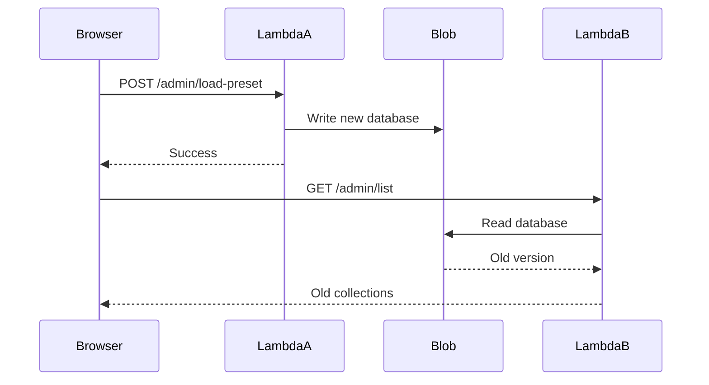
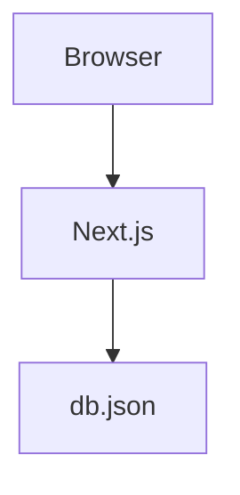
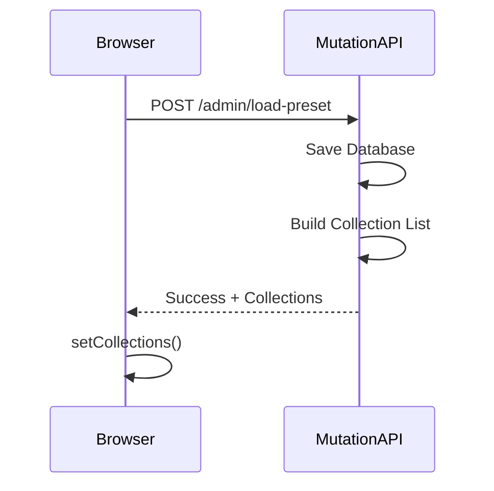

# Appendix B – Case Study: Solving Stale Data in a Serverless Environment

One of the most significant improvements made during the development of Greymatter did not involve adding a new feature. Instead, it involved solving a subtle production bug that appeared only after the application was deployed to Vercel.

This appendix documents that journey.

It demonstrates an important lesson in modern web development:

> Code that works perfectly on your local machine may behave very differently once deployed to a distributed, serverless environment.

The problem described here is not unique to Greymatter. It is representative of an entire class of issues involving distributed systems, eventual consistency, caching, and stateless execution.

---

# Learning Objectives

After reading this appendix you will understand:

* why serverless applications behave differently from traditional servers
* how eventual consistency affects application design
* why local testing did not reveal the bug
* how Greymatter evolved from a simple implementation to a production-ready architecture
* practical techniques for designing resilient APIs

---

# The Original Architecture

The first versions of Greymatter were designed for local development.

The architecture was straightforward.

```mermaid
flowchart TD

Dashboard

-->

REST API

-->

db.json
```

Everything executed inside a single Node.js process.

Every request shared:

* the same memory
* the same file system
* the same runtime

Whenever data changed, every subsequent request immediately saw the updated database.

No synchronization was required.

---

# Moving to Vercel

As Greymatter evolved, it was refactored to run on Vercel.

Instead of executing as a single long-running server, every Route Handler became an independent serverless function.

The architecture now looked like this.

```mermaid
flowchart TD

Dashboard

-->

Admin API

Dashboard

-->

REST API

Admin API

-->

LambdaA["Lambda A"]

REST API

-->

LambdaB["Lambda B"]

LambdaA --> Blob["Vercel Blob Storage"]

LambdaB --> Blob
```

Each request could be handled by a completely different runtime.

Unlike a traditional server, these runtimes do not share memory.

---

# The Problem

Users began reporting a confusing issue.

After clicking:

* Load Default Data
* Upload JSON
* Empty Storage
* Create Collection
* Delete Collection

the dashboard often continued displaying the previous dataset.

Clicking the same button a second time usually fixed the problem.

Refreshing the browser sometimes helped.

Sometimes it did not.

The behaviour appeared random.

---

# Initial Assumption

The obvious assumption was that the dashboard was failing to refresh correctly.

The application originally used:

```text
location.reload()
```

after every mutation.

The expectation was simple.

```mermaid
flowchart LR

Mutation

-->

Reload Page

-->

Fetch Data

-->

Updated Dashboard
```

Unfortunately, that assumption was incorrect.

---

# What Was Really Happening

The actual request flow was far more complicated.



The dashboard had refreshed correctly.

The server had responded correctly.

The problem was that the second request was processed by an entirely different Lambda instance.

---

# Eventual Consistency

Another factor complicated the problem.

Vercel Blob Storage is **eventually consistent**.

Immediately after writing new data, another request may briefly receive an older version.

Propagation typically occurs within a few hundred milliseconds.

This behaviour is completely normal for distributed object storage systems.

Unfortunately, it exposed a race condition.

---

# Why Local Development Never Failed

During local development:



Every request shared:

* one process
* one memory space
* one file

No distributed system existed.

The race condition simply could not occur.

---

# First Improvement

The first attempt replaced:

```text
location.reload()
```

with:

```text
refreshData()
```

Instead of reloading the page, the dashboard re-fetched:

* `/admin/list`
* `/admin/status`

and updated React state directly.

This improved the user experience considerably.

However, it still depended on separate GET requests.

Those requests could still reach another Lambda instance.

---

# Second Improvement

The next enhancement addressed Blob propagation.

The Data Layer introduced two mechanisms.

## Cache Busting

Every Blob read appended a timestamp.

Example:

```text
...?t=1700000000000
```

This prevented stale CDN responses.

---

## Retry Logic

If stale data was detected, the application retried the request.

```mermaid
flowchart LR

Read Blob

-->

Fresh?

Fresh?

-- No -->

Wait

-->

Retry

Fresh?

-- Yes -->

Continue
```

Retries used exponential backoff to allow Blob propagation to complete.

This reduced failures significantly.

But the architecture still depended on a second read after every write.

---

# The Architectural Breakthrough

Eventually a much simpler idea emerged.

Instead of asking another endpoint for the updated collections...

...the mutation endpoint already had them.

Immediately after writing the database, the current Lambda possessed the latest data.

Rather than performing another GET request, it could simply return the updated collection list as part of the response.



The second network request disappeared completely.

---

# Before

```mermaid
flowchart LR

Mutation

-->

Write Blob

-->

Reload

-->

GET Collections

-->

Read Blob Again

-->

Update UI
```

Two requests.

Two Lambda instances.

Two Blob reads.

---

# After

```mermaid
flowchart LR

Mutation

-->

Write Blob

-->

Return Collections

-->

Update React State
```

One request.

One Lambda.

One Blob write.

No immediate read.

---

# Additional Improvements

To support the new approach, a helper function was added to the Data Layer.

```
getCollectionList(data)
```

This function generates the collection metadata directly from the updated dataset.

Every administration endpoint now returns:

* success
* message
* updated collections

The dashboard simply updates its React state using the returned data.

---

# Why This Works Better

The final architecture avoids an important distributed systems anti-pattern:

> Never perform an immediate read when you already possess the correct data.

The mutation endpoint has authoritative knowledge of the database it just wrote.

Returning that data directly is both faster and more reliable.

---

# Lessons Learned

This issue reinforced several important engineering principles.

## Serverless Is Not a Traditional Server

Never assume consecutive requests execute inside the same process.

---

## Eventual Consistency Is Real

Distributed storage systems trade immediate consistency for scalability and availability.

Applications must account for this behaviour.

---

## Reduce Network Round Trips

Every additional request introduces latency and additional failure modes.

Whenever possible, return the information clients need immediately.

---

## Design APIs Around Client Needs

The client required the updated collection list.

Returning it directly simplified both the client and the server.

---

## Separate Business Logic from Storage

Because Greymatter already used a dedicated Data Layer, the storage implementation could evolve without affecting the rest of the application.

This architectural decision greatly simplified the fix.

---

# Final Architecture

```mermaid
flowchart TD

Dashboard

-->

Administration API

Administration API

-->

Data Layer

Data Layer

-->

Blob Storage

Administration API

-->

Updated Collections

Updated Collections

-->

Dashboard State
```

No additional synchronization request is required.

The dashboard always reflects the state produced by the mutation that just completed.

---

# Conclusion

Although this issue began as an unexpected production bug, solving it ultimately improved the overall architecture of Greymatter.

The final solution is simpler, faster, and more reliable than the original implementation.

More importantly, it demonstrates an important principle of software engineering:

> The best solution is often not adding more code—it is removing unnecessary work.

By eliminating an entire network round-trip, Greymatter became both more efficient and more resilient to the realities of distributed, serverless systems.

For many developers, this type of production-only bug is a rite of passage. Understanding why it happened—and how it was resolved—provides valuable insight into designing applications that behave correctly in modern cloud environments.
