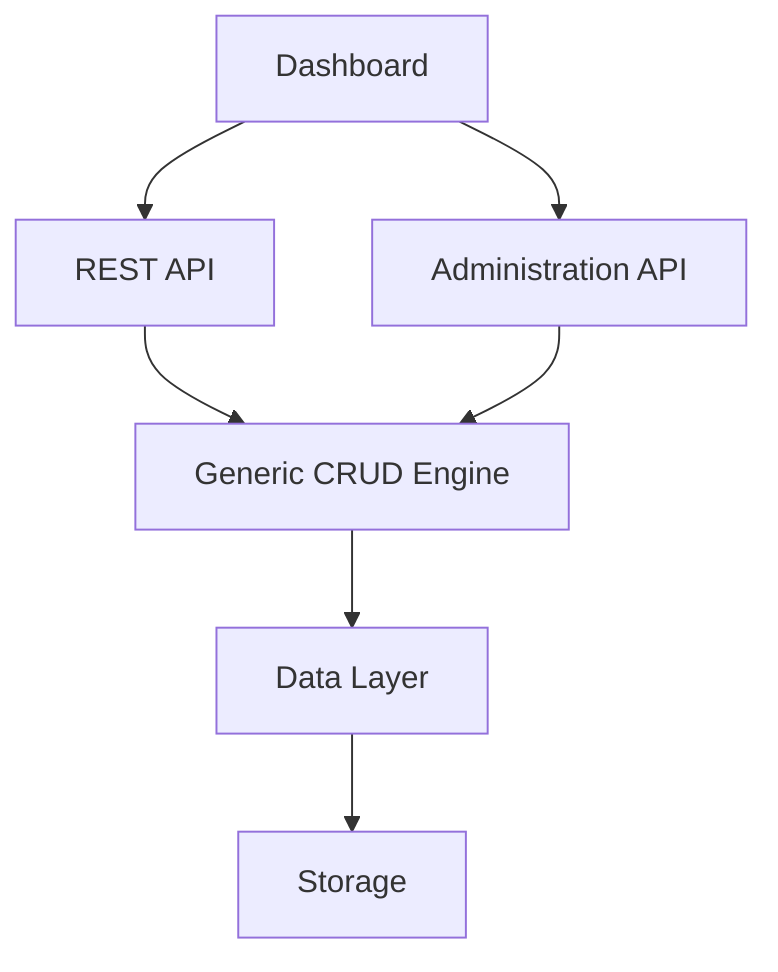
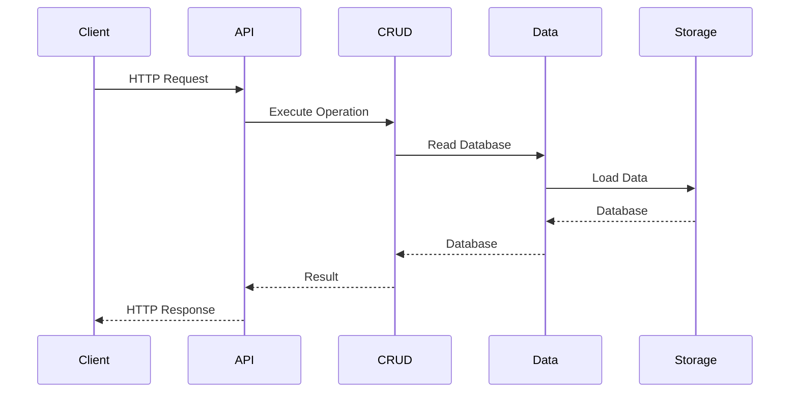

# Appendix A – Complete Project Structure

Throughout this tutorial we've built Greymatter incrementally, one feature at a time.

By the end of the project, the application has evolved into a clean, layered architecture that separates presentation, API endpoints, business logic, and persistence.

This appendix provides a complete overview of the finished project and explains the purpose of each major directory.

---

# Final Project Structure

A simplified project layout is shown below.

```text
greymatter-api-server/
│
├── app/
│   ├── api/
│   │   ├── health/
│   │   ├── products/
│   │   ├── [...slug]/
│   │   └── admin/
│   │
│   ├── components/
│   │   ├── Dashboard/
│   │   ├── DatasetViewer/
│   │   ├── Upload/
│   │   ├── Collections/
│   │   └── QuickStart/
│   │
│   ├── globals.css
│   ├── layout.tsx
│   └── page.tsx
│
├── lib/
│   ├── db.ts
│   ├── query.ts
│   ├── crud.ts
│   ├── storage.ts
│   └── utils.ts
│
├── presets/
│
├── public/
│
├── db.json
│
├── package.json
│
└── README.md
```

Your actual project may contain additional files, but the overall architecture remains the same.

---

# app/

The **app** directory contains everything related to the Next.js application.

It includes:

* Pages
* Route Handlers
* React components
* Global styles

It is the application's presentation layer.

---

# app/api/

This directory contains every API endpoint.

```text
app/api/
```

Responsibilities include:

* REST API
* Administration API
* Health endpoint
* Products endpoint

These Route Handlers process HTTP requests and delegate business logic to the Data Layer.

---

# app/api/[...slug]/

This catch-all Route Handler powers the Generic CRUD Engine.

Rather than creating one route for every collection, all requests pass through a single endpoint.

Example requests include:

```text
GET /api/users

GET /api/posts

DELETE /api/products/7
```

Every request is interpreted dynamically.

---

# app/api/admin/

Administrative operations live separately from the public REST API.

Examples include:

* Create collections
* Delete collections
* Upload JSON
* Download data
* Load presets
* Empty storage

Separating administration from CRUD operations keeps responsibilities clear.

---

# app/api/health/

Provides operational information.

Typical response:

```json
{
  "status": "ok",
  "timestamp": "...",
  "entities": {
    "users": 25,
    "posts": 42
  }
}
```

The dashboard uses this endpoint to display server status.

---

# app/components/

The dashboard consists of reusable React components.

Examples include:

```text
Status

Collections

Dataset Viewer

Upload

Quick Start

Download Tools
```

Each component has a single responsibility.

---

# lib/

The **lib** directory contains the application's core business logic.

Unlike Route Handlers, these modules contain reusable functions that can be shared throughout the application.

---

# lib/db.ts

The Data Layer.

Provides:

```typescript
getDb()

saveDb()

setDb()
```

Every read and write operation passes through these functions.

---

# lib/query.ts

Implements query processing.

Supports:

* Sorting
* Pagination
* Filtering
* Embedding related collections

The CRUD engine delegates request processing to this module.

---

# lib/crud.ts

Implements the Generic CRUD Engine.

Provides reusable operations such as:

* List records
* Get record
* Create record
* Update record
* Delete record

These operations work with every collection.

---

# lib/storage.ts

Contains storage-specific logic.

Depending on the environment it communicates with:

* Local db.json
* Vercel Blob Storage

Everything else in the application remains storage-independent.

---

# presets/

Contains reusable datasets.

Examples:

```text
full-demo.json

blog.json

ecommerce.json
```

These datasets allow developers to populate the API instantly.

---

# public/

Contains static assets such as:

* Images
* Icons
* Logos
* Static downloads

---

# db.json

During local development, this file stores every collection.

Example:

```json
{
  "users": [],
  "posts": [],
  "products": []
}
```

When deployed to Vercel, the same data is stored in Blob Storage instead.

---

# package.json

Defines:

* Project metadata
* Scripts
* Dependencies

Typical scripts include:

```bash
npm run dev

npm run build

npm run lint
```

---

# Architectural Layers

The complete application can be viewed as five layers.



Each layer depends only on the layer below it.

---

# Request Lifecycle

Every request follows the same general flow.



This architecture keeps components loosely coupled.

---

# Key Design Decisions

Greymatter's architecture is built around several principles.

### Generic Design

Collections are data.

Resources are never hardcoded.

---

### Separation of Concerns

Each layer performs one responsibility.

---

### Storage Independence

Business logic never depends on a specific storage provider.

---

### Reusable Components

Dashboard components remain independent and composable.

---

### Serverless Ready

The application runs locally and in the cloud without changing application logic.

---

# Architecture Summary

The completed Greymatter platform consists of:

* React Dashboard
* Public REST API
* Administration API
* Generic CRUD Engine
* Query Processor
* Data Layer
* Storage Abstraction

Each module is small, focused, and reusable.

Together they create a modern mock API platform that is easy to understand, extend, and deploy.

---

# Next Steps

You now have a complete understanding of the Greymatter architecture.

From here you can:

* Add authentication
* Build plugins
* Support additional databases
* Generate OpenAPI documentation
* Add GraphQL
* Implement WebSockets
* Create your own administration tools

Because the application follows a modular architecture, each enhancement can be added without significantly affecting the existing codebase.
