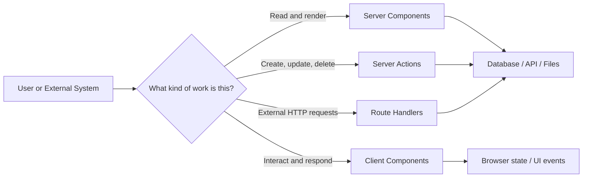
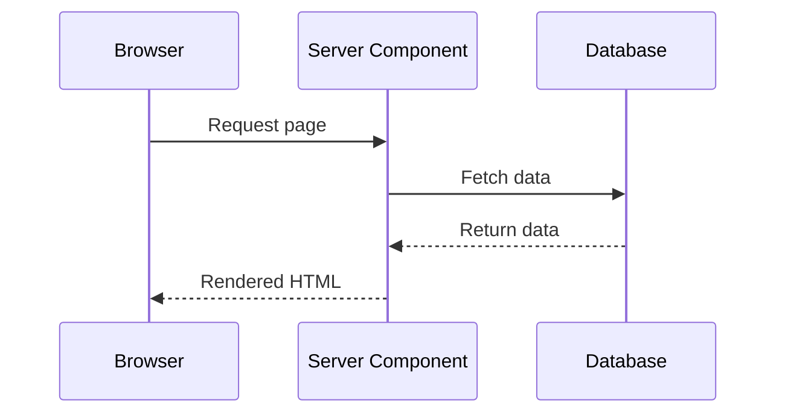
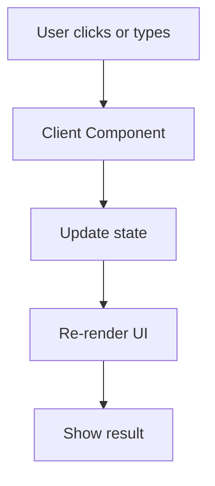
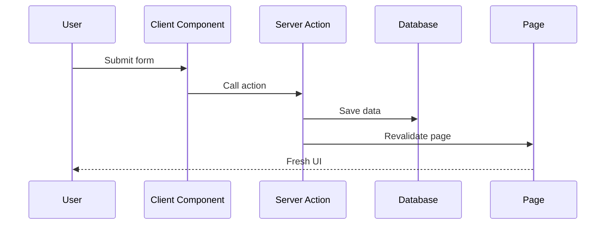
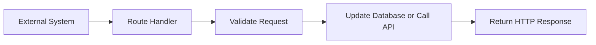
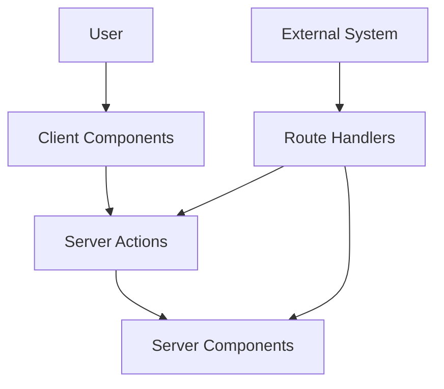

# Beyond Frontend vs Backend: The Four Pillars of Next.js Architecture


Next.js changes how we think about building web applications. Instead of treating everything as either frontend or backend, it gives us four clear building blocks: Server Components, Client Components, Server Actions, and Route Handlers.

This is more than a framework feature. It is a beginner-friendly way to organize your app so each piece runs where it makes the most sense. Once you understand the roles, Next.js becomes much easier to learn and much easier to maintain.

## Why This Matters

If you are coming from traditional React, you may be used to fetching data in `useEffect`, building API routes manually, and juggling loading states, errors, and cache updates yourself. That works, but it creates extra moving parts.

Next.js simplifies this by letting you choose the right runtime for the right job. The result is less boilerplate, better performance, stronger security, and a clearer mental model for your application.

Think of it like a team:

- Some people gather information.
- Some people interact with users.
- Some people change records.
- Some people talk to outside systems.

That is exactly how the four pillars work.

## The Big Picture

Before diving into each pillar, here is the simplest way to remember the architecture:

- Server Components read.
- Client Components interact.
- Server Actions mutate.
- Route Handlers communicate.

Or in plain English:

- Server Components fetch and render.
- Client Components respond and update.
- Server Actions write data.
- Route Handlers expose HTTP endpoints.

That one idea explains most Next.js architecture decisions.



## 1. Server Components

Server Components are the **readers** of your application. They run on the server, which means they can safely access databases, secure cookies, environment variables, and private services.

They are ideal when you want to fetch data and render UI before the page reaches the browser. This makes them perfect for blog pages, dashboards, authenticated views, and other content-heavy screens.

A beginner-friendly way to think about them is this: if the component’s main job is to show information, it probably belongs on the server.

### What They Are Good For

- Fetching data from a database.
- Checking whether a user is logged in.
- Reading markdown or other files.
- Calling private APIs.
- Rendering pages with SEO-friendly HTML.

### Example

```tsx
// app/dashboard/page.tsx
export default async function DashboardPage() {
  const user = await getCurrentUser();
  const posts = await getPosts();

  return (
    <main>
      <h1>Welcome, {user.name}</h1>
      <ul>
        {posts.map((post) => (
          <li key={post.id}>{post.title}</li>
        ))}
      </ul>
    </main>
  );
}
```

This example shows the main strength of Server Components: data is fetched before rendering, so the browser receives a ready-to-display page.

### Why Beginners Should Care

If you are new to Next.js, Server Components are often the easiest place to start. They let you build pages without immediately worrying about client-side state, effects, or API boilerplate.

They also help you avoid exposing sensitive information to the browser. That makes them a safer default for most pages that are mostly about reading data.



## 2. Client Components

Client Components are the **interactive layer**. They run in the browser and handle clicks, form input, state, animations, browser APIs, and other behavior that depends on user action.

If a component needs to remember something after rendering, respond to events, or update instantly without a full page reload, it should usually be a Client Component.

A simple rule: if the user can click it, type into it, drag it, hover it, or change it in real time, you are probably in Client Component territory.

### What They Are Good For

- Forms and validation.
- Buttons and event handlers.
- Tabs, modals, and dropdowns.
- Charts and data visualization.
- Drag-and-drop interfaces.
- Browser-only features like `localStorage` or `window`.

### Example

```tsx
"use client";

import { useState } from "react";

export default function Counter() {
  const [count, setCount] = useState(0);

  return (
    <section>
      <p>Count: {count}</p>
      <button onClick={() => setCount(count + 1)}>Increment</button>
    </section>
  );
}
```

This component must run in the browser because it uses `useState` and reacts to clicks.

### Beginner Tip

A lot of beginners try to make everything a Client Component. That usually makes apps heavier than necessary. Instead, use Client Components only when you need interaction.

A helpful question is:

> Does this component need to react to what the user does?

If the answer is yes, it probably needs to be a Client Component.



## 3. Server Actions

Server Actions are the **writers** of your application. They are server-side functions that can be called directly from your UI to create, update, or delete data.

This is one of the most exciting features for beginners because it removes a lot of traditional API setup. Instead of building a separate endpoint, you write a function on the server and call it from a form or UI event.

### What They Are Good For

- Creating blog posts.
- Updating user profiles.
- Submitting forms.
- Processing checkout flows.
- Handling authentication steps.
- Running business logic that changes data.

### Example

```tsx
// app/posts/actions.ts
"use server";

import { revalidatePath } from "next/cache";

export async function createPost(formData: FormData) {
  const title = String(formData.get("title") || "");
  await db.post.create({
    data: { title },
  });

  revalidatePath("/posts");
}
```

```tsx
// app/posts/new-post-form.tsx
"use client";

import { createPost } from "./actions";

export default function NewPostForm() {
  return (
    <form action={createPost}>
      <input name="title" placeholder="Post title" required />
      <button type="submit">Create Post</button>
    </form>
  );
}
```

In this example, the form submits directly to the Server Action. Next.js handles the server communication, so you do not need to manually write a REST endpoint for this use case.

### Why They Matter

Server Actions make mutation flows much simpler. They also help with revalidation, so when data changes, the UI can refresh with the latest content.

This is especially useful for beginners because it reduces the number of concepts you need to juggle at once.



## 4. Route Handlers

Route Handlers are the **bridge** between your app and the outside world. They expose HTTP endpoints that external systems can call.

This matters because not every request comes from a person using your UI. Sometimes a webhook, mobile app, third-party service, or another backend needs to talk to your app directly.

### What They Are Good For

- API endpoints.
- Webhooks from Stripe, GitHub, or other services.
- OAuth callbacks.
- Mobile app requests.
- Machine-to-machine communication.

### Example

```tsx
// app/api/posts/route.ts
export async function GET() {
  const posts = await db.post.findMany();
  return Response.json(posts);
}
```

```tsx
// app/api/webhooks/stripe/route.ts
export async function POST(request: Request) {
  const payload = await request.json();

  // Verify event, process payment, update database
  return Response.json({ success: true });
}
```

This is the right tool when your app needs an HTTP endpoint that is not tied to a React screen.



## Putting It Together

A good way to remember the whole architecture is to map each pillar to a question:

- Server Components: What should the user see?
- Client Components: What should happen when the user interacts?
- Server Actions: How do we change data safely?
- Route Handlers: How do outside systems talk to us?

That mental model helps you choose the right place for your code without overthinking every decision.



## A Beginner-Friendly Rule of Thumb

Use this simple decision guide:

1. If the code is mostly reading data and rendering UI, use a Server Component.
2. If the code needs clicks, state, or browser APIs, use a Client Component.
3. If the code changes data, use a Server Action.
4. If the code serves HTTP requests from outside your app, use a Route Handler.

You do not need to memorize every detail on day one. Start by asking what kind of work the code is doing, then place it in the matching pillar.

## Common Mistakes

New Next.js developers often make a few predictable mistakes.

- They put everything in Client Components, which increases bundle size.
- They use Server Components for interactive features, which breaks browser behavior.
- They build API routes for simple form submissions when Server Actions would be cleaner.
- They use Server Actions when they actually need a public HTTP endpoint.

If you avoid those mistakes early, your app will be simpler and easier to grow.

## Final Takeaway

Next.js is not just a framework for building React apps. It is a system for deciding where different kinds of work should happen.

Server Components read. Client Components interact. Server Actions mutate. Route Handlers communicate.

Once that clicks, Next.js stops feeling like a maze of special cases and starts feeling like a well-organized architecture.

## Closing Line

> The real power of Next.js is not only in what it can do, but in how clearly it teaches you to separate concerns across the browser and the server.

---

# Further Reading

* [Next.js Documentation](https://nextjs.org/docs?utm_source=chatgpt.com)
* [React Server Components Documentation](https://react.dev/reference/rsc/server-components?utm_source=chatgpt.com)
* [Next.js Server Actions Documentation](https://nextjs.org/docs/app/building-your-application/data-fetching/server-actions-and-mutations?utm_source=chatgpt.com)
* [Next.js Route Handlers Documentation](https://nextjs.org/docs/app/building-your-application/routing/route-handlers?utm_source=chatgpt.com)
* [Stripe Webhooks Documentation](https://docs.stripe.com/webhooks?utm_source=chatgpt.com)
* [GitHub Webhooks Documentation](https://docs.github.com/en/webhooks?utm_source=chatgpt.com)
