# Next.js 16 Deep Dive: Mastering Server Components, Client Components, Server Actions, and Route Handlers


> **Goal:** Understand not just *what* the four major building blocks of Next.js 16 are, but *when*, *why*, and *how* to use them in real-world applications.

---

# The Mental Model Shift

For years, web developers thought about applications using a strict separation of concerns:

```text
Frontend (React SPA)
        ↓ API Calls
Backend (Express/Rails/Spring)
        ↓
Database
```

The frontend rendered user interfaces.

The backend handled business logic and data access.

Modern Next.js applications work differently.

Instead of maintaining separate frontend and backend applications, **Next.js 16 distributes execution across multiple environments**, allowing each piece of code to run where it performs best.

## Traditional Web Architecture

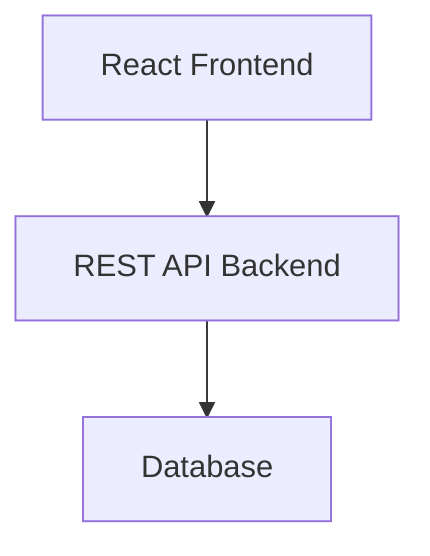

---

## Modern Next.js Architecture

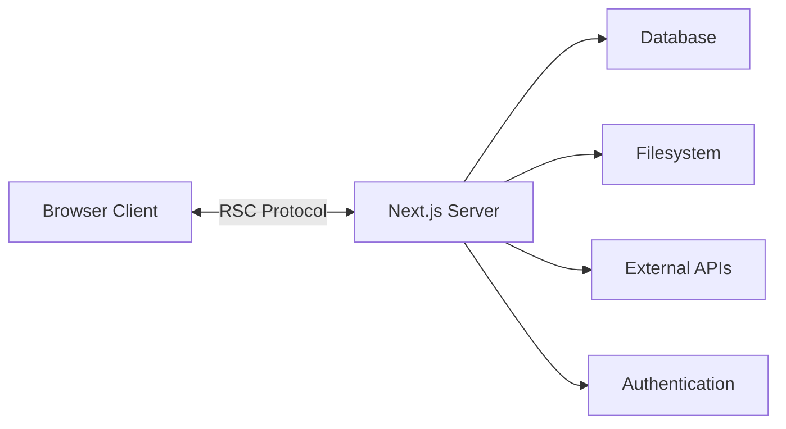

The important question is no longer:

> **"Should this code live in the frontend or backend?"**

Instead, ask:

> **"Where should this code execute?"**

---

# The Four Execution Environments

Next.js 16 applications are built from four primary execution environments.

| Component         | Runs Where | Purpose                      |
| ----------------- | ---------- | ---------------------------- |
| Server Components | Server     | Rendering and data fetching  |
| Client Components | Browser    | Interactivity and state      |
| Server Actions    | Server     | Mutations and business logic |
| Route Handlers    | Server     | APIs and integrations        |

Think of them as specialized tools.

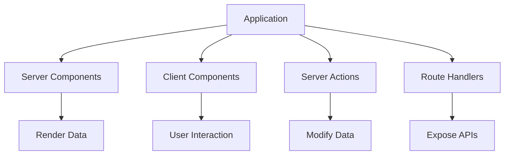

---

# The Big Picture

A Next.js application is really a distributed system.

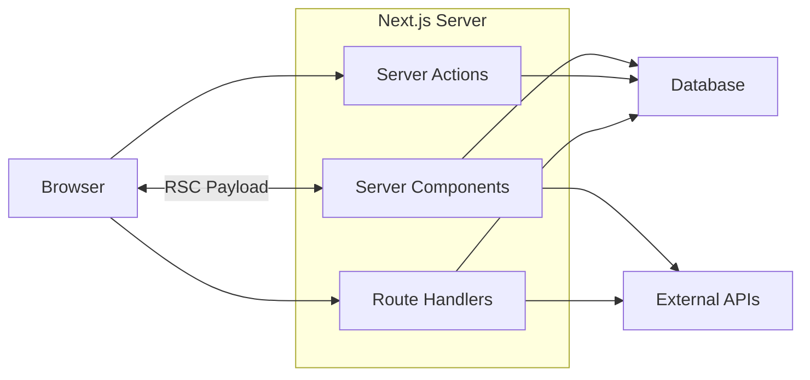

The browser contains only the code required for interaction.

Everything else remains on the server:

* data fetching
* business logic
* authentication
* database access
* API integrations
* cache management

This architecture delivers:

* smaller JavaScript bundles
* better security
* improved SEO
* faster page loads
* improved scalability

---

# Part 1 — Server Components

# What Are Server Components?

Server Components execute entirely on the server.

They can:

* access databases
* access secrets
* read files
* call APIs
* perform authentication
* stream HTML
* render React trees

Most importantly:

> **They ship zero JavaScript to the browser.**

---

# Server Components Are the Default

```tsx
// app/page.tsx

export default function HomePage() {
  return <h1>Hello World</h1>;
}
```

There is:

* no `"use server"`
* no configuration
* no extra syntax

Everything is a Server Component unless you opt into client execution.

---

# Example: Database Access

```tsx
// app/dashboard/page.tsx

import { prisma } from '@/lib/prisma';

export default async function Dashboard() {
  const users = await prisma.user.findMany();

  return (
    <div>
      <h1>Users</h1>

      {users.map(user => (
        <p key={user.id}>
          {user.name}
        </p>
      ))}
    </div>
  );
}
```

Notice what is missing:

❌ API routes
❌ fetch calls
❌ useEffect
❌ loading state management

The database query executes directly on the server.

---

# Example: Reading Files

```tsx
import fs from 'fs/promises';

export default async function DocsPage() {
  const markdown = await fs.readFile(
    './README.md',
    'utf8'
  );

  return <pre>{markdown}</pre>;
}
```

This is impossible inside browser JavaScript.

---

# Example: Environment Variables

```tsx
export default function AdminPage() {
  const secret =
    process.env.ADMIN_SECRET;

  return (
    <div>
      Secret loaded
    </div>
  );
}
```

The browser never receives the secret.

---

# Example: External APIs

```tsx
export default async function Products() {
  const response =
    await fetch(
      'https://dummyjson.com/products'
    );

  const data =
    await response.json();

  return (
    <ul>
      {data.products.map(product => (
        <li key={product.id}>
          {product.title}
        </li>
      ))}
    </ul>
  );
}
```

---

# Server Component Architecture

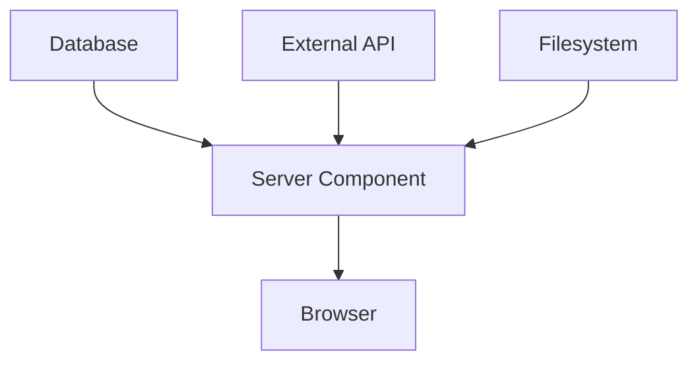

---

# Use Server Components When

✅ Fetching data
✅ Accessing databases
✅ Reading files
✅ Accessing secrets
✅ Rendering pages
✅ SEO content
✅ Layouts
✅ Metadata

---

# Avoid Server Components When

❌ useState
❌ useEffect
❌ onClick
❌ Browser APIs
❌ localStorage
❌ Animations

---

# Part 2 — Client Components

Server Components cannot handle interaction.

That's the responsibility of Client Components.

---

# Creating a Client Component

```tsx
'use client';

export default function Button() {
  return (
    <button>
      Click Me
    </button>
  );
}
```

The `"use client"` directive tells Next.js:

> Ship this component to the browser.

---

# Example: State

```tsx
'use client';

import { useState } from 'react';

export default function Counter() {
  const [count, setCount] =
    useState(0);

  return (
    <>
      <p>{count}</p>

      <button
        onClick={() =>
          setCount(c => c + 1)
        }
      >
        Increment
      </button>
    </>
  );
}
```

---

# Example: Browser APIs

```tsx
'use client';

export default function Location() {
  function getLocation() {
    navigator.geolocation
      .getCurrentPosition(
        console.log
      );
  }

  return (
    <button onClick={getLocation}>
      Get Location
    </button>
  );
}
```

---

# Example: Local Storage

```tsx
'use client';

import { useEffect } from 'react';

export default function Theme() {
  useEffect(() => {
    const theme =
      localStorage.getItem(
        'theme'
      );

    console.log(theme);
  }, []);

  return null;
}
```

---

# Example: Animation

```tsx
'use client';

import { motion }
  from 'framer-motion';

export default function Card() {
  return (
    <motion.div
      whileHover={{
        scale: 1.1,
      }}
    >
      Product
    </motion.div>
  );
}
```

---

# Client Component Architecture

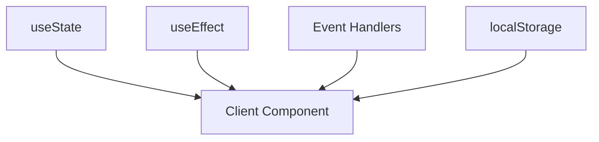

---

# Use Client Components When

✅ useState
✅ useEffect
✅ Event handlers
✅ Browser APIs
✅ Forms
✅ Charts
✅ Animations
✅ Drag-and-drop
✅ Interactive widgets

---

# Part 3 — Combining Server and Client Components

This is the most common architecture pattern.

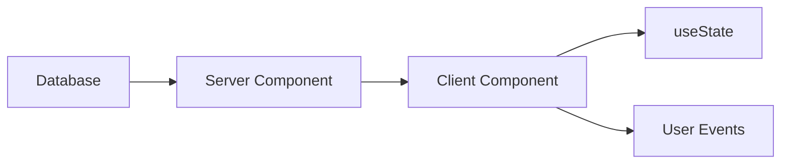

---

# Example: Searchable Product List

## Server Component

```tsx
// app/products/page.tsx

import ProductGrid from './ProductGrid';
import { db } from '@/lib/db';

export default async function Page() {
  const products =
    await db.product.findMany();

  return (
    <ProductGrid
      products={products}
    />
  );
}
```

---

## Client Component

```tsx
'use client';

import { useState } from 'react';

export default function ProductGrid({
  products,
}) {
  const [search, setSearch] =
    useState('');

  const filtered =
    products.filter(product =>
      product.name
        .includes(search)
    );

  return (
    <>
      <input
        value={search}
        onChange={e =>
          setSearch(
            e.target.value
          )
        }
      />

      {filtered.map(product => (
        <p key={product.id}>
          {product.name}
        </p>
      ))}
    </>
  );
}
```

---

# Part 4 — Server Actions

Server Components fetch data.

Server Actions modify data.

Think SQL:

| Operation | Next.js Tool     |
| --------- | ---------------- |
| SELECT    | Server Component |
| INSERT    | Server Action    |
| UPDATE    | Server Action    |
| DELETE    | Server Action    |

---

# Creating a Server Action

```tsx
// app/actions.ts

'use server';

export async function createPost(
  formData: FormData
) {
  const title =
    formData.get('title');

  console.log(title);
}
```

---

# Database Example

```tsx
'use server';

import { prisma }
  from '@/lib/prisma';

export async function addUser(
  formData: FormData
) {
  await prisma.user.create({
    data: {
      name:
        formData.get('name')
        as string,
    },
  });
}
```

---

# Using a Server Action

```tsx
import { addUser }
  from './actions';

export default function Page() {
  return (
    <form action={addUser}>
      <input name="name" />

      <button>
        Create User
      </button>
    </form>
  );
}
```

---

# Revalidation

```tsx
'use server';

import {
  revalidatePath,
} from 'next/cache';

export async function createPost() {
  await db.post.create();

  revalidatePath('/blog');
}
```

---

# Client Components Can Call Server Actions

```tsx
'use client';

import { addUser }
  from './actions';

export default function Save() {
  async function save() {
    await addUser(
      new FormData()
    );
  }

  return (
    <button onClick={save}>
      Save
    </button>
  );
}
```

---

# Server Action Flow

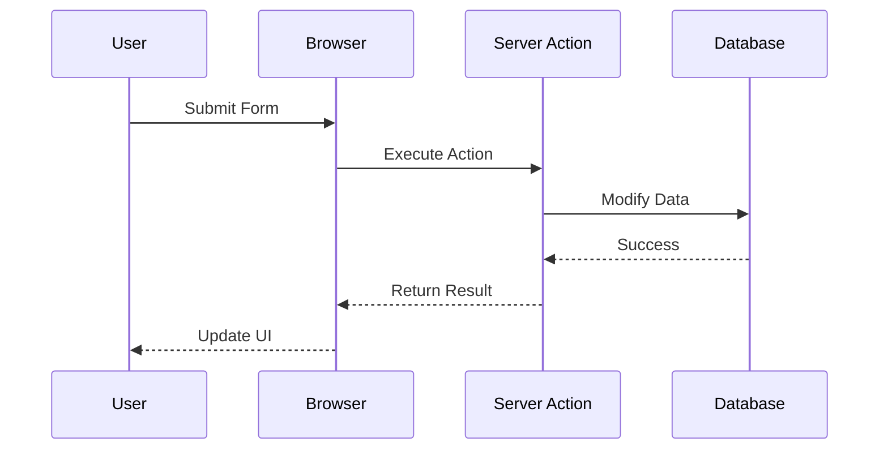

---

# Use Server Actions When

✅ Create records
✅ Update records
✅ Delete records
✅ Authentication
✅ Form submission
✅ Cache invalidation
✅ Business rules

---

# Part 5 — Route Handlers

Sometimes you need a real HTTP API.

Examples include:

* Stripe webhooks
* OAuth callbacks
* mobile applications
* REST APIs
* file uploads
* external integrations

---

# GET Endpoint

```tsx
// app/api/users/route.ts

export async function GET() {
  return Response.json({
    users: [],
  });
}
```

---

# POST Endpoint

```tsx
export async function POST(
  request: Request
) {
  const body =
    await request.json();

  return Response.json({
    success: true,
  });
}
```

---

# Stripe Webhook

```tsx
export async function POST(
  request: Request
) {
  const payload =
    await request.text();

  // verify stripe signature

  return Response.json({
    received: true,
  });
}
```

---

# Route Handler Architecture

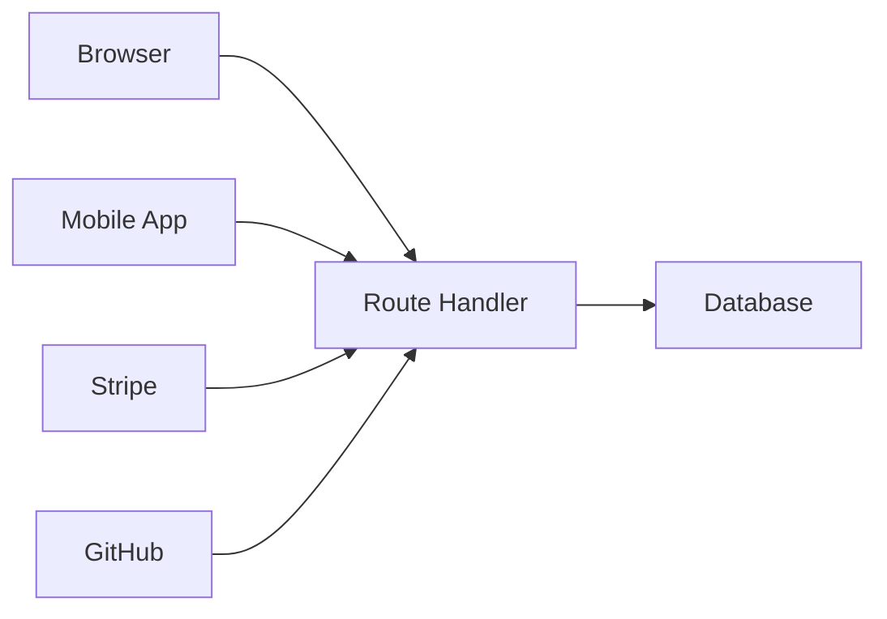

---

# Use Route Handlers When

✅ Webhooks
✅ Public APIs
✅ Mobile clients
✅ OAuth
✅ Streaming
✅ File uploads
✅ Third-party integrations

---

# Decision Tree

When in doubt:

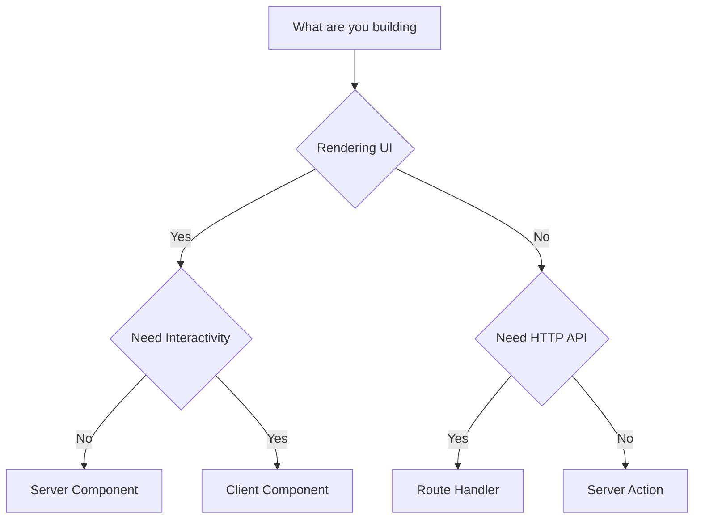

---

# Real-World E-Commerce Architecture

A typical Next.js application uses all four execution environments.

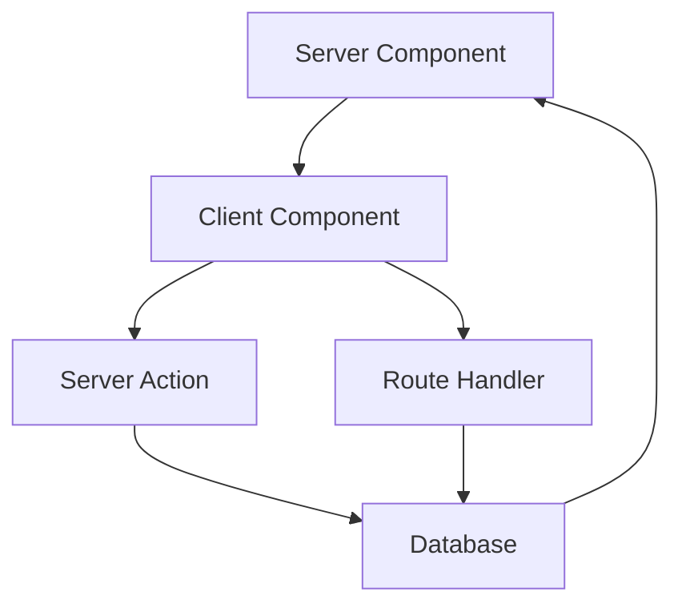

| Feature           | Tool             |
| ----------------- | ---------------- |
| Product page      | Server Component |
| Quantity selector | Client Component |
| Add to cart       | Server Action    |
| Stripe webhook    | Route Handler    |

---

# The Golden Rule

Ask yourself four questions.

### Am I rendering data?

➡️ Use a **Server Component**

---

### Am I handling interaction?

➡️ Use a **Client Component**

---

### Am I modifying data?

➡️ Use a **Server Action**

---

### Am I exposing an HTTP endpoint?

➡️ Use a **Route Handler**

---

# Final Mental Model

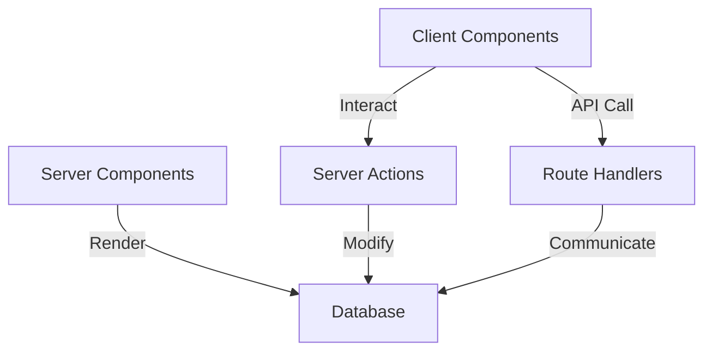

Remember:

> **Server Components render.**
>
> **Client Components interact.**
>
> **Server Actions mutate.**
>
> **Route Handlers communicate.**

Once you understand these four responsibilities, Next.js 16 stops feeling magical and starts feeling like what it really is:

> **A distributed application runtime that happens to use React.**
