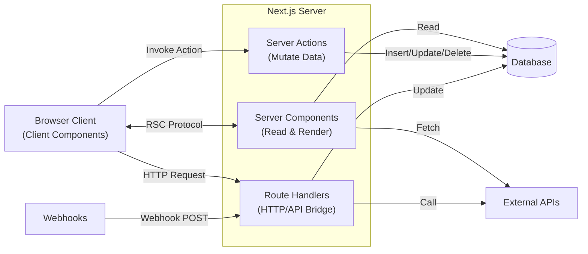
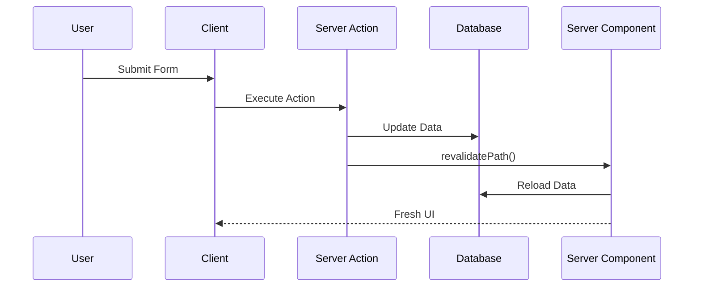
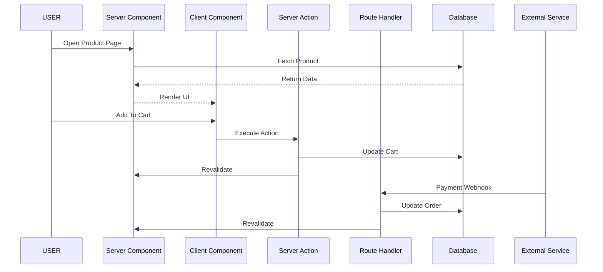

# **Beyond Frontend vs Backend: Understanding the Four Pillars of Next.js 16 Architecture**

> **If React taught us to think in components, Next.js 16 teaches us to think in execution environments.**


For years, web developers were taught to think about applications as two separate systems:

* a **frontend** application that users interact with
* a **backend** application that handles data and business logic

These two worlds communicated through APIs, resulting in architectures that often looked like this:

```text
Frontend SPA
      ↓
 REST API
      ↓
Backend
      ↓
Database
```

This separation worked, but it introduced significant complexity:

* duplicated validation logic
* loading states everywhere
* API boilerplate
* authentication boundaries
* network latency
* large client-side JavaScript bundles

Modern applications built with [Next.js](https://nextjs.org?utm_source=chatgpt.com) take a fundamentally different approach.

Instead of asking:

> **"Should this code live in the frontend or backend?"**

we now ask:

> **"Where should this code execute?"**

That single shift changes everything.

---

# The Big Idea: Next.js Is a Distributed Runtime

Most beginners initially think of Next.js as:

> "React plus server-side rendering."

But that's not quite accurate.

A better mental model is:

> **Next.js is a distributed application runtime that happens to use React.**

Your application is distributed across multiple execution environments, each optimized for a specific responsibility.



Instead of one frontend and one backend, you now have **four architectural pillars**.

---

# The Four Pillars of Next.js Architecture

| Pillar            | Responsibility         | Runs Where |
| ----------------- | ---------------------- | ---------- |
| Server Components | Read and render        | Server     |
| Client Components | Interact               | Browser    |
| Server Actions    | Modify data            | Server     |
| Route Handlers    | Communicate externally | Server     |

Think of them as specialists on a software engineering team.

---

# Pillar #1 — Server Components: The Reader

Server Components are responsible for:

* fetching data
* rendering pages
* performing authentication
* reading files
* calling APIs
* generating HTML

Their defining characteristic is:

> **They send almost no JavaScript to the browser.**

---

## The Old React Way

Many React developers learned data fetching like this:

```tsx
function Posts() {
  const [posts, setPosts] =
    useState([]);

  useEffect(() => {
    fetch('/api/posts')
      .then(res => res.json())
      .then(setPosts);
  }, []);

  return (
    <div>
      {posts.map(...)}
    </div>
  );
}
```

This required managing:

* loading state
* error state
* retries
* caching
* API routes

---

## The Next.js Way

```tsx
async function getPosts() {
  const response =
    await fetch(
      'https://api.example.com/posts',
      {
        next: {
          revalidate: 3600,
        },
      }
    );

  return response.json();
}

export default async function PostsPage() {

  const posts =
    await getPosts();

  return (
    <ul>
      {posts.map(post => (
        <li key={post.id}>
          {post.title}
        </li>
      ))}
    </ul>
  );
}
```

Notice what's missing:

❌ `useEffect`

❌ `useState`

❌ API boilerplate

❌ loading state management

Instead:

```text
Fetch
   ↓
Render
   ↓
Stream UI
```

---

## Server Components Are Excellent For

✅ Database queries

✅ Authentication

✅ SEO

✅ Layouts

✅ Metadata

✅ Reading files

✅ Fetching APIs

---

# Pillar #2 — Client Components: The Interactive Layer

Server Components cannot:

* handle clicks
* maintain state
* access browser APIs

That's the job of Client Components.

A Client Component simply declares:

```tsx
'use client';
```

which tells Next.js:

> Ship this component to the browser.

---

## Example: State

```tsx
'use client';

import { useState }
  from 'react';

export default function Counter() {

  const [count, setCount] =
    useState(0);

  return (
    <>
      <p>{count}</p>

      <button
        onClick={() =>
          setCount(c => c + 1)
        }
      >
        Increment
      </button>
    </>
  );
}
```

---

## Client Components Are Excellent For

✅ Forms

✅ Event handlers

✅ Animations

✅ Browser APIs

✅ Charts

✅ Drag-and-drop

✅ State management

---

# Pillar #3 — Server Actions: The Mutator

If Server Components perform **SELECT**, Server Actions perform:

* INSERT
* UPDATE
* DELETE

Think of Server Actions as:

> **Server-side functions callable from the UI.**

---

## Creating a Server Action

```tsx
'use server';

import {
  revalidatePath
} from 'next/cache';

export async function createPost(
  formData: FormData
) {

  const title =
    formData.get('title');

  // Save to database

  revalidatePath('/posts');
}
```

---

## Calling It From The Browser

```tsx
'use client';

import {
  createPost
} from './actions';

export function CreateForm() {

  return (
    <form action={createPost}>

      <input
        name="title"
        required
      />

      <button>
        Create Post
      </button>

    </form>
  );
}
```

Notice something remarkable:

There is:

* no fetch call
* no API endpoint
* no axios
* no REST layer

Next.js creates the communication layer automatically.

---

## The Revalidation Cycle



This automatic revalidation is one of the biggest architectural advantages of modern Next.js.

---

# Pillar #4 — Route Handlers: The Bridge

Sometimes your application isn't talking to a person.

Sometimes it's talking to another machine.

Examples include:

* payment providers
* authentication providers
* mobile applications
* webhooks
* third-party services

This is where Route Handlers come in.

---

## Example: Webhook Endpoint

```tsx
export async function POST(
  request: Request
) {

  const payload =
    await request.json();

  if (
    isAuthorized(
      request.headers
    )
  ) {

    // Update database

    return Response.json({
      success: true,
    });
  }

  return Response.json(
    {
      error: 'Unauthorized',
    },
    {
      status: 401,
    }
  );
}
```

---

## Route Handlers Are Excellent For

✅ Webhooks

✅ REST APIs

✅ OAuth callbacks

✅ Mobile apps

✅ File uploads

✅ Third-party integrations

---

# The Final Boss: Orchestrating Everything

The real power of Next.js emerges when these four pillars work together.

Imagine an e-commerce website:



The application stays synchronized because:

* Server Components read
* Client Components interact
* Server Actions mutate
* Route Handlers integrate

---

# The Architect's Cheat Sheet

| Question                      | Answer                |
| ----------------------------- | --------------------- |
| Am I rendering data?          | Use Server Components |
| Am I handling interaction?    | Use Client Components |
| Am I modifying data?          | Use Server Actions    |
| Am I exposing HTTP endpoints? | Use Route Handlers    |

---

# Why This Architecture Matters

Traditional React applications often required developers to build:

```text
UI
 ↓
State
 ↓
Effect
 ↓
API
 ↓
Backend
 ↓
Database
```

Next.js removes much of this complexity:

```text
UI
 ↓
Execution Environment
 ↓
Database
```

The result is:

* smaller bundles
* fewer API layers
* less boilerplate
* improved security
* better SEO
* faster rendering
* simpler mental models

---

# Conclusion

The biggest mistake developers make when learning Next.js is trying to classify code as either:

> frontend code

or

> backend code

Next.js no longer thinks this way.

Instead, ask:

* **Am I rendering?**
* **Am I interacting?**
* **Am I mutating?**
* **Am I integrating?**

Once you begin thinking in terms of **execution environments and responsibilities**, Next.js stops feeling magical and starts feeling like what it actually is:

> **A distributed application architecture platform built on top of React.**

---

# Further Reading

* [Next.js Documentation](https://nextjs.org/docs?utm_source=chatgpt.com)
* [React Server Components Documentation](https://react.dev/reference/rsc/server-components?utm_source=chatgpt.com)
* [Next.js Server Actions Documentation](https://nextjs.org/docs/app/building-your-application/data-fetching/server-actions-and-mutations?utm_source=chatgpt.com)
* [Next.js Route Handlers Documentation](https://nextjs.org/docs/app/building-your-application/routing/route-handlers?utm_source=chatgpt.com)
* [Stripe Webhooks Documentation](https://docs.stripe.com/webhooks?utm_source=chatgpt.com)
* [GitHub Webhooks Documentation](https://docs.github.com/en/webhooks?utm_source=chatgpt.com)
