# **Beyond Frontend vs Backend: Understanding the Four Pillars of Next.js 16 Architecture**

> **If React taught us to think in components, Next.js 16 teaches us to think in execution environments.**


# From Frontend vs Backend to Execution Environments

For decades, web developers were taught to think about applications as **two separate systems**:

* a **frontend application** responsible for the user interface
* a **backend application** responsible for data, business logic, and security

These two worlds communicated through APIs, resulting in architectures that typically looked like this:

```text
Frontend SPA
      ↓
 REST API
      ↓
Backend
      ↓
Database
```

This model powered an entire generation of web applications.

Frameworks like React, Angular, Vue, Express, Spring Boot, Rails, and ASP.NET all evolved around this fundamental separation.

And to be clear:

> **There is nothing inherently wrong with this architecture.**

It solved important problems by separating concerns and allowing frontend and backend teams to work independently.

However, this separation also introduced significant complexity.

---

## The Hidden Cost of the Frontend/Backend Split

Consider what happens when a user clicks a simple **"Create Post"** button.

```text
User Click
     ↓
Frontend Validation
     ↓
HTTP Request
     ↓
API Authentication
     ↓
Backend Validation
     ↓
Business Logic
     ↓
Database
     ↓
JSON Response
     ↓
Frontend State Update
     ↓
UI Re-render
```

To make this workflow function correctly, developers often had to build and maintain:

### 🔄 Duplicated Validation Logic

Validation frequently exists in multiple places:

* browser validation
* API validation
* database validation

```text
Frontend Validation
          +
Backend Validation
          +
Database Constraints
```

The same business rule might be implemented three times.

---

### ⏳ Loading States Everywhere

Every API call introduces uncertainty:

```tsx
const [loading, setLoading] =
  useState(false);

const [error, setError] =
  useState(null);

const [data, setData] =
  useState(null);
```

Developers spend enormous amounts of time managing:

* loading states
* error states
* empty states
* retry states
* stale data states

---

### 🌐 API Boilerplate

Even simple operations require multiple layers:

```text
Button Click
      ↓
fetch()
      ↓
HTTP Request
      ↓
API Endpoint
      ↓
Controller
      ↓
Service
      ↓
Repository
      ↓
Database
```

A single user action might require hundreds of lines of infrastructure code.

---

### 🔐 Authentication Boundaries

Authentication becomes complicated because it must cross system boundaries:

```text
Browser
    ↓
JWT/Cookie
    ↓
API
    ↓
Session Validation
    ↓
Business Logic
```

Every request must be:

* authenticated
* authorized
* validated
* serialized

---

### 🐌 Network Latency

Even if your frontend and backend are owned by the same company, they're still separate systems.

```text
Browser
     ↓
Network
     ↓
API Server
     ↓
Database
     ↓
API Server
     ↓
Network
     ↓
Browser
```

Every hop introduces latency.

---

### 📦 Large Client-Side JavaScript Bundles

Traditional SPAs often push substantial amounts of JavaScript to the browser:

* data fetching logic
* state management
* API clients
* caching libraries
* loading management
* synchronization logic

Ironically, much of this code exists only to coordinate communication with the backend.

---

# The Next.js Mental Model Shift

Modern applications built with Next.js take a fundamentally different approach.

Instead of asking:

> **"Should this code live in the frontend or backend?"**

we now ask:

> **"Where should this code execute?"**

That single shift changes everything.

Because not all code has the same requirements.

Some code needs:

* database access
* secrets
* filesystem access
* authentication

Other code needs:

* event handlers
* animations
* browser APIs
* local state

And some code needs:

* HTTP endpoints
* webhook processing
* third-party integrations

The goal is no longer to separate by *application layer*.

The goal is to optimize by *execution environment*.

---

# The Big Idea: Next.js Is a Distributed Runtime

Most beginners initially think of Next.js as:

> "React plus server-side rendering."

That's understandable, but it's not the most useful mental model.

A better way to think about Next.js is:

> **Next.js is a distributed application runtime that happens to use React.**

Your application no longer executes in a single place.

Instead, it is distributed across multiple execution environments, each optimized for a specific responsibility.

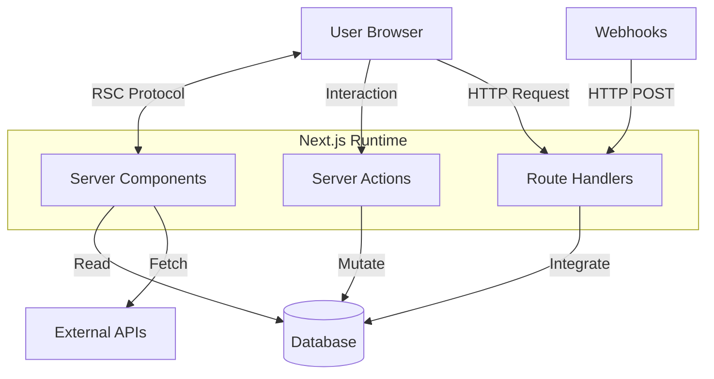

Notice what happened.

We no longer have:

```text
Frontend
    ↓
Backend
```

Instead, we have:

```text
Read
  ↓
Interact
  ↓
Mutate
  ↓
Integrate
```

---

# The Four Execution Environments

Next.js applications are built using four primary execution environments.

| Execution Environment | Responsibility         | Think Of It As |
| --------------------- | ---------------------- | -------------- |
| Server Components     | Reading data           | The Reader     |
| Client Components     | User interaction       | The Actor      |
| Server Actions        | Modifying data         | The Mutator    |
| Route Handlers        | External communication | The Bridge     |

Each environment exists because it solves a different problem.

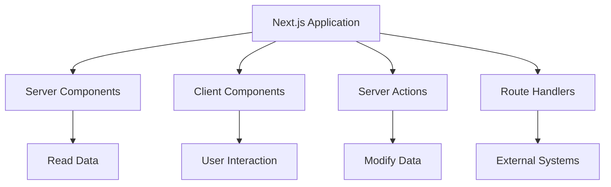

---

# Why This Matters

Once you understand this mental model, many aspects of Next.js suddenly become intuitive.

You stop asking:

> "Why do we have Server Components, Client Components, Server Actions, and Route Handlers?"

And start asking:

> "What responsibility does this code have?"

Because in Next.js:

* **Server Components read.**
* **Client Components interact.**
* **Server Actions mutate.**
* **Route Handlers communicate.**

And that is why modern Next.js applications feel fundamentally different from traditional frontend/backend applications:

> **They are not two applications communicating over an API.**
>
> **They are one distributed application executing in multiple environments.**


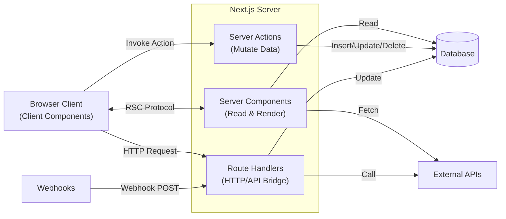

Instead of one frontend and one backend, you now have **four architectural pillars**.

---

# The Four Pillars of Next.js Architecture

| Pillar            | Responsibility         | Runs Where |
| ----------------- | ---------------------- | ---------- |
| Server Components | Read and render        | Server     |
| Client Components | Interact               | Browser    |
| Server Actions    | Modify data            | Server     |
| Route Handlers    | Communicate externally | Server     |

Think of them as specialists on a software engineering team.

---

## Pillar #1 — Server Components: The Reader

If traditional React components were responsible for both **fetching data** and **rendering interfaces**, **Server Components separate those concerns by moving data access and rendering back to the server**, where they naturally belong.

Think of a Server Component as the **"reader"** of your application.

Its primary responsibility is to gather everything needed to render a page and then produce the UI that the user sees.

Server Components can:

* 📊 **Fetch data** from databases
* 🔐 **Perform authentication and authorization**
* 📁 **Read files from the filesystem**
* 🌐 **Call external APIs and services**
* 🔑 **Access environment variables and secrets**
* 🏗️ **Generate HTML and React component trees**
* ⚡ **Leverage caching, streaming, and revalidation**

Their defining characteristic is:

> **Server Components execute entirely on the server and send almost no JavaScript to the browser.**

This represents one of the biggest architectural shifts in modern web development.

In traditional React applications, the browser typically:

1. downloads JavaScript,
2. renders an empty UI,
3. executes `useEffect`,
4. calls an API,
5. waits for a response,
6. updates state,
7. and finally renders the data.

```text
Browser
   ↓
Download JS
   ↓
Render Empty UI
   ↓
useEffect()
   ↓
Fetch API
   ↓
Wait
   ↓
setState()
   ↓
Render Data
```

With Server Components, the process is reversed:

```text
Server
   ↓
Fetch Data
   ↓
Render UI
   ↓
Stream HTML/RSC Payload
   ↓
Browser Displays Content
```

The user receives an already-rendered interface rather than a JavaScript application that still needs to fetch its data.

This provides several major advantages:

| Benefit                       | Why It Matters                                                     |
| ----------------------------- | ------------------------------------------------------------------ |
| 🚀 Faster initial page loads  | Data fetching occurs before the browser renders                    |
| 🔒 Improved security          | Database credentials and secrets never leave the server            |
| 📦 Smaller JavaScript bundles | Less code is shipped to the client                                 |
| 🔍 Better SEO                 | Search engines receive fully rendered content                      |
| ⚡ Automatic caching           | Next.js can cache and revalidate server fetches                    |
| 🧩 Simplified code            | No `useEffect`, loading state, or API boilerplate for initial data |

A useful mental model is:

> **Server Components are not interactive components.**
>
> **They are server-side render functions that happen to return React.**

Or even more simply:

> **Server Components read data and render UI. They do not handle user interaction.**

This is why Server Components are the default in Next.js 16: most of what applications do is **read information and display it**, and the server is the best place to perform that work.


---

## The Old React Way

Many React developers learned data fetching like this:

```tsx
function Posts() {
  const [posts, setPosts] =
    useState([]);

  useEffect(() => {
    fetch('/api/posts')
      .then(res => res.json())
      .then(setPosts);
  }, []);

  return (
    <div>
      {posts.map(...)}
    </div>
  );
}
```

This required managing:

* loading state
* error state
* retries
* caching
* API routes

---

## The Next.js Way

```tsx
async function getPosts() {
  const response =
    await fetch(
      'https://api.example.com/posts',
      {
        next: {
          revalidate: 3600,
        },
      }
    );

  return response.json();
}

export default async function PostsPage() {

  const posts =
    await getPosts();

  return (
    <ul>
      {posts.map(post => (
        <li key={post.id}>
          {post.title}
        </li>
      ))}
    </ul>
  );
}
```

Notice what's missing:

❌ `useEffect`

❌ `useState`

❌ API boilerplate

❌ loading state management

Instead:

```text
Fetch
   ↓
Render
   ↓
Stream UI
```

---

## Server Components Are Excellent For

Because Server Components execute entirely on the server, they excel at tasks that require **data access**, **security**, and **initial rendering**. Whenever your goal is to **retrieve information and present it to the user**, a Server Component should usually be your first choice.

### 🗄️ Database Queries

Server Components can connect directly to your database without requiring an intermediate API layer.

```tsx
export default async function UsersPage() {
  const users =
    await prisma.user.findMany();

  return (
    <ul>
      {users.map(user => (
        <li key={user.id}>
          {user.name}
        </li>
      ))}
    </ul>
  );
}
```

**Why Server Components?**

* No API routes required
* No `useEffect`
* No loading state management
* Database credentials remain secure
* Faster rendering through server-side execution

---

### 🔐 Authentication and Authorization

Authentication naturally belongs on the server because sensitive information should never be exposed to the browser.

```tsx
export default async function Dashboard() {
  const session =
    await auth();

  if (!session) {
    redirect('/login');
  }

  return (
    <h1>
      Welcome,
      {session.user.name}
    </h1>
  );
}
```

**Why Server Components?**

* Access secure cookies and sessions
* Protect routes before rendering
* Prevent unauthorized UI exposure
* Keep authentication logic private

---

### 🔍 SEO and Search Engine Rendering

Search engines prefer receiving fully rendered HTML instead of JavaScript applications that fetch data after loading.

```tsx
export default async function BlogPost() {
  const post =
    await getPost();

  return (
    <article>
      <h1>{post.title}</h1>
      <p>{post.content}</p>
    </article>
  );
}
```

**Why Server Components?**

* HTML is generated before reaching the browser
* Faster indexing by search engines
* Better Core Web Vitals
* Improved social sharing previews

---

### 🏗️ Layouts and Application Shells

Layouts are ideal Server Components because they usually display data but don't require interactivity.

```tsx
export default async function DashboardLayout({
  children,
}) {
  const user =
    await getCurrentUser();

  return (
    <>
      <Sidebar user={user} />
      <main>{children}</main>
    </>
  );
}
```

**Why Server Components?**

* Fetch data once at the layout level
* Share data across multiple pages
* Reduce duplicate requests
* Keep layouts lightweight

---

### 🏷️ Metadata Generation

Server Components can dynamically generate metadata based on live data.

```tsx
export async function generateMetadata({
  params,
}) {
  const post =
    await getPost(params.slug);

  return {
    title: post.title,
    description: post.summary,
  };
}
```

**Why Server Components?**

* Dynamic SEO metadata
* Social media previews
* OpenGraph generation
* Search engine optimization

---

### 📁 Reading Files and Local Resources

Since Server Components execute on the server, they can access the filesystem directly.

```tsx
import fs from 'fs/promises';

export default async function DocsPage() {
  const markdown =
    await fs.readFile(
      './README.md',
      'utf8'
    );

  return (
    <pre>{markdown}</pre>
  );
}
```

**Why Server Components?**

* Access local files
* Read markdown content
* Load configuration files
* Generate static content dynamically

---

### 🌐 Fetching External APIs

Server Components can call external services directly without exposing API keys to users.

```tsx
export default async function Weather() {
  const response =
    await fetch(
      'https://api.weather.com/data',
      {
        headers: {
          Authorization:
            process.env.API_KEY!,
        },
      }
    );

  const weather =
    await response.json();

  return (
    <div>
      {weather.temperature}
    </div>
  );
}
```

**Why Server Components?**

* API secrets remain secure
* Automatic request deduplication
* Built-in caching
* Support for streaming and revalidation

---

## A Useful Rule of Thumb

Ask yourself one question:

> **"Am I primarily reading data and displaying it?"**

If the answer is **yes**, then a **Server Component** is usually the correct choice.

```text
Read Data
    ↓
Authenticate
    ↓
Fetch Resources
    ↓
Render HTML
    ↓
Send UI to Browser
```

A simple way to remember this is:

> **Server Components are the readers of your application.**
>
> They **read**, **fetch**, **authenticate**, and **render**.
>
> They do **not** handle clicks, state, or browser interactions.


---

# Pillar #2 — Client Components: The Interactive Layer

Server Components cannot:

* handle clicks
* maintain state
* access browser APIs

That's the job of Client Components.

A Client Component simply declares:

```tsx
'use client';
```

which tells Next.js:

> Ship this component to the browser.

---

## Example: State

```tsx
'use client';

import { useState }
  from 'react';

export default function Counter() {

  const [count, setCount] =
    useState(0);

  return (
    <>
      <p>{count}</p>

      <button
        onClick={() =>
          setCount(c => c + 1)
        }
      >
        Increment
      </button>
    </>
  );
}
```

---

## Client Components Are Excellent For

While **Server Components are optimized for reading and rendering data**, **Client Components are optimized for interaction**.

Think of a Client Component as the **"interactive layer"** of your application.

Whenever your application needs to respond to a user's actions, maintain state, or access browser capabilities, you're entering Client Component territory.

Their defining characteristic is:

> **Client Components execute inside the user's browser and enable rich, interactive experiences.**

Unlike Server Components, Client Components are shipped to the browser as JavaScript, where they can:

* maintain state
* respond to events
* access browser APIs
* update the UI without a full page refresh
* create dynamic and interactive user experiences

A useful mental model is:

> **Server Components answer the question "What should the user see?"**
>
> **Client Components answer the question "What should happen when the user does something?"**

---

### 📝 Forms and User Input

Forms are one of the most common reasons to use Client Components.

Users expect forms to provide:

* immediate validation
* dynamic feedback
* conditional fields
* loading indicators
* optimistic updates

```tsx
'use client';

import { useState } from 'react';

export default function LoginForm() {
  const [email, setEmail] =
    useState('');

  return (
    <form>
      <input
        value={email}
        onChange={(e) =>
          setEmail(e.target.value)
        }
      />

      <button>
        Login
      </button>
    </form>
  );
}
```

**Why Client Components?**

* Handle user input instantly
* Display validation feedback
* Manage form state
* Improve user experience

---

### 🖱️ Event Handlers

Server Components cannot respond to clicks, keyboard events, or mouse interactions.

Client Components can.

```tsx
'use client';

export default function DeleteButton() {

  function handleDelete() {
    console.log('Deleting...');
  }

  return (
    <button
      onClick={handleDelete}
    >
      Delete
    </button>
  );
}
```

**Why Client Components?**

* Respond to user actions
* Trigger workflows
* Update UI immediately
* Provide interactive experiences

---

### ✨ Animations and Transitions

Animations require JavaScript execution inside the browser.

```tsx
'use client';

import { motion }
  from 'framer-motion';

export default function Card() {

  return (
    <motion.div
      whileHover={{
        scale: 1.1,
      }}
    >
      Product
    </motion.div>
  );
}
```

**Why Client Components?**

* Smooth transitions
* Hover effects
* Page animations
* Interactive visual feedback

---

### 🌐 Browser APIs

Some APIs only exist inside the browser environment.

Examples include:

* `localStorage`
* `sessionStorage`
* `navigator.geolocation`
* `navigator.clipboard`
* `window`
* `document`
* camera and microphone APIs

```tsx
'use client';

export default function Location() {

  async function getLocation() {
    navigator.geolocation
      .getCurrentPosition(
        console.log
      );
  }

  return (
    <button
      onClick={getLocation}
    >
      Get Location
    </button>
  );
}
```

**Why Client Components?**

* Access browser hardware
* Store local preferences
* Integrate with browser capabilities
* Provide personalized experiences

---

### 📊 Charts and Data Visualization

Charts require dynamic rendering, resizing, animation, and user interaction.

```tsx
'use client';

import {
  BarChart,
  Bar,
} from 'recharts';

export default function SalesChart() {

  return (
    <BarChart
      width={400}
      height={300}
      data={data}
    >
      <Bar dataKey="sales" />
    </BarChart>
  );
}
```

**Why Client Components?**

* Interactive charts
* Responsive resizing
* Tooltips
* Zooming and filtering
* Real-time updates

---

### 🖱️ Drag-and-Drop Interfaces

Drag-and-drop requires continuous interaction with mouse and touch events.

```tsx
'use client';

export default function KanbanBoard() {
  return (
    <div>
      {/* Drag and drop UI */}
    </div>
  );
}
```

Examples include:

* Kanban boards
* sortable lists
* page builders
* dashboard widgets
* file uploads

**Why Client Components?**

* Real-time interactions
* Mouse tracking
* Gesture handling
* Visual feedback

---

### 🧠 State Management

Perhaps the most important use case.

If your component needs to remember something after rendering, you need a Client Component.

```tsx
'use client';

import { useState }
  from 'react';

export default function Counter() {

  const [count, setCount] =
    useState(0);

  return (
    <>
      <p>{count}</p>

      <button
        onClick={() =>
          setCount(
            count + 1
          )
        }
      >
        Increment
      </button>
    </>
  );
}
```

State can include:

* counters
* search filters
* modal visibility
* tabs
* selected items
* shopping carts
* form inputs

**Why Client Components?**

* Preserve user interactions
* Enable dynamic UIs
* Avoid page refreshes
* Create app-like experiences

---

## A Useful Rule of Thumb

Ask yourself one question:

> **"Does this component need to react to something the user does?"**

If the answer is **yes**, you probably need a **Client Component**.

```text
User Interaction
        ↓
Browser Event
        ↓
Update State
        ↓
Re-render UI
        ↓
Display Result
```

A simple way to remember this is:

> **Client Components are the actors of your application.**
>
> They **listen**, **react**, **remember**, and **interact**.
>
> They do **not** fetch secure data, access databases, or hold server secrets.

---

## Server Components vs Client Components

| Question             | Server Component | Client Component |
| -------------------- | ---------------- | ---------------- |
| Fetch data?          | ✅                | ⚠️ Sometimes     |
| Query database?      | ✅                | ❌                |
| Access secrets?      | ✅                | ❌                |
| Render HTML?         | ✅                | ✅                |
| Handle clicks?       | ❌                | ✅                |
| Use state?           | ❌                | ✅                |
| Use effects?         | ❌                | ✅                |
| Access browser APIs? | ❌                | ✅                |
| Run animations?      | ❌                | ✅                |

The easiest way to remember the distinction is:

> **Server Components read.**
>
> **Client Components interact.**


---

# Pillar #3 — Server Actions: The Mutator

If **Server Components are the readers of your application**, then **Server Actions are the writers**.

Their primary responsibility is to **change the state of your system**.

A useful way to think about this is through the lens of SQL:

| Database Operation | Next.js Primitive |
| ------------------ | ----------------- |
| `SELECT`           | Server Components |
| `INSERT`           | Server Actions    |
| `UPDATE`           | Server Actions    |
| `DELETE`           | Server Actions    |

This leads to one of the most important mental models in modern Next.js:

> **Server Actions are server-side functions that can be called directly from your UI.**

---

## Why Server Actions Exist

Before Server Actions, changing data in a React application typically involved several layers:

```text
User Click
     ↓
onSubmit()
     ↓
fetch()
     ↓
REST API Endpoint
     ↓
Business Logic
     ↓
Database
     ↓
JSON Response
     ↓
Refresh UI
```

This approach works, but it forces developers to manually manage:

* API endpoints
* request serialization
* loading states
* error handling
* cache invalidation
* UI synchronization

In other words:

> **Developers had to build the communication layer themselves.**

Server Actions eliminate much of this boilerplate.

---

## The Server Action Mental Model

Think of a Server Action as:

```text
Browser
    ↓
Call Function
    ↓
Execute Securely On Server
    ↓
Update Database
    ↓
Refresh UI
```

You write a function.

Next.js handles:

* the network request,
* serialization,
* security,
* invocation,
* cache invalidation,
* and UI synchronization.

---

# Creating a Server Action

A Server Action is simply a function marked with the `"use server"` directive.

```tsx
'use server';

import {
  revalidatePath
} from 'next/cache';

export async function createPost(
  formData: FormData
) {

  const title =
    formData.get('title');

  // Save to database

  revalidatePath('/posts');
}
```

The `'use server'` directive tells Next.js:

> **This function must always execute on the server, even if it is triggered from the browser.**

Because it executes on the server, it can safely:

* access databases,
* access environment variables,
* perform authentication,
* execute business logic,
* call external services,
* modify application state.

---

## Calling It From The Browser

The remarkable part is what happens next.

You can call this server-side function directly from your user interface.

```tsx
'use client';

import {
  createPost
} from './actions';

export function CreateForm() {

  return (
    <form action={createPost}>

      <input
        name="title"
        required
      />

      <button>
        Create Post
      </button>

    </form>
  );
}
```

From the developer's perspective, this feels almost magical.

```text
Browser Form
      ↓
Server Action
      ↓
Database
      ↓
Updated UI
```

---

## What's Missing?

Notice something remarkable.

There is:

❌ no `fetch()`

❌ no API endpoint

❌ no `axios`

❌ no REST controller

❌ no JSON serialization

❌ no request parsing

❌ no response handling

Next.js creates the communication layer automatically.

---

## What Actually Happens Behind The Scenes?

Although it feels like a function call, Next.js is secretly orchestrating a sophisticated distributed workflow.

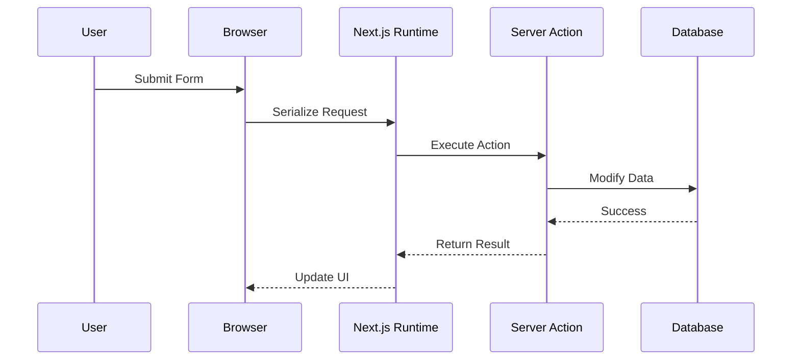

The important thing to understand is:

> **Server Actions are not magic.**
>
> They are secure RPC (Remote Procedure Calls) generated automatically by Next.js.

---

## Server Actions Are About Business Operations

A common beginner misconception is:

> "Server Actions are just CRUD functions."

Not quite.

Server Actions are really:

> **Business operations expressed as server functions.**

Examples include:

### 🛒 Add To Cart

```text
Validate User
      ↓
Check Inventory
      ↓
Update Cart
      ↓
Recalculate Totals
```

---

### 💳 Checkout

```text
Validate Payment
       ↓
Charge Card
       ↓
Create Order
       ↓
Send Receipt
```

---

### 👤 Register User

```text
Validate Input
       ↓
Hash Password
       ↓
Create User
       ↓
Create Session
```

---

### 📦 Submit Order

```text
Validate Stock
       ↓
Reserve Inventory
       ↓
Create Order
       ↓
Update Analytics
```

Notice that these are not simple database operations.

They are complete business workflows.

---

# The Revalidation Cycle

One of the biggest challenges in web development is keeping the UI synchronized with the database.

Traditional applications often require:

* refetching APIs,
* updating state,
* invalidating caches,
* refreshing components manually.

Server Actions automate this process.

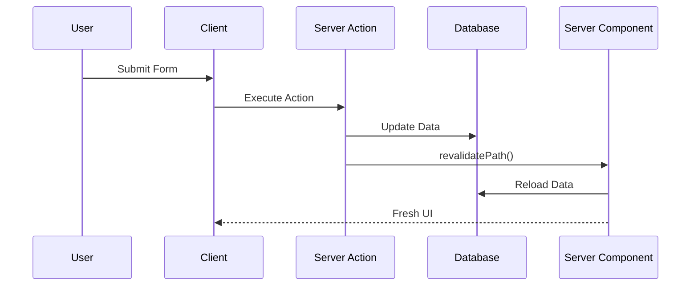

When `revalidatePath()` executes:

```tsx
revalidatePath('/posts');
```

you are telling Next.js:

> **"The data rendered on this route is now stale. Please fetch fresh data and re-render the page."**

---

## Why This Matters

Imagine creating a blog post.

### Traditional React Flow

```text
Submit Form
      ↓
POST /api/posts
      ↓
Update Database
      ↓
Call GET /api/posts
      ↓
Update useState
      ↓
Refresh UI
```

### Next.js Server Action Flow

```text
Submit Form
      ↓
Server Action
      ↓
Update Database
      ↓
revalidatePath()
      ↓
Server Component Reloads
      ↓
Fresh UI
```

The framework performs the synchronization for you.

---

## The Mutation Lifecycle

A useful way to think about Server Actions is:

```text
User Interaction
        ↓
Server Action
        ↓
Business Logic
        ↓
Database Mutation
        ↓
Cache Invalidation
        ↓
Server Component Re-Read
        ↓
Fresh UI
```

This creates a beautiful architectural cycle:

```text
Read
  ↓
Interact
  ↓
Mutate
  ↓
Revalidate
  ↓
Read Again
```

---

## Server Actions Are Excellent For

### ➕ Creating Data

* users
* posts
* orders
* comments

### ✏️ Updating Data

* profiles
* products
* settings
* inventory

### ❌ Deleting Data

* accounts
* records
* files
* cart items

### 🔐 Authentication

* login
* logout
* registration
* sessions

### 💼 Business Logic

* checkout workflows
* payment processing
* approval flows
* notifications

### ♻️ Cache Revalidation

* `revalidatePath()`
* `revalidateTag()`
* UI synchronization

---

## A Useful Rule of Thumb

Ask yourself:

> **"Am I changing the state of my system?"**

If the answer is **yes**, you probably need a **Server Action**.

```text
User Action
      ↓
Server Action
      ↓
Business Logic
      ↓
Database Mutation
      ↓
Revalidation
      ↓
Fresh UI
```

The easiest way to remember the four pillars of Next.js architecture is:

> **Server Components read.**
>
> **Client Components interact.**
>
> **Server Actions mutate.**
>
> **Route Handlers communicate.**

Or, in SQL terms:

> **Server Components perform `SELECT`.**
>
> **Server Actions perform `INSERT`, `UPDATE`, and `DELETE`.**


---
# Pillar #4 — Route Handlers: The Bridge

If **Server Components are the readers** and **Server Actions are the mutators**, then **Route Handlers are the communicators**.

Their job is simple:

> **Allow systems outside of your React application to communicate with your application through HTTP.**

This is an important distinction for beginners to understand.

Most of the time, your application is interacting with a human user:

```text id="zq61kg"
User
  ↓
Browser
  ↓
React UI
```

But sometimes your application isn't talking to a person at all.

Sometimes it's talking to:

* Stripe
* GitHub
* Google OAuth
* Clerk
* Shopify
* mobile applications
* IoT devices
* internal microservices
* third-party APIs

These systems don't understand:

* React components
* Server Actions
* the RSC protocol
* your UI hierarchy

They only understand one thing:

> **HTTP requests.**

This is where Route Handlers come in.

---

## Think of Route Handlers as the "API Department"

One of the reasons beginners struggle with Route Handlers is that they try to compare them to React components.

But Route Handlers aren't really part of your UI.

A better way to think about them is organizationally.

Imagine your application is a company.

Every department has a specialized responsibility:

| Department            | Responsibility                          |
| --------------------- | --------------------------------------- |
| **Server Components** | Read information                        |
| **Client Components** | Interact with customers                 |
| **Server Actions**    | Process internal business operations    |
| **Route Handlers**    | Communicate with external organizations |

In this analogy:

* **Server Components** are the research department that gathers information.
* **Client Components** are the customer service representatives interacting with users.
* **Server Actions** are the operations team updating records and processing requests.
* **Route Handlers** are the communications and partnerships department that talks to the outside world.

---

## Why Does This Department Exist?

Most of your application is designed for humans:

```text id="jwpq8g"
Human
   ↓
Browser
   ↓
React UI
   ↓
Application
```

But many important interactions don't involve humans at all.

Examples include:

* Stripe notifying you that a payment succeeded
* GitHub informing you that a deployment completed
* Google sending an OAuth callback
* A mobile application requesting data
* Another microservice synchronizing records
* Slack sending an event notification

These systems don't understand:

* React
* JSX
* Components
* Server Actions
* Hooks
* the RSC protocol

They only understand one thing:

> **HTTP requests and HTTP responses.**

This is precisely why Route Handlers exist.

---

## Route Handlers Are Your Application's External Interface

Think of Route Handlers as your application's:

### 🌐 API Gateway

They expose HTTP endpoints that external systems can call.

```text id="6vx7ke"
GET    /api/users
POST   /api/orders
PUT    /api/profile
DELETE /api/cart
```

---

### 🔔 Webhook Receiver

They receive events from third-party systems.

```text id="fjlwmu"
Stripe
    ↓
Webhook
    ↓
Route Handler
    ↓
Database
```

---

### 🔌 Integration Layer

They connect your application to external platforms.

```text id="h4g00j"
Salesforce
      ↓
Route Handler
      ↓
Database
      ↓
Application
```

---

### 🤖 Machine-to-Machine Communication System

They allow software systems to communicate without involving a browser.

```text id="mf5j9w"
Mobile App
       ↓
HTTP
       ↓
Route Handler
       ↓
Database
```

---

## Visualizing the Organization

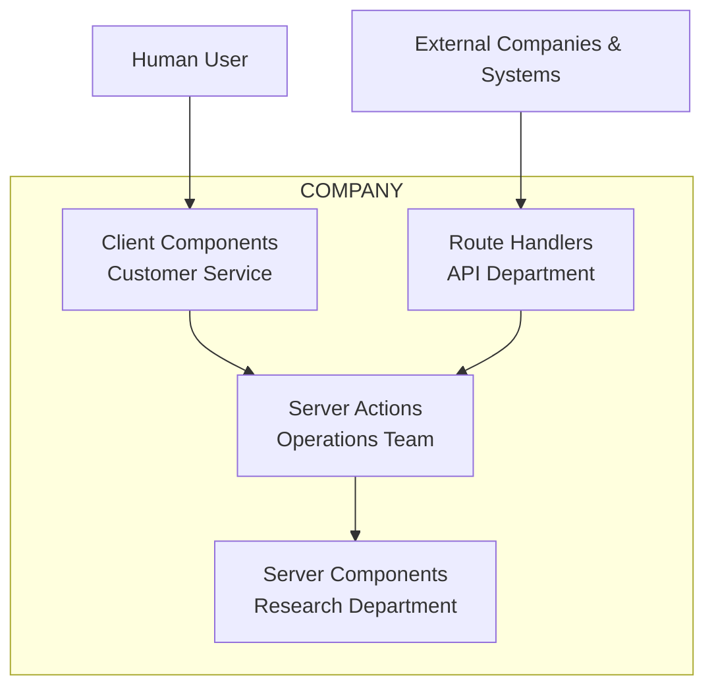

Notice something important:

* **Humans enter through Client Components.**
* **Machines enter through Route Handlers.**

---

## The Internal vs External Boundary

Another useful mental model is to divide your application into two worlds:

### Internal Operations

```text id="ncbhly"
Server Components
        ↓
Client Components
        ↓
Server Actions
```

These are optimized for:

* users
* UI
* rendering
* interaction
* business logic

---

### External Communication

```text id="fcr3n1"
External Systems
         ↓
Route Handlers
         ↓
Application
```

These are optimized for:

* HTTP
* APIs
* webhooks
* integrations
* machine communication

---

## A Useful Rule of Thumb

Ask yourself:

> **"Is this request coming from a human using my UI, or from another machine?"**

If the answer is:

| Source  | Use                                |
| ------- | ---------------------------------- |
| Human   | Client Components + Server Actions |
| Machine | Route Handlers                     |

---

## The Mental Model to Remember

> **Server Components read.**
>
> **Client Components interact.**
>
> **Server Actions operate.**
>
> **Route Handlers communicate.**

Or using the company analogy:

> **Server Components gather information.**
>
> **Client Components serve customers.**
>
> **Server Actions run the business.**
>
> **Route Handlers answer the phone when another company calls.**


---

# What Exactly Is a Route Handler?

A Route Handler is simply a server function that responds to HTTP requests.

For example:

```text id="vup6a2"
GET    /api/users
POST   /api/orders
PUT    /api/profile
DELETE /api/cart
```

In Next.js App Router, these are defined using:

```text id="ix6ofw"
app/api/.../route.ts
```

---

# Example: Creating a REST API

```tsx
// app/api/users/route.ts

export async function GET() {
  return Response.json({
    users: [],
  });
}
```

This creates:

```text id="hlx3y7"
/api/users
```

which can be called by:

* browsers
* mobile apps
* external services
* curl
* Postman
* other servers

---

# Example: Receiving Data

```tsx
export async function POST(
  request: Request
) {

  const body =
    await request.json();

  return Response.json({
    success: true,
  });
}
```

This behaves exactly like a traditional backend API endpoint.

---

# The Most Important Use Case: Webhooks

One of the most common uses of Route Handlers is receiving webhooks.

A webhook is simply:

> **One server notifying another server that something happened.**

For example:

```text id="gjb32r"
Customer Pays
        ↓
Stripe Processes Payment
        ↓
Stripe Sends HTTP POST
        ↓
Your Route Handler
        ↓
Update Database
```

---

# Example: Stripe Webhook

```tsx
// app/api/webhooks/route.ts

export async function POST(
  request: Request
) {

  const payload =
    await request.json();

  const signature =
    request.headers.get(
      'stripe-signature'
    );

  if (
    isAuthorized(
      signature
    )
  ) {

    // Update database

    return Response.json({
      success: true,
    });
  }

  return Response.json(
    {
      error: 'Unauthorized',
    },
    {
      status: 401,
    }
  );
}
```

---

# Why Signature Verification Matters

A webhook endpoint is publicly accessible.

That means anyone can attempt to call it.

Without verification:

```text id="y8jgwg"
Attacker
    ↓
POST /api/webhook
    ↓
Fake Payment Success
    ↓
Database Corrupted
```

With signature verification:

```text id="ggk6eh"
Stripe
    ↓
Signed Request
    ↓
Verify Signature
    ↓
Process Event
```

This is why webhook verification is one of the most important security practices when building integrations.

---

# OAuth Callbacks

Another common use case is authentication.

For example, when a user logs in using Google:

```text id="vldj60"
User Clicks Login
        ↓
Google Login
        ↓
Google Redirects
        ↓
Route Handler
        ↓
Create Session
        ↓
Redirect User
```

The Route Handler acts as the bridge between your application and the external identity provider.

---

# Mobile Applications

Mobile applications cannot call:

* Server Components
* Client Components
* Server Actions

They only understand HTTP.

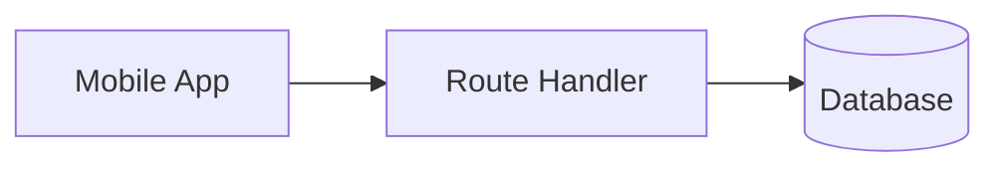

This allows your Next.js application to act as a backend service for:

* iOS applications
* Android applications
* React Native applications
* desktop applications

---

# File Uploads

Route Handlers are also useful for processing file uploads.

```text id="jwrt6m"
User Uploads File
          ↓
Route Handler
          ↓
Validate File
          ↓
Store File
          ↓
Update Database
```

Examples include:

* profile pictures
* PDFs
* CSV imports
* videos
* images
* documents

---

# Third-Party Integrations

Many enterprise systems communicate exclusively through APIs.

Examples include:

* Stripe
* GitHub
* Slack
* Shopify
* Salesforce
* SAP
* AWS services
* internal microservices

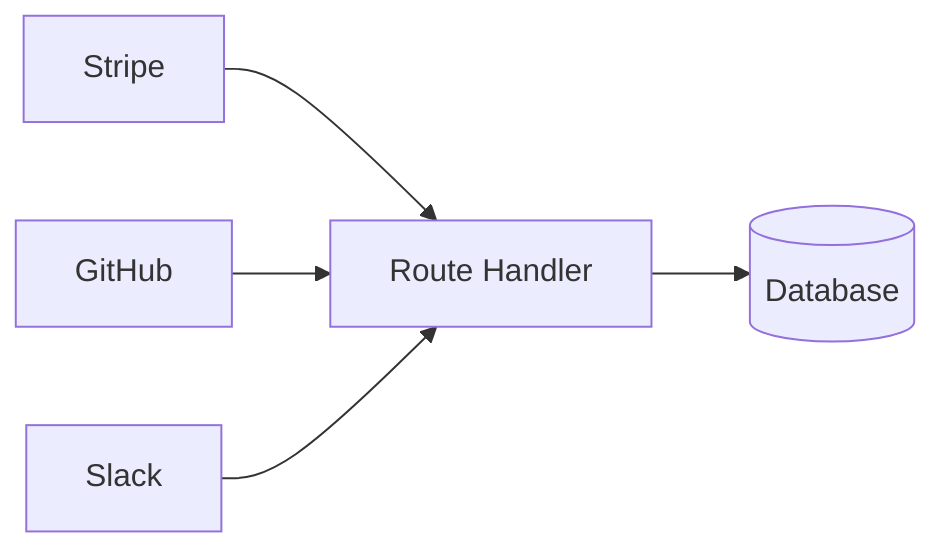

---

# Route Handler Architecture

A useful mental model is:

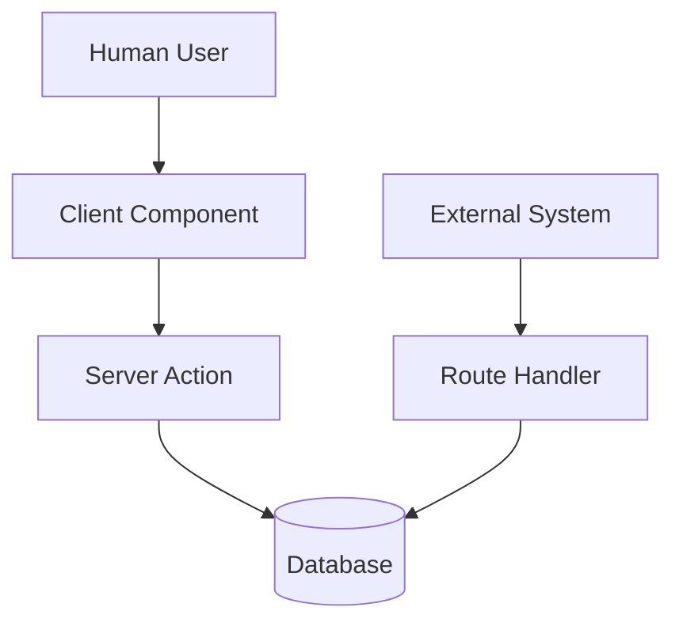

Notice the distinction:

* Humans typically interact through **Client Components** and **Server Actions**.
* Machines typically interact through **Route Handlers**.

---

# Route Handlers Are Excellent For

### 🔔 Webhooks

Receive notifications from:

* Stripe
* GitHub
* Clerk
* Shopify
* Slack

---

### 🌐 REST APIs

Build traditional API endpoints:

```text id="z8x4kn"
GET    /api/products
POST   /api/orders
PUT    /api/profile
DELETE /api/cart
```

---

### 🔐 OAuth Callbacks

Handle authentication flows from:

* Google
* GitHub
* Microsoft
* Okta
* Auth0

---

### 📱 Mobile Applications

Provide backend services for:

* iOS
* Android
* React Native
* Flutter

---

### 📁 File Uploads

Process:

* images
* PDFs
* CSV files
* videos
* documents

---

### 🔌 Third-Party Integrations

Communicate with:

* payment providers
* CRM systems
* ERP systems
* messaging platforms
* cloud services

---

# A Useful Rule of Thumb

Ask yourself one question:

> **"Am I communicating with another machine using HTTP?"**

If the answer is **yes**, then you probably need a **Route Handler**.

```text id="5xie3u"
External System
        ↓
HTTP Request
        ↓
Route Handler
        ↓
Business Logic
        ↓
Database/API
        ↓
HTTP Response
```

A simple way to remember this is:

> **Server Components read.**
>
> **Client Components interact.**
>
> **Server Actions mutate.**
>
> **Route Handlers communicate.**

Or even shorter:

> **Humans use Server Actions.**
>
> **Machines use Route Handlers.**


---

# The Final Boss: Orchestrating Everything

The real power of Next.js emerges when these four pillars work together.

Imagine an e-commerce website:

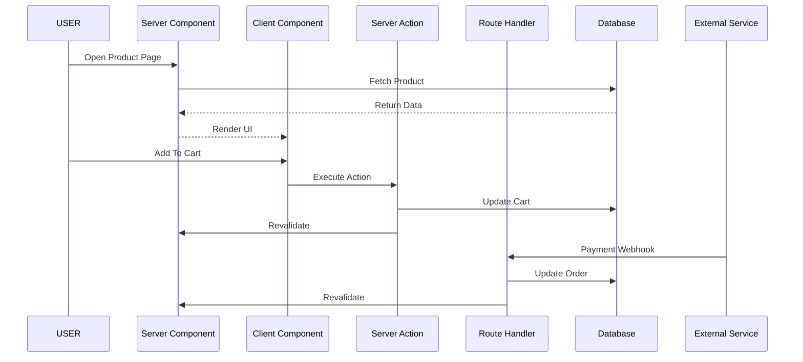

## Why Does the UI Stay Synchronized?

One of the most impressive aspects of Next.js 16 is that your application remains synchronized **without manually orchestrating API calls, loading states, cache updates, and UI refreshes**.

This happens because each execution environment has a **single, well-defined responsibility**:

* **Server Components read**
* **Client Components interact**
* **Server Actions mutate**
* **Route Handlers integrate**

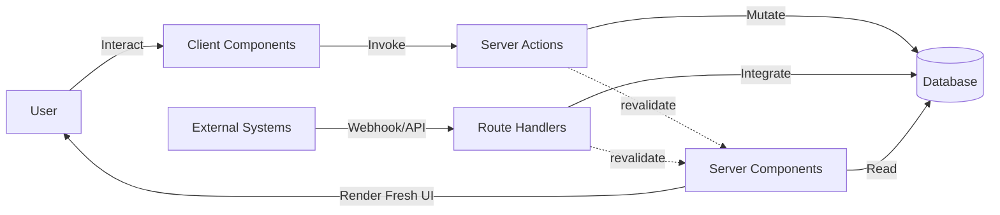

Think of it as a company where every department has a specific job:

| Component             | Responsibility         | Question It Answers                  |
| --------------------- | ---------------------- | ------------------------------------ |
| **Server Components** | Reading data           | "What should the user see?"          |
| **Client Components** | Handling interaction   | "What did the user do?"              |
| **Server Actions**    | Changing data          | "How should the system update?"      |
| **Route Handlers**    | External communication | "How do outside systems talk to us?" |

---

## Example: User Interaction Flow

Imagine a user adding a product to their shopping cart.

### Step 1 — Server Component Reads

The product page is initially rendered by a Server Component:

```text
Database
    ↓
Server Component
    ↓
Browser
```

The user sees:

```
Product: Mechanical Keyboard
Price: $129
Stock: Available
```

---

### Step 2 — Client Component Interacts

The user clicks:

```text
Add To Cart
```

The Client Component handles the click:

```tsx
<button onClick={addToCart}>
  Add To Cart
</button>
```

---

### Step 3 — Server Action Mutates

The Client Component invokes a Server Action:

```text
Browser
    ↓
Server Action
    ↓
Database Update
```

The Server Action:

* validates the request
* updates the cart
* recalculates totals
* triggers cache invalidation

```tsx
revalidatePath('/cart');
```

---

### Step 4 — Server Component Re-Reads

After revalidation:

```text
Database
    ↓
Server Component
    ↓
Fresh UI
```

The UI automatically refreshes with the latest data.

The developer never writes:

* `setCart()`
* `fetch('/api/cart')`
* `useEffect()`
* cache synchronization code

---

## Example: External System Flow

Now imagine Stripe confirms payment.

```text
Customer Pays
        ↓
Stripe
        ↓
Webhook
        ↓
Route Handler
        ↓
Database Update
        ↓
revalidatePath()
        ↓
Server Component
        ↓
Fresh UI
```

The user might already have the order page open.

As soon as Stripe notifies your application:

* the database updates
* the cache invalidates
* the Server Component fetches fresh data
* the UI reflects the new order status

All automatically.

---

## The Secret: Separation by Intent

The real breakthrough in Next.js architecture is that components are separated by **what they do**, not **where they live**.

Traditional architecture asks:

> Is this frontend code or backend code?

Next.js asks:

> What responsibility does this piece of code have?

| Responsibility         | Next.js Tool     |
| ---------------------- | ---------------- |
| Read data              | Server Component |
| Handle interaction     | Client Component |
| Modify data            | Server Action    |
| Communicate externally | Route Handler    |

This separation creates a powerful feedback loop:

```text
Read
  ↓
Interact
  ↓
Mutate
  ↓
Integrate
  ↓
Revalidate
  ↓
Read Again
```

And that is why:

> **The application stays synchronized because:**
>
> * **Server Components read**
> * **Client Components interact**
> * **Server Actions mutate**
> * **Route Handlers integrate**

Once you understand this cycle, Next.js stops feeling like a collection of features and starts feeling like what it really is:

> **A distributed, self-synchronizing application runtime.**


---

# The Architect's Cheat Sheet

| Question                      | Answer                |
| ----------------------------- | --------------------- |
| Am I rendering data?          | Use Server Components |
| Am I handling interaction?    | Use Client Components |
| Am I modifying data?          | Use Server Actions    |
| Am I exposing HTTP endpoints? | Use Route Handlers    |

---

# Why This Architecture Matters

Traditional React applications often required developers to build:

```text
UI
 ↓
State
 ↓
Effect
 ↓
API
 ↓
Backend
 ↓
Database
```

Next.js removes much of this complexity:

```text
UI
 ↓
Execution Environment
 ↓
Database
```

The result is:

* smaller bundles
* fewer API layers
* less boilerplate
* improved security
* better SEO
* faster rendering
* simpler mental models

---

# Conclusion

The biggest mistake developers make when learning Next.js is trying to classify code as either:

> frontend code

or

> backend code

Next.js no longer thinks this way.

Instead, ask:

* **Am I rendering?**
* **Am I interacting?**
* **Am I mutating?**
* **Am I integrating?**

Once you begin thinking in terms of **execution environments and responsibilities**, Next.js stops feeling magical and starts feeling like what it actually is:

> **A distributed application architecture platform built on top of React.**

---

# Further Reading

* [Next.js Documentation](https://nextjs.org/docs?utm_source=chatgpt.com)
* [React Server Components Documentation](https://react.dev/reference/rsc/server-components?utm_source=chatgpt.com)
* [Next.js Server Actions Documentation](https://nextjs.org/docs/app/building-your-application/data-fetching/server-actions-and-mutations?utm_source=chatgpt.com)
* [Next.js Route Handlers Documentation](https://nextjs.org/docs/app/building-your-application/routing/route-handlers?utm_source=chatgpt.com)
* [Stripe Webhooks Documentation](https://docs.stripe.com/webhooks?utm_source=chatgpt.com)
* [GitHub Webhooks Documentation](https://docs.github.com/en/webhooks?utm_source=chatgpt.com)
