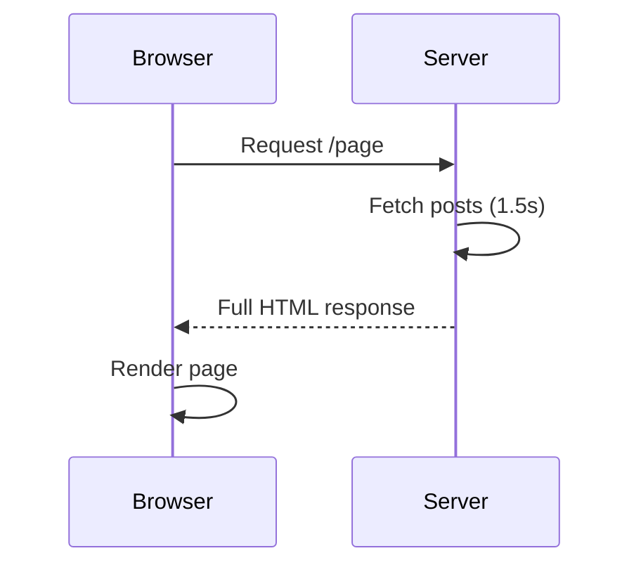
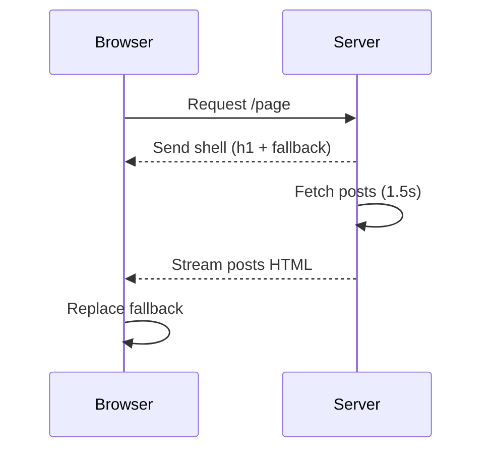
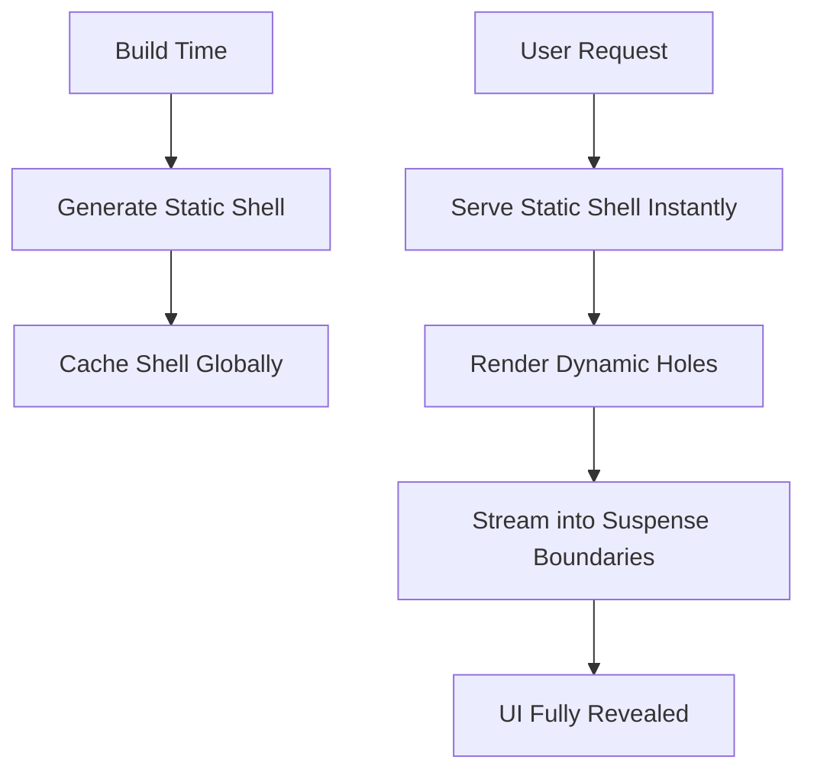

# Mastering Next.js Performance: From Suspense to Partial Prerendering (Hands-on Guide)

In this tutorial, you will build and progressively enhance a Next.js 16 page using Suspense and Partial Prerendering (PPR). The goal is simple: eliminate blocking UI and deliver a fast, streaming experience.

We will start with a naïve implementation, then improve it step by step.

***

### Step 0: The Baseline (Blocking Page)

Let’s start with a typical async Server Component:

```tsx
// app/page.tsx
async function getPosts() {
  await new Promise((r) => setTimeout(r, 1500)); // simulate slow DB
  return [
    { id: 1, title: "Hello World" },
    { id: 2, title: "Next.js 16 Rocks" },
  ];
}

export default async function Page() {
  const posts = await getPosts();

  return (
    <main>
      <h1>My Blog</h1>
      <ul>
        {posts.map((p) => (
          <li key={p.id}>{p.title}</li>
        ))}
      </ul>
    </main>
  );
}
```

### What happens?

- The server waits 1.5s  
- No HTML is sent  
- The user sees a blank screen  

### Request Flow (Blocking)



***

### Step 1: Introduce Suspense

We move data fetching into a child component and wrap it with Suspense.

```tsx
// app/posts.tsx
async function getPosts() {
  await new Promise((r) => setTimeout(r, 1500));
  return [
    { id: 1, title: "Hello World" },
    { id: 2, title: "Next.js 16 Rocks" },
  ];
}

export default async function Posts() {
  const posts = await getPosts();

  return (
    <ul>
      {posts.map((p) => (
        <li key={p.id}>{p.title}</li>
      ))}
    </ul>
  );
}
```

```tsx
// app/page.tsx
import { Suspense } from "react";
import Posts from "./posts";

export default function Page() {
  return (
    <main>
      <h1>My Blog</h1>

      <Suspense fallback={<p>Loading posts...</p>}>
        <Posts />
      </Suspense>
    </main>
  );
}
```

### What changed?

- The page shell renders instantly  
- The posts section streams later  
- The fallback UI appears immediately  

### Streaming Flow



***

### Step 2: Add Granular Boundaries

```tsx
// app/comments.tsx
export default async function Comments() {
  await new Promise((r) => setTimeout(r, 2000));
  return <div>Comments loaded</div>;
}
```

```tsx
// app/page.tsx
import { Suspense } from "react";
import Posts from "./posts";
import Comments from "./comments";

export default function Page() {
  return (
    <main>
      <h1>My Blog</h1>

      <Suspense fallback={<p>Loading posts...</p>}>
        <Posts />
      </Suspense>

      <Suspense fallback={<p>Loading comments...</p>}>
        <Comments />
      </Suspense>
    </main>
  );
}
```

### Result

- Posts and comments load independently  
- Slow components no longer block each other  

***

### Step 3: Upgrade Fallbacks (Skeleton UI)

```tsx
function PostsSkeleton() {
  return (
    <ul>
      <li className="animate-pulse">Loading...</li>
      <li className="animate-pulse">Loading...</li>
    </ul>
  );
}
```

```tsx
<Suspense fallback={<PostsSkeleton />}>
  <Posts />
</Suspense>
```

Skeletons improve perceived performance by mimicking final layout.

***

### Step 4: Introduce Partial Prerendering (PPR)

### Enable PPR

```ts
// next.config.ts
export default {
  experimental: {
    ppr: "incremental",
  },
};
```

```tsx
// app/page.tsx
export const experimental_ppr = true;
```

***

### Step 5: Create Static + Dynamic Split

```tsx
// app/user.tsx
import { cookies } from "next/headers";

export default async function UserGreeting() {
  const cookieStore = cookies();
  const name = cookieStore.get("name")?.value || "Guest";

  return <p>Welcome, {name}</p>;
}
```

```tsx
// app/page.tsx
import { Suspense } from "react";
import Posts from "./posts";
import UserGreeting from "./user";

export const experimental_ppr = true;

export default function Page() {
  return (
    <main>
      <h1>My Blog</h1>

      <Suspense fallback={<p>Loading user...</p>}>
        <UserGreeting />
      </Suspense>

      <Suspense fallback={<p>Loading posts...</p>}>
        <Posts />
      </Suspense>
    </main>
  );
}
```

***

### How PPR Works Internally

- Static shell is generated at build time  
- Suspense boundaries define dynamic holes  
- Dynamic content is streamed at request time  

### PPR Rendering Flow



***

### Step 6: Final Architecture

You now have:

- Static shell (instant load via PPR)  
- Streaming components (via Suspense)  
- Independent async boundaries  

This combination delivers both strong real performance and excellent perceived performance.

***

### Key Insight

Suspense controls how the UI streams.  
PPR controls what can be served instantly.  

Together, they let you build applications that feel fast by design.

***

### References

- React Suspense (official docs): https://react.dev/reference/react/Suspense  
- Next.js Loading UI and Streaming: https://nextjs.org/docs/app/building-your-application/routing/loading-ui-and-streaming  
- Next.js Partial Prerendering: https://nextjs.org/docs/app/building-your-application/rendering/partial-prerendering  
- Next.js App Router overview: https://nextjs.org/docs/app  
- Vercel blog on Partial Prerendering (conceptual deep dive): https://vercel.com/blog/partial-prerendering  
