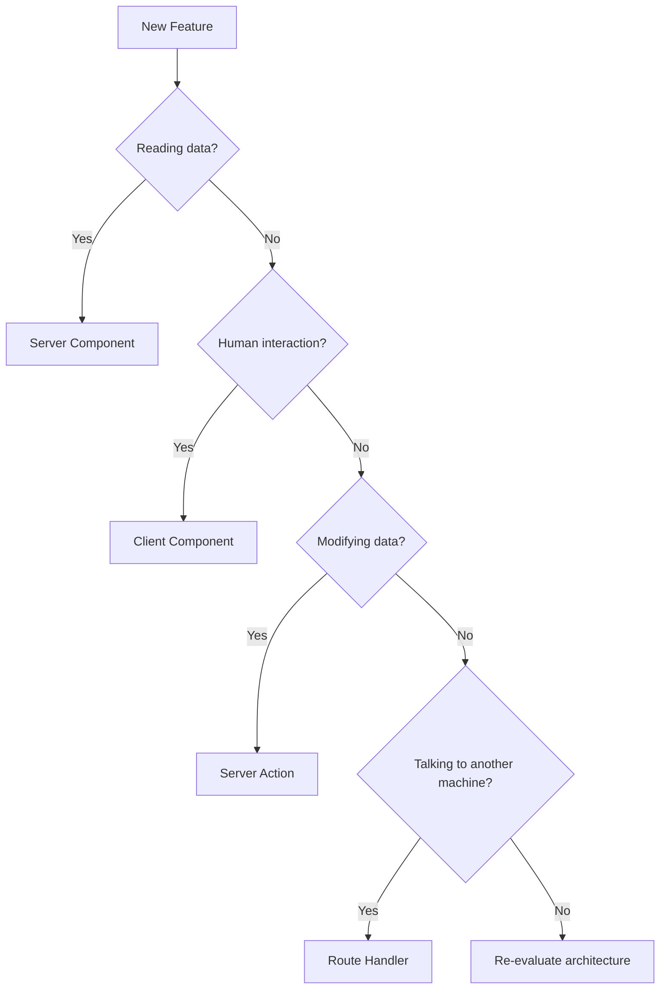

# Next.js 16 for Absolute Beginners

# Appendix A — The Four Environment Decision Matrix

> **The most important skill in Next.js isn't writing code.**
>
> **It's knowing where that code should execute.**

After finishing this series, you'll probably discover something interesting:

Most Next.js problems are not syntax problems.

They're **placement problems**.

Developers often ask:

* "Why doesn't this work?"
* "Why can't I access the database?"
* "Why can't I use `useState`?"
* "Why is my bundle so large?"
* "Why do I need a Route Handler?"

The answer is usually:

> **You put the code in the wrong execution environment.**

This appendix is designed to become your "cheat sheet" whenever you're unsure.

---

# The One Question Rule

Before writing any code, ask yourself:

> **What responsibility does this code have?**

There are only four possible answers:

| Responsibility            | Environment      |
| ------------------------- | ---------------- |
| Read information          | Server Component |
| Interact with humans      | Client Component |
| Modify information        | Server Action    |
| Communicate with machines | Route Handler    |

Everything in modern Next.js is built on this idea.

---

# The Complete Decision Matrix

| I Need To...                 | Environment      |
| ---------------------------- | ---------------- |
| Read database records        | Server Component |
| Read authenticated user      | Server Component |
| Read cookies                 | Server Component |
| Read environment variables   | Server Component |
| Read filesystem              | Server Component |
| Fetch external API data      | Server Component |
| Render SEO content           | Server Component |
| Display a dashboard          | Server Component |
| Handle button clicks         | Client Component |
| Open modals                  | Client Component |
| Manage form state            | Client Component |
| Create animations            | Client Component |
| Use localStorage             | Client Component |
| Use browser APIs             | Client Component |
| Use React hooks              | Client Component |
| Submit forms                 | Server Action    |
| Create records               | Server Action    |
| Update records               | Server Action    |
| Delete records               | Server Action    |
| Process business logic       | Server Action    |
| Revalidate cache             | Server Action    |
| Receive webhooks             | Route Handler    |
| Build REST APIs              | Route Handler    |
| Serve mobile applications    | Route Handler    |
| Serve external clients       | Route Handler    |
| Handle machine communication | Route Handler    |
| Process file uploads         | Route Handler    |

---

# Decision Tree Version

Sometimes tables aren't enough.

Here's the actual mental flow professional Next.js developers use.



Surprisingly, this simple flowchart correctly categorizes most Next.js code.

---

# Environment #1 — Server Components

Remember:

> **Server Components are readers.**

Use them whenever your primary responsibility is:

* reading,
* loading,
* fetching,
* displaying.

---

## Examples

### Reading from a database

```tsx
export default async function ProductsPage() {
  const products =
    await db.product.findMany();

  return (
    <ProductsList
      products={products}
    />
  );
}
```

---

### Reading the current user

```tsx
export default async function Dashboard() {
  const session =
    await auth();

  return (
    <div>
      Welcome {session.user.name}
    </div>
  );
}
```

---

### Reading external APIs

```tsx
export default async function Weather() {
  const response =
    await fetch(apiUrl);

  const weather =
    await response.json();

  return <WeatherCard />;
}
```

---

## Quick Rule

Ask:

> Am I trying to learn something?

If yes:

```text
Server Component
```

---

# Environment #2 — Client Components

Remember:

> **Client Components are actors.**

They exist for human interaction.

---

## Examples

### Button clicks

```tsx
"use client";

export function SaveButton() {
  return (
    <button onClick={save}>
      Save
    </button>
  );
}
```

---

### Form state

```tsx
"use client";

const [email, setEmail] =
  useState("");
```

---

### Browser APIs

```tsx
"use client";

localStorage.setItem(
  "theme",
  "dark"
);
```

---

### Animations

```tsx
"use client";

const [open, setOpen] =
  useState(false);
```

---

## Quick Rule

Ask:

> Am I interacting with a human?

If yes:

```text
Client Component
```

---

# Environment #3 — Server Actions

Remember:

> **Server Actions are mutators.**

They change state.

---

## Examples

### Creating data

```tsx
"use server";

export async function createPost(
  formData: FormData
) {
  await db.post.create();
}
```

---

### Updating data

```tsx
"use server";

export async function updateUser() {
  await db.user.update();
}
```

---

### Deleting data

```tsx
"use server";

export async function deleteOrder() {
  await db.order.delete();
}
```

---

### Revalidating UI

```tsx
"use server";

import { revalidatePath }
  from "next/cache";

export async function save() {
  await db.save();

  revalidatePath("/");
}
```

---

## Quick Rule

Ask:

> Am I changing information?

If yes:

```text
Server Action
```

---

# Environment #4 — Route Handlers

Remember:

> **Route Handlers are bridges.**

They communicate with machines.

---

## Examples

### REST API

```tsx
export async function GET() {
  return Response.json({
    hello: "world",
  });
}
```

---

### Stripe webhook

```tsx
export async function POST(
  request: Request
) {
  const body =
    await request.text();

  // process webhook
}
```

---

### Mobile API

```tsx
export async function GET() {
  const products =
    await db.product.findMany();

  return Response.json(
    products
  );
}
```

---

### Third-party integrations

```tsx
export async function POST() {
  await sendToCRM();
}
```

---

## Quick Rule

Ask:

> Am I talking to another machine?

If yes:

```text
Route Handler
```

---

# The Three Most Common Mistakes

## Mistake #1

Putting database code in Client Components.

❌

```tsx
"use client";

const users =
  await db.user.findMany();
```

Why?

Because browsers cannot access databases.

---

## Mistake #2

Creating APIs for everything.

❌

```text
Button
   ↓
fetch()
   ↓
Route Handler
   ↓
Database
```

Modern Next.js usually prefers:

```text
Button
   ↓
Server Action
   ↓
Database
```

---

## Mistake #3

Using Client Components for reading data.

❌

```tsx
"use client";

useEffect(() => {
  fetch("/api/posts");
}, []);
```

Usually better:

✅

```tsx
export default async function Page() {
  const posts =
    await db.post.findMany();

  return <Posts />;
}
```

---

# The One Sentence Cheat Sheet

If you remember nothing else from this series, remember this:

```text
Need to READ?
    Server Component

Need to INTERACT?
    Client Component

Need to MUTATE?
    Server Action

Need to COMMUNICATE?
    Route Handler
```

Or even shorter:

> **Read. Interact. Mutate. Communicate.**

That's the entire mental model of modern Next.js.

---

# Next Appendix

In **Appendix B**, we'll examine:

# **The Complete Request Lifecycle**

We'll trace a single user click through all four execution environments and finally answer the question:

> **"What actually happens after I click a button in Next.js?"**
