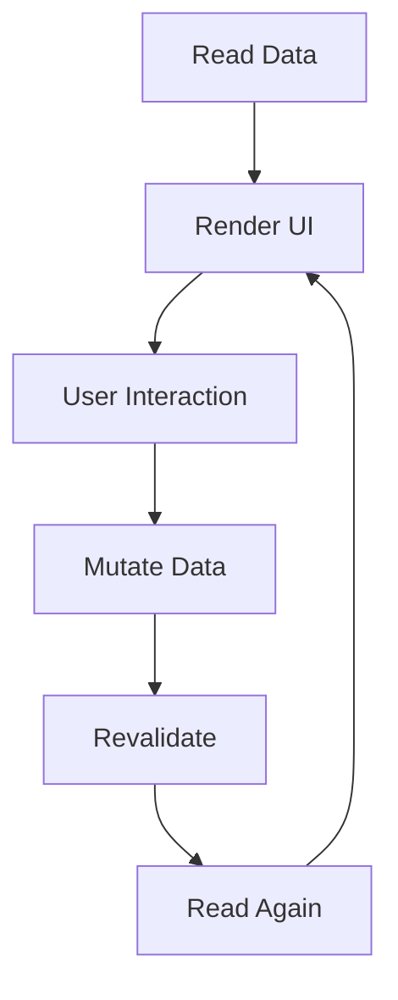
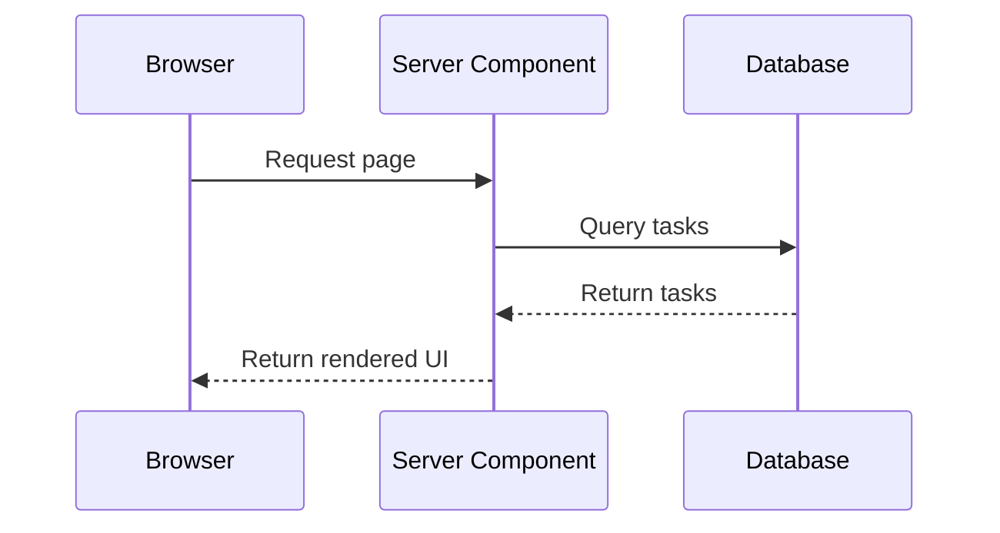
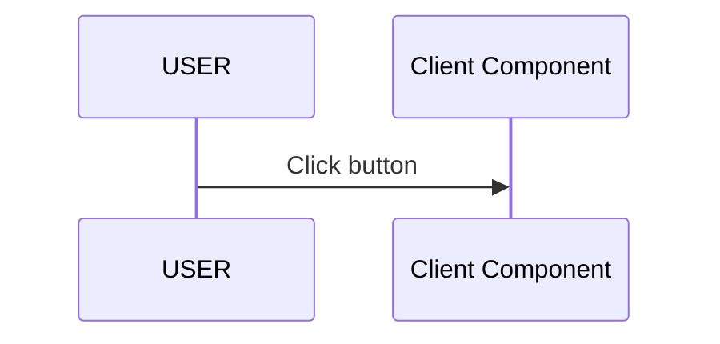
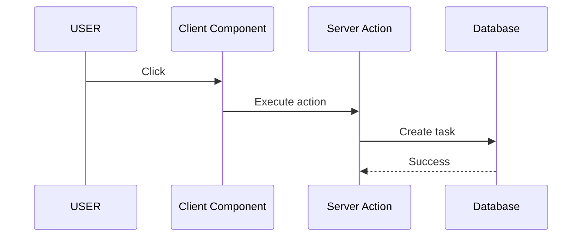
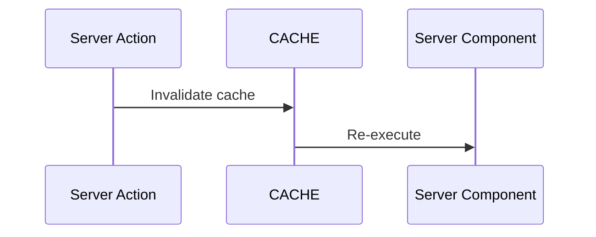
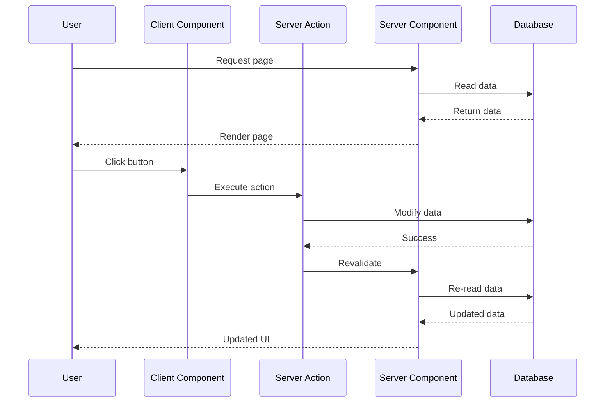
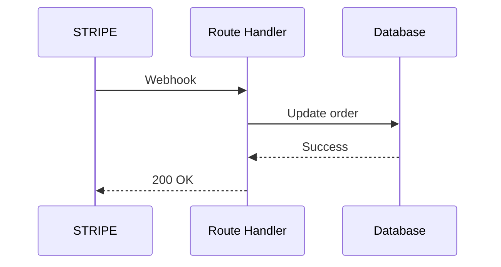

# Next.js 16 for Absolute Beginners

# Appendix B — The Complete Request Lifecycle

> **One of the biggest sources of confusion in Next.js is that developers know the individual pieces but don't understand how they work together.**

After learning:

* Server Components,
* Client Components,
* Server Actions,
* Route Handlers,

many beginners still ask:

> **"Okay... but what actually happens when a user clicks a button?"**

This appendix answers that question.

Because once you understand the complete lifecycle of a request, modern Next.js suddenly stops feeling magical.

---

# The Traditional React Lifecycle

If you learned React using a traditional SPA architecture, your mental model probably looks like this:

```text
User
   ↓
Button Click
   ↓
useState()
   ↓
fetch()
   ↓
REST API
   ↓
Backend
   ↓
Database
   ↓
JSON
   ↓
setState()
   ↓
Re-render
```

This model works.

But notice how much of the application exists simply to move information around.

---

# The Next.js Lifecycle

In Next.js, the lifecycle becomes:

```text
Read
   ↓
Render
   ↓
Interact
   ↓
Mutate
   ↓
Revalidate
   ↓
Read Again
```

Or visually:



Notice something important:

> **The UI automatically synchronizes itself.**

This is one of the biggest architectural differences between React SPAs and modern Next.js.

---

# Example Application

Let's imagine we're building a simple task application.

The user sees:

```text
Tasks

□ Learn Next.js
□ Build App
□ Deploy Project

[Add Task]
```

The user clicks:

```text
Add Task
```

Let's trace what actually happens.

---

# Step 1 — The Browser Requests The Page

The user visits:

```text
/tasks
```

The browser sends a request:

```text
Browser
     ↓
Next.js Server
```

---

# Step 2 — Server Components Execute

The page itself is usually a Server Component.

```tsx
export default async function Page() {
  const tasks =
    await db.task.findMany();

  return (
    <TaskList
      tasks={tasks}
    />
  );
}
```

Notice:

* the browser never touches the database,
* the database credentials stay secret,
* the server fetches everything.

---

## Visualizing It



---

# Step 3 — The Browser Receives UI

The browser now receives:

```text
✓ HTML
✓ RSC payload
✓ Minimal JavaScript
```

The user sees:

```text
Learn Next.js
Build App
Deploy Project
```

At this point:

> The page is already usable.

No loading spinner.

No useEffect.

No client fetch.

---

# Step 4 — The User Interacts

Now the user clicks:

```text
Add Task
```

This requires a Client Component.

```tsx
"use client";

export function AddButton() {
  return (
    <button>
      Add Task
    </button>
  );
}
```

Why?

Because browsers handle clicks.

---

## Visualizing Interaction



Simple.

No server yet.

---

# Step 5 — The Client Calls A Server Action

The button invokes:

```tsx
"use server";

export async function createTask() {
  await db.task.create({
    data: {
      title: "New Task",
    },
  });
}
```

Now the flow becomes:



Notice:

* no API route,
* no fetch,
* no JSON serialization.

The framework handles everything.

---

# Step 6 — Revalidation Happens

The database changed.

The UI is now stale.

Next.js solves this using revalidation.

```tsx
"use server";

import { revalidatePath }
  from "next/cache";

export async function createTask() {

  await db.task.create();

  revalidatePath("/tasks");
}
```

---

## Visualizing Revalidation



The page becomes fresh again.

---

# Step 7 — Server Components Execute Again

After invalidation:

```tsx
export default async function Page() {

  const tasks =
    await db.task.findMany();

  return (
    <TaskList
      tasks={tasks}
    />
  );
}
```

The database is queried again.

---

# Step 8 — The Browser Receives Updated UI

The browser receives:

```text
Learn Next.js
Build App
Deploy Project
New Task
```

The user never sees:

* fetch requests,
* loading states,
* cache invalidation,
* synchronization logic.

It simply works.

---

# The Complete Lifecycle Diagram

This diagram is arguably the most important diagram in modern Next.js.



This diagram explains:

* Server Components,
* Client Components,
* Server Actions,
* caching,
* revalidation,
* synchronization,
* UI updates.

---

# Where Do Route Handlers Fit?

Route Handlers are different.

They are entered by machines.

Example:

```text
Stripe
   ↓
Webhook
   ↓
Route Handler
   ↓
Database
```

---

## Route Handler Lifecycle



Notice:

> Humans don't enter through Route Handlers.

Machines do.

---

# Comparing Traditional React

Traditional React:

```text
Browser
    ↓
fetch()
    ↓
REST API
    ↓
Database
    ↓
JSON
    ↓
State Update
```

Modern Next.js:

```text
Browser
    ↓
Client Component
    ↓
Server Action
    ↓
Database
    ↓
Revalidate
    ↓
Server Component
    ↓
Updated UI
```

The second model removes enormous amounts of boilerplate.

---

# The Self-Synchronizing Application

One way to think about Next.js is:

```text
Read
   ↓
Display
   ↓
Interact
   ↓
Mutate
   ↓
Invalidate
   ↓
Read Again
```

Or even simpler:

```text
Read
   ↓
Change
   ↓
Read Again
```

This feedback loop is what makes modern Next.js applications feel so natural.

---

# The Mental Model

After reading this appendix, try to stop thinking:

> "How do I update the UI?"

Instead think:

> "How do I update the data?"

Because in Next.js:

> **The UI is just a reflection of the current data state.**

---

# Next Appendix

In **Appendix C**, we'll build the ultimate reference table:

# **The Server vs Client Capability Matrix**

You'll finally have a definitive answer to questions like:

* Can this use `useState`?
* Can this access the database?
* Can this access cookies?
* Can this access environment variables?
* Can this use browser APIs?
* Can this call external APIs?
