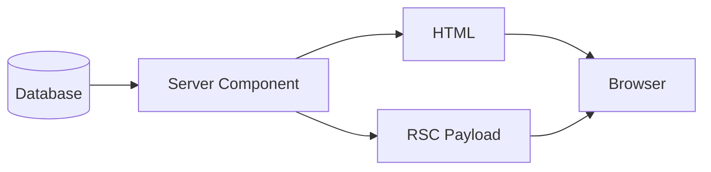
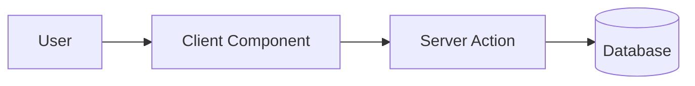
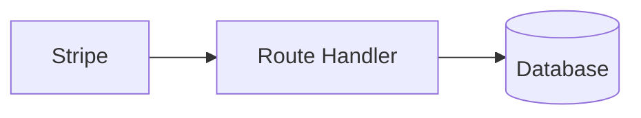
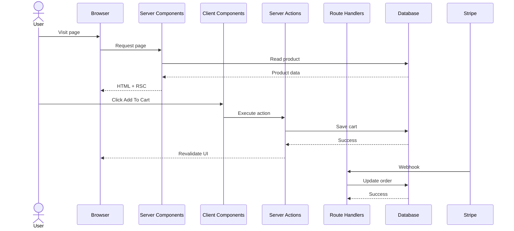

# Appendix C — The Next.js Request Lifecycle: Following One User Click Through The Entire System

> **The easiest way to understand Next.js is to stop studying features individually and start following what actually happens when a user uses your application.**

By this point in the series, you've learned:

* **Server Components read**
* **Client Components interact**
* **Server Actions mutate**
* **Route Handlers communicate**

But beginners often still ask:

> "How do all these pieces actually work together?"

This appendix answers that question.

We're going to follow a single user action through the entire Next.js execution model.

---

# The Example Application

Imagine we're building a simple e-commerce application.

The user visits a product page.

They:

1. View product information
2. Click "Add to Cart"
3. Submit the order
4. Receive confirmation
5. Stripe sends a webhook
6. Inventory updates

This seemingly simple interaction actually travels through multiple execution environments.

---

# Step 1 — User Requests the Page

The browser requests:

```text
/products/123
```

```text
Browser
    ↓
Next.js Server
```

The first thing that executes is:

> **Server Components**

---

## Server Component Reads Data

```tsx
// app/products/[id]/page.tsx

export default async function ProductPage({
  params,
}: {
  params: { id: string };
}) {
  const product =
    await db.product.findUnique({
      where: {
        id: params.id,
      },
    });

  return (
    <ProductView
      product={product}
    />
  );
}
```

Notice:

```text
Server Component
      ↓
Database
```

No API.

No fetch.

No loading spinner.

No useEffect.

---

## What Gets Sent To The Browser?

Many beginners imagine:

```text
Server
     ↓
Entire React Application
```

But that's not what happens.

Instead:

```text
Server Component
        ↓
RSC Payload
        ↓
HTML
        ↓
Browser
```



The browser receives:

* HTML
* minimal component instructions
* almost no JavaScript

---

# Step 2 — User Clicks "Add To Cart"

The button exists inside a Client Component.

```tsx
"use client";

export function AddToCartButton() {
  return (
    <button>
      Add To Cart
    </button>
  );
}
```

Why?

Because clicks only exist inside browsers.

```text
Browser Event
       ↓
Client Component
```

---

# Step 3 — User Submits The Cart

The button calls a Server Action.

```tsx
"use server";

export async function addToCart(
  productId: string
) {
  await db.cart.create({
    data: {
      productId,
    },
  });
}
```

Execution flow:



Notice something important.

The browser never directly touches the database.

Instead:

```text
Browser
    ↓
Server Action
    ↓
Database
```

---

# What Actually Happens?

Most beginners imagine:

```text
Button
   ↓
fetch()
   ↓
REST API
   ↓
Backend
```

But Server Actions work differently.

Internally, Next.js creates a hidden RPC call.

```text
Client
    ↓
Encrypted Action Request
    ↓
Next.js Runtime
    ↓
Server Action
    ↓
Database
```

The developer writes:

```tsx
await addToCart(id);
```

But Next.js handles:

* serialization
* transport
* routing
* authentication context
* execution

automatically.

---

# Step 4 — UI Revalidation

After mutation succeeds:

```text
Database Updated
        ↓
Cache Invalidated
        ↓
Server Components Re-render
        ↓
Fresh UI Returned
```

Example:

```tsx
"use server";

import { revalidatePath }
  from "next/cache";

export async function addToCart(
  id: string
) {
  await db.cart.create({
    data: { id },
  });

  revalidatePath("/cart");
}
```

---

# Why This Feels Different From React

Traditional React:

```text
Save
   ↓
POST API
   ↓
Response
   ↓
Update State
   ↓
Refetch
   ↓
Synchronize Cache
```

Next.js:

```text
Save
   ↓
Mutate
   ↓
Revalidate
   ↓
Done
```

The server becomes the source of truth.

---

# Step 5 — Stripe Sends A Webhook

Now a machine—not a human—contacts our system.

```text
Stripe
   ↓
HTTP POST
   ↓
Route Handler
```

Example:

```tsx
// app/api/stripe/route.ts

export async function POST(
  request: Request
) {
  const body =
    await request.json();

  await processOrder(body);

  return Response.json({
    ok: true,
  });
}
```

---

# Why Not Use Server Actions?

Because Server Actions require:

```text
Human User
      ↓
Browser
      ↓
Next.js Application
```

Stripe isn't a browser.

Stripe is another machine.

Machines communicate through:

> **Route Handlers**

---

# Route Handler Execution



Route Handlers act as bridges between systems.

---

# Step 6 — Inventory Updates

The Route Handler updates inventory.

```tsx
await db.inventory.update({
  where: {
    productId,
  },
  data: {
    quantity: {
      decrement: 1,
    },
  },
});
```

Again:

```text
Machine
    ↓
Route Handler
    ↓
Business Logic
    ↓
Database
```

---

# The Entire Lifecycle

Now let's visualize everything together.



---

# The Hidden Beauty Of Next.js

Notice what we never wrote:

❌ REST controllers

❌ API client wrappers

❌ fetch boilerplate

❌ loading synchronization

❌ cache synchronization

❌ state duplication

❌ client-side database logic

Instead, we wrote code where it naturally belongs.

---

# The Four Questions Revisited

Whenever you're unsure where code belongs, ask:

### Are you reading?

```text
Server Component
```

---

### Are you interacting?

```text
Client Component
```

---

### Are you mutating?

```text
Server Action
```

---

### Are you communicating with another machine?

```text
Route Handler
```

---

# Final Mental Model

Next.js applications are not:

```text
Frontend
     ↓
Backend
```

They are:

```text
Read
   ↓
Interact
   ↓
Mutate
   ↓
Integrate
```

Or, even more simply:

> **Server Components read.**

> **Client Components interact.**

> **Server Actions mutate.**

> **Route Handlers communicate.**

Once you internalize this execution model, most of modern Next.js stops feeling magical and starts feeling inevitable.
