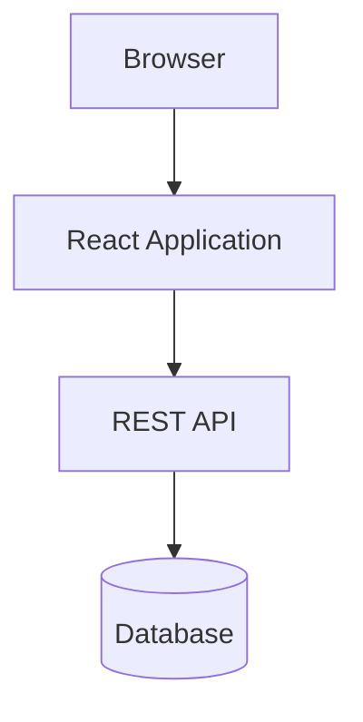
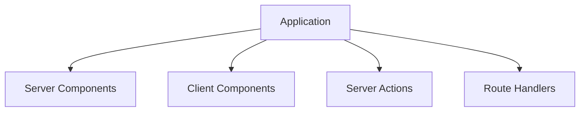

# Appendix D — The Evolution of Web Application Architecture: Why Next.js Exists

> **To understand why Next.js works the way it does, you first need to understand the problems it was designed to solve.**

Many beginners encounter Server Components, Server Actions, and Route Handlers and ask:

> "Why did React and Next.js become so complicated?"

The surprising answer is:

> **They didn't become complicated.**
>
> They became simpler by removing decades of architectural workarounds.

To understand this, we need to take a brief journey through the history of web applications.

---

# Era 1 — The Server-Rendered Web (1995–2005)

In the beginning, websites were simple.

A browser requested a page.

The server generated HTML.

The browser displayed it.

```text
Browser
    ↓
Request
    ↓
Server
    ↓
HTML
    ↓
Browser
```

Examples:

* PHP
* ASP
* JSP
* Rails
* Django

---

## Example

```php
<?php

$products = getProducts();

foreach ($products as $product) {
    echo "<div>";
    echo $product->name;
    echo "</div>";
}
```

Everything happened on the server.

---

## Advantages

✅ Simple

✅ Secure

✅ Fast initial load

✅ SEO-friendly

✅ Direct database access

---

## Problems

As applications became interactive, this model struggled.

Users wanted:

* live updates
* drag-and-drop
* dashboards
* rich forms
* real-time interactions

The browser needed to become smarter.

---

# Era 2 — AJAX Changed Everything (2005–2012)

The introduction of AJAX transformed web development.

Instead of refreshing entire pages:

```text
Browser
    ↓
AJAX
    ↓
Server
    ↓
JSON
    ↓
Update UI
```

Suddenly:

* pages became interactive,
* applications became dynamic,
* browsers became mini operating systems.

---

## Example

```javascript
fetch("/api/products")
  .then(response => response.json())
  .then(data => {
    renderProducts(data);
  });
```

This felt revolutionary.

And it was.

---

# Era 3 — The Single Page Application Revolution (2012–2020)

Frameworks like React changed everything again.

The browser became the center of the application.

```text
Browser
    ↓
React App
    ↓
REST API
    ↓
Backend
    ↓
Database
```

The frontend and backend became separate systems.

---

## The SPA Architecture



This architecture solved many problems:

✅ rich interactions

✅ component reuse

✅ client-side routing

✅ responsive applications

---

# But SPAs Created New Problems

Ironically, solving one problem created many others.

---

## Problem 1 — Duplicate Logic

Validation existed everywhere.

```text
Browser Validation
        +
API Validation
        +
Database Validation
```

Example:

```text
Email required
```

implemented:

* in React
* in Express
* in Prisma
* in SQL

---

## Problem 2 — API Boilerplate

To save one record:

```text
Button
   ↓
fetch()
   ↓
REST Endpoint
   ↓
Controller
   ↓
Service
   ↓
Repository
   ↓
Database
```

A simple operation suddenly required hundreds of lines of infrastructure.

---

## Problem 3 — State Synchronization

Developers began managing:

* local state
* server state
* cache state
* loading state
* error state
* optimistic state

Example:

```tsx
const [loading, setLoading] =
  useState(false);

const [error, setError] =
  useState(null);

const [data, setData] =
  useState(null);
```

Entire libraries appeared simply to solve synchronization problems.

---

## Problem 4 — Large JavaScript Bundles

Browsers downloaded:

```text
✓ UI
✓ Routing
✓ State Management
✓ API Client
✓ Cache Layer
✓ Synchronization Logic
✓ Data Fetching Logic
✓ Validation Logic
```

Applications became increasingly heavy.

---

# The Industry Started Asking A Different Question

Instead of asking:

> "How do we make the browser do everything?"

Engineers started asking:

> "Why are we forcing the browser to do everything?"

This question led to:

* server-side rendering,
* static generation,
* edge computing,
* partial hydration,
* server components.

---

# Enter React Server Components

The React team realized something important.

Most components:

* don't need clicks,
* don't need state,
* don't need browser APIs.

Most components simply:

> **read data and render UI.**

For example:

```tsx
export default async function Products() {
  const products =
    await db.product.findMany();

  return (
    <>
      {products.map(product => (
        <div>
          {product.name}
        </div>
      ))}
    </>
  );
}
```

Why send this code to the browser?

The browser doesn't need it.

---

# Enter Next.js 16

Next.js embraced this idea completely.

Instead of:

```text
Frontend
     ↓
Backend
```

Next.js introduced:

```text
Execution Environments
```

---

# The Four Environments



Each environment solves one problem.

---

## Server Components

Responsible for:

```text
Reading
```

Example:

```tsx
await db.products.findMany();
```

---

## Client Components

Responsible for:

```text
Interaction
```

Example:

```tsx
<button onClick={save}>
```

---

## Server Actions

Responsible for:

```text
Mutation
```

Example:

```tsx
await createOrder();
```

---

## Route Handlers

Responsible for:

```text
Communication
```

Example:

```tsx
export async function POST() {}
```

---

# Notice What's Happening

We've actually returned to the original web architecture.

Remember 1995?

```text
Browser
    ↓
Server
    ↓
HTML
```

Modern Next.js looks surprisingly similar:

```text
Browser
    ↓
Server Components
    ↓
Server Actions
    ↓
Route Handlers
    ↓
Database
```

But now we keep all the interactive power of modern React.

---

# The Great Circle Of Web Development

The evolution of web architecture looks like this:


Or more humorously:

```text
1995:
Everything on server

2015:
Everything in browser

2025:
Most things on server again
```

---

# Why Next.js Feels Strange

If you learned React during the SPA era, you learned:

```text
Browser First
```

Next.js teaches:

```text
Server First
```

That mental shift is what makes modern Next.js initially difficult.

You're not learning new APIs.

You're learning a new philosophy.

---

# The New Philosophy

Instead of asking:

> "Can the browser do this?"

Ask:

> "Where should this execute?"

---

# The Final Evolution

The progression of thinking looks like this:

| Era              | Question                            |
| ---------------- | ----------------------------------- |
| Server Rendering | How do we generate pages?           |
| AJAX             | How do we avoid page refreshes?     |
| SPA              | How do we move logic into browsers? |
| SSR              | How do we improve performance?      |
| Next.js 16       | Where should code execute?          |

---

# The Most Important Realization

Next.js is not trying to replace React.

Next.js is trying to solve the architectural problems created by treating browsers as application servers.

And that's why modern Next.js applications feel less like:

```text
Frontend
     +
Backend
```

and more like:

```text
Distributed System
```

---

# Final Mental Model

The history of web development can almost be summarized in one sentence:

> We spent twenty years moving everything into the browser, only to discover that most of it never belonged there in the first place.

And that realization gave us:

> **Server Components read.**

> **Client Components interact.**

> **Server Actions mutate.**

> **Route Handlers communicate.**
