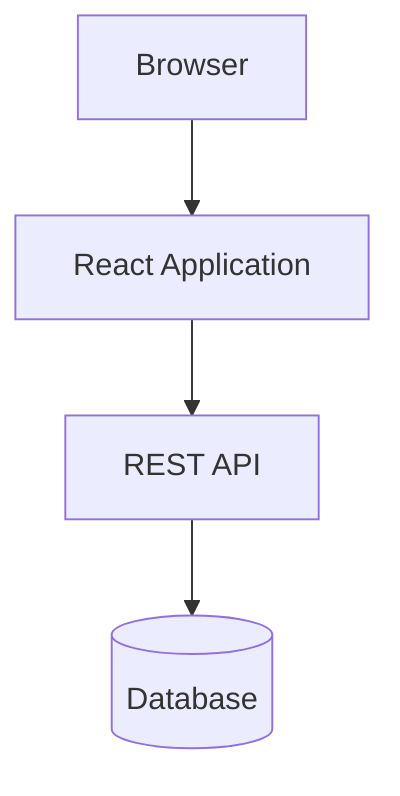
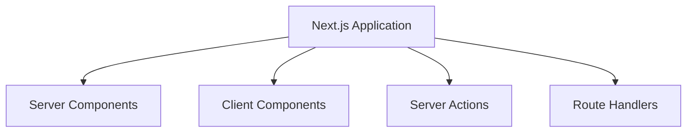

# Appendix D — The Evolution of Web Application Architecture: Why Next.js Exists

> **To understand why Next.js 16 works the way it does, you first need to understand the problems it was designed to solve.**

Many developers encounter Server Components, Server Actions, and Route Handlers and ask:

> **"Why did React and Next.js become so complicated?"**

The surprising answer is:

> **They didn't become more complicated.**
>
> **They became more specialized in order to remove decades of architectural complexity.**

To understand this, we need to take a brief journey through the history of web development.

---

# The Story of Web Development Is Actually One Big Question

For thirty years, web developers have repeatedly asked one question:

> **Where should application code execute?**

The answer has changed many times.

```text
1995:
Mostly on servers

2010:
Mostly in browsers

2025:
Wherever it makes the most sense
```

This evolution eventually led us to Next.js 16.

---

# Era 1 — The Server-Rendered Web (1995–2005)

In the beginning, web applications were simple.

A browser requested a page.

The server generated HTML.

The browser displayed the result.

```text
Browser
    ↓
Request
    ↓
Server
    ↓
Database
    ↓
HTML
    ↓
Browser
```

Examples included:

* PHP
* ASP
* JSP
* Rails
* Django

---

## Example

A product page might have looked like this:

```php
<?php

$products = getProducts();

foreach ($products as $product) {
    echo "<div>";
    echo $product->name;
    echo "</div>";
}
```

Everything happened on the server.

---

## Why This Worked So Well

This architecture had many advantages.

✅ Simple

✅ Secure

✅ SEO-friendly

✅ Direct database access

✅ Small browser payloads

---

## The Problem

As websites evolved into applications, users wanted more.

They wanted:

* instant interactions,
* dashboards,
* drag-and-drop,
* rich forms,
* real-time updates,
* desktop-like experiences.

The browser needed to become smarter.

---

# Era 2 — AJAX Changed Everything (2005–2012)

AJAX introduced a revolutionary idea:

> **What if we updated parts of the page without refreshing everything?**

Instead of:

```text
Browser
    ↓
Page Refresh
    ↓
Server
```

We now had:

```text
Browser
    ↓
AJAX Request
    ↓
Server
    ↓
JSON
    ↓
Partial Update
```

---

## Example

```javascript
fetch("/api/products")
  .then(response => response.json())
  .then(products => {
    renderProducts(products);
  });
```

For the first time:

* pages became applications,
* browsers became execution environments,
* servers became data providers.

---

## This Felt Revolutionary

And it truly was.

Suddenly we could build:

* Gmail,
* Google Maps,
* Facebook,
* Twitter,
* interactive dashboards.

The web became an application platform.

---

# Era 3 — The Single Page Application Revolution (2012–2020)

Frameworks like React, Angular, and Vue pushed this idea even further.

The browser became the center of the application.

```text
Browser
     ↓
SPA
     ↓
REST API
     ↓
Backend
     ↓
Database
```

---

## The Architecture



This architecture solved many problems.

✅ rich interactions

✅ reusable components

✅ client-side routing

✅ dynamic interfaces

✅ desktop-like experiences

---

# But SPAs Introduced New Problems

Ironically, solving one problem created several others.

---

## Problem 1 — Duplicate Validation

The same rule often existed three times.

```text
Browser Validation
        +
API Validation
        +
Database Validation
```

For example:

```text
Email is required
```

might be implemented:

* in React,
* in Express,
* in Prisma,
* in SQL constraints.

---

## Problem 2 — API Boilerplate

To save a single record:

```text
Button
    ↓
fetch()
    ↓
REST API
    ↓
Controller
    ↓
Service
    ↓
Repository
    ↓
Database
```

A simple operation suddenly required hundreds of lines of infrastructure.

---

## Problem 3 — State Synchronization

Developers found themselves managing:

* local state,
* server state,
* cache state,
* loading state,
* error state,
* optimistic state.

Example:

```tsx
const [loading, setLoading] =
  useState(false);

const [error, setError] =
  useState(null);

const [data, setData] =
  useState(null);
```

Entire libraries emerged to solve synchronization problems.

---

## Problem 4 — Large JavaScript Bundles

Browsers started downloading:

```text
✓ UI Components
✓ Router
✓ State Management
✓ API Client
✓ Cache Layer
✓ Data Fetching
✓ Validation
✓ Synchronization Logic
```

Ironically, much of this code existed simply because frontend and backend had become separate systems.

---

# The Industry Started Asking A New Question

Engineers began asking:

> **Why are we forcing browsers to do everything?**

This question sparked innovations such as:

* Server-Side Rendering,
* Static Site Generation,
* Edge Computing,
* Partial Hydration,
* React Server Components.

---

# The Return Of The Server

Around 2016, developers rediscovered something important:

> **Servers are actually very good at generating HTML.**

This led to the resurgence of:

* Next.js,
* Nuxt,
* Remix,
* Astro.

The server returned.

But this time, the browser remained interactive.

---

# Enter React Server Components

The React team then asked an even more important question:

> **Why send code to the browser if the browser never needs to run it?**

Consider this component:

```tsx
export default async function Products() {
  const products =
    await db.product.findMany();

  return (
    <>
      {products.map(product => (
        <div key={product.id}>
          {product.name}
        </div>
      ))}
    </>
  );
}
```

Ask yourself:

> Why should this execute in the browser?

The browser doesn't need:

* Prisma,
* SQL,
* database credentials,
* fetching logic,
* caching logic.

It only needs:

```text
HTML
```

This realization gave birth to:

```text
Server Components
```

---

# Next.js Took This Idea Further

Next.js embraced a completely different architectural model.

Instead of asking:

> **Is this frontend code?**

or

> **Is this backend code?**

Next.js asks:

> **Where should this code execute?**

This single question changes everything.

---

# The Four Execution Environments

Modern Next.js applications consist of four specialized execution environments.



Each environment has one responsibility.

| Environment       | Responsibility |
| ----------------- | -------------- |
| Server Components | Read           |
| Client Components | Interact       |
| Server Actions    | Mutate         |
| Route Handlers    | Communicate    |

---

# Notice Something Fascinating

We've actually come full circle.

Remember the architecture from 1995?

```text
Browser
    ↓
Server
    ↓
Database
```

Modern Next.js looks surprisingly similar:

```text
Browser
    ↓
Server Components
    ↓
Server Actions
    ↓
Route Handlers
    ↓
Database
```

The difference is:

> We kept all the interactive capabilities that twenty years of frontend innovation gave us.

---

# The Great Circle Of Web Development

The evolution of web architecture looks something like this:


Or more humorously:

```text
1995:
Everything on the server

2015:
Everything in the browser

2025:
Most things on the server again
```

---

# The Evolution Of The Question

Perhaps the best way to understand web history is to look at the question each era tried to answer.

| Era              | Primary Question                    |
| ---------------- | ----------------------------------- |
| Server Rendering | How do we generate pages?           |
| AJAX             | How do we avoid page refreshes?     |
| SPA              | How do we move logic into browsers? |
| SSR              | How do we improve performance?      |
| Next.js 16       | Where should code execute?          |

---

# Why Next.js Feels Strange

If you learned React during the SPA era, you learned to think:

```text
Browser First
```

Next.js teaches you to think:

```text
Execution First
```

You're not merely learning new APIs.

You're learning a new architectural philosophy.

---

# The New Philosophy

Instead of asking:

> "Can the browser do this?"

Ask:

> **"Where should this execute?"**

That question determines everything.

---

# The Most Important Realization

Next.js is not trying to replace React.

Next.js is trying to solve the architectural problems created by treating browsers as application servers.

Modern applications no longer look like:

```text
Frontend
     +
Backend
```

Instead, they look like:

```text
Distributed Runtime
```

---

# Final Mental Model

The entire history of modern web development can almost be summarized in one sentence:

> **We spent twenty years moving everything into the browser, only to discover that most of it never belonged there in the first place.**

And that realization eventually gave us the four execution environments of modern Next.js:

> **Server Components read.**

> **Client Components interact.**

> **Server Actions mutate.**

> **Route Handlers communicate.**
