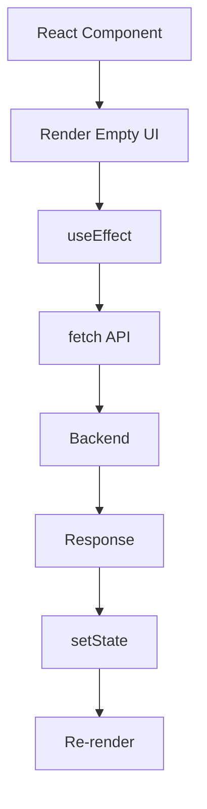
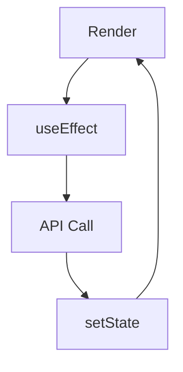
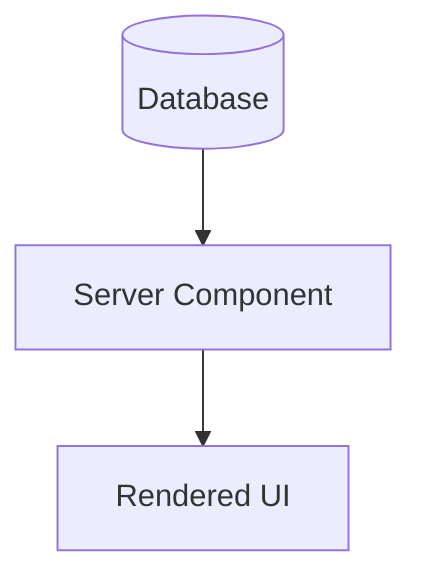

# Appendix E — Why `useEffect()` Disappears in Next.js: Understanding the Biggest Shift for React Developers

> **For many React developers, the most shocking thing about Next.js isn't Server Components.**
>
> It's opening a Next.js project and realizing:
>
> > **"Wait... where did all the `useEffect()` code go?"**

If you learned React through tutorials, bootcamps, or professional SPA development, you were probably taught something like this:

```tsx
function Users() {
  const [users, setUsers] =
    useState([]);

  useEffect(() => {
    fetch("/api/users")
      .then(r => r.json())
      .then(setUsers);
  }, []);

  return (
    <div>
      {users.map(user => (
        <p>{user.name}</p>
      ))}
    </div>
  );
}
```

For years, this pattern became the default way to fetch data in React.

Then you open a Next.js 16 application and see:

```tsx
export default async function Users() {
  const users =
    await db.user.findMany();

  return (
    <div>
      {users.map(user => (
        <p>{user.name}</p>
      ))}
    </div>
  );
}
```

And your first reaction is usually:

> **"Wait... where did everything go?"**

The answer is:

> **Most of that code existed to solve a problem that no longer exists.**

---

# Why React Needed `useEffect()`

To understand why `useEffect()` disappears, we first need to understand why it existed.

Traditional React applications execute entirely inside the browser.

```text
Browser
    ↓
React
    ↓
Render UI
```

The browser cannot:

* access databases,
* access secrets,
* access file systems,
* execute backend logic.

So React applications had to perform data fetching after rendering.

---

## Traditional React Data Flow



This became known as:

> **Fetch After Render**

---

## Example

```tsx
function Dashboard() {
  const [users, setUsers] =
    useState([]);

  const [loading, setLoading] =
    useState(true);

  useEffect(() => {
    async function load() {
      const response =
        await fetch("/api/users");

      const data =
        await response.json();

      setUsers(data);
      setLoading(false);
    }

    load();
  }, []);

  if (loading) {
    return <Spinner />;
  }

  return (
    <UserList users={users} />
  );
}
```

This pattern works.

But notice what happened.

---

# We Accidentally Built A State Machine

To fetch one piece of data, we suddenly need:

```text
No Data
    ↓
Loading
    ↓
Success
    ↓
Error
    ↓
Retry
```

Plus:

```text
State
+
Effect
+
Fetch
+
Loading
+
Error Handling
+
Re-render
```

The actual business logic becomes a tiny part of the code.

---

# Why `useEffect()` Was Never Really A Data Fetching Tool

This surprises many React developers.

The React team never designed `useEffect()` specifically for fetching data.

It was designed for:

> **Synchronizing React with external systems.**

Examples:

```tsx
useEffect(() => {
  document.title = title;
}, [title]);
```

```tsx
useEffect(() => {
  const socket =
    connect();

  return () =>
    socket.disconnect();
}, []);
```

```tsx
useEffect(() => {
  window.addEventListener(
    "resize",
    handler
  );

  return () =>
    window.removeEventListener(
      "resize",
      handler
    );
}, []);
```

Data fetching became a workaround because browsers couldn't execute server logic.

---

# Server Components Change Everything

Server Components execute on the server.

```text
Browser
      X
Database

Server
      ✓
Database
```

This means:

```tsx
export default async function Users() {
  const users =
    await db.user.findMany();

  return (
    <UserList users={users} />
  );
}
```

becomes perfectly legal.

---

# Compare The Two Approaches

## Traditional React

```tsx
function Products() {
  const [products, setProducts] =
    useState([]);

  const [loading, setLoading] =
    useState(true);

  useEffect(() => {
    async function load() {
      const response =
        await fetch("/api/products");

      setProducts(
        await response.json()
      );

      setLoading(false);
    }

    load();
  }, []);

  if (loading)
    return <Spinner />;

  return (
    <ProductList
      products={products}
    />
  );
}
```

---

## Next.js Server Component

```tsx
export default async function Products() {
  const products =
    await db.product.findMany();

  return (
    <ProductList
      products={products}
    />
  );
}
```

That's it.

No:

❌ `useState`

❌ `useEffect`

❌ loading state

❌ fetch

❌ API route

❌ synchronization

❌ cache management

---

# Visualizing The Difference

## Traditional React



---

## Next.js Server Components



Much simpler.

---

# Wait — What About Loading States?

This is where many beginners get confused.

They ask:

> "If we don't use `useEffect`, how do we show loading indicators?"

The answer is:

> **Loading moved from the component level to the route level.**

Instead of:

```tsx
if (loading)
  return <Spinner />;
```

Next.js uses:

```text
loading.tsx
```

Example:

```text
app/

 ├── dashboard/
 │      ├── page.tsx
 │      └── loading.tsx
```

```tsx
export default function Loading() {
  return <Spinner />;
}
```

Next.js automatically displays this while Server Components execute.

---

# What About Refetching?

Traditional React:

```text
Save
   ↓
API
   ↓
Refetch
   ↓
Update State
```

Next.js:

```text
Save
   ↓
Server Action
   ↓
Revalidate
   ↓
Server Re-render
```

Example:

```tsx
"use server";

import {
  revalidatePath
} from "next/cache";

export async function save() {
  await db.save();

  revalidatePath("/");
}
```

No manual synchronization.

---

# Does `useEffect()` Still Exist?

Absolutely.

But its role changed.

---

## Good Uses Of `useEffect()`

### Browser APIs

```tsx
useEffect(() => {
  localStorage.setItem(
    "theme",
    theme
  );
}, [theme]);
```

---

### WebSocket Connections

```tsx
useEffect(() => {
  const socket =
    connect();

  return () =>
    socket.close();
}, []);
```

---

### Timers

```tsx
useEffect(() => {
  const id =
    setInterval(update, 1000);

  return () =>
    clearInterval(id);
}, []);
```

---

### Event Listeners

```tsx
useEffect(() => {
  window.addEventListener(
    "resize",
    resize
  );

  return () =>
    window.removeEventListener(
      "resize",
      resize
    );
}, []);
```

---

# Bad Uses Of `useEffect()`

In modern Next.js, avoid:

```tsx
useEffect(() => {
  fetch("/api/data");
}, []);
```

Avoid:

```tsx
useEffect(() => {
  loadUsers();
}, []);
```

Avoid:

```tsx
useEffect(() => {
  getProducts();
}, []);
```

These usually belong in:

> **Server Components**

---

# The Mental Shift

React taught us:

> **Render first, fetch later.**

Next.js teaches us:

> **Fetch first, render later.**

---

# The Evolution Of Data Fetching


Notice the trend:

> We're gradually moving data fetching back to the server.

---

# The One Sentence To Remember

If you remember nothing else from this appendix, remember this:

> **`useEffect()` didn't disappear because it's bad.**
>
> **It disappeared because Server Components eliminated the problem it was being used to solve.**

And that's one of the biggest architectural shifts in modern React and Next.js.
