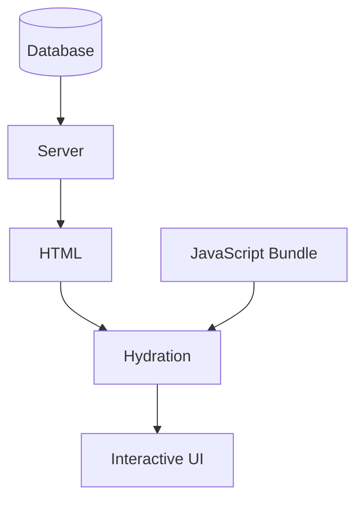
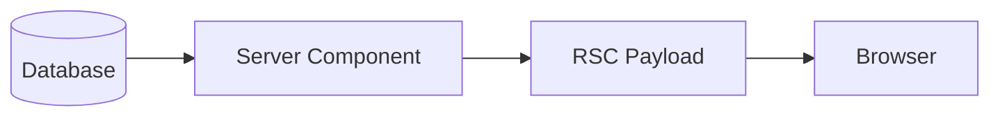
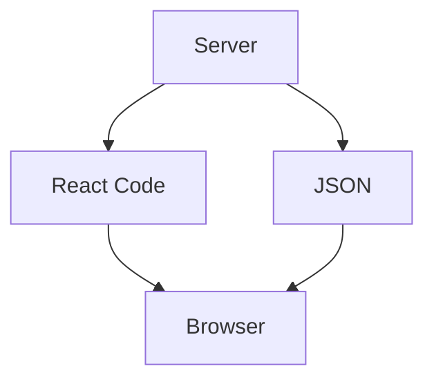
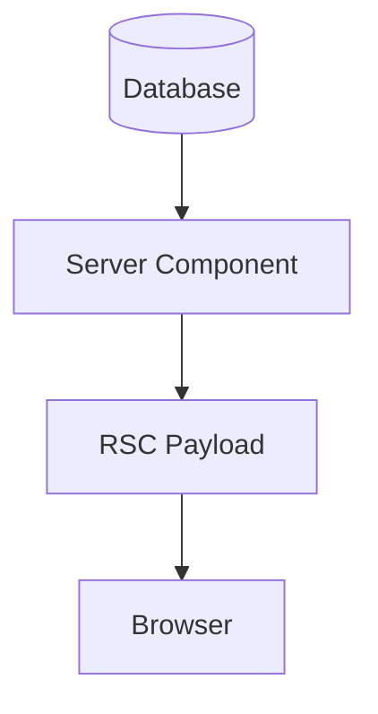
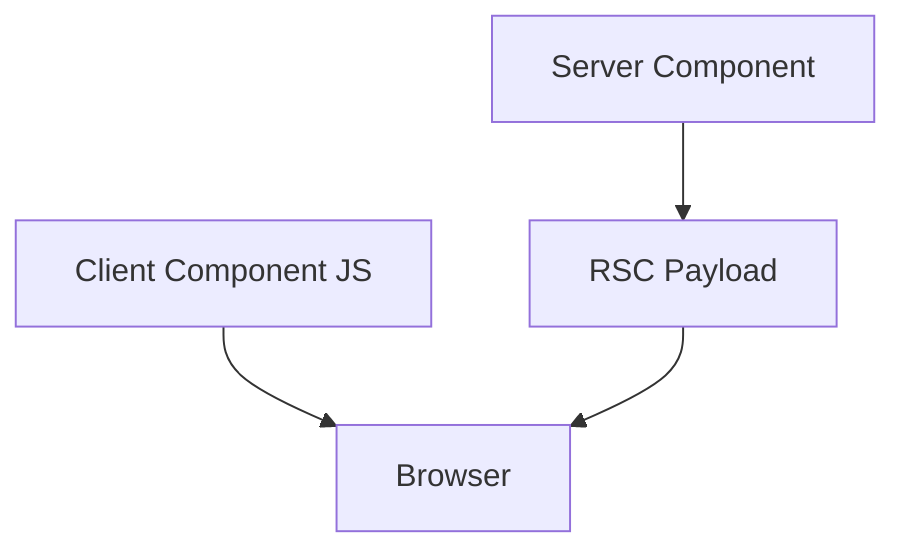
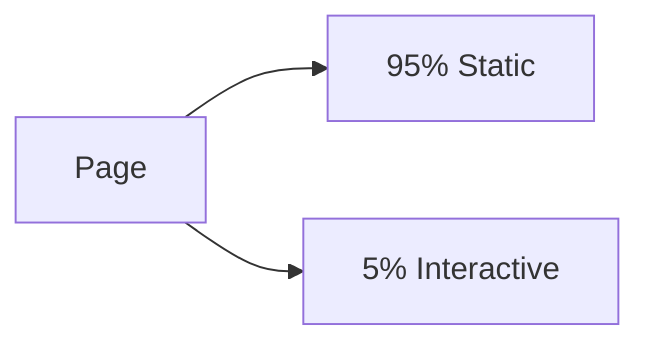

# Appendix F — Understanding the React Server Component (RSC) Protocol: The Magic Behind Next.js

> **One of the biggest misconceptions about Server Components is that they "render HTML on the server."**
>
> That's only partially true.
>
> The real innovation behind Next.js isn't Server Components themselves.
>
> It's the protocol that makes Server Components possible.

This protocol is called:

> **React Server Components Protocol (RSC Protocol)**

Understanding it explains why modern Next.js feels fundamentally different from traditional server-side rendering.

---

# The Traditional SSR Mental Model

Most developers learn server-side rendering like this:

```text
Browser
    ↓
Request
    ↓
Server
    ↓
Generate HTML
    ↓
Send HTML
    ↓
Browser
```

Examples:

* PHP
* Rails
* Django
* ASP.NET MVC
* Next.js Pages Router SSR

The server sends:

```html
<div>
  <h1>Products</h1>
  <p>Laptop</p>
</div>
```

The browser simply displays it.

---

# The Problem With Traditional SSR

Traditional SSR creates a problem.

The browser receives HTML:

```html
<button>
  Add To Cart
</button>
```

But HTML isn't interactive.

To become interactive, the browser must download:

```text
HTML
   +
JavaScript Bundle
   +
Hydration
```

---

## Traditional React SSR



This means:

Even if a component never becomes interactive:

```tsx
<h1>Welcome</h1>
```

the browser still downloads the code that generated it.

---

# React Asked A Radical Question

The React team asked:

> **What if the browser never received most components at all?**

Because many components:

* never handle clicks,
* never use state,
* never use browser APIs.

For example:

```tsx
export default async function Products() {
  const products =
    await db.product.findMany();

  return (
    <>
      {products.map(product => (
        <div>
          {product.name}
        </div>
      ))}
    </>
  );
}
```

Why send this component to the browser?

The browser doesn't need it.

---

# Enter The RSC Protocol

Instead of sending JavaScript components, React sends instructions.

Think of it as:

```text
Server:
"I already rendered this."

Browser:
"Okay, I'll display it."
```

---

# A Simplified Example

Suppose you write:

```tsx
export default function Page() {
  return (
    <div>
      <h1>Hello</h1>
    </div>
  );
}
```

The browser does NOT receive:

```tsx
function Page() {
  return (
    <div>
      <h1>Hello</h1>
    </div>
  );
}
```

Instead, React generates an internal protocol payload.

Conceptually:

```text
Create div
    ↓
Create h1
    ↓
Insert "Hello"
```

---

# Visualizing The RSC Flow



Notice what's missing:

```text
Server Component JS
```

The browser never downloads it.

---

# What Is The RSC Payload?

The RSC payload is a serialized description of a React component tree.

Very simplified:

```text
[
  {
    type: "h1",
    children: "Products"
  },

  {
    type: "div",
    children: [...]
  }
]
```

Real RSC payloads are more sophisticated, but the idea is the same.

The payload says:

> "Here's the UI I already computed."

---

# Traditional React

The browser receives:

```text
Component Source Code
        +
Data
        +
Execution Logic
```

Example:



The browser performs the work.

---

# React Server Components

The browser receives:

```text
Already Computed UI
```

Example:



The server performs the work.

---

# Why This Is So Powerful

Suppose you have:

```tsx
export default async function Dashboard() {
  const users =
    await db.user.findMany();

  const orders =
    await db.order.findMany();

  const products =
    await db.product.findMany();

  return (
    <>
      <Users />
      <Orders />
      <Products />
    </>
  );
}
```

Traditional React:

```text
Browser downloads:

✓ Dashboard component
✓ Users component
✓ Orders component
✓ Products component
✓ Fetch logic
✓ State logic
✓ Loading logic
✓ API logic
```

---

## With Server Components

Browser downloads:

```text
✓ Rendered result
```

Everything else stays on the server.

---

# But What About Interactive Components?

Suppose we have:

```tsx
export default function Page() {
  return (
    <>
      <ProductList />

      <AddToCartButton />
    </>
  );
}
```

Where:

```tsx
<ProductList />
```

is a Server Component, and:

```tsx
"use client";

<AddToCartButton />
```

is a Client Component.

---

# The RSC Payload Contains References

Instead of sending the entire client component, React sends a reference.

Conceptually:

```text
Render ProductList

Encounter Client Component

Insert placeholder

Continue rendering
```

Example:



The browser later downloads:

```text
AddToCartButton.js
```

and hydrates only that portion.

---

# Partial Hydration

Traditional React:

```text
Hydrate Entire Application
```

Next.js:

```text
Hydrate Only Interactive Parts
```

Example:



Only the interactive portions require JavaScript.

---

# Why Server Components Can't Use Hooks

Many beginners ask:

> "Why can't I use `useState()` in Server Components?"

Because Server Components never execute in browsers.

```text
Server Component
        ↓
Execute Once
        ↓
Produce RSC Payload
        ↓
Destroyed
```

No browser.

No events.

No persistent state.

No lifecycle.

---

# Why Server Components Can Access Databases

Because they execute here:

```text
Server
   ↓
Database
```

Example:

```tsx
const users =
  await db.user.findMany();
```

No API required.

No fetch required.

No serialization required.

---

# Why Server Components Improve Security

Traditional React:

```text
Browser
    ↓
API
    ↓
Database
```

Next.js:

```text
Server Component
        ↓
Database
```

Secrets remain:

```text
Server Only
```

The browser never sees:

* database credentials,
* API keys,
* tokens,
* private business logic.

---

# The Mental Model

Think of Server Components like movie production.

---

## Traditional React

```text
Send cameras
Send actors
Send director
Send script

Make audience produce movie
```

---

## Server Components

```text
Produce movie first

Send finished movie
```

The browser becomes a viewer rather than a producer.

---

# The Biggest Misconception

People often say:

> "Server Components are server-side rendering."

Not exactly.

Traditional SSR sends:

```text
HTML
```

Server Components send:

```text
React Instructions
```

The RSC Protocol is what makes this possible.

---

# The One Sentence To Remember

If you remember nothing else from this appendix, remember this:

> **Server Components are not sent to the browser.**
>
> **Only their results are sent to the browser through the React Server Component protocol.**

And that single architectural decision is what enables most of the performance improvements in modern Next.js.
