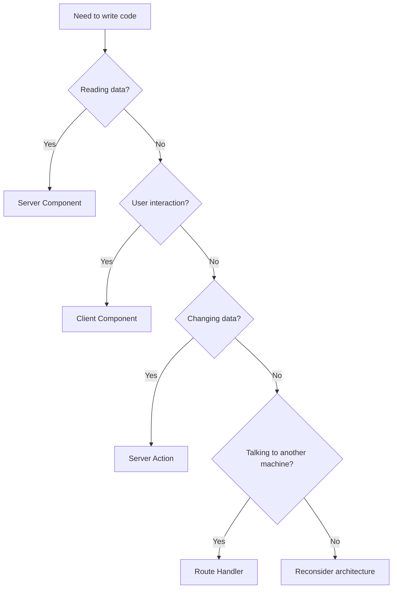
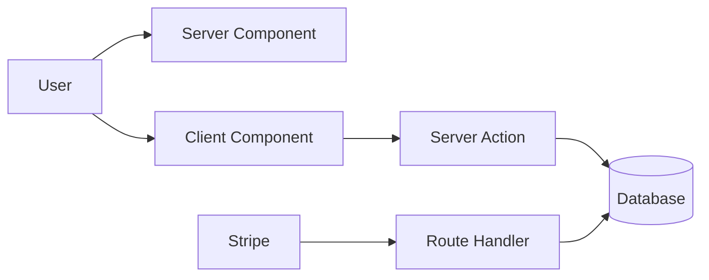

# Appendix G — A Practical Decision Tree: "Where Does This Code Belong?"

One of the biggest challenges for beginners learning Next.js 16 isn't understanding what Server Components, Client Components, Server Actions, and Route Handlers are.

The real challenge is deciding:

> **"Which one should I use right now?"**

This appendix provides a practical decision framework that you can apply whenever you're writing Next.js code.

---

# The One Question That Matters

When writing a feature, stop asking:

> "Should this go in the the frontend or backend?"

Instead ask:

> **"What responsibility does this code have?"**

Every piece of code in Next.js belongs to one of four responsibilities:

```text
Read
Interact
Mutate
Communicate
```

---

# The Ultimate Decision Tree



This simple diagram solves most Next.js architecture questions.

---

# Question 1

## "Am I Reading Data?"

Examples:

* displaying products
* showing blog posts
* reading user profiles
* retrieving orders
* loading dashboard statistics

If the answer is yes:

```text
Use Server Components
```

---

### Example

```tsx
export default async function ProductsPage() {
  const products =
    await db.product.findMany();

  return (
    <ul>
      {products.map(product => (
        <li key={product.id}>
          {product.name}
        </li>
      ))}
    </ul>
  );
}
```

---

### Why?

Because reading data requires:

* databases
* secrets
* authentication
* server resources

And Server Components execute on the server.

---

# Question 2

## "Am I Handling User Interaction?"

Examples:

* button clicks
* forms
* dropdown menus
* tabs
* animations
* drag-and-drop
* browser APIs

If the answer is yes:

```text
Use Client Components
```

---

### Example

```tsx
"use client";

import { useState } from "react";

export default function Counter() {
  const [count, setCount] =
    useState(0);

  return (
    <button
      onClick={() =>
        setCount(count + 1)
      }
    >
      {count}
    </button>
  );
}
```

---

### Why?

Because only browsers support:

* clicks
* keyboard events
* animations
* local state
* browser APIs

---

# Question 3

## "Am I Changing Data?"

Examples:

* creating posts
* deleting records
* updating profiles
* processing payments
* placing orders

If the answer is yes:

```text
Use Server Actions
```

---

### Example

```tsx
"use server";

export async function createPost(
  formData: FormData
) {
  await db.post.create({
    data: {
      title:
        formData.get("title")
    }
  });
}
```

---

### Why?

Because mutations require:

* validation
* authentication
* transactions
* business logic
* database updates

---

# Question 4

## "Am I Communicating With Another Machine?"

Examples:

* Stripe webhooks
* GitHub webhooks
* REST APIs
* mobile apps
* external integrations
* machine-to-machine communication

If the answer is yes:

```text
Use Route Handlers
```

---

### Example

```tsx
export async function POST(
  request: Request
) {
  const payload =
    await request.json();

  await processWebhook(payload);

  return Response.json({
    success: true
  });
}
```

---

### Why?

Because Route Handlers are designed for:

* HTTP requests
* webhooks
* APIs
* external services

---

# A Real Example

Imagine you're building an e-commerce application.

---

## Display Products

```text
Read products
```

Use:

```text
Server Component
```

---

## Add To Cart Button

```text
User clicks
```

Use:

```text
Client Component
```

---

## Checkout Process

```text
Create order
```

Use:

```text
Server Action
```

---

## Stripe Webhook

```text
Payment provider callback
```

Use:

```text
Route Handler
```

---

## Visualizing The Flow



Notice how every part of the system has exactly one responsibility.

---

# The Biggest Beginner Mistake

Many beginners try to put everything into Client Components.

Example:

```tsx
"use client";

useEffect(() => {
  fetch("/api/products");
}, []);
```

Then:

```text
Browser
     ↓
API
     ↓
Database
```

This recreates the old React SPA architecture.

---

# The Better Next.js Architecture

Instead:

```tsx
export default async function Page() {
  const products =
    await db.product.findMany();

  return <Products />;
}
```

Now:

```text
Server Component
        ↓
Database
```

No:

* API call
* loading spinner
* fetch boilerplate
* cache management
* duplicated logic

---

# The Four Rules To Memorize

Whenever you're stuck, ask these four questions:

| Question                         | Environment      |
| -------------------------------- | ---------------- |
| Am I reading data?               | Server Component |
| Am I handling interaction?       | Client Component |
| Am I changing data?              | Server Action    |
| Am I talking to another machine? | Route Handler    |

---

# The Shortcut Every Next.js Developer Eventually Learns

> **Server Components read.**

> **Client Components interact.**

> **Server Actions mutate.**

> **Route Handlers communicate.**

If you remember those four sentences, you'll solve most Next.js architecture problems correctly.
