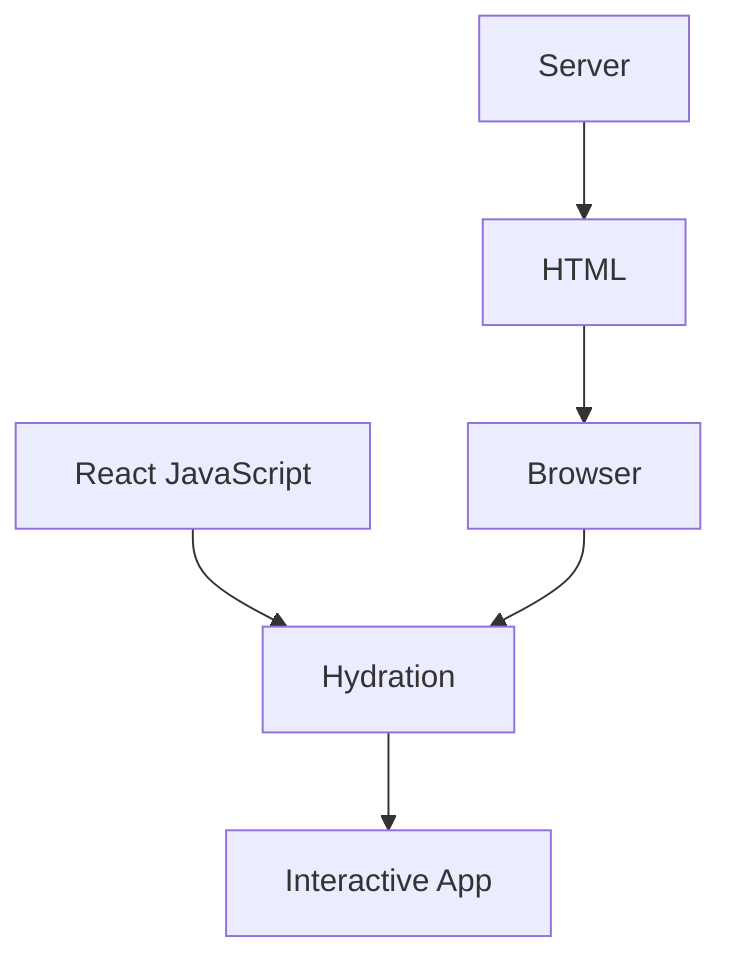
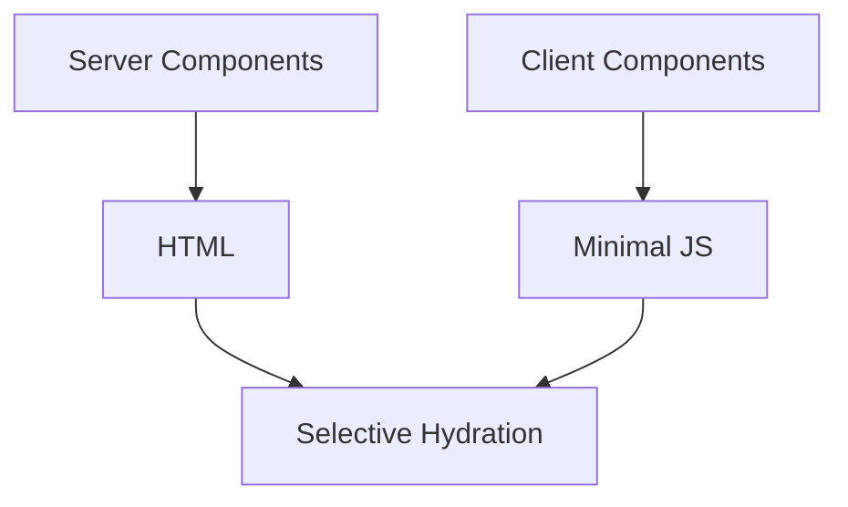

# Appendix H — Understanding Hydration: The Magic Trick Behind Modern React

> **One of the most confusing concepts in React and Next.js is something that happens after your page already appears to work.**
>
> It's called **hydration**.
>
> Ironically, hydration exists because HTML alone isn't enough to build interactive applications.

---

# Why Beginners Get Confused

Imagine you build this component:

```tsx
export default function Counter() {
  return (
    <button>
      Count: 0
    </button>
  );
}
```

When you visit the page, you immediately see:

```text
[ Count: 0 ]
```

So naturally you might think:

> "Great. The browser received the page."

But now consider this:

```tsx
export default function Counter() {
  return (
    <button
      onClick={() => alert("Hello")}
    >
      Click Me
    </button>
  );
}
```

The browser still receives:

```html
<button>
  Click Me
</button>
```

The problem is:

> HTML does not contain JavaScript behavior.

The browser knows:

* what a button looks like,
* where the button is,
* how to style the button,

but it has absolutely no idea that React intended:

```tsx
onClick={() => alert("Hello")}
```

to exist.

This creates one of the most important questions in modern web development:

> **How does a static HTML page become an interactive application?**

The answer is:

> **Hydration.**

---

# The Original Web

The original web was simple.

```text
Browser
    ↓
Request
    ↓
Server
    ↓
HTML
    ↓
Display
```

Example:

```html
<h1>Hello World</h1>

<button>
  Save
</button>
```

The browser rendered everything immediately.

No JavaScript required.

---

# The Problem

Static HTML cannot do things like:

* button clicks,
* animations,
* state updates,
* drag and drop,
* local storage,
* forms with validation,
* dynamic interfaces.

For example:

```html
<button>
  Add To Cart
</button>
```

looks interactive.

But it isn't.

```text
Click
   ↓
Nothing Happens
```

---

# Enter JavaScript

Developers added JavaScript:

```html
<button id="buy">
  Add To Cart
</button>

<script>
document
  .getElementById("buy")
  .onclick = function() {
    alert("Added");
  };
</script>
```

Now the browser had:

* HTML
* behavior

The page became interactive.

---

# React Changed The Model

React doesn't attach handlers one-by-one.

Instead, React builds an entire application model.

Consider:

```tsx
export default function App() {
  return (
    <button
      onClick={() => {
        console.log("clicked");
      }}
    >
      Buy
    </button>
  );
}
```

React understands:

* the component tree,
* the state,
* the event handlers,
* the props,
* the relationships.

But browsers don't understand React.

Browsers only understand:

```text
HTML
CSS
JavaScript
```

---

# The Big Problem With Server Rendering

Suppose the server renders:

```tsx
export default function Product() {
  return (
    <button
      onClick={buy}
    >
      Buy Now
    </button>
  );
}
```

The browser receives:

```html
<button>
  Buy Now
</button>
```

Notice what disappeared:

```tsx
onClick={buy}
```

The browser never received:

* the function,
* the component,
* the React tree.

So the browser sees:

```text
Beautiful page

But dead page
```

---

# Hydration To The Rescue

Hydration means:

> **React reconstructs the application in the browser and reconnects behavior to existing HTML.**

The process looks like this:



---

# Step 1 — Server Generates HTML

Server:

```tsx
<button>
  Buy Now
</button>
```

Browser receives:

```html
<button>
  Buy Now
</button>
```

User sees:

```text
✓ Page loaded
```

---

# Step 2 — Browser Downloads JavaScript

The browser then downloads:

```text
React Runtime
+
Application Bundle
+
Component Logic
```

Example:

```text
500KB
1MB
2MB
```

depending on the application.

---

# Step 3 — React Rebuilds The Tree

React executes:

```tsx
<App />
```

again.

It recreates:

```text
Component Tree
        +
State Tree
        +
Event Handlers
        +
Hooks
```

---

# Step 4 — React Attaches Behavior

React compares:

```text
Browser HTML
```

against:

```text
Virtual React Tree
```

and reconnects:

```tsx
onClick
onChange
useState
useEffect
```

The page becomes interactive.

---

# Before And After Hydration

Before hydration:

```text
┌─────────────┐
│ Buy Button  │
└─────────────┘

Click:
Nothing
```

After hydration:

```text
┌─────────────┐
│ Buy Button  │
└─────────────┘

Click:
Works
```

---

# Why Hydration Became Expensive

Traditional React SSR worked like this:


The problem:

Even this component:

```tsx
<h1>Products</h1>
```

required hydration.

And this component:

```tsx
<div>
  Welcome
</div>
```

required hydration.

And this component:

```tsx
<footer>
  Copyright
</footer>
```

required hydration.

Eventually:

```text
Everything
got hydrated.
```

---

# This Created The SPA Problem

Browsers downloaded:

```text
✓ React
✓ Components
✓ State
✓ Hooks
✓ Event Logic
✓ Fetch Logic
✓ Cache Logic
✓ Validation Logic
```

Even if most of it never needed interaction.

---

# React Server Components Changed Everything

The React team asked:

> "What if we only hydrated the parts that actually need JavaScript?"

Example:

```tsx
export default async function ProductPage() {
  const products =
    await db.product.findMany();

  return (
    <>
      <h1>Products</h1>

      <ProductList
        products={products}
      />

      <AddToCartButton />
    </>
  );
}
```

Notice:

```text
h1
ProductList
```

don't need hydration.

Only:

```text
AddToCartButton
```

does.

---

# Selective Hydration

Modern Next.js looks more like this:



Instead of:

```text
Hydrate Everything
```

we now do:

```text
Hydrate Only What Needs Interaction
```

---

# Example

Server Component:

```tsx
export default async function Products() {
  const products =
    await db.product.findMany();

  return (
    <>
      {products.map(product => (
        <div>
          {product.name}
        </div>
      ))}

      <CartButton />
    </>
  );
}
```

Client Component:

```tsx
"use client";

export default function CartButton() {
  return (
    <button>
      Add To Cart
    </button>
  );
}
```

Hydration occurs only for:

```text
CartButton
```

Not:

```text
Products
```

---

# Why This Is Revolutionary

Traditional React:

```text
HTML
     +
Hydrate Everything
```

Next.js + RSC:

```text
HTML
     +
Hydrate Only Interactive Islands
```

This means:

✅ smaller bundles

✅ faster startup

✅ less JavaScript

✅ better SEO

✅ better mobile performance

✅ lower memory usage

---

# A Helpful Analogy

Imagine furnishing a house.

Traditional React:

```text
Move entire house
to new location.
```

Server Components:

```text
Keep house where it is.

Move only the furniture
that people actually use.
```

---

# The Most Important Thing To Remember

Hydration is not:

> "making HTML appear."

Hydration is:

> **teaching the browser how to interact with HTML that already exists.**

And modern Next.js asks an even better question:

> **Do we need to hydrate this at all?**

That single question is one of the biggest reasons why modern React applications became dramatically faster.

---

# Final Mental Model

```text
Server Components
        ↓
Generate HTML

Client Components
        ↓
Generate Behavior

Hydration
        ↓
Attach Behavior To HTML
```

Or even shorter:

> **HTML shows the page.**
>
> **Hydration teaches the page how to work.**
