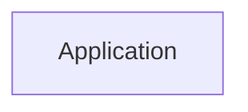
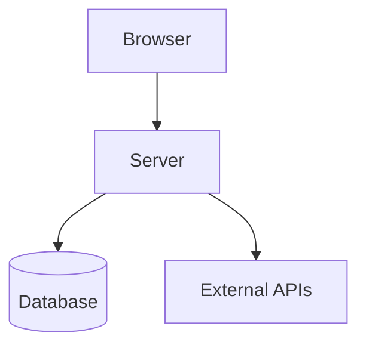

# Appendix I — The Most Common Beginner Mistakes in Next.js 16

> **Most developers don't struggle with Next.js because the APIs are difficult.**
>
> They struggle because they're applying the mental models of traditional React applications to a completely different architecture.
>
> The good news is that most confusion in Next.js comes from making the same small set of mistakes.
>
> Once you understand why these mistakes happen, Next.js suddenly becomes much easier.

---

# The Root Cause Of Most Problems

Most React developers learned this mental model:

```text
Browser
    ↓
React
    ↓
fetch()
    ↓
API
    ↓
Database
```

Next.js teaches a different model:

```text
Server Components
        ↓
Client Components
        ↓
Server Actions
        ↓
Route Handlers
```

The mistakes below happen when we accidentally mix these two models.

---

# Mistake 1 — Making Everything A Client Component

This is probably the most common beginner mistake.

New developers often write:

```tsx
"use client";

export default function Home() {
  return (
    <main>
      <Hero />
      <Products />
      <Footer />
    </main>
  );
}
```

because they think:

> "React components need JavaScript."

But in Next.js:

> **Server Components are the default.**

---

## What Happens?

Instead of sending:

```text
HTML
```

you send:

```text
HTML
    +
JavaScript
    +
Hydration
```

for your entire page.

---

## Example

Bad:

```tsx
"use client";

export default function ProductPage() {
  return (
    <>
      <ProductList />
      <ProductReviews />
      <ProductFAQ />
    </>
  );
}
```

Good:

```tsx
export default function ProductPage() {
  return (
    <>
      <ProductList />
      <ProductReviews />
      <ProductFAQ />
    </>
  );
}
```

---

## Rule

Ask yourself:

> Does this component actually need browser interaction?

If not:

```text
Keep it as a Server Component.
```

---

# Mistake 2 — Using useEffect For Data Fetching

Many React developers automatically write:

```tsx
"use client";

export default function Products() {
  const [products, setProducts] =
    useState([]);

  useEffect(() => {
    fetch("/api/products")
      .then(r => r.json())
      .then(setProducts);
  }, []);

  return <div />;
}
```

because this was standard React practice.

---

## The Problem

This creates:

```text
Page Loads
      ↓
JavaScript Loads
      ↓
React Starts
      ↓
Fetch Begins
      ↓
Wait
      ↓
Data Arrives
      ↓
Render
```

This is called a:

> **network waterfall**

---

## The Next.js Way

Instead:

```tsx
export default async function Products() {
  const products =
    await db.product.findMany();

  return (
    <>
      {products.map(product => (
        <div>{product.name}</div>
      ))}
    </>
  );
}
```

Now:

```text
Server Fetches
       ↓
Server Renders
       ↓
Browser Displays
```

No waterfall.

---

## Rule

If you're writing:

```tsx
useEffect(() => {
  fetch(...)
}, []);
```

ask yourself:

> Could this simply be a Server Component?

Usually the answer is:

```text
Yes.
```

---

# Mistake 3 — Using useState In Server Components

Beginners often write:

```tsx
export default function Page() {
  const [count, setCount] =
    useState(0);

  return <div>{count}</div>;
}
```

and get:

```text
Error:
useState only works in Client Components
```

---

## Why?

Remember:

```text
Server Components execute
on the server.
```

Servers don't have:

* clicks,
* mouse events,
* browser state,
* local component state.

---

## Rule

If you need:

```text
useState
useEffect
useReducer
useRef
```

you probably need:

```tsx
"use client";
```

---

# Mistake 4 — Using Browser APIs On The Server

Another common mistake:

```tsx
export default function Page() {
  const token =
    localStorage.getItem("token");

  return <div />;
}
```

or:

```tsx
window.location.href
```

or:

```tsx
document.querySelector()
```

---

## Why This Fails

Server Components execute here:

```text
Linux Server
```

not here:

```text
Chrome Browser
```

The server has no:

```text
window
document
localStorage
navigator
sessionStorage
```

---

## Rule

Ask:

> Would this code work inside Node.js?

If not:

```text
It belongs in a Client Component.
```

---

# Mistake 5 — Creating APIs For Everything

React developers often build:

```text
Client
   ↓
fetch()
   ↓
Route Handler
   ↓
Database
```

for every operation.

Example:

```tsx
await fetch("/api/orders", {
  method: "POST"
});
```

---

## The Problem

You've recreated the old SPA architecture.

```text
Button
   ↓
HTTP
   ↓
JSON
   ↓
API
   ↓
Database
```

---

## The Next.js Way

Use a Server Action:

```tsx
"use server";

export async function createOrder() {
  await db.order.create();
}
```

Then:

```tsx
<form action={createOrder}>
```

No API required.

---

## Rule

Ask:

> Is a human user initiating this action?

If yes:

```text
Use a Server Action.
```

---

# Mistake 6 — Using Server Actions As APIs

Sometimes developers do the opposite.

They try:

```tsx
await createOrder()
```

from:

* mobile apps,
* webhooks,
* third-party services.

---

## The Problem

Server Actions are designed for:

```text
Browser
     →
Server
```

communication.

They are not public APIs.

---

## Rule

Ask:

> Is another machine calling me?

If yes:

```text
Use Route Handlers.
```

---

# Mistake 7 — Confusing Server Actions And Route Handlers

This is probably the second most common question.

---

## Server Action

```text
Human
   ↓
Browser
   ↓
Server Action
```

Example:

```tsx
<form action={savePost}>
```

---

## Route Handler

```text
Machine
    ↓
HTTP
    ↓
Route Handler
```

Example:

```text
Stripe
GitHub
Slack
Mobile App
Webhook
```

---

## Simple Rule

Remember:

```text
Humans
     ↓
Server Actions

Machines
     ↓
Route Handlers
```

---

# Mistake 8 — Fetching Data Twice

Example:

Server:

```tsx
const products =
  await getProducts();
```

Then:

```tsx
"use client";

useEffect(() => {
  getProducts();
}, []);
```

Now you've fetched:

```text
Server
     +
Browser
```

for no reason.

---

## Rule

Fetch data once.

Prefer:

```text
Server Components
```

unless the data genuinely changes in the browser.

---

# Mistake 9 — Treating Server Components Like APIs

Beginners sometimes write:

```tsx
export default async function Page() {
  await createOrder();
}
```

because they think:

> "Server Components run on the server."

This is true.

But Server Components are intended for:

```text
Reading
```

not:

```text
Mutating
```

---

## Remember

```text
Server Components
     =
Read

Server Actions
     =
Write
```

---

# Mistake 10 — Forgetting That Next.js Is Distributed

The biggest mistake of all:

Thinking:

```text
My app runs here.
```

Instead of:

```text
Some code runs here.

Some code runs there.

Some code runs elsewhere.
```

---

# Visualizing The Mistake

Beginners imagine:



Reality:



---

# The Four Questions That Solve Almost Everything

Whenever you're confused, ask these four questions.

---

## Question 1

> Am I reading data?

Use:

```text
Server Components
```

---

## Question 2

> Am I handling user interaction?

Use:

```text
Client Components
```

---

## Question 3

> Am I modifying data?

Use:

```text
Server Actions
```

---

## Question 4

> Am I communicating with another machine?

Use:

```text
Route Handlers
```

---

# The Beginner Cheat Sheet

| If You Need To...   | Use              |
| ------------------- | ---------------- |
| Query a database    | Server Component |
| Read authentication | Server Component |
| Handle a click      | Client Component |
| Use useState        | Client Component |
| Use localStorage    | Client Component |
| Submit a form       | Server Action    |
| Update a database   | Server Action    |
| Receive a webhook   | Route Handler    |
| Create a public API | Route Handler    |

---

# The Most Important Thing To Remember

Most Next.js problems happen because you're asking:

> "Is this frontend or backend?"

Instead ask:

> **Where should this code execute?**

Once you start thinking in execution environments, almost every confusing Next.js decision becomes surprisingly obvious.

---

# Final Mental Model

```text
Server Components
        ↓
Read

Client Components
        ↓
Interact

Server Actions
        ↓
Mutate

Route Handlers
        ↓
Communicate
```

If you remember only one thing from this entire series, remember that. Everything else in modern Next.js grows from that single idea.
