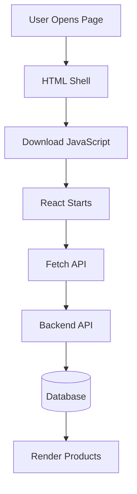
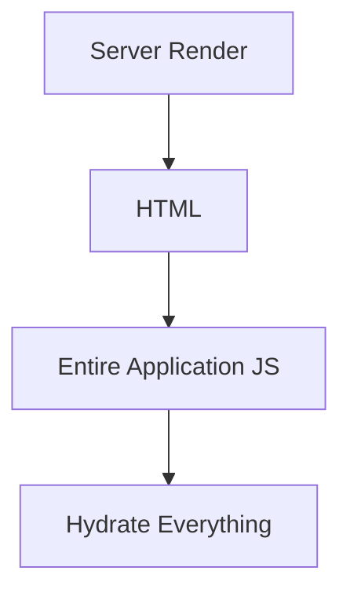
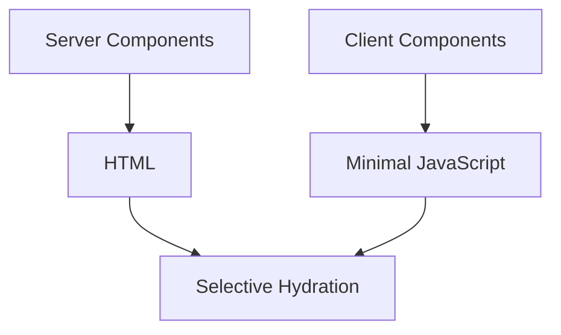

# Appendix J — Why Server Components Became the Default

> **One of the first questions many React developers ask when learning Next.js is:**
>
> > "Why did React invent Server Components?"
>
> After all, React already worked.
>
> We had:
>
> * Components
> * Hooks
> * State management
> * APIs
> * React Query
> * Redux
> * REST
> * GraphQL
>
> So why introduce an entirely new execution model?
>
> The answer is simple:
>
> > **Because the browser was doing far more work than it should have been doing.**

---

# The Original Promise Of React

When React became popular, its promise was revolutionary:

> Build your entire application in JavaScript.

The architecture looked like this:

```text
Browser
    ↓
React Application
    ↓
REST API
    ↓
Backend
    ↓
Database
```

This gave us:

✅ reusable components

✅ client-side routing

✅ interactive applications

✅ rich user experiences

For many years, this felt like the future.

---

# The Hidden Assumption

There was one assumption hidden inside SPA architecture:

> **The browser should become the application server.**

This meant the browser was responsible for:

* rendering,
* routing,
* state management,
* data fetching,
* caching,
* synchronization,
* validation,
* business logic.

The browser became a miniature operating system.

---

# Consider A Simple Product Page

Imagine displaying products.

Traditional React often looked like this:

```tsx
export default function Products() {
  const [products, setProducts] =
    useState([]);

  useEffect(() => {
    fetch("/api/products")
      .then(r => r.json())
      .then(setProducts);
  }, []);

  return (
    <>
      {products.map(product => (
        <div>{product.name}</div>
      ))}
    </>
  );
}
```

This became so common that developers stopped questioning it.

---

# But Look Carefully At What Happens



Notice something important.

The browser cannot display products until:

1. JavaScript downloads,
2. React initializes,
3. fetch executes,
4. the API responds.

This is called a:

> **network waterfall.**

---

# Example Timeline

Imagine:

```text
HTML Download:
100ms

JavaScript Download:
300ms

React Startup:
100ms

API Request:
200ms

Database:
100ms
```

Total:

```text
800ms
```

before users see actual content.

---

# But The Server Already Had The Data

This led React engineers to ask:

> Why are we waiting for the browser to fetch data that the server already has?

Instead of:

```text
Browser
     ↓
API
     ↓
Database
```

why not simply do:

```text
Server
     ↓
Database
     ↓
HTML
     ↓
Browser
```

---

# The First Solution: Server-Side Rendering

The industry tried:

```text
Browser
     ↓
Server
     ↓
Database
     ↓
HTML
```

This solved:

✅ SEO

✅ initial loading speed

✅ network waterfalls

But it introduced a new problem.

---

# The Hydration Problem

Consider this page:

```tsx
<Page>
  <Header />
  <Products />
  <Footer />
</Page>
```

Even though:

```text
Header
```

never changes,

and:

```text
Footer
```

never changes,

React still had to hydrate:

```text
Everything.
```

---

# Traditional SSR



The result:

```text
Fast HTML

Slow JavaScript
```

---

# React Engineers Noticed Something

Most components don't actually need JavaScript.

Consider:

```tsx
function ProductCard({
  product
}) {
  return (
    <>
      <h2>{product.name}</h2>
      <p>{product.price}</p>
    </>
  );
}
```

This component:

* doesn't use state,
* doesn't handle clicks,
* doesn't access browser APIs.

It simply:

> **reads data and produces UI.**

---

# The Big Question

The React team asked:

> Why send this component to the browser at all?

Why send:

```text
Component Code
        +
State Logic
        +
Hooks
        +
JavaScript Runtime
```

when the browser only needs:

```html
<h2>MacBook</h2>

<p>$2000</p>
```

---

# The Server Component Idea

Instead of:

```text
Server
     ↓
HTML
     ↓
Browser
     ↓
Hydrate Everything
```

what if we did:

```text
Server
     ↓
Execute Component
     ↓
Send Result
```

The browser would receive:

```text
Output

Not Code
```

---

# Example

Server Component:

```tsx
export default async function Products() {
  const products =
    await db.product.findMany();

  return (
    <>
      {products.map(product => (
        <div>
          {product.name}
        </div>
      ))}
    </>
  );
}
```

The browser receives:

```html
<div>MacBook</div>

<div>iPhone</div>
```

But the browser never receives:

```text
Products.tsx
```

at all.

---

# Why This Is Huge

Traditional React:

```text
Component
      ↓
Bundle
      ↓
Browser
      ↓
Hydrate
```

Server Components:

```text
Component
      ↓
Server Executes
      ↓
Send Result
```

No browser JavaScript required.

---

# The Impact On Bundle Size

Traditional SPA:

```text
React Runtime
       +
Component Code
       +
Hooks
       +
State
       +
Fetch Logic
       +
Cache Logic
       +
Validation Logic
```

Modern Server Components:

```text
HTML
```

plus only the JavaScript that truly requires interaction.

---

# Example

Consider an ecommerce homepage.

```text
Hero Banner
Product Grid
Reviews
FAQ
Footer
```

Question:

> Which parts need clicks?

Maybe only:

```text
Add To Cart Button
Search Bar
Shopping Cart
```

Everything else can remain on the server.

---

# Selective Hydration

This led to a completely new architecture.



Instead of:

```text
Hydrate Everything
```

we now:

```text
Hydrate Only Interactive Components
```

---

# Why Server Components Became The Default

The React team eventually realized:

Most components are:

```text
Read-only
```

Not:

```text
Interactive
```

Most components:

* display products,
* display articles,
* display profiles,
* display dashboards,
* display reports,
* display analytics.

They simply:

> **read data.**

And that's exactly what Server Components are optimized to do.

---

# The Performance Benefits

Server Components provide:

### Smaller Bundles

```text
Less JavaScript
```

---

### Faster Startup

```text
Less Hydration
```

---

### Better SEO

```text
HTML arrives immediately
```

---

### Better Security

```text
Database credentials
never leave the server
```

---

### Better Performance

```text
Database
      ↓
Server
      ↓
HTML
```

instead of:

```text
Database
      ↓
API
      ↓
Browser
      ↓
Render
```

---

# Why Beginners Initially Struggle

If you learned React during the SPA era, you learned:

```text
Browser First
```

Next.js teaches:

```text
Server First
```

That feels strange because you're not learning new APIs.

You're learning a new philosophy.

---

# The New Question

Old React asked:

> How do we get data into the browser?

Modern Next.js asks:

> Why does the browser need this data in the first place?

---

# The Most Important Realization

Server Components are not a replacement for React.

They are a recognition that:

> **Most UI was never supposed to execute in the browser.**

Interactive components still belong in the browser.

But non-interactive components belong where the data already lives:

```text
The server.
```

---

# Final Mental Model

```text
Traditional React:

Everything
     ↓
Browser


Modern Next.js:

Read
     ↓
Server

Interact
     ↓
Browser
```

Or even shorter:

> **The browser should execute only the code that actually requires a browser.**

That simple idea is why Server Components became the default in Next.js 16.
