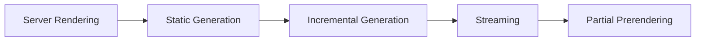
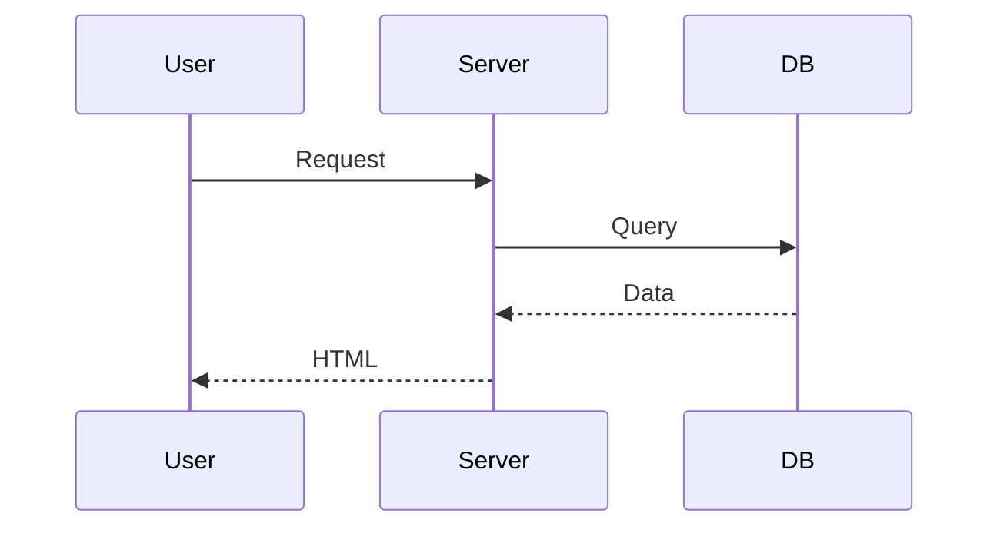
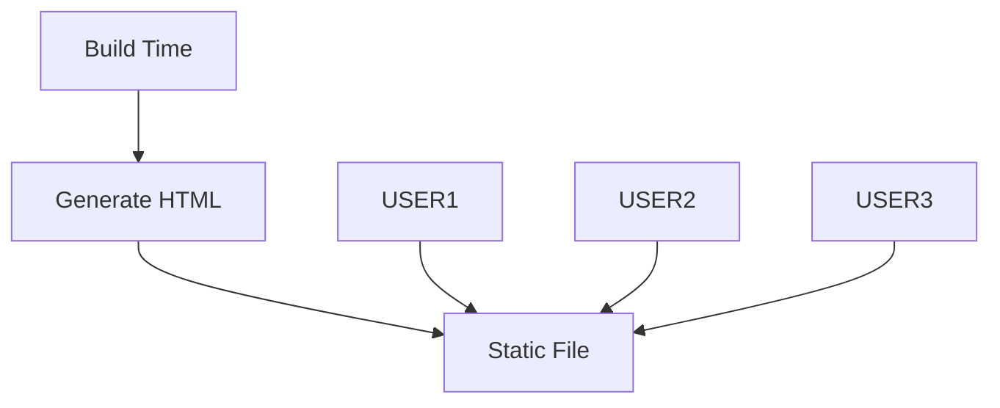
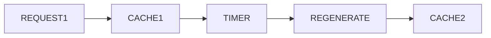
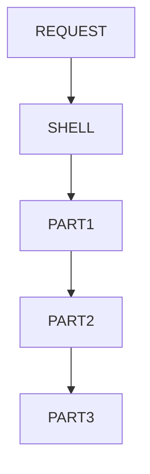
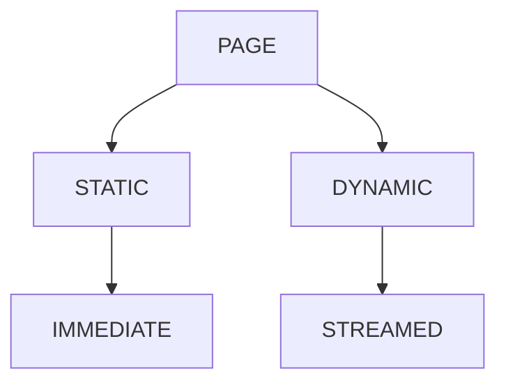

# Appendix K — Understanding Rendering Modes: SSR, SSG, ISR, Streaming, and Partial Prerendering

> **One of the biggest misconceptions about Next.js is that it has "many rendering modes."**
>
> In reality, Next.js has one goal:
>
> > **Generate HTML at the best possible time.**
>
> Everything else—SSR, SSG, ISR, Streaming, and Partial Prerendering—is simply a different answer to one question:
>
> > **"When should this HTML be generated?"**

---

# Why Beginners Get Confused

When developers first encounter Next.js, they often see terms like:

* SSR
* SSG
* ISR
* Dynamic Rendering
* Streaming
* Partial Prerendering (PPR)

and think:

> "Why does Next.js have six different rendering systems?"

The answer is:

> **It doesn't.**

Next.js has one rendering engine.

The only thing that changes is:

```text
WHEN rendering happens.
```

---

# The One Question That Explains Everything

Suppose you have a page:

```text
/products
```

Next.js asks:

```text
When should we create the HTML?
```

Possible answers:

```text
Before deployment?
At deployment?
At request time?
After deployment?
Partially now?
Partially later?
```

Every rendering strategy is simply a different answer.

---

# The Evolution of Rendering

The history of web rendering looks something like this:



Notice:

> Every step attempts to preserve the advantages of the previous step while removing its disadvantages.

---

# Rendering Strategy #1 — Server-Side Rendering (SSR)

The original web worked like this.

```text
Browser
    ↓
Request
    ↓
Server
    ↓
Generate HTML
    ↓
Return HTML
```

---

## Example

```tsx
export default async function Products() {
  const products =
    await db.product.findMany();

  return (
    <ProductsList
      products={products}
    />
  );
}
```

Suppose three users visit:

```text
User A
User B
User C
```

The server performs:

```text
Render #1
Render #2
Render #3
```

for every request.

---

## Visualization



---

## Advantages

✅ Always fresh

✅ Personalized

✅ Secure

✅ SEO-friendly

---

## Disadvantages

❌ Server work on every request

❌ Higher latency

❌ More expensive

---

# Rendering Strategy #2 — Static Site Generation (SSG)

Suppose your data rarely changes.

Example:

* blog posts
* documentation
* marketing pages

Instead of rendering every request:

```text
Request
   ↓
Render
```

we can do:

```text
Build
   ↓
Render Once
   ↓
Store HTML
```

---

## Example

```text
npm run build
       ↓
Generate HTML
       ↓
Store HTML
       ↓
Serve forever
```

---

## Visualization



---

## Advantages

✅ Extremely fast

✅ Cheap

✅ Great SEO

✅ Minimal server work

---

## Disadvantages

❌ Data becomes stale

---

# Example

Imagine:

```text
/blog/my-post
```

Generated once:

```text
July 1
```

A user visiting:

```text
July 15
```

still sees:

```text
July 1 data
```

unless you rebuild.

---

# Rendering Strategy #3 — Incremental Static Regeneration (ISR)

ISR solves this problem.

Instead of:

```text
Generate forever
```

we say:

```text
Generate and periodically refresh.
```

---

## Example

```tsx
export const revalidate = 60;
```

Meaning:

```text
Generate page
       ↓
Cache for 60 seconds
       ↓
Regenerate automatically
```

---

## Visualization



---

## Example Timeline

```text
10:00
Generate page

10:01
Serve cache

10:02
Serve cache

10:03
Regenerate

10:04
Serve new cache
```

---

## Advantages

✅ Nearly static speed

✅ Fresh data

✅ Lower server costs

---

## Typical Use Cases

* ecommerce catalogues
* news sites
* blogs
* documentation
* product listings

---

# Rendering Strategy #4 — Dynamic Rendering

Some pages cannot be cached.

Examples:

* dashboards
* admin panels
* user profiles
* shopping carts

Each user sees different data.

---

## Example

```tsx
import { cookies } from "next/headers";

export default async function Dashboard() {
  const session =
    await getSession();

  return (
    <DashboardView
      user={session}
    />
  );
}
```

---

## Visualization

```text
User A
    ↓
Render A

User B
    ↓
Render B

User C
    ↓
Render C
```

Every request gets its own render.

---

# Rendering Strategy #5 — Streaming

Traditional rendering waits for everything.

```text
Database A
Database B
Database C

WAIT
WAIT
WAIT

Send page
```

Streaming changes this.

---

## Traditional Rendering

```text
Request
    ↓
Fetch A
    ↓
Fetch B
    ↓
Fetch C
    ↓
Send HTML
```

---

## Streaming Rendering

```text
Request
    ↓
Send shell immediately
    ↓
Stream section A
    ↓
Stream section B
    ↓
Stream section C
```

---

## Visualization



---

## Example

Suppose a dashboard contains:

```text
Navbar
Profile
Orders
Analytics
```

The user might see:

```text
Navbar immediately

Profile after 100ms

Orders after 300ms

Analytics after 1 second
```

instead of waiting one second for everything.

---

# Rendering Strategy #6 — Partial Prerendering (PPR)

This is one of the newest ideas in Next.js.

The insight is:

> Most pages are partly static and partly dynamic.

Example:

```text
Homepage

✓ Header
✓ Hero
✓ Footer

✗ Recommendations
✗ User session
✗ Cart
```

Why not prerender the static parts and stream the dynamic parts?

---

## Visualization



---

## Example

```text
Immediately:

Header
Hero
Footer

Later:

User recommendations
Shopping cart
Notifications
```

---

# Comparing All Rendering Modes

| Strategy  | Generated When | Fresh     | Fast         | Server Cost |
| --------- | -------------- | --------- | ------------ | ----------- |
| SSR       | Every request  | Excellent | Moderate     | High        |
| SSG       | Build time     | Poor      | Excellent    | Minimal     |
| ISR       | Periodically   | Good      | Excellent    | Low         |
| Dynamic   | Every request  | Excellent | Moderate     | High        |
| Streaming | Incrementally  | Excellent | Excellent UX | Moderate    |
| PPR       | Mixed          | Excellent | Excellent    | Low         |

---

# The Big Realization

Most tutorials teach:

```text
SSR
SSG
ISR
PPR

are different systems.
```

But they're actually different answers to one question:

> **When should this HTML be generated?**

---

# The Next.js Mental Model

When building a page, ask:

```text
Can this page be reused?
```

If yes:

```text
Static
```

If partially:

```text
PPR
```

If occasionally updated:

```text
ISR
```

If user-specific:

```text
Dynamic
```

And whenever possible:

```text
Stream everything.
```

---

# Final Mental Model

```text
SSG
=
Generate once

ISR
=
Generate occasionally

SSR
=
Generate every request

Streaming
=
Generate incrementally

PPR
=
Generate static parts now,
generate dynamic parts later
```

Or even more simply:

> **Rendering modes aren't different technologies.**
>
> **They're different timing strategies for producing HTML.**
