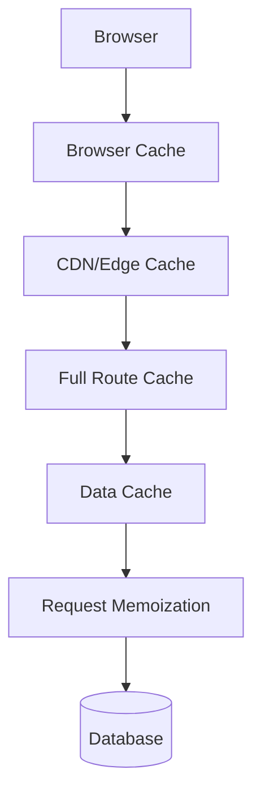
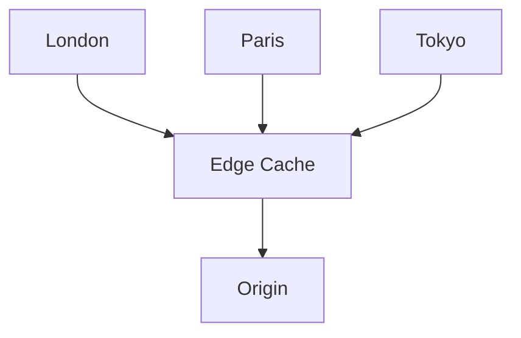
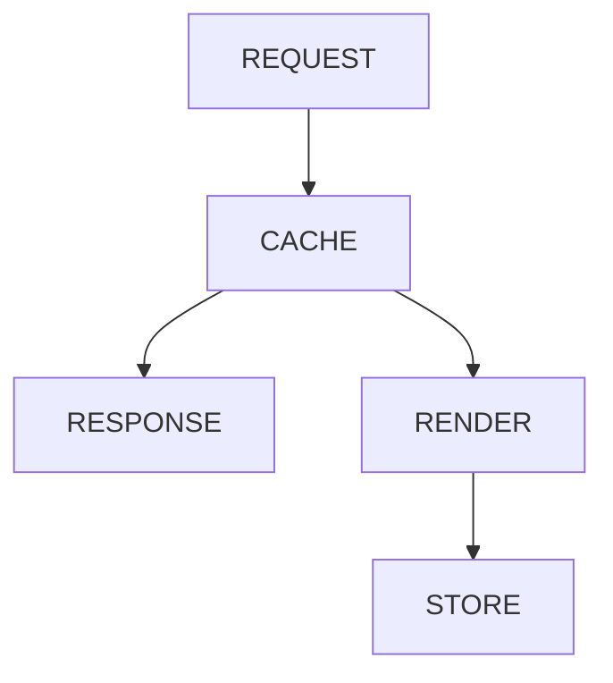
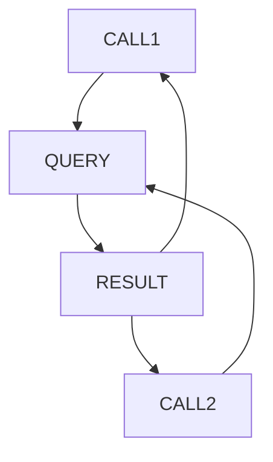
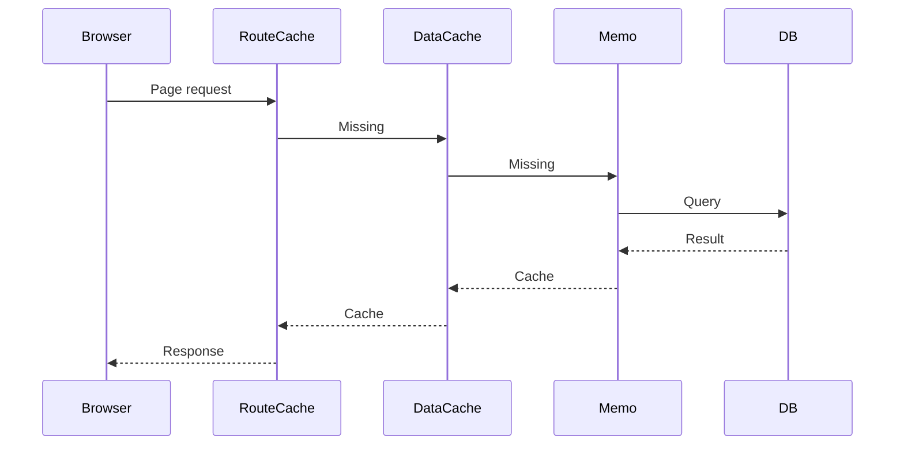
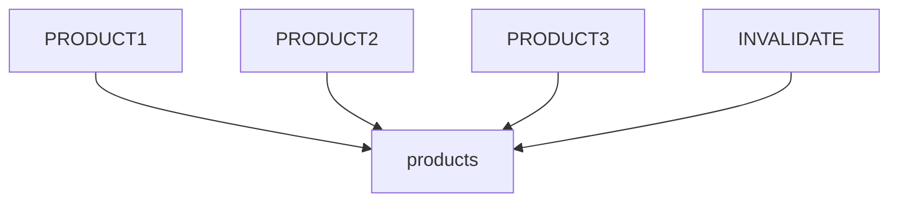

# Appendix L — Understanding Caching in Next.js 16: The Most Misunderstood Feature

> **If Server Components are the biggest conceptual shift in Next.js, caching is probably the biggest source of confusion.**

Many beginners ask questions like:

> * "Why isn't my data updating?"
> * "Why is this API call cached?"
> * "Why did changing one line suddenly make everything dynamic?"
> * "Where exactly is Next.js storing my data?"

The answer is that:

> **Next.js doesn't have one cache.**
>
> **It has several caches, each solving a different problem.**

Understanding these caches transforms Next.js from "magic" into engineering.

---

# The Biggest Misconception

Many developers imagine caching like this:

```text
Request
    ↓
Cache
    ↓
Database
```

Unfortunately, modern web applications don't work this way.

Next.js actually uses multiple layers of caching.

---

# The Complete Cache Stack



Notice:

> There isn't one cache.
>
> There are multiple caches stacked on top of each other.

---

# Why Multiple Caches Exist

Different problems require different solutions.

| Problem                               | Solution            |
| ------------------------------------- | ------------------- |
| Avoid duplicate browser downloads     | Browser Cache       |
| Reduce global latency                 | CDN Cache           |
| Avoid rerendering pages               | Full Route Cache    |
| Avoid refetching data                 | Data Cache          |
| Avoid duplicate queries during render | Request Memoization |

Each cache exists because it solves a different bottleneck.

---

# Cache #1 — Browser Cache

The browser already caches many things.

For example:

```text
✓ JavaScript
✓ CSS
✓ Images
✓ Fonts
✓ Static assets
```

---

## Example

First visit:

```text
Browser
    ↓
Download app.js
```

Second visit:

```text
Browser
    ↓
Use local copy
```

---

## Visualization


---

# Cache #2 — CDN / Edge Cache

Suppose your server is located in:

```text
Singapore
```

but your user is in:

```text
London
```

Without caching:

```text
London
    ↓
Singapore
    ↓
London
```

Every request travels across the world.

Instead:

```text
London
    ↓
London CDN
```

---

## Visualization



---

## Purpose

CDN caching optimizes:

```text
Distance
```

not rendering.

---

# Cache #3 — Full Route Cache

Suppose you have:

```text
/blog
```

Server Components produce:

```text
HTML
+
RSC Payload
```

Instead of regenerating every request:

```text
Request
    ↓
Render
    ↓
Return
```

Next.js can store the result.

---

## Visualization



---

## Example

First request:

```text
User
   ↓
Render page
   ↓
Store result
```

Second request:

```text
User
   ↓
Serve cached result
```

No rendering occurs.

---

# Cache #4 — Data Cache

Suppose a Server Component executes:

```tsx
const products =
  await fetch(
    "https://api.shop.com/products"
  );
```

Next.js can cache the data itself.

---

## Example

Without data cache:

```text
Request 1
   ↓
API

Request 2
   ↓
API

Request 3
   ↓
API
```

With data cache:

```text
Request 1
   ↓
API
   ↓
Cache

Request 2
   ↓
Cache

Request 3
   ↓
Cache
```

---

## Visualization


---

# Cache #5 — Request Memoization

This cache surprises many developers.

Suppose you accidentally do this:

```tsx
const users =
  await getUsers();

const stats =
  await getUsers();
```

Normally:

```text
Database Query
Database Query
```

twice.

But React notices:

```text
Same request
Same render
```

and performs:

```text
Database Query
       ↓
Reuse result
```

---

## Visualization



---

# Example: What Actually Happens?

Suppose a user visits:

```text
/products
```

The request flow becomes:



---

# Dynamic Rendering Turns Off Some Caches

Certain APIs force dynamic rendering.

Examples:

```tsx
cookies()

headers()

searchParams
```

Once these appear:

```text
Static Route Cache
      ↓
Disabled
```

because the result now depends on the individual user.

---

## Example

This page:

```tsx
export default async function Page() {
  const products =
    await getProducts();

  return <Products />;
}
```

may be cached.

But:

```tsx
export default async function Page() {
  const cookie =
    cookies();

  return <Dashboard />;
}
```

cannot be.

---

# Revalidation

Sometimes we want:

```text
Fast
+
Fresh
```

This is where revalidation enters.

Example:

```tsx
export const revalidate = 60;
```

means:

```text
Cache page
      ↓
Keep for 60 seconds
      ↓
Regenerate
```

---

# Manual Revalidation

Server Actions can invalidate caches.

Example:

```tsx
await savePost();

revalidatePath("/posts");
```

---

## Visualization

```text
Save Post
     ↓
Invalidate Cache
     ↓
Next Request
     ↓
Regenerate
```

---

# Tag-Based Revalidation

Even more powerful:

```tsx
fetch(url, {
  next: {
    tags: ["products"]
  }
});
```

Later:

```tsx
revalidateTag("products");
```

---

## Visualization



---

# The Beginner Rule

When confused, ask:

> **What exactly am I caching?**

Possible answers:

```text
HTML?

RSC payload?

Data?

Network request?

Database query?

Browser assets?
```

Different answers imply different caches.

---

# The Architect's Mental Model

Think of caching as a pyramid.

```text
Browser Cache
        ↓
CDN Cache
        ↓
Route Cache
        ↓
Data Cache
        ↓
Request Memoization
        ↓
Database
```

Each layer:

* protects the layer below,
* reduces work,
* improves performance.

---

# Final Mental Model

Most tutorials teach:

```text
Cache
```

But Next.js actually teaches:

```text
Caches
```

And perhaps the most important realization is:

> **Caching is not an optimization added after the application works.**
>
> **Caching is part of the architecture of the application itself.**
