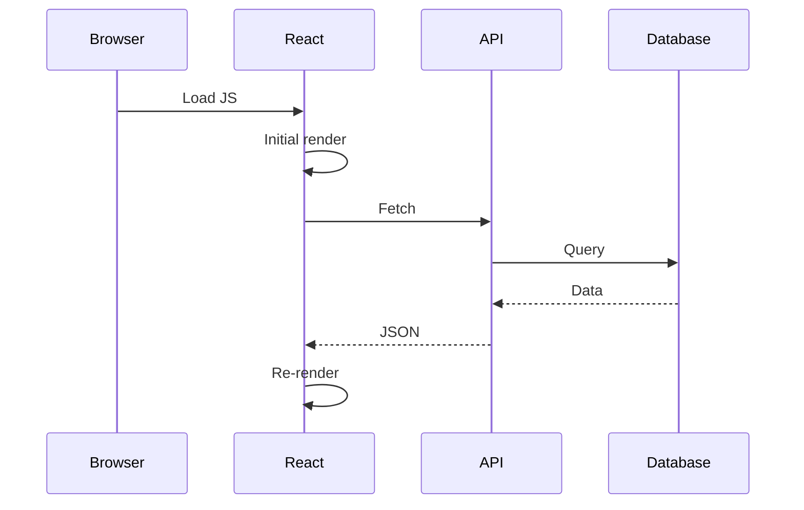
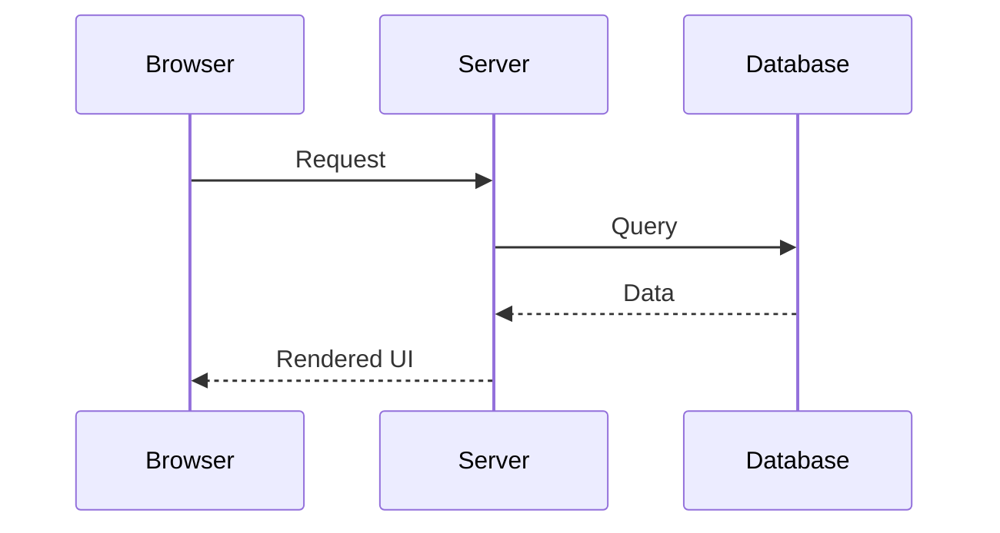
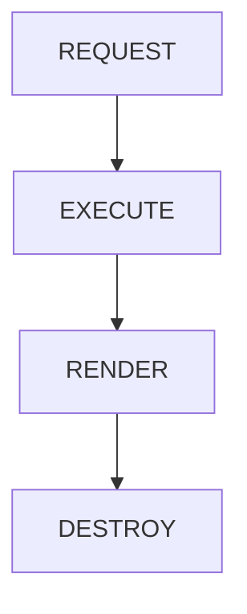
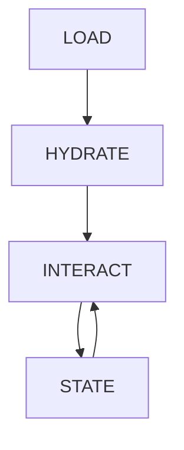
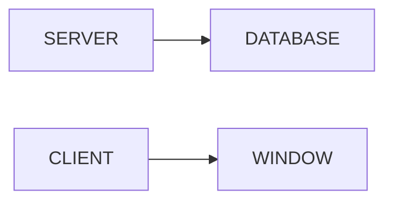

# Appendix M — Why React Hooks Feel Different in Next.js: Understanding the Server-First Mental Model

> **One of the most confusing experiences for React developers learning Next.js is discovering that many familiar React patterns suddenly feel wrong.**
>
> Questions like:
>
> * "Why don't I use `useEffect` for data fetching anymore?"
> * "Why can't I use `useState` here?"
> * "Why does `window` suddenly break?"
> * "Why do I need `'use client'`?"
>
> aren't really questions about React.
>
> They're questions about **execution environments**.

---

# The Big Surprise

Most developers learned React through the Single Page Application (SPA) model.

The mental model looked like this:

```text
Browser
    ↓
Load JavaScript
    ↓
Render React
    ↓
Fetch Data
    ↓
Update UI
```

Everything happened:

```text
Inside the browser
```

---

# Traditional React Thinking

Suppose we build a product page.

The classic React approach looks like this:

```tsx
function Products() {
  const [products, setProducts] =
    useState([]);

  useEffect(() => {
    fetch("/api/products")
      .then(r => r.json())
      .then(setProducts);
  }, []);

  return (
    <ProductsList
      products={products}
    />
  );
}
```

This probably feels normal.

---

## But Look Carefully

What actually happens?



Notice:

The user experiences:

```text
Empty page
      ↓
Loading state
      ↓
Data arrives
      ↓
UI updates
```

---

# Why Did React Developers Accept This?

Because for years, there was no alternative.

The browser was the application runtime.

Therefore:

```text
Render
    ↓
Fetch
    ↓
Render Again
```

became normal.

---

# Then Server Components Arrived

Server Components ask a simple question:

> Why fetch after rendering when you can fetch before rendering?

Instead of:

```text
Render
   ↓
Fetch
   ↓
Render Again
```

we can do:

```text
Fetch
   ↓
Render
```

---

## Example

```tsx
export default async function Products() {
  const products =
    await db.product.findMany();

  return (
    <ProductsList
      products={products}
    />
  );
}
```

No:

```tsx
useState()

useEffect()

loading

error

fetch()
```

---

## What Actually Happens



The user receives:

```text
Finished UI
```

instead of:

```text
Empty UI
    ↓
Loading
    ↓
Finished UI
```

---

# The Mental Model Shift

React taught us:

> Render first.
>
> Fetch later.

Next.js teaches:

> Fetch first.
>
> Render once.

---

# Why `useEffect` Seems To Disappear

Many beginners think:

> Next.js removed `useEffect`.

Not true.

`useEffect` still exists.

But many of its historical jobs disappear.

---

# Traditional useEffect Jobs

Developers often used `useEffect` for:

```text
✓ Data fetching
✓ API calls
✓ Loading state
✓ Synchronization
✓ Initial requests
✓ Cache updates
```

Example:

```tsx
useEffect(() => {
  fetchProducts();
}, []);
```

---

# In Next.js

Most of these become:

```tsx
const products =
  await getProducts();
```

The effect simply isn't needed.

---

# What useEffect Is Actually For

`useEffect` was never intended to be a data-fetching API.

It was designed for:

> Synchronizing React with external systems.

Examples:

```text
✓ Timers
✓ Browser events
✓ WebSockets
✓ Animations
✓ DOM APIs
✓ Third-party libraries
```

---

## Good Example

```tsx
"use client";

useEffect(() => {
  const id =
    setInterval(update, 1000);

  return () => {
    clearInterval(id);
  };
}, []);
```

---

## Another Good Example

```tsx
"use client";

useEffect(() => {
  window.addEventListener(
    "resize",
    handleResize
  );

  return () =>
    window.removeEventListener(
      "resize",
      handleResize
    );
}, []);
```

---

# Why `useState` Sometimes Breaks

Consider:

```tsx
export default function Page() {
  const [count, setCount] =
    useState(0);

  return <div>{count}</div>;
}
```

Error.

Why?

Because this component executes on:

```text
Server
```

not:

```text
Browser
```

---

# Server Components Cannot Maintain Browser State

A Server Component executes like this:

```text
Request arrives
       ↓
Execute component
       ↓
Generate UI
       ↓
Destroy component
```

---

## Visualization



There is nowhere to store:

```text
count = 5
```

between requests.

---

# Client Components Stay Alive

Client Components execute differently.

```text
Load
   ↓
Hydrate
   ↓
Remain alive
   ↓
Handle interactions
```

---

## Visualization



This persistent lifecycle enables:

```tsx
useState()

useReducer()

useEffect()

useRef()
```

---

# Why `window` Suddenly Breaks

This surprises almost everyone.

Example:

```tsx
console.log(window.location);
```

Error.

Why?

Because:

```text
window
```

exists only in:

```text
Browser
```

and your component currently runs in:

```text
Server
```

---

## Visualization



---

# Why `'use client'` Exists

`'use client'` is often misunderstood.

It does not mean:

> "Turn React on."

React already exists.

Instead it means:

> **Execute this component inside the browser runtime.**

Example:

```tsx
"use client";

export default function Counter() {
  const [count, setCount] =
    useState(0);

  return (
    <button
      onClick={() =>
        setCount(count + 1)
      }
    >
      {count}
    </button>
  );
}
```

---

# Comparing The Two Mental Models

## Traditional React SPA

```text
Browser
    ↓
Load JS
    ↓
Render
    ↓
Fetch
    ↓
Render Again
```

---

## Next.js Server-First

```text
Server
    ↓
Fetch
    ↓
Render
    ↓
Send UI
    ↓
Hydrate only if needed
```

---

# The Real Reason Hooks Feel Different

The problem isn't:

```text
React changed.
```

The problem is:

```text
The execution environment changed.
```

---

# The Rule That Explains Everything

When writing React inside Next.js, ask:

> Where is this component executing?

If the answer is:

```text
Server
```

you can use:

```text
✓ databases
✓ secrets
✓ files
✓ APIs
```

but not:

```text
✗ useState
✗ useEffect
✗ window
✗ document
✗ browser events
```

---

If the answer is:

```text
Browser
```

you can use:

```text
✓ useState
✓ useEffect
✓ window
✓ document
✓ events
```

but not:

```text
✗ database access
✗ secrets
✗ filesystem
```

---

# The Architect's Mental Model

React Hooks didn't become obsolete.

They became specialized.

```text
Server Components
        ↓
Fetch
        ↓
Render

Client Components
        ↓
State
        ↓
Effects
        ↓
Interaction
```

---

# Final Mental Model

Most developers think:

> **Next.js changed React.**

But the reality is:

> **Next.js changed where React executes.**

And once you understand that, the rules become surprisingly simple:

> **Server Components read.**
>
> **Client Components interact.**
>
> **Hooks belong where interaction lives.**
