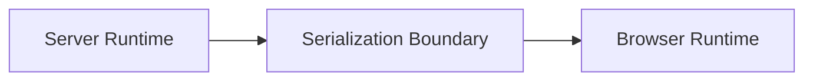
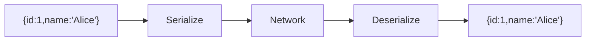
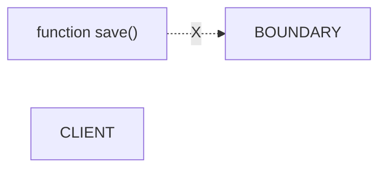
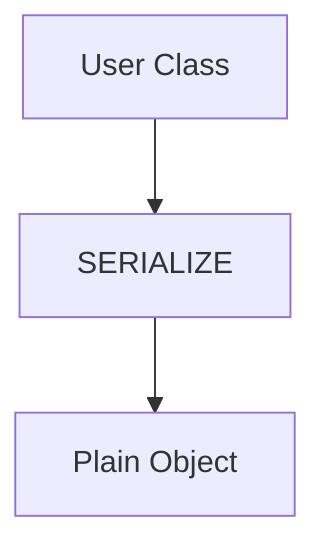
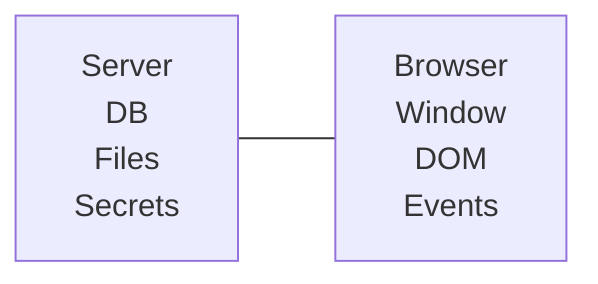
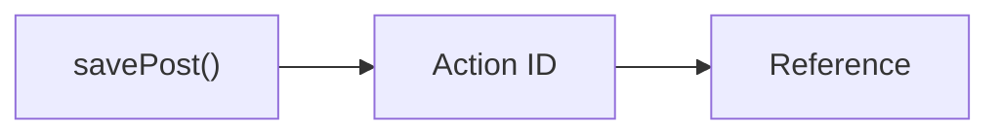

# Appendix N — Understanding the Server/Browser Boundary: The Invisible Wall That Explains Everything in Next.js

> **If there is one concept that separates beginner Next.js developers from experienced Next.js architects, it is understanding the Server/Browser boundary.**
>
> Most confusing errors in Next.js ultimately come from crossing this boundary incorrectly.

For example:

* "Why can't I pass a function as a prop?"
* "Why can't I use `window`?"
* "Why can't I send a database connection?"
* "Why do Server Actions work?"
* "Why do classes sometimes break?"
* "Why does `'use client'` exist?"

The answer to all of these questions is the same:

> **Server and browser are two completely different execution environments separated by a serialization boundary.**

---

# The Mental Model We Learned From React SPAs

Traditional React taught us to think like this:

```text
Application
      ↓
React Components
      ↓
Browser
```

Everything existed in one place.

```text
Variables
Functions
Objects
Classes
State
Events
```

could all freely interact.

---

# Next.js Introduces A Boundary

Next.js changes this.

Your application now looks like this:



This boundary changes everything.

---

# The Server And Browser Are Different Computers

This fact sounds obvious.

But many developers unconsciously forget it.

Imagine:

```text
Server:
Singapore

Browser:
London
```

These are literally two different machines.

```text
Different memory
Different CPU
Different filesystem
Different process
Different runtime
```

There is no shared memory.

---

# Example

Suppose your Server Component executes:

```tsx
const user = {
  id: 1,
  name: "Alice"
};
```

The browser does NOT receive:

```text
The object
```

It receives:

```text
A serialized representation
```

---

# Visualizing Serialization



Notice:

```text
Original object
       ≠
New object
```

The browser reconstructs a copy.

---

# What Can Cross The Boundary?

Simple data types cross easily.

---

## Strings

```tsx
<Product
  name="Laptop"
/>
```

---

## Numbers

```tsx
<Product
  price={100}
/>
```

---

## Arrays

```tsx
<ProductList
  items={products}
/>
```

---

## Plain Objects

```tsx
<UserCard
  user={user}
/>
```

---

# What Cannot Cross The Boundary?

Many JavaScript values cannot be serialized.

---

## Functions

```tsx
function save() {}

<ClientComponent
  onSave={save}
/>
```

Error.

Why?

Because:

```text
Functions
cannot be serialized.
```

---

## Visualization



---

## Database Connections

```tsx
const db =
  new PrismaClient();

<Client db={db} />
```

Impossible.

Why?

Because:

```text
Database connection
=
Open server resource
```

The browser cannot recreate it.

---

## File Handles

```tsx
const file =
  fs.readFileSync();

<Client file={file} />
```

Impossible.

---

## Network Sockets

```tsx
socket.connect();
```

Cannot cross.

---

## Closures

Suppose:

```tsx
const secret =
  "password";

function login() {
  console.log(secret);
}
```

The closure contains:

```text
Memory references
```

which cannot be serialized.

---

# Why Classes Sometimes Break

This surprises many developers.

Suppose:

```tsx
class User {
  constructor(name) {
    this.name = name;
  }

  greet() {
    return "Hello";
  }
}
```

Server:

```tsx
const user =
  new User("Alice");
```

After serialization:

```tsx
{
  name: "Alice"
}
```

becomes:

```tsx
{
  name: "Alice"
}
```

---

## What Disappeared?

```text
❌ prototype
❌ methods
❌ inheritance
❌ behavior
```

Only the data survives.

---

## Visualization



---

# Why `window` Doesn't Exist

This error happens constantly.

```tsx
console.log(window.location);
```

fails because:

```text
Server Runtime
```

contains:

```text
✓ filesystem
✓ database
✓ environment variables
```

but:

```text
✗ window
✗ document
✗ localStorage
```

---

# Browser Runtime

Conversely:

```text
Browser Runtime
```

contains:

```text
✓ window
✓ document
✓ events
✓ localStorage
```

but:

```text
✗ filesystem
✗ database
✗ secrets
```

---

## Visualization



---

# Why Props Must Be Serializable

Suppose:

```tsx
export default function Page() {
  return (
    <ClientComponent
      title="Hello"
      count={10}
    />
  );
}
```

Works.

Because:

```text
String
Number
```

serialize perfectly.

---

But:

```tsx
export default function Page() {
  function save() {}

  return (
    <ClientComponent
      save={save}
    />
  );
}
```

fails.

Because:

```text
Functions
cannot cross.
```

---

# Then Why Do Server Actions Work?

This is the fascinating part.

Consider:

```tsx
"use server";

export async function savePost() {
  await db.post.create();
}
```

Then:

```tsx
<button
  action={savePost}
>
```

works.

Why?

Because the browser never receives the function.

---

## What Actually Crosses

Instead of sending:

```text
Function
```

Next.js sends:

```text
Function ID
```

---

## Visualization



Later:

```text
Browser
    ↓
Send Action ID
    ↓
Server
    ↓
Execute Function
```

---

# Server Actions Are RPC Calls

Server Actions effectively behave like:

```text
Remote Procedure Calls
```

---

## Visualization

```mermaid
sequenceDiagram

    participant Browser

    participant Server

    Browser->>Server:
    Action ID + Data

    Server->>Server:
    Execute function

    Server-->>Browser:
    Result
```

---

# The Boundary Explains Everything

Many mysterious Next.js rules suddenly become obvious.

---

## Why Can't I Use `useState`?

Because:

```text
State
=
Long-lived browser memory
```

---

## Why Can't I Use `window`?

Because:

```text
window
=
Browser runtime only
```

---

## Why Can't I Access Database In Client Components?

Because:

```text
Database
=
Server runtime only
```

---

## Why Can't I Pass Functions?

Because:

```text
Functions
cannot serialize
```

---

## Why Do Server Actions Work?

Because:

```text
Function
       ↓
Reference
       ↓
RPC
```

---

# The Architect's Mental Model

Whenever you write Next.js code, imagine a wall.

```text
SERVER
═══════════════════
Database
Files
Secrets
Functions
Classes

-------------------
SERIALIZATION WALL
-------------------

Strings
Numbers
Arrays
Objects

═══════════════════
BROWSER

Window
Events
DOM
State
Hooks
```

---

# The One Question To Always Ask

Before writing code, ask:

> **Can this value cross the server/browser boundary?**

If the answer is:

```text
Yes
```

you're safe.

If the answer is:

```text
No
```

you probably need:

* a Client Component,
* a Server Component,
* a Server Action,
* or a Route Handler.

---

# Final Mental Model

Most developers think Next.js errors are caused by:

> "weird framework rules."

In reality:

> **Next.js is simply enforcing the laws of distributed systems.**

And perhaps the most important realization in the entire course is:

> **A Next.js application is not one program.**
>
> **It is multiple programs executing in different environments and communicating across a network boundary.**
