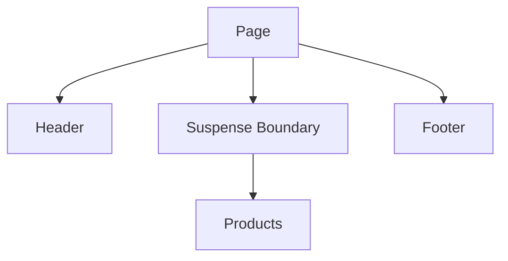
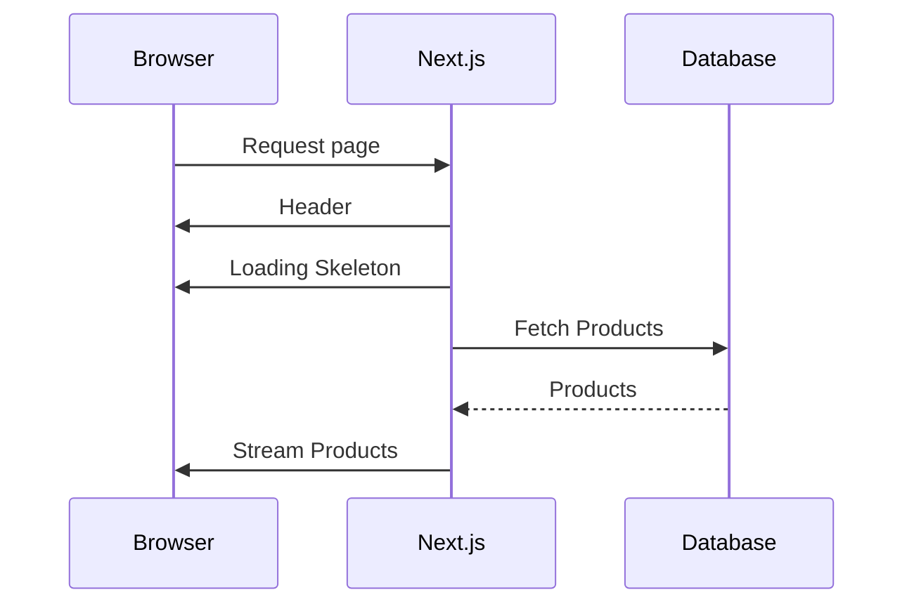
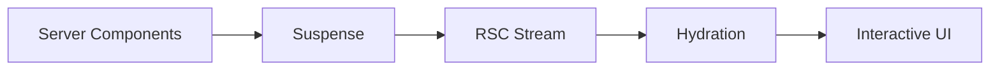

# Appendix O — Understanding Streaming: How Next.js Sends UI Before Your Application Finishes

> **One of the most magical things beginners encounter in Next.js is this:**
>
> *"How can part of my page appear before the rest of the page has finished loading?"*
>
> The answer is:
>
> > **Next.js doesn't wait for your entire application to finish.**
>
> Instead:
>
> > **Next.js streams your UI incrementally.**

---

# The Traditional Mental Model

Most developers imagine web servers working like this:

```text
Browser
    ↓
Request
    ↓
Server builds everything
    ↓
Server sends everything
    ↓
Browser displays everything
```

This is called:

```text
Blocking Rendering
```

The browser receives nothing until the server has completed all work.

---

## Example

Imagine building a dashboard:

```tsx
export default async function Dashboard() {
  const user = await getUser();
  const analytics = await getAnalytics();
  const reports = await getReports();

  return (
    <>
      <Profile user={user} />
      <Analytics data={analytics} />
      <Reports reports={reports} />
    </>
  );
}
```

Suppose:

| Operation | Time   |
| --------- | ------ |
| User      | 100ms  |
| Analytics | 500ms  |
| Reports   | 3000ms |

Traditional rendering becomes:

```text
Request
   ↓
Wait 100ms
   ↓
Wait 500ms
   ↓
Wait 3000ms
   ↓
Send HTML
```

Total:

```text
3600ms
```

The user sees:

```text
Nothing.
```

---

# Why Waiting Is Expensive

Imagine going to a restaurant.

The waiter says:

> "We'll only serve your food when every dish for every customer is finished."

That sounds ridiculous.

Instead, restaurants work like this:

```text
Dish ready?
     ↓
Serve it immediately.
```

Streaming applies exactly the same principle.

---

# Enter React Streaming

React Server Components introduced a different approach.

Instead of:

```text
Build everything
      ↓
Send everything
```

React now does:

```text
Build something
      ↓
Send something
      ↓
Build more
      ↓
Send more
      ↓
Repeat
```

---

# Visualizing Streaming

Without streaming:

```text
Request
   ↓
████████████████████
   ↓
Entire Page Appears
```

With streaming:

```text
Request
   ↓
██
   ↓
Header Appears

      ↓
████
      ↓
Sidebar Appears

           ↓
██████
           ↓
Content Appears
```

The page gradually materializes.

---

# A Simple Example

Consider this page:

```tsx
export default function Page() {
  return (
    <>
      <Header />

      <Suspense fallback={<LoadingProducts />}>
        <Products />
      </Suspense>

      <Footer />
    </>
  );
}
```

Suppose:

```text
Header      = 50ms
Products    = 3000ms
Footer      = 20ms
```

Traditional SSR:

```text
Wait 3070ms
       ↓
Render everything
```

Streaming:

```text
50ms:
Header appears

70ms:
Footer appears

3000ms:
Products appear
```

The user immediately sees something useful.

---

# How Suspense Enables Streaming

The magic happens through:

```tsx
<Suspense>
```

Think of Suspense as saying:

> "Don't block the rest of the application waiting for this component."

Example:

```tsx
<Suspense fallback={<Loading />}>
    <ExpensiveComponent />
</Suspense>
```

This tells React:

```text
If ExpensiveComponent
isn't ready yet:

show Loading

and continue rendering
everything else.
```

---

# Visualizing Suspense



Execution:

```text
Header
   ↓
Footer
   ↓
Loading UI
   ↓
Products later
```

---

# What Actually Gets Sent?

Suppose Products requires:

```tsx
await db.products.findMany();
```

Initially the browser receives:

```html
<header>Store</header>

<div>Loading...</div>

<footer>Copyright</footer>
```

Later React streams:

```html
<div>
    Product A
    Product B
    Product C
</div>
```

The browser patches the page automatically.

---

# Streaming With Server Components

This is where Server Components become powerful.

Server Components can fetch data directly:

```tsx
async function Products() {
  const products =
    await db.product.findMany();

  return (
    <>
      {products.map(product =>
        <div>{product.name}</div>
      )}
    </>
  );
}
```

Instead of waiting:

```text
Entire Page
        ↓
Database
        ↓
Render
```

React does:

```text
Render page
      ↓
Send page
      ↓
Continue fetching
      ↓
Inject products later
```

---

# Visual Timeline



Notice:

> The browser never waits.

---

# Loading.tsx Is Streaming

Many beginners think:

```text
loading.tsx
```

is simply a loading spinner.

It isn't.

It is actually:

> **A streaming boundary.**

Example:

```text
app/dashboard/loading.tsx
```

```tsx
export default function Loading() {
  return <DashboardSkeleton />;
}
```

When the page loads:

```text
Show loading.tsx immediately
          ↓
Stream real page later
```

---

# Why Streaming Feels Faster

Suppose two pages both require:

```text
3000ms
```

Page A:

```text
Nothing for 3000ms.
```

Page B:

```text
100ms:
Navbar

150ms:
Sidebar

200ms:
Skeleton

3000ms:
Real content
```

Technically:

```text
Same speed.
```

Perceptually:

```text
Page B feels dramatically faster.
```

Because humans measure:

> **progress**

more than:

> **absolute time**

---

# Streaming Creates Progressive Rendering

Instead of:

```text
Wait
Wait
Wait
Everything
```

Users experience:

```text
Something
More
More
Complete
```

---

# The Bigger Picture

Streaming only works because:

| Feature           | Responsibility      |
| ----------------- | ------------------- |
| Server Components | Generate UI         |
| Suspense          | Create boundaries   |
| RSC Protocol      | Stream payloads     |
| Hydration         | Attach interactions |
| Client Components | Become interactive  |

Together:



---

# Why Streaming Changed Web Development

Traditional SSR:

```text
Render Everything
      ↓
Send Everything
      ↓
Hydrate Everything
```

Modern Next.js:

```text
Render Some
      ↓
Send Some
      ↓
Hydrate Some
      ↓
Stream More
      ↓
Hydrate More
```

The browser progressively receives your application.

---

# Final Mental Model

Think of streaming like watching a movie online.

You don't wait:

```text
2 hours
```

for the entire movie to download.

Instead:

```text
Download a little
       ↓
Watch a little
       ↓
Download more
       ↓
Watch more
```

Next.js treats UI exactly the same way.

And that's why modern applications feel instant even when they're not.

> **Server Components generate UI.**
>
> **Suspense creates boundaries.**
>
> **Streaming delivers UI progressively.**
>
> **Hydration activates interactions.**
>
> **The browser never waits for everything.**
