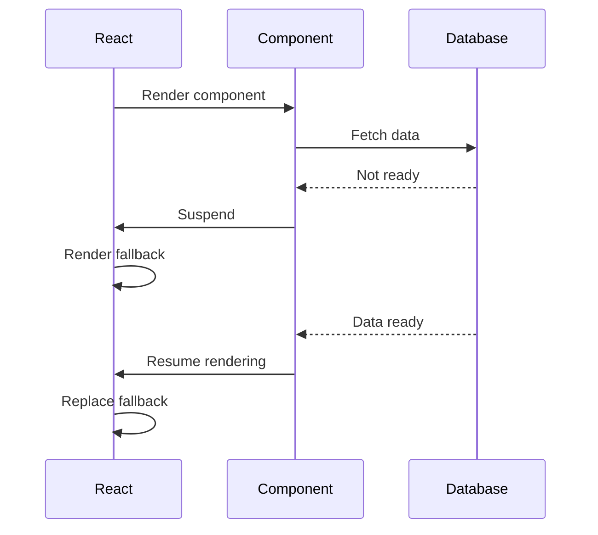
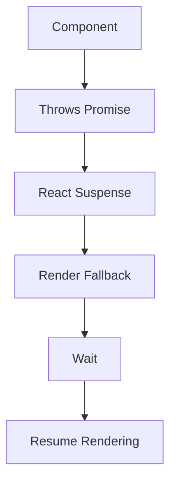
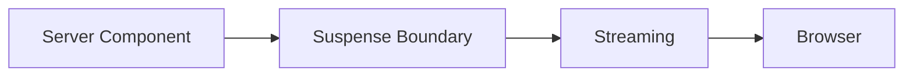
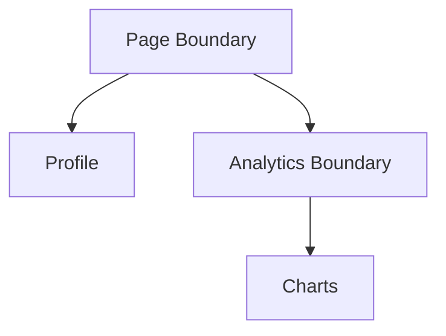
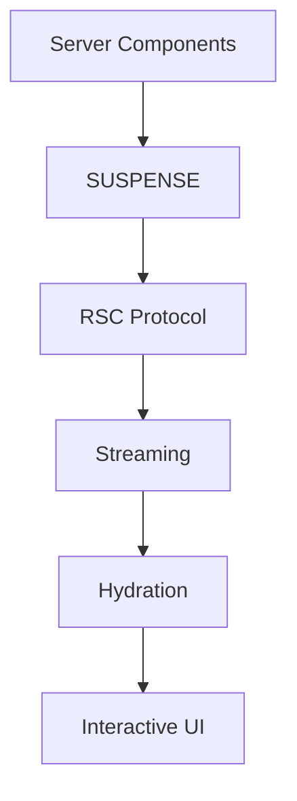

# Appendix P — Understanding Suspense in Next.js 16: The Feature That Makes Everything Else Possible

> **If there is one feature in React and Next.js that beginners find the most mysterious, it is probably `Suspense`.**
>
> Questions like:
>
> * "Is Suspense just a loading spinner?"
> * "Why does Next.js use Suspense everywhere?"
> * "What does `loading.tsx` actually do?"
> * "Why can't Server Components work without Suspense?"
>
> are extremely common.
>
> The short answer is:
>
> > **Suspense is not a loading component.**
>
> Instead:
>
> > **Suspense is React's mechanism for coordinating asynchronous rendering.**
>
> And modern Next.js is built almost entirely on top of this idea.

---

# Why Is It Called "Suspense"?

Before learning how Suspense works, we should first understand why React chose this particular name.

The word **suspend** means:

> **to temporarily pause something with the intention of continuing it later.**

Examples:

| Situation         | Meaning of Suspend                 |
| ----------------- | ---------------------------------- |
| Suspend a meeting | Pause the meeting and resume later |
| Suspend a student | Temporarily stop participation     |
| Suspend a movie   | Pause playback and continue later  |
| React Suspense    | Pause rendering and continue later |

This is exactly what React does.

A component can effectively tell React:

> **"I cannot finish rendering right now. Please pause me, continue rendering everything else, and come back later."**

This is why the feature is called:

> **Suspense.**

---

# The Series Context

Throughout this tutorial series, we've learned that modern Next.js applications are built around four execution environments:

| Environment       | Responsibility |
| ----------------- | -------------- |
| Server Components | Read           |
| Client Components | Interact       |
| Server Actions    | Mutate         |
| Route Handlers    | Communicate    |

But there is a hidden system underneath all four environments.

That system is:

```text
Suspense
```

In fact, modern Next.js architecture is closer to:

```text
Server Components
        ↓
Suspense
        ↓
Streaming
        ↓
RSC Protocol
        ↓
Hydration
        ↓
Interactive UI
```

Without Suspense:

* Server Components cannot pause,
* Streaming cannot occur,
* `loading.tsx` cannot exist,
* Progressive rendering becomes impossible.

---

# The Traditional Mental Model

Most developers learn asynchronous programming like this:

```javascript
const data = await fetchData();

render(data);
```

The mental model is:

```text
Wait
   ↓
Get Data
   ↓
Render
```

Or:

```text
Blocking Execution
```

This works.

Until applications become large.

---

# Example: Traditional Page Rendering

Imagine a dashboard page:

```tsx
export default async function Dashboard() {
  const profile = await getProfile();
  const analytics = await getAnalytics();
  const reports = await getReports();

  return (
    <>
      <Profile data={profile} />
      <Analytics data={analytics} />
      <Reports data={reports} />
    </>
  );
}
```

Suppose:

| Query     | Time   |
| --------- | ------ |
| Profile   | 50ms   |
| Analytics | 500ms  |
| Reports   | 3000ms |

The rendering timeline becomes:

```text
Wait 50ms
     ↓
Wait 500ms
     ↓
Wait 3000ms
     ↓
Render everything
```

Total:

```text
3550ms
```

The user sees:

```text
Nothing.
```

---

# Humans Hate Waiting

Imagine going to a restaurant.

The waiter says:

> "We'll bring your food only after every customer in the restaurant has finished cooking."

That sounds ridiculous.

Instead, restaurants work like this:

```text
Food ready?
      ↓
Serve immediately
```

React Suspense applies exactly the same principle.

---

# The Big Idea Behind Suspense

Suspense changes the question from:

> "How do we wait?"

to:

> **"How do we continue while waiting?"**

Instead of:

```text
Wait
   ↓
Render
```

React now does:

```text
Render
   ↓
Pause
   ↓
Continue elsewhere
   ↓
Resume later
```

Think of Suspense as:

> **a pause button, not a loading spinner.**

---

# The Movie Analogy

Traditional rendering behaves like this:

```text
Download entire movie
          ↓
Start watching
```

Suspense behaves like this:

```text
Download first scene
          ↓
Start watching
          ↓
Download more scenes
          ↓
Continue watching
```

The movie never stops.

The missing pieces simply arrive later.

---

# Your First Suspense Boundary

```tsx
<Suspense fallback={<Loading />}>
    <Products />
</Suspense>
```

This does NOT mean:

```text
Show loading spinner
```

Instead, it means:

```text
If Products pauses:
        ↓
Render Loading
        ↓
Continue rendering page
        ↓
Resume Products later
```

The fallback is simply what React displays while the component is suspended.

---

# Suspense Creates Checkpoints

A useful mental model is to think of Suspense boundaries as **checkpoints**.

```tsx
<Suspense fallback={<LoadingProducts />}>
    <Products />
</Suspense>
```

This creates:

```text
Page
   ↓
Checkpoint
   ↓
Products
```

If Products pauses:

```text
Checkpoint reached
        ↓
Display fallback
        ↓
Continue rendering
        ↓
Resume later
```

---

# Visualizing Suspension



Notice something important:

> The application never crashes.
>
> The render never fails.
>
> React simply pauses and resumes.

---

# How Suspense Actually Works

Most developers imagine:

```text
Component
      ↓
returns Loading
```

That is NOT what happens.

Internally, React behaves more like this:

```text
Component
      ↓
throws Promise
      ↓
React catches Promise
      ↓
Render fallback
      ↓
Promise resolves
      ↓
Resume rendering
```

---

# Visualizing Internal React Execution



This is one of React's most unusual mechanisms.

React literally pauses rendering and resumes later.

---

# Server Components Depend On Suspense

Consider:

```tsx
async function Products() {
  const products =
    await db.product.findMany();

  return (
    <>
      {products.map(product => (
        <div>{product.name}</div>
      ))}
    </>
  );
}
```

When React encounters:

```text
await db.product.findMany()
```

the component effectively says:

```text
I cannot finish rendering yet.

Suspend me.

Render something else.

Return when I'm ready.
```

Without Suspense:

```text
Server Components cannot exist.
```

---

# Streaming Depends On Suspense

Consider:

```tsx
export default function Page() {
  return (
    <>
      <Navbar />

      <Suspense fallback={<Loading />}>
        <SlowProducts />
      </Suspense>

      <Footer />
    </>
  );
}
```

Timeline:

```text
50ms:
Navbar

100ms:
Footer

120ms:
Loading

3000ms:
Products
```

Without Suspense:

```text
Wait 3000ms
```

With Suspense:

```text
Stream progressively
```

---

# The Relationship Between Suspense And Streaming



Think of Suspense as:

> **the place where React is allowed to pause.**

Streaming then becomes:

> **the mechanism that delivers the completed work later.**

---

# Why `loading.tsx` Exists

Many beginners think:

```text
loading.tsx
```

means:

```text
A loading page
```

It isn't.

It is actually:

```text
An automatically created Suspense boundary.
```

Example:

```
app/dashboard/loading.tsx
```

```tsx
export default function Loading() {
  return <DashboardSkeleton />;
}
```

Next.js internally creates something conceptually similar to:

```tsx
<Suspense
  fallback={<DashboardSkeleton />}
>
    <Dashboard />
</Suspense>
```

---

# Nested Suspense

Suspense boundaries can be nested.

```tsx
<Suspense fallback={<PageLoading />}>

    <Profile />

    <Suspense fallback={<ChartLoading />}>
        <Analytics />
    </Suspense>

</Suspense>
```

Execution becomes:

```text
Page Loading
      ↓
Profile Appears
      ↓
Chart Loading
      ↓
Analytics Appears
```

---

# Visualizing Nested Suspense



Each boundary can suspend and resume independently.

---

# Suspense Is Not Just For Server Components

Suspense powers many React features:

| Feature               | Uses Suspense |
| --------------------- | ------------- |
| Server Components     | ✓             |
| Streaming SSR         | ✓             |
| `loading.tsx`         | ✓             |
| Partial Hydration     | ✓             |
| Lazy Loading          | ✓             |
| Dynamic Imports       | ✓             |
| Progressive Rendering | ✓             |

Examples:

### Lazy Loading

```tsx
const Chart =
  React.lazy(() =>
    import("./Chart")
  );
```

### Dynamic Imports

```tsx
const Map =
  dynamic(() =>
    import("./Map")
  );
```

### Client Data Fetching

```tsx
const data =
  use(fetchPromise);
```

---

# The Hidden Architecture Of Next.js

Most beginners imagine:

```text
Page
   ↓
HTML
```

Internally, Next.js is much closer to:



Notice what sits at the center:

```text
Suspense
```

---

# Why React Invented Suspense

The React team discovered a fundamental truth:

> Applications should not wait for their slowest component.

Instead:

```text
Render what you know
       ↓
Show placeholders
       ↓
Continue later
```

That single idea enables:

* Server Components,
* Streaming,
* Progressive rendering,
* Partial hydration,
* Lazy loading,
* Route loading states.

---

# The Mental Model

Don't think:

> Suspense = Loading Spinner

Think:

> Suspense = Permission To Pause

Or even simpler:

| Traditional React | Modern React                       |
| ----------------- | ---------------------------------- |
| Wait → Render     | Render → Pause → Continue → Resume |
| Block everything  | Continue elsewhere                 |
| Single render     | Incremental renders                |
| Single response   | Streaming responses                |

---

# Final Mental Model

Everything in modern Next.js ultimately depends on Suspense.

```text
Server Components
        ↓
Suspend
        ↓
Stream
        ↓
RSC Protocol
        ↓
Hydrate
        ↓
Interact
```

Which means:

> **Suspense is not merely a feature of React.**

It is:

> **the execution engine that makes modern React and modern Next.js possible.**
