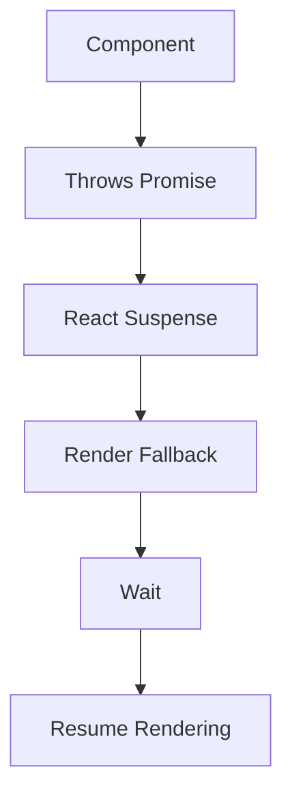
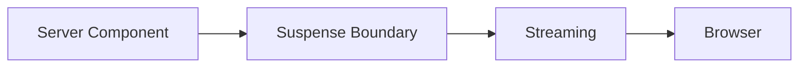
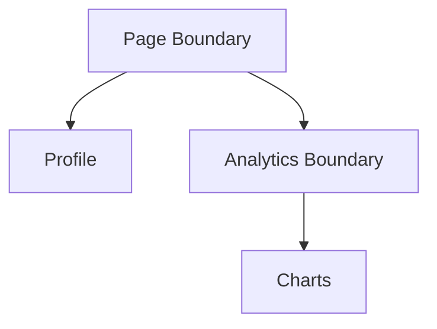
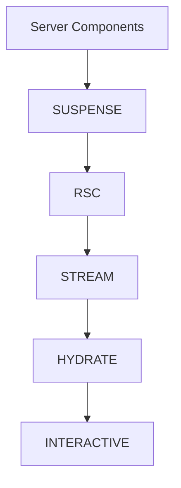

# Appendix P — Understanding Suspense in Next.js 16: The Feature That Makes Everything Else Possible

> **If there is one feature in React and Next.js that beginners find the most mysterious, it is probably `Suspense`.**
>
> Questions like:
>
> * "Is Suspense just a loading spinner?"
> * "Why does Next.js use Suspense everywhere?"
> * "What does `loading.tsx` actually do?"
> * "Why can't Server Components work without Suspense?"
>
> are extremely common.
>
> The short answer is:
>
> > **Suspense is not a loading component.**
>
> Instead:
>
> > **Suspense is React's mechanism for coordinating asynchronous rendering.**
>
> And modern Next.js is built almost entirely on top of this idea.

---

# The Traditional Mental Model

Most developers learn asynchronous programming like this:

```javascript
const data = await fetchData();

render(data);
```

The model is simple:

```text
Wait
   ↓
Get Data
   ↓
Render
```

This is called:

```text
Blocking Execution
```

The problem is:

> blocking scales poorly.

---

# Example: Traditional Page Rendering

Imagine a dashboard:

```tsx
export default async function Dashboard() {
  const profile = await getProfile();
  const analytics = await getAnalytics();
  const reports = await getReports();

  return (
    <>
      <Profile data={profile} />
      <Analytics data={analytics} />
      <Reports data={reports} />
    </>
  );
}
```

Suppose:

| Data      | Time   |
| --------- | ------ |
| Profile   | 50ms   |
| Analytics | 500ms  |
| Reports   | 3000ms |

The rendering timeline becomes:

```text
Wait 50ms
     ↓
Wait 500ms
     ↓
Wait 3000ms
     ↓
Render everything
```

Total:

```text
3550ms
```

The user sees:

```text
Nothing.
```

---

# Humans Hate Waiting

Imagine visiting a restaurant.

The waiter says:

> "We'll bring your meal only after every customer in the restaurant has finished cooking."

That sounds absurd.

Instead, restaurants operate like this:

```text
Food ready?
      ↓
Serve immediately
```

React Suspense applies the same principle.

---

# The Big Idea Behind Suspense

Suspense tells React:

> **"If this part isn't ready, don't stop rendering everything else."**

Instead of:

```text
Wait for entire page
       ↓
Render
```

React does:

```text
Render what is ready
         ↓
Show placeholder
         ↓
Continue rendering later
```

---

# Your First Suspense Boundary

```tsx
<Suspense fallback={<Loading />}>
    <Products />
</Suspense>
```

This does NOT mean:

```text
Show loading spinner
```

Instead it means:

```text
Products unavailable?
          ↓
Continue rendering page
          ↓
Temporarily render fallback
          ↓
Replace later
```

---

# Visualizing Suspense

Without Suspense:

```text
Request
   ↓
██████████████████
   ↓
Entire Page Appears
```

With Suspense:

```text
Request
   ↓
██
   ↓
Header Appears

      ↓
████
      ↓
Sidebar Appears

             ↓
██████
             ↓
Products Appear
```

---

# Example

Suppose we build:

```tsx
export default function Page() {
  return (
    <>
      <Header />

      <Suspense
        fallback={<LoadingProducts />}
      >
        <Products />
      </Suspense>

      <Footer />
    </>
  );
}
```

Execution becomes:

```text
Header
   ↓
Footer
   ↓
LoadingProducts
   ↓
Products later
```

The user never waits for the slow part.

---

# How Suspense Actually Works

The mental model most people have is:

```text
Component
     ↓
returns Loading
```

That is NOT what happens.

Instead:

```text
Component
     ↓
throws Promise
     ↓
React catches Promise
     ↓
Render fallback
     ↓
Promise resolves
     ↓
Resume rendering
```

---

# Visualizing Internal React Execution



This is one of React's most unusual mechanisms.

React literally pauses rendering and resumes later.

---

# Server Components Depend On Suspense

Consider:

```tsx
async function Products() {
  const products =
    await db.product.findMany();

  return (
    <>
      {products.map(product => (
        <div>{product.name}</div>
      ))}
    </>
  );
}
```

When React encounters:

```text
await db.product.findMany()
```

it effectively says:

```text
Pause this subtree.
```

Suspense provides the mechanism that allows this pause.

Without Suspense:

```text
Server Components cannot exist.
```

---

# Streaming Depends On Suspense

Suppose:

```tsx
export default function Page() {
  return (
    <>
      <Navbar />

      <Suspense fallback={<Loading />}>
        <SlowProducts />
      </Suspense>

      <Footer />
    </>
  );
}
```

Timeline:

```text
50ms:
Navbar

100ms:
Footer

120ms:
Loading

3000ms:
Products
```

Without Suspense:

```text
Wait 3000ms
```

With Suspense:

```text
Stream progressively
```

---

# The Relationship Between Suspense And Streaming



Think of Suspense as:

> **the place where React is allowed to pause.**

Streaming then becomes:

> **the mechanism that delivers the completed work later.**

---

# Why loading.tsx Exists

Many beginners think:

```text
loading.tsx
```

is:

```text
A loading page
```

It isn't.

It is actually:

```text
An automatically created Suspense boundary
```

Example:

```
app/dashboard/loading.tsx
```

```tsx
export default function Loading() {
  return <DashboardSkeleton />;
}
```

Next.js internally transforms this into something conceptually similar to:

```tsx
<Suspense
  fallback={<DashboardSkeleton />}
>
    <Dashboard />
</Suspense>
```

---

# Nested Suspense

Suspense boundaries can be nested.

```tsx
<Suspense fallback={<PageLoading />}>

    <Profile />

    <Suspense fallback={<ChartLoading />}>
        <Analytics />
    </Suspense>

</Suspense>
```

This creates:

```text
Page Loading
      ↓
Profile Appears
      ↓
Chart Loading
      ↓
Analytics Appears
```

---

# Visualizing Nested Suspense



Each boundary streams independently.

---

# Suspense Is Not Just For Server Components

Suspense also powers:

### Lazy Loading

```tsx
const Chart =
  React.lazy(() =>
    import("./Chart")
  );
```

---

### Dynamic Imports

```tsx
const Map =
  dynamic(() => import("./Map"));
```

---

### Client-side Data Fetching

```tsx
const data = use(fetchPromise);
```

---

### Streaming

```tsx
<Suspense>
```

---

### Server Components

```tsx
async function Products() {}
```

---

# The Hidden Architecture Of Next.js

Most beginners think Next.js works like this:

```text
Page
   ↓
HTML
```

Internally, it's closer to:



Suspense sits at the center of everything.

---

# Why React Invented Suspense

React discovered a fundamental truth:

> Applications should not wait for their slowest component.

Instead:

```text
Render what you know
       ↓
Show placeholders
       ↓
Continue later
```

This creates:

* progressive rendering,
* streaming,
* partial hydration,
* Server Components,
* route loading states,
* lazy loading.

---

# The Mental Model

Don't think:

> Suspense = Loading Spinner

Think:

> Suspense = Permission To Pause

Or even simpler:

| Traditional Rendering | Suspense Rendering   |
| --------------------- | -------------------- |
| Wait for everything   | Render what is ready |
| Block                 | Continue             |
| One render            | Incremental renders  |
| One response          | Streaming responses  |

---

# Final Mental Model

Everything in modern Next.js depends on Suspense.

```text
Server Components
        ↓
Suspense
        ↓
Streaming
        ↓
RSC Protocol
        ↓
Hydration
        ↓
Interactive UI
```

Which means:

> **Suspense is not a feature of Next.js.**

It is:

> **the execution engine that makes modern React possible.**
