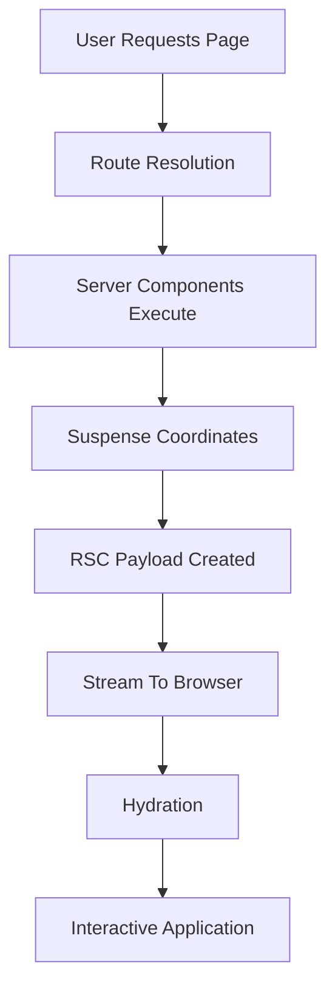
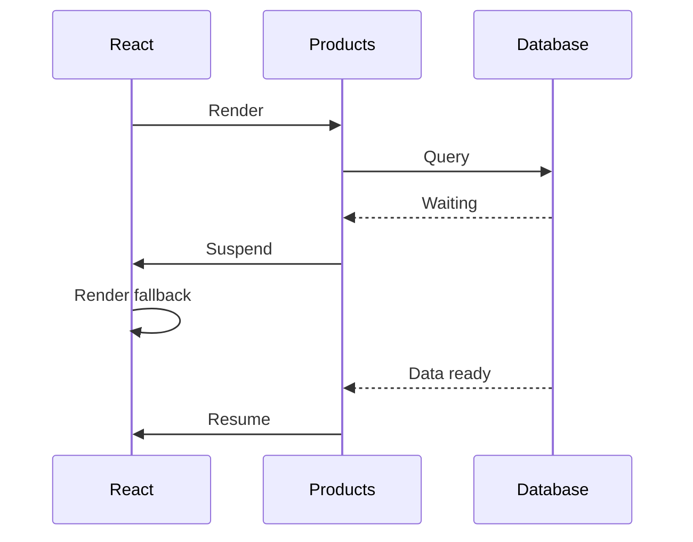
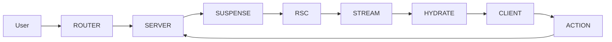

# Appendix Q — Understanding the React Rendering Pipeline: What Actually Happens When You Visit a Next.js Page

This appendix answers the question that beginners eventually ask:

> **"I understand Server Components, Client Components, Suspense, Streaming, Hydration, and the RSC Protocol individually... but what actually happens when I visit a page?"**

---

# Appendix Q — Understanding the React Rendering Pipeline: What Actually Happens When You Visit a Next.js Page

> **One of the biggest challenges when learning Next.js is that every concept is usually taught separately.**
>
> You learn:
>
> * Server Components
> * Client Components
> * Suspense
> * Streaming
> * Hydration
> * RSC Protocol
> * Server Actions
>
> But eventually, every developer asks the same question:
>
> > **What actually happens when I type a URL into my browser?**
>
> This appendix answers that question.

---

# The Old Mental Model

Traditional React applications looked roughly like this:

```text
Browser
    ↓
Download JavaScript
    ↓
Execute JavaScript
    ↓
Fetch API Data
    ↓
Render UI
```

The browser did almost everything.

---

# The Next.js Mental Model

Modern Next.js applications execute across multiple environments:

```text
Browser
    ↓
Server Components
    ↓
RSC Protocol
    ↓
Streaming
    ↓
Hydration
    ↓
Interactive UI
```

This means rendering no longer happens in one step.

It happens in multiple phases.

---

# The Seven Rendering Phases

When a user visits a page, Next.js performs approximately seven major phases:

| Phase | Name                       |
| ----- | -------------------------- |
| 1     | Route Resolution           |
| 2     | Server Component Execution |
| 3     | Suspense Coordination      |
| 4     | RSC Payload Generation     |
| 5     | Streaming Response         |
| 6     | Hydration                  |
| 7     | Client Interaction         |

---

# Visualizing The Entire Pipeline



This is the complete React/Next.js rendering engine.

---

# Phase 1 — Route Resolution

Suppose the user visits:

```text
/products
```

Next.js first determines:

```text
app/products/page.tsx
```

It also discovers:

```text
layout.tsx
loading.tsx
error.tsx
template.tsx
```

The application tree is constructed:

```text
RootLayout
     ↓
ProductsLayout
     ↓
ProductsPage
```

---

# Phase 2 — Server Components Execute

Next.js now begins executing Server Components.

Example:

```tsx
export default async function ProductsPage() {
  const products =
    await db.product.findMany();

  return (
    <ProductList
      products={products}
    />
  );
}
```

Notice:

```text
This code runs on the server.
```

The browser never sees:

```tsx
await db.product.findMany()
```

---

# Phase 3 — Suspense Coordinates Execution

Suppose:

```tsx
<Suspense fallback={<Loading />}>
    <Products />
</Suspense>
```

React now creates a checkpoint.

```text
Can Products finish?
        ↓
      No
        ↓
Suspend
        ↓
Render fallback
        ↓
Resume later
```

This allows rendering to continue.

---

# Visualizing Suspension



---

# Phase 4 — RSC Payload Generation

After execution, React does not send components.

Instead, it creates an RSC payload:

```json
[
  {
    "type": "ProductCard",
    "props": {
      "name": "Laptop"
    }
  }
]
```

Think of this as:

```text
UI Instructions
```

rather than:

```text
HTML
```

or:

```text
JavaScript
```

---

# Phase 5 — Streaming Begins

Instead of waiting:

```text
Wait
Wait
Wait
Render
```

React streams immediately.

Timeline:

```text
100ms:
Header

150ms:
Sidebar

300ms:
Skeleton

3000ms:
Products
```

The browser begins rendering immediately.

---

# Visualizing Streaming

Without streaming:

```text
██████████████████
          ↓
      Entire Page
```

With streaming:

```text
██
 ↓
Header

    ██
     ↓
Sidebar

         ███
          ↓
Products
```

---

# Phase 6 — Hydration

The browser now receives:

* HTML
* RSC payload
* Client Component JavaScript

React reconstructs the component tree.

Example:

```tsx
"use client";

export default function Counter() {
  const [count, setCount] =
    useState(0);

  return (
    <button>
      {count}
    </button>
  );
}
```

Initially:

```text
HTML only
```

After hydration:

```text
HTML + JavaScript behavior
```

---

# Phase 7 — User Interaction

Finally:

```text
Button Click
        ↓
Client Component
        ↓
Server Action
        ↓
Database
        ↓
Re-render
        ↓
RSC Stream
        ↓
Browser Update
```

The cycle begins again.

---

# The Complete Lifecycle



---

# What Makes This Revolutionary

Traditional React:

```text
Download App
       ↓
Execute App
       ↓
Fetch Data
       ↓
Render
```

Next.js:

```text
Execute
      ↓
Suspend
      ↓
Stream
      ↓
Hydrate
      ↓
Interact
      ↓
Re-execute
```

Notice the shift:

| Traditional React | Next.js             |
| ----------------- | ------------------- |
| Browser-first     | Server-first        |
| Single render     | Incremental render  |
| Blocking          | Streaming           |
| JavaScript app    | Distributed runtime |

---

# The Hidden Truth

Most beginners think:

```text
Next.js
     ↓
React
     ↓
HTML
```

Internally, it is much closer to:

```text
Server Components
        ↓
Suspense
        ↓
RSC Protocol
        ↓
Streaming
        ↓
Hydration
        ↓
Client Components
        ↓
Server Actions
        ↓
Re-rendering
```

---

# Final Mental Model

When a user visits a page, Next.js does not:

> **Render a page.**

Instead, Next.js:

> **Executes a distributed rendering pipeline.**

And that pipeline is built from the concepts you've now learned:

```text
Server Components
        ↓
Suspense
        ↓
RSC Protocol
        ↓
Streaming
        ↓
Hydration
        ↓
Client Components
        ↓
Server Actions
        ↓
Route Handlers
```

Once you understand this pipeline:

> **Next.js stops feeling magical and starts feeling architectural.**
