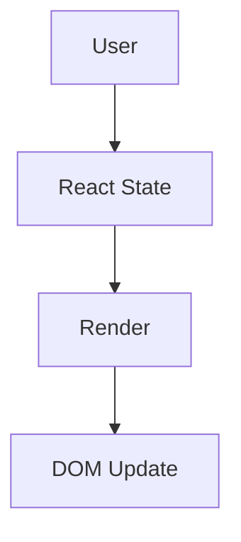
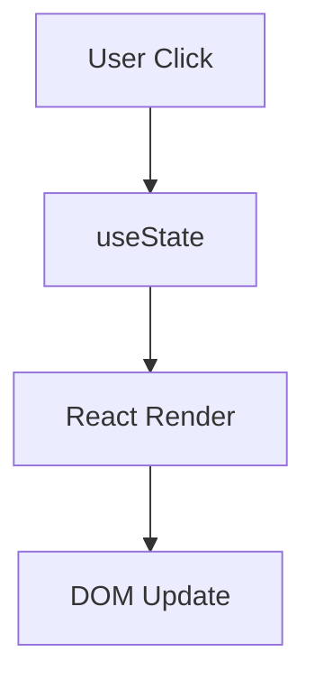
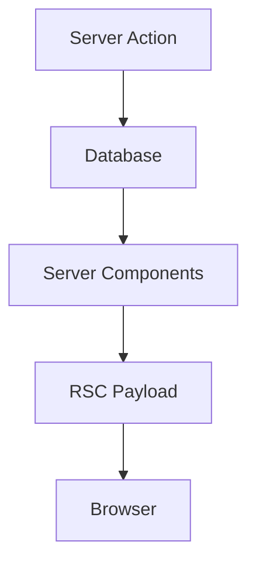
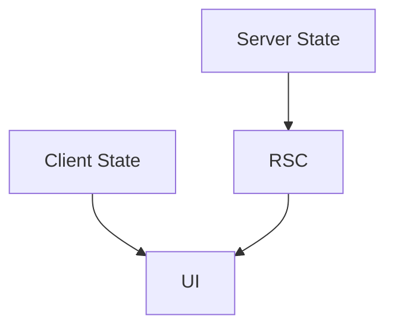
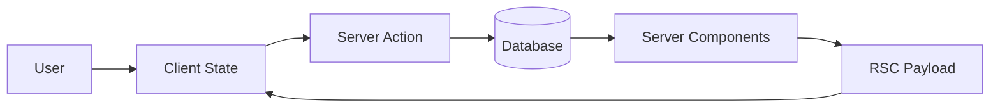

# Appendix R — Understanding Re-rendering in Next.js: Why Everything You Know About React Updates Is Wrong

> **One of the most confusing parts of learning Next.js is realizing that React still re-renders—but not in the way you've spent years learning.**
>
> React developers are taught:
>
> * state changes cause re-renders,
> * props changes cause re-renders,
> * parent re-renders cause child re-renders.
>
> While this is still true, modern Next.js introduces an entirely new kind of re-rendering:
>
> > **Server re-rendering.**
>
> Understanding this distinction is one of the biggest mental shifts in modern React.

---

# The React Mental Model We All Learned

Traditional React applications work like this:

```text
User Event
      ↓
setState()
      ↓
React Re-render
      ↓
Virtual DOM Diff
      ↓
DOM Update
```

Example:

```tsx
function Counter() {
  const [count, setCount] =
    useState(0);

  return (
    <button
      onClick={() =>
        setCount(count + 1)
      }
    >
      {count}
    </button>
  );
}
```

Timeline:

```text
Click
   ↓
State Changes
   ↓
Component Re-renders
   ↓
DOM Updates
```

Everything happens:

```text
Inside the browser
```

---

# The Hidden Assumption

Traditional React teaches us:

> **The browser owns the application state.**



This mental model worked perfectly for SPAs.

---

# Next.js Changes The Owner

In Next.js, much of the state lives on the server.

Consider:

```tsx
export default async function Products() {
  const products =
    await db.product.findMany();

  return (
    <>
      {products.map(product => (
        <div>{product.name}</div>
      ))}
    </>
  );
}
```

Question:

```text
Where is the state?
```

Answer:

```text
The database.
```

Not:

```text
useState()
```

---

# The Two Kinds Of Re-rendering

Modern Next.js applications have two completely different rendering mechanisms.

| Re-render Type   | Location |
| ---------------- | -------- |
| Client Re-render | Browser  |
| Server Re-render | Server   |

---

# Client Re-render

Traditional React behavior:

```tsx
"use client";

function Counter() {
  const [count, setCount] =
    useState(0);

  return (
    <button
      onClick={() =>
        setCount(count + 1)
      }
    >
      {count}
    </button>
  );
}
```

Execution:

```text
Click
   ↓
State Update
   ↓
React Re-render
   ↓
DOM Update
```

No server involved.

---

# Visualizing Client Re-renders



This is the React you've always known.

---

# Server Re-render

Now consider:

```tsx
"use server";

export async function addProduct() {
  await db.product.create({
    data: {
      name: "Laptop"
    }
  });
}
```

When this executes:

```text
Database changes
```

Next.js now performs:

```text
Server Re-render
```

---

# Visualizing Server Re-renders



Notice:

```text
The browser did not re-render itself.
```

Instead:

```text
The server re-rendered the UI.
```

---

# Example

Suppose:

```tsx
export default async function Products() {
  const products =
    await db.product.findMany();

  return (
    <>
      {products.map(product => (
        <div>{product.name}</div>
      ))}
    </>
  );
}
```

And:

```tsx
"use server";

export async function createProduct() {
  await db.product.create(...);
}
```

Timeline:

```text
User Click
      ↓
Server Action
      ↓
Database Update
      ↓
Server Component Re-executes
      ↓
New RSC Payload
      ↓
Browser Updates
```

---

# Notice What Didn't Happen

There was no:

```tsx
setProducts()
```

No:

```tsx
useEffect()
```

No:

```tsx
invalidateCache()
```

No:

```tsx
refetch()
```

No:

```tsx
queryClient.invalidateQueries()
```

Instead:

```text
Server became source of truth.
```

---

# Traditional React Synchronization

SPAs typically require:

```text
Mutation
    ↓
Update Cache
    ↓
Invalidate Cache
    ↓
Fetch Data
    ↓
Re-render
```

Example:

```tsx
await mutation.mutate();

queryClient.invalidateQueries();
```

---

# Next.js Synchronization

Next.js performs:

```text
Mutation
    ↓
Re-render Server
    ↓
Send Updated UI
```

---

# Why This Feels Strange

React developers often ask:

> "Where is my state?"

The answer is:

```text
Wherever it naturally belongs.
```

Examples:

| Data                   | Owner    |
| ---------------------- | -------- |
| Counter value          | Browser  |
| User session           | Server   |
| Products               | Database |
| Orders                 | Database |
| Shopping cart UI state | Browser  |
| Shopping cart data     | Server   |

---

# Think About Google Docs

Google Docs doesn't work like this:

```text
Browser owns document
```

Instead:

```text
Server owns document
```

The browser merely displays:

```text
Current server state
```

Modern Next.js works similarly.

---

# The New React Cycle

Traditional React:

```text
State
   ↓
Render
   ↓
DOM
```

Modern Next.js:

```text
Server State
        ↓
Server Render
        ↓
RSC Payload
        ↓
Browser
```

---

# The Hybrid Model

The reality is that modern applications use both.



Examples:

### Client State

```text
Dropdown open?
Modal visible?
Current tab?
Mouse position?
```

---

### Server State

```text
Products
Orders
Users
Inventory
Sessions
Analytics
```

---

# Why useEffect Disappeared

Before:

```tsx
useEffect(() => {
  fetchProducts();
}, []);
```

Now:

```tsx
const products =
  await db.product.findMany();
```

Because:

```text
Server already owns the data.
```

No synchronization required.

---

# The Mental Model Shift

Stop thinking:

> React re-renders components.

Start thinking:

> **The browser re-renders local state.**
>
> **The server re-renders application state.**

---

# The Architecture Diagram



This loop is the core execution model of modern Next.js.

---

# Final Mental Model

Traditional React:

```text
State → Render → DOM
```

Modern Next.js:

```text
Client State
      ↓
Interact
      ↓
Server State
      ↓
Re-render
      ↓
RSC Payload
      ↓
Browser Update
```

The biggest realization is:

> **React didn't stop re-rendering.**
>
> Instead:
>
> > **Rendering became distributed across the browser and the server.**
