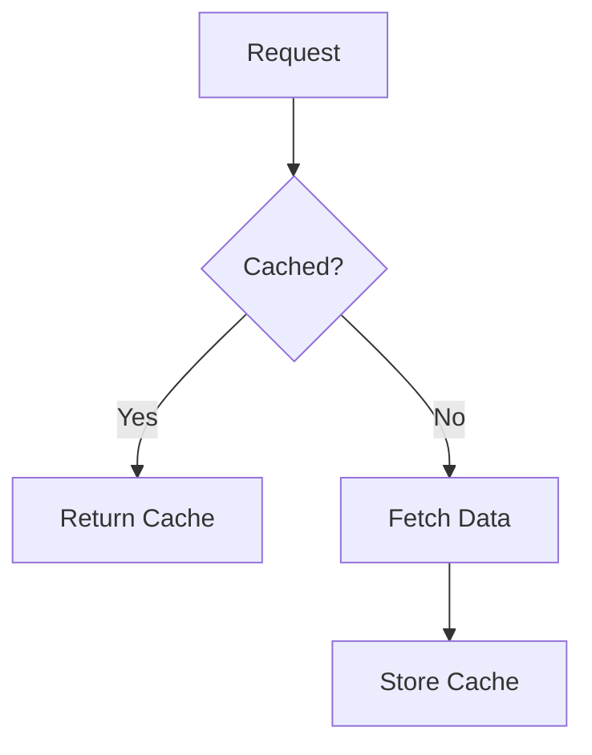
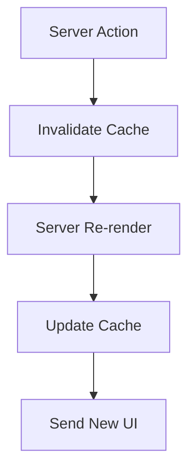
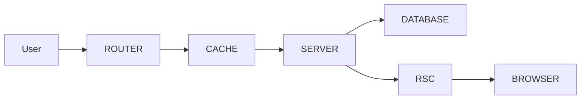

# Appendix S — Understanding Caching, Revalidation, and Why Next.js Doesn't Re-render Everything

> **One of the biggest misconceptions about Server Components is this:**
>
> > "If Server Components execute on the server, won't the server have to rebuild the entire application on every request?"
>
> At first glance, that sounds terrifying.
>
> Imagine:
>
> * thousands of users,
> * hundreds of database queries,
> * dozens of components,
> * every request re-rendering everything.
>
> Surely that would be slower than a traditional SPA.
>
> Surprisingly:
>
> > **Modern Next.js is often faster precisely because it re-renders on the server.**
>
> The secret is:
>
> > **Not everything actually re-renders.**

---

# The Traditional SPA Mental Model

Most React developers learned performance optimization like this:

```text
State changes
       ↓
React re-renders
       ↓
Memoization
       ↓
useMemo
       ↓
useCallback
       ↓
React.memo
```

Example:

```tsx
const expensiveData =
  useMemo(
    () => calculate(),
    [dependency]
  );
```

The assumption was:

> Rendering is expensive.

---

# Why Rendering Was Expensive

In traditional React:

```text
Browser
     ↓
JavaScript Execution
     ↓
Virtual DOM
     ↓
Diffing
     ↓
DOM Updates
```

Every render consumed:

* CPU
* memory
* browser resources
* battery life

So developers became obsessed with preventing renders.

---

# Next.js Changes The Question

Next.js asks:

> **What if we render where rendering is cheap?**

Instead of:

```text
Browser
```

we move rendering to:

```text
Server
```

Where we have:

* CPUs
* memory
* databases
* caches
* distributed infrastructure

---

# The Important Distinction

Many developers imagine:

```text
Request
    ↓
Execute Entire Application
    ↓
Send Response
```

But Next.js actually does something closer to:

```text
Request
    ↓
Reuse Cached Work
    ↓
Execute Missing Work
    ↓
Send Response
```

---

# Three Things Can Be Cached

Modern Next.js caches three different things.

| Cache        | What Is Cached           |
| ------------ | ------------------------ |
| Data Cache   | Database/API results     |
| RSC Cache    | Server Component output  |
| Router Cache | Browser navigation state |

---

# Layer 1 — Data Cache

Suppose:

```tsx
const products =
  await fetch(
    "https://api.store.com/products"
  );
```

Next.js can cache:

```text
The data itself.
```

```text
Request 1:
Database queried

Request 2:
Cached response returned
```

---

# Visualizing Data Caching



---

# Layer 2 — Server Component Cache

Suppose:

```tsx
export default async function Products() {
  const products =
    await getProducts();

  return (
    <ProductList
      products={products}
    />
  );
}
```

Next.js can cache:

```text
The rendered component tree.
```

Meaning:

```text
Request
    ↓
Skip execution
    ↓
Return cached RSC payload
```

---

# Layer 3 — Router Cache

The browser itself also caches.

Suppose:

```text
/Products
      ↓
/Orders
      ↓
Back to /Products
```

The browser may already have:

```text
Products RSC payload
```

No server request required.

---

# Why This Feels Magical

Consider:

```tsx
export default async function Products() {
  const products =
    await db.product.findMany();

  return (
    <>
      {products.map(product => (
        <ProductCard />
      ))}
    </>
  );
}
```

A beginner thinks:

```text
Database executes every request.
```

But Next.js may actually do:

```text
Request
    ↓
Cache Hit
    ↓
Return Existing RSC Payload
```

No database query.

No render.

No computation.

---

# Then Why Do Server Actions Re-render?

Suppose:

```tsx
"use server";

export async function createProduct() {
  await db.product.create();
}
```

Something changed.

Therefore:

```text
Cache is now stale.
```

Next.js performs:

```text
Invalidate
      ↓
Re-render
      ↓
New RSC Payload
```

---

# Visualizing Revalidation



---

# The Brilliant Trick

Traditional SPAs do:

```text
Data Changed
      ↓
Invalidate Query
      ↓
Refetch
      ↓
Re-render
```

Next.js does:

```text
Data Changed
      ↓
Re-render Server
      ↓
Replace UI
```

The application stays synchronized automatically.

---

# Example: Shopping Cart

Traditional React:

```text
Add Item
     ↓
API Call
     ↓
Invalidate Cache
     ↓
Fetch Cart
     ↓
Update State
     ↓
Re-render
```

Next.js:

```text
Add Item
     ↓
Server Action
     ↓
Database
     ↓
Server Re-render
     ↓
Updated UI
```

Much less orchestration.

---

# Why Server Rendering Is Often Faster

The browser no longer downloads:

```text
✓ API Client
✓ Cache Client
✓ Synchronization Logic
✓ Fetching Hooks
✓ Invalidators
✓ State Managers
```

Instead:

```text
Browser
      ↓
Receives UI
```

---

# The New Performance Model

Traditional React optimization:

```text
Prevent renders
```

Next.js optimization:

```text
Make renders cheap
```

---

# The Four Rules

When thinking about Next.js performance, remember:

### Rule 1

```text
Rendering on servers is cheap.
```

---

### Rule 2

```text
Network requests are expensive.
```

---

### Rule 3

```text
JavaScript bundles are expensive.
```

---

### Rule 4

```text
Synchronization complexity is expensive.
```

---

# The Architecture



Notice:

```text
Cache sits in the middle of everything.
```

---

# Final Mental Model

Beginners often think:

> **Server Components execute constantly.**

The reality is closer to:

> **Server Components execute only when necessary.**

Modern Next.js applications operate like this:

```text
Cache
   ↓
Reuse
   ↓
Invalidate
   ↓
Re-render
   ↓
Re-cache
```

Which leads to perhaps the most surprising realization in modern React:

> **The goal of Next.js is not to avoid rendering.**
>
> It is:
>
> > **to make rendering so cheap that you no longer need to fear it.**
