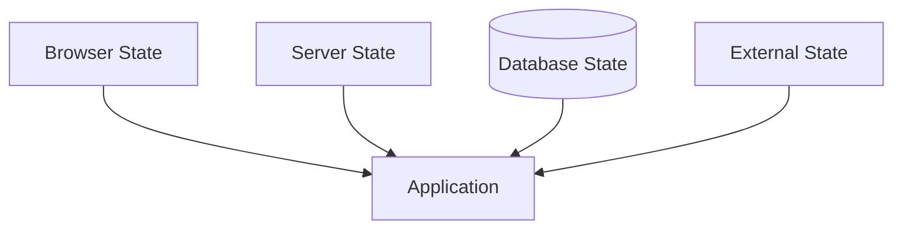
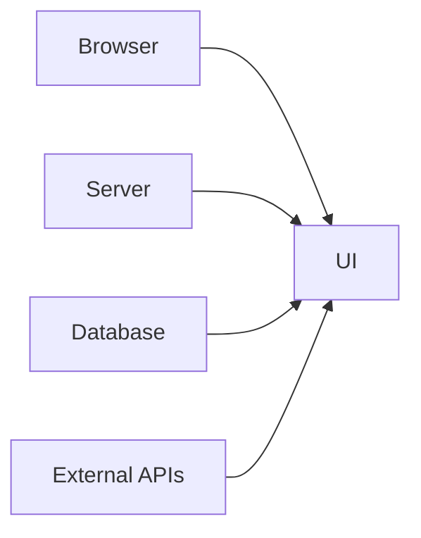
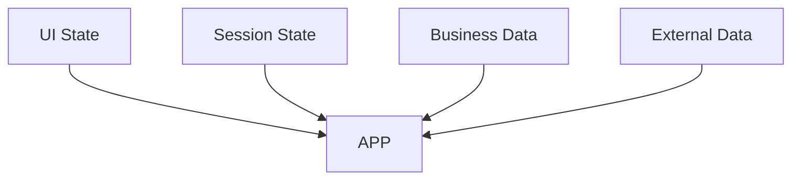

# Appendix T — Understanding State in Next.js: There Is No Such Thing As "The State"

> **One of the first things React developers learn is that applications are built around state.**
>
> ```text
> State → UI
> ```
>
> This mental model works well for traditional React applications.
>
> The problem is:
>
> > **Modern Next.js applications don't have one kind of state.**
>
> They have many kinds of state.
>
> And one of the biggest sources of bugs in React applications comes from storing data in the wrong place.

---

# The Traditional React Mental Model

In traditional React applications, developers often think:

```text
Application
       ↓
    State
       ↓
      UI
```

For example:

```tsx
const [user, setUser] =
  useState();

const [products, setProducts] =
  useState();

const [orders, setOrders] =
  useState();
```

Everything eventually becomes:

```text
useState()
```

or:

```text
Redux
```

or:

```text
Context
```

---

# Why This Creates Problems

Suppose you're building an e-commerce site.

You might have:

```text
Products
Orders
Users
Inventory
Shopping Cart
Authentication
Filters
Modal State
Pagination
```

Should all of these be stored in React state?

Obviously not.

Yet many React applications attempt exactly this.

---

# The Hidden Problem

The mistake is assuming:

> **State is a technical concept.**

It isn't.

State is actually an architectural concept.

The real question is:

> **Who owns this information?**

---

# The Four Owners Of State

Modern Next.js applications have four primary owners of state.

| State Owner      | Examples          |
| ---------------- | ----------------- |
| Browser          | UI interactions   |
| Server           | Authentication    |
| Database         | Business data     |
| External Systems | Third-party state |

---

# Visualizing State Ownership



The application does not own all state.

It coordinates state.

---

# Browser State

Browser state is temporary.

Examples:

```text
Modal open?
Dropdown expanded?
Current tab?
Mouse position?
Scroll position?
Form typing?
```

Example:

```tsx
"use client";

const [isOpen, setIsOpen] =
  useState(false);
```

This state belongs in:

```text
The browser.
```

---

# Why?

Because:

```text
The server doesn't care.
```

The database certainly doesn't care whether your modal is open.

---

# Server State

Some state belongs to the server.

Examples:

```text
Current user
Permissions
Authentication
Feature flags
Session data
```

Example:

```tsx
const session =
  await auth();
```

This state belongs:

```text
On the server.
```

---

# Database State

Most business state belongs here.

Examples:

```text
Products
Orders
Customers
Invoices
Inventory
Payments
Comments
Posts
```

Example:

```tsx
const products =
  await db.product.findMany();
```

Notice:

```text
No useState().
```

Because:

```text
The database already IS the state.
```

---

# External State

Sometimes another system owns the state.

Examples:

```text
Stripe subscriptions
GitHub repositories
Weather APIs
Stock prices
Analytics platforms
```

Example:

```tsx
const weather =
  await fetch(weatherApi);
```

The application merely observes this state.

---

# Visualizing Ownership



---

# Traditional React Architecture

Many applications accidentally do this:

```text
Database
      ↓
API
      ↓
Browser
      ↓
React State
```

Result:

```text
Duplicate State
```

---

# Example

Suppose:

```tsx
const [products, setProducts] =
  useState([]);
```

Question:

```text
Who owns products?
```

Answer:

```text
The database.
```

Yet we copied them into:

```text
Browser memory.
```

Now we have:

```text
Database state
          +
Browser state
```

And they can drift apart.

---

# Synchronization Hell

This creates:

```text
Fetch
   ↓
Store
   ↓
Mutate
   ↓
Invalidate
   ↓
Refetch
   ↓
Update
```

Which is why we invented:

* Redux
* RTK Query
* React Query
* SWR
* Apollo Cache
* Zustand
* MobX

Many libraries exist primarily to solve duplicated ownership.

---

# The Next.js Philosophy

Next.js asks:

> **Why duplicate ownership?**

Instead of:

```text
Database
     ↓
API
     ↓
React State
```

we do:

```text
Database
     ↓
Server Component
     ↓
UI
```

---

# Example

Instead of:

```tsx
const [products, setProducts] =
  useState([]);

useEffect(() => {
  fetchProducts();
}, []);
```

We write:

```tsx
export default async function Products() {
  const products =
    await db.product.findMany();

  return (
    <ProductList
      products={products}
    />
  );
}
```

Notice:

```text
No duplication.
```

---

# The State Decision Tree

Before creating state, ask:

### Question 1

```text
Does this represent UI interaction?
```

If yes:

```text
Browser state.
```

---

### Question 2

```text
Does this represent business data?
```

If yes:

```text
Database state.
```

---

### Question 3

```text
Does this represent authentication?
```

If yes:

```text
Server state.
```

---

### Question 4

```text
Does another system own it?
```

If yes:

```text
External state.
```

---

# Example: Shopping Cart

Many beginners store everything here:

```tsx
const [cart, setCart] =
  useState([]);
```

But let's analyze ownership.

---

## Cart UI State

```text
Cart drawer open?
Current tab?
Animation state?
```

Owner:

```text
Browser
```

---

## Cart Data

```text
Items
Prices
Discounts
Tax
Inventory
```

Owner:

```text
Database
```

---

## User Session

```text
Current user
Permissions
Session
```

Owner:

```text
Server
```

---

# Visualizing Modern State



---

# The Biggest Mental Shift

Traditional React teaches:

> **Store your data in React.**

Modern Next.js teaches:

> **Leave data where it naturally belongs.**

React should not become:

```text
The database.
```

Or:

```text
The session store.
```

Or:

```text
The API cache.
```

React should primarily be:

```text
The user interface.
```

---

# Final Mental Model

Stop asking:

> "Where should I put my state?"

Start asking:

> **"Who actually owns this information?"**

Because modern Next.js applications are not built around:

```text
State
```

They are built around:

```text
State Ownership
```

And understanding state ownership is one of the biggest steps from:

> **React developer**

to

> **Software architect**.
