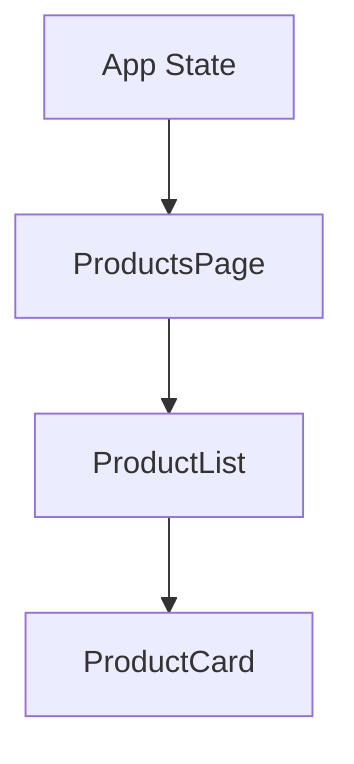
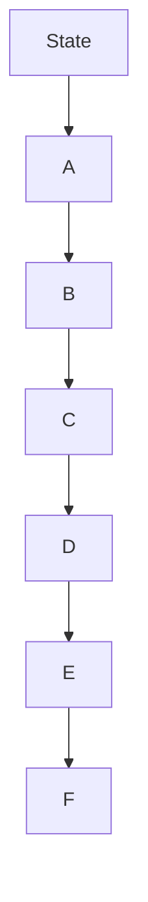
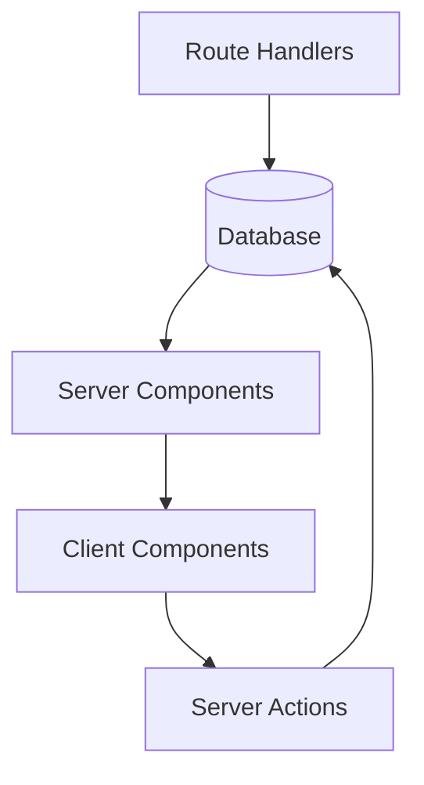
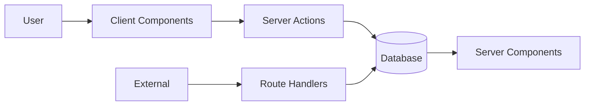
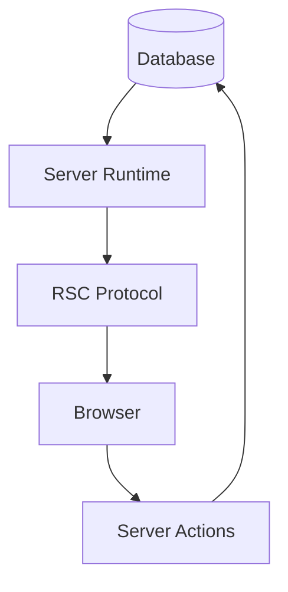

# Appendix U — Understanding Data Flow in Next.js: Why Data No Longer Flows Up and Down

> **One of the first architectural rules React developers learn is this:**
>
> > **Data flows down. Events flow up.**
>
> This principle shaped an entire generation of React applications.
>
> We learned to think about applications as trees:
>
> * parents own state,
> * parents pass props,
> * children emit events,
> * parents update state,
> * React re-renders.
>
> This model works beautifully for client-side applications.
>
> The problem is:
>
> > **Modern Next.js applications are not purely client-side applications anymore.**
>
> And once rendering becomes distributed, something surprising happens:
>
> > **Much of the data no longer flows through React components at all.**
>
> Instead:
>
> > **Data flows through execution environments.**

---

# The Traditional React Mental Model

Consider a typical React application:

```text
App
 ↓
ProductsPage
 ↓
ProductList
 ↓
ProductCard
```

The data flow looks like this:



Everything flows:

```text
Top
 ↓
Bottom
```

---

# Example

```tsx
function App() {
  const [products, setProducts] =
    useState([]);

  return (
    <ProductsPage
      products={products}
    />
  );
}
```

Then:

```tsx
function ProductsPage({
  products
}) {
  return (
    <ProductList
      products={products}
    />
  );
}
```

Then:

```tsx
function ProductList({
  products
}) {
  return products.map(
    product => (
      <ProductCard
        product={product}
      />
    )
  );
}
```

This creates:

```text
State
   ↓
Props
   ↓
Props
   ↓
Props
```

---

# The Famous Problem: Prop Drilling

Eventually applications become:

```text
App
 ↓
Page
 ↓
Layout
 ↓
Sidebar
 ↓
Container
 ↓
Widget
 ↓
Card
```

Data flows through many layers:



Even when intermediate components don't need the data.

---

# The Industry Response

We invented:

* Redux
* Context
* MobX
* Zustand
* Recoil
* Jotai

All attempting to solve:

> **How do we move data through component trees?**

---

# The Hidden Assumption

Traditional React assumes:

> **The browser owns the application.**

Therefore:

```text
Data
   ↓
Component
   ↓
Component
   ↓
Component
```

This assumption breaks in Next.js.

---

# Example: Server Components

Suppose:

```tsx
export default async function ProductsPage() {
  const products =
    await db.product.findMany();

  return (
    <ProductList
      products={products}
    />
  );
}
```

Question:

```text
Where did the data come from?
```

Answer:

```text
The database.
```

Question:

```text
How many components did it pass through?
```

Answer:

```text
Zero.
```

---

# Visualizing Server Data Flow

Traditional React:

```text
Database
     ↓
API
     ↓
Browser
     ↓
State
     ↓
Props
     ↓
Component
```

Next.js:

```text
Database
     ↓
Server Component
     ↓
UI
```

---

# Data No Longer Flows Through Components

Instead:

```text
Data
   ↓
Execution Environment
   ↓
Render
```

This is a massive architectural shift.

---

# Example: Authentication

Traditional React:

```text
Login
   ↓
API
   ↓
Store Token
   ↓
Context
   ↓
Provider
   ↓
Components
```

Modern Next.js:

```tsx
const session =
  await auth();
```

Flow:

```text
Session Store
       ↓
Server
       ↓
Render
```

No Context required.

---

# Example: Products

Traditional SPA:

```text
Browser
     ↓
fetch()
     ↓
REST API
     ↓
Database
     ↓
JSON
     ↓
React State
     ↓
Props
```

Modern Next.js:

```text
Database
     ↓
Server Component
     ↓
HTML + RSC
     ↓
Browser
```

Again:

```text
No prop drilling.
```

---

# Example: Updating Data

Traditional React:

```text
Click
   ↓
API
   ↓
Database
   ↓
Invalidate Cache
   ↓
Refetch
   ↓
State Update
   ↓
Re-render
```

Modern Next.js:

```text
Click
   ↓
Server Action
   ↓
Database
   ↓
Server Re-render
   ↓
RSC Payload
   ↓
Browser Update
```

Notice:

```text
No state synchronization.
```

---

# Visualizing Modern Data Flow



The flow is no longer:

```text
Component
     ↓
Component
```

Instead:

```text
Environment
     ↓
Environment
```

---

# Think Of Airports

Traditional React resembles:

```text
One giant airport terminal.
```

Everything passes through:

```text
Security
     ↓
Passport
     ↓
Customs
     ↓
Gate
```

Modern Next.js resembles:

```text
A transportation network.
```

You might travel via:

* plane,
* train,
* bus,
* ferry.

Different routes exist for different purposes.

---

# The Four Data Flows

Modern Next.js applications have four primary data flows.

---

## Flow 1 — Read

```text
Database
     ↓
Server Component
     ↓
Browser
```

Purpose:

```text
Display data
```

---

## Flow 2 — Interact

```text
Browser
     ↓
Client Component
```

Purpose:

```text
User interaction
```

---

## Flow 3 — Mutate

```text
Client
    ↓
Server Action
    ↓
Database
```

Purpose:

```text
Modify data
```

---

## Flow 4 — Integrate

```text
External System
        ↓
Route Handler
        ↓
Database
```

Purpose:

```text
Machine communication
```

---

# Visualizing The Four Flows



---

# Why Context Became Less Important

Many React developers are surprised that modern Next.js applications often use much less:

* Context
* Redux
* Global state
* Providers

Why?

Because much of the data no longer exists in the browser.

For example:

```text
Products
Orders
Users
Inventory
Sessions
```

already have owners:

* databases,
* servers,
* external systems.

React doesn't need to own them.

---

# The New Mental Model

Stop thinking:

```text
Parent
   ↓
Child
   ↓
Child
   ↓
Child
```

Start thinking:

```text
Read
 ↓
Interact
 ↓
Mutate
 ↓
Integrate
```

Or even:

```text
Database
      ↓
Server Components
      ↓
Client Components
      ↓
Server Actions
      ↓
Database
```

---

# The Hidden Architecture Of Next.js

Most beginners imagine:

```text
React Component Tree
```

Internally, Next.js behaves more like:



The component tree is merely:

> **The user interface representation of a distributed data flow system.**

---

# Final Mental Model

Traditional React asks:

> **How do I pass data through components?**

Modern Next.js asks:

> **Where should this data flow?**

Because in modern Next.js:

```text
Data doesn't primarily flow
through components.

Data flows
through execution environments.
```

And understanding that shift is one of the biggest steps from:

> **Building React applications**

to

> **Designing distributed systems with React.**
