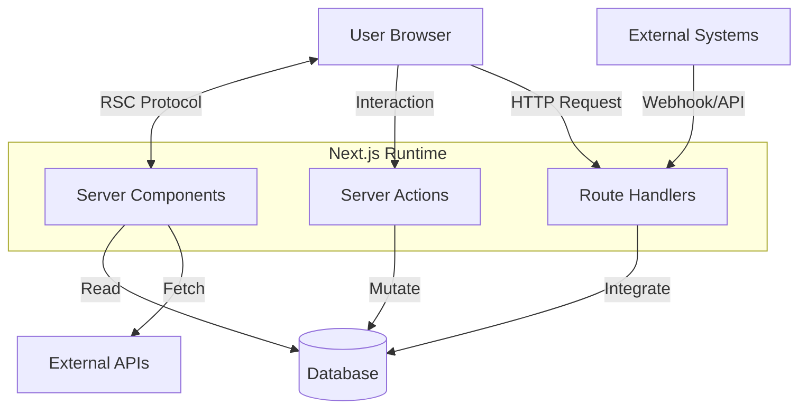
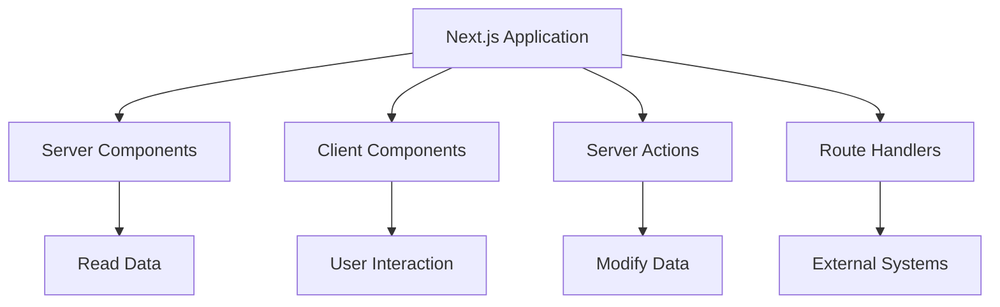
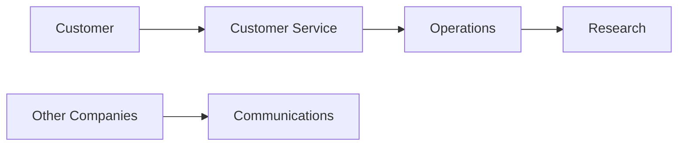

# Next.js 16 for Absolute Beginners

# Part 1 — Stop Thinking in Frontend vs Backend: The Mental Model Shift That Changes Everything

> **If React taught us to think in components, Next.js 16 teaches us to think in execution environments.**

---

# Introduction

One of the biggest reasons developers struggle with modern Next.js is that they bring an old mental model into a new architecture.

For years, web development taught us to think about applications as two completely separate systems:

* a **frontend application** that users interact with
* a **backend application** that handles data and business logic

This model worked well for decades.

In fact, entire ecosystems were built around this separation:

* React
* Angular
* Vue
* Express
* Spring Boot
* ASP.NET
* Rails
* Laravel

The architecture usually looked something like this:

```text
Frontend SPA
      ↓
   REST API
      ↓
   Backend
      ↓
  Database
```

If you learned React before learning Next.js, this architecture probably feels natural.

The problem is:

> **Next.js 16 doesn't really think this way anymore.**

And that's why many beginners feel confused when they first encounter:

* Server Components
* Client Components
* Server Actions
* Route Handlers

They ask questions like:

* "Is this frontend?"
* "Is this backend?"
* "Why do I suddenly have four different kinds of components?"
* "Why do Server Actions exist if Route Handlers already exist?"

The answer is simple:

> **You're asking the wrong question.**

---

# The Old Question

Traditional web architecture asks:

> **Should this code live in the frontend or the backend?**

For example:

### User clicks "Create Post"

```text
User
   ↓
Frontend Validation
   ↓
API Request
   ↓
Backend Validation
   ↓
Business Logic
   ↓
Database
   ↓
JSON Response
   ↓
Frontend State Update
```

This architecture works.

But notice how much infrastructure exists simply to move information around.

---

# The Hidden Cost of Frontend/Backend Separation

Consider what developers often have to build for one simple button click.

## Duplicate Validation

The same rule frequently exists in multiple places:

```text
Browser Validation
        +
API Validation
        +
Database Constraints
```

For example:

```text
"Username must be at least 8 characters"
```

might exist:

* in React
* in the API
* in the database schema

---

## Loading States Everywhere

React developers quickly become familiar with this pattern:

```tsx
const [loading, setLoading] =
  useState(false);

const [error, setError] =
  useState(null);

const [data, setData] =
  useState(null);
```

Then we spend time managing:

* loading states
* error states
* retry states
* empty states
* stale states

---

## API Boilerplate

Even simple operations require many layers:

```text
Button Click
      ↓
fetch()
      ↓
HTTP Request
      ↓
API Endpoint
      ↓
Controller
      ↓
Service
      ↓
Repository
      ↓
Database
```

Sometimes hundreds of lines of code exist simply to move data from one place to another.

---

## Authentication Boundaries

Authentication also becomes more complicated:

```text
Browser
    ↓
JWT/Cookie
    ↓
API
    ↓
Session Validation
    ↓
Business Logic
```

Every request must be:

* authenticated
* authorized
* validated
* serialized
* deserialized

---

## Large JavaScript Bundles

Traditional SPAs often send enormous amounts of JavaScript to the browser:

```text
Browser Downloads:

✓ UI
✓ State Management
✓ API Client
✓ Cache Layer
✓ Loading Logic
✓ Synchronization Logic
✓ Data Fetching Logic
```

Ironically, much of this code exists only because the frontend and backend are separate systems.

---

# The Next.js Mental Model Shift

Next.js asks a completely different question.

Instead of asking:

> **Should this code live in the frontend or backend?**

Next.js asks:

> **Where should this code execute?**

That one question changes everything.

Because different types of code have different requirements.

Some code needs:

* databases
* secrets
* authentication
* file systems

Other code needs:

* clicks
* animations
* browser APIs
* local state

And some code needs:

* HTTP endpoints
* webhooks
* third-party integrations

The goal is no longer:

```text
Frontend
     vs
Backend
```

The goal becomes:

```text
Execute code
where it works best
```

---

# Next.js Is Actually a Distributed Runtime

Most beginners think:

> "Next.js is React with server-side rendering."

That's understandable.

But there's a much more useful mental model:

> **Next.js is a distributed application runtime that happens to use React.**

Your application no longer runs in one place.

Instead, it runs across multiple execution environments.

---

## Visualizing the Architecture



Look carefully at what's happening.

We no longer have:

```text
Frontend
     ↓
Backend
```

Instead, we have:

```text
Read
   ↓
Interact
   ↓
Mutate
   ↓
Integrate
```

---

# The Four Execution Environments

Modern Next.js applications are built from four primary execution environments.

| Execution Environment | Responsibility         | Think Of It As |
| --------------------- | ---------------------- | -------------- |
| Server Components     | Reading data           | The Reader     |
| Client Components     | User interaction       | The Actor      |
| Server Actions        | Modifying data         | The Mutator    |
| Route Handlers        | External communication | The Bridge     |

---

## Another Way to Visualize It



Notice something important:

Each environment exists because it solves a different problem.

---

# A Company Analogy

Imagine your application is a company.

Every department has a specialized responsibility.

| Department        | Responsibility            |
| ----------------- | ------------------------- |
| Server Components | Research Department       |
| Client Components | Customer Service          |
| Server Actions    | Operations Department     |
| Route Handlers    | Communications Department |



In this model:

* **Server Components gather information**
* **Client Components interact with users**
* **Server Actions perform work**
* **Route Handlers communicate externally**

---

# Why This Matters

Once you understand this mental model, many confusing Next.js concepts suddenly become obvious.

You stop asking:

> "Why do we need four different things?"

And start asking:

> "What responsibility does this code have?"

Because in Next.js:

> **Server Components read.**

> **Client Components interact.**

> **Server Actions mutate.**

> **Route Handlers communicate.**

---

# A Simple Exercise

Try categorizing the following tasks:

| Task                     | Which Environment? |
| ------------------------ | ------------------ |
| Fetch blog posts         | ?                  |
| Handle a button click    | ?                  |
| Save a new order         | ?                  |
| Receive a Stripe webhook | ?                  |

Take a moment before reading the answers.

---

## Answers

| Task                   | Environment      |
| ---------------------- | ---------------- |
| Fetch blog posts       | Server Component |
| Handle button click    | Client Component |
| Save new order         | Server Action    |
| Receive Stripe webhook | Route Handler    |

If that feels intuitive, you've already understood the most important concept in modern Next.js.

---

# What We'll Learn Next

In the next part, we'll dive into the first pillar:

# **Server Components — The Reader**

You'll learn:

* why Server Components became the default
* why `useEffect()` often disappears in Next.js
* why Server Components send almost no JavaScript
* how databases, authentication, SEO, and APIs fit naturally into Server Components
* why Server Components represent one of the biggest architectural shifts in modern web development

---

## Key Takeaways

✅ Stop thinking in **frontend vs backend**

✅ Start thinking in **execution environments**

✅ Next.js is a **distributed runtime**

✅ Every execution environment has one responsibility

Remember this phrase:

> **Server Components read.**
>
> **Client Components interact.**
>
> **Server Actions mutate.**
>
> **Route Handlers communicate.**

Everything else in Next.js builds on top of that mental model.
