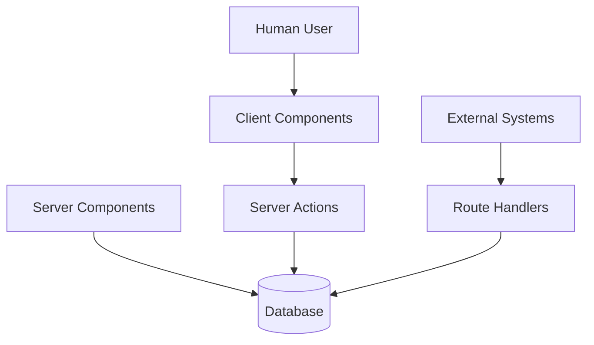

# Next.js 16 for Absolute Beginners

# Part 1 — Stop Thinking in Frontend vs Backend: The Mental Model Shift That Changes Everything

> **If React taught us to think in components, Next.js 16 teaches us to think in execution environments.**

---

# Welcome to This Series

Modern Next.js can feel overwhelming.

Beginners quickly encounter terms like:

* Server Components
* Client Components
* Server Actions
* Route Handlers
* Streaming
* Server Rendering
* React Server Components
* Server Functions
* Edge Runtime

And one question appears almost immediately:

> **"Why does Next.js suddenly have so many different ways to write code?"**

The answer is surprisingly simple:

> **Because modern web applications no longer run in one place.**

This series was created specifically to help beginners understand the architectural shift that happened between traditional React applications and modern Next.js applications.

Rather than memorizing APIs, we'll focus on building a mental model.

Because once you understand the mental model, the APIs become easy.

---

# What You'll Learn In This Series

Throughout this series, we'll progressively build a complete mental model of modern Next.js.

| Part   | Topic                                              |
| ------ | -------------------------------------------------- |
| Part 1 | From Frontend vs Backend to Execution Environments |
| Part 2 | Understanding Server Components — The Reader       |
| Part 3 | Understanding Client Components — The Actor        |
| Part 4 | Understanding Server Actions — The Mutator         |
| Part 5 | Understanding Route Handlers — The Bridge          |
| Part 6 | How The Four Environments Work Together            |
| Part 7 | The Architect's Mental Model                       |

By the end of this series, you'll understand:

* where code executes,
* why some code runs on the server,
* why some code runs in the browser,
* why Server Actions exist,
* why Route Handlers still matter,
* and how professional Next.js applications are actually designed.

---

# The Biggest Mistake Beginners Make

One of the biggest reasons developers struggle with modern Next.js is that they bring an old mental model into a new architecture.

For years, web development taught us to think about applications as two completely separate systems:

* a **frontend application**
* a **backend application**

This model worked well for decades.

Entire ecosystems were built around this separation:

* React
* Angular
* Vue
* Express
* Spring Boot
* ASP.NET
* Rails
* Laravel

The architecture usually looked like this:

```text
Frontend SPA
      ↓
   REST API
      ↓
   Backend
      ↓
  Database
```

If you learned React before learning Next.js, this architecture probably feels completely natural.

The problem is:

> **Next.js 16 doesn't really think this way anymore.**

And that's why many beginners become confused when they first encounter:

* Server Components
* Client Components
* Server Actions
* Route Handlers

They ask questions like:

* "Is this frontend?"
* "Is this backend?"
* "Why do I suddenly have four different types of components?"
* "Why do Server Actions exist if Route Handlers already exist?"

The answer is:

> **You're asking the wrong question.**

---

# The Question Has Changed

Traditional web development asks:

> **Should this code live in the frontend or backend?**

Next.js asks:

> **Where should this code execute?**

That one question changes everything.

Because different types of code have different requirements.

Some code requires:

* databases,
* authentication,
* secrets,
* file systems.

Other code requires:

* clicks,
* animations,
* browser APIs,
* local state.

And some code requires:

* HTTP endpoints,
* webhooks,
* machine-to-machine communication.

The goal is no longer:

```text
Frontend
     vs
Backend
```

The goal becomes:

```text
Execute code
where it works best
```

---

# Before We Go Further, Meet The Four Execution Environments

Everything in modern Next.js revolves around four execution environments.

Think of them as four specialized workers inside your application.

| Environment       | Primary Responsibility | Nickname    |
| ----------------- | ---------------------- | ----------- |
| Server Components | Reading information    | The Reader  |
| Client Components | User interaction       | The Actor   |
| Server Actions    | Modifying information  | The Mutator |
| Route Handlers    | External communication | The Bridge  |

---

## Server Components — The Reader

Server Components answer questions.

Examples:

* Fetch products
* Read user profiles
* Load blog posts
* Query databases
* Call external APIs

```tsx
const products =
  await db.product.findMany();
```

Their job is simple:

> **Read information.**

---

## Client Components — The Actor

Client Components handle user interaction.

Examples:

* button clicks,
* forms,
* dropdown menus,
* animations,
* browser APIs.

```tsx
<button onClick={save}>
  Save
</button>
```

Their job is:

> **Interact with humans.**

---

## Server Actions — The Mutator

Server Actions change information.

Examples:

* create orders,
* update profiles,
* submit forms,
* delete records,
* process payments.

```tsx
await createOrder();
```

Their job is:

> **Modify state safely on the server.**

---

## Route Handlers — The Bridge

Route Handlers communicate with other systems.

Examples:

* REST APIs,
* webhooks,
* mobile applications,
* external integrations.

```tsx
export async function POST() {
  // webhook
}
```

Their job is:

> **Communicate with machines.**

---

# The Entire Architecture In One Picture



Notice what's missing.

There is no:

```text
Frontend
     ↓
Backend
```

Instead, there are specialized execution environments.

---

# The Old Question

Traditional web architecture asks:

> **Should this code live in the frontend or backend?**

For example:

### User clicks "Create Post"

```text
User
   ↓
Frontend Validation
   ↓
API Request
   ↓
Backend Validation
   ↓
Business Logic
   ↓
Database
   ↓
JSON Response
   ↓
Frontend State Update
```

This architecture works.

But notice how much infrastructure exists simply to move information around.

---

# The Hidden Cost of Frontend/Backend Separation

Consider what developers often build for one simple button click.

## Duplicate Validation

```text
Browser Validation
        +
API Validation
        +
Database Constraints
```

The same rule may exist in three different places.

Example:

```text
"Username must be at least 8 characters"
```

exists in:

* React,
* the API,
* the database schema.

---

## Loading States Everywhere

React developers become familiar with:

```tsx
const [loading, setLoading] =
  useState(false);

const [error, setError] =
  useState(null);

const [data, setData] =
  useState(null);
```

Then we spend time managing:

* loading,
* errors,
* retries,
* stale data,
* synchronization.

---

## API Boilerplate

Even simple operations become:

```text
Button Click
      ↓
fetch()
      ↓
HTTP Request
      ↓
API Endpoint
      ↓
Controller
      ↓
Service
      ↓
Repository
      ↓
Database
```

Sometimes hundreds of lines exist simply to move data from one layer to another.

---

## Authentication Boundaries

Authentication becomes another layer of complexity:

```text
Browser
    ↓
JWT/Cookie
    ↓
API
    ↓
Session Validation
    ↓
Business Logic
```

Every request must be:

* authenticated,
* authorized,
* validated,
* serialized,
* deserialized.

---

## Large JavaScript Bundles

Traditional SPAs often send enormous amounts of JavaScript:

```text
Browser Downloads

✓ UI
✓ State Management
✓ API Client
✓ Cache Layer
✓ Loading Logic
✓ Synchronization Logic
✓ Data Fetching Logic
```

Ironically, much of this complexity exists only because frontend and backend were separated.

---

# The Big Idea

The single most important thing to understand about Next.js 16 is this:

> **Next.js is not primarily a frontend framework.**

A more useful mental model is:

> **Next.js is a distributed application runtime that uses React as its programming model.**

Your application no longer runs in one place.

It runs across multiple execution environments.

And those environments have one simple responsibility each:

> **Server Components read.**

> **Client Components interact.**

> **Server Actions mutate.**

> **Route Handlers communicate.**

Everything else in this series builds on top of that idea.

---

# Up Next

In Part 2, we'll explore the first execution environment:

# **Server Components — The Reader**

You'll learn:

* why Server Components became the default,
* why `useEffect()` often disappears,
* why Server Components send almost no JavaScript,
* how they improve performance,
* and why they represent one of the biggest architectural shifts in React history.
