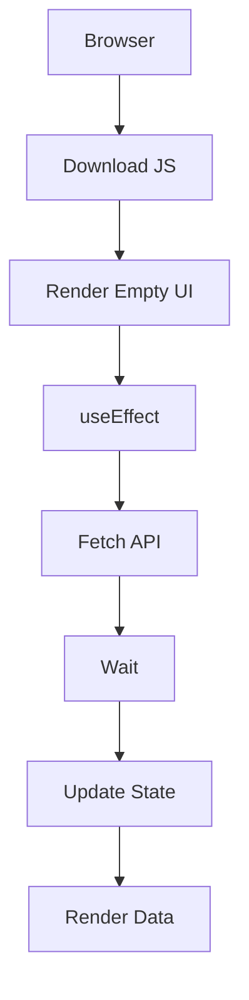
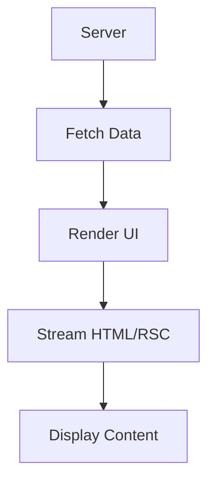
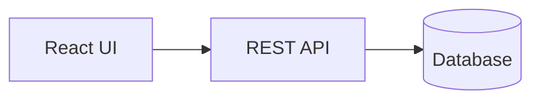
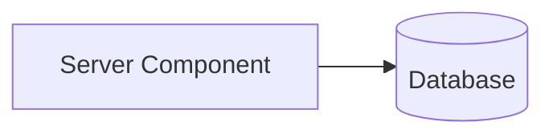
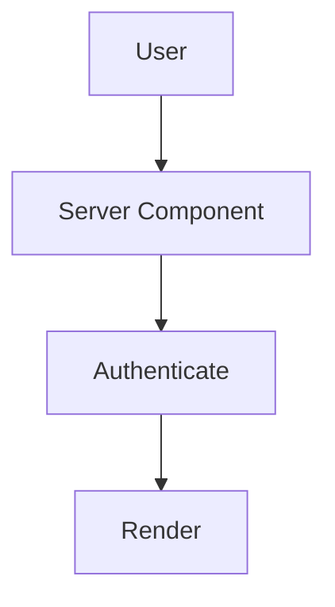
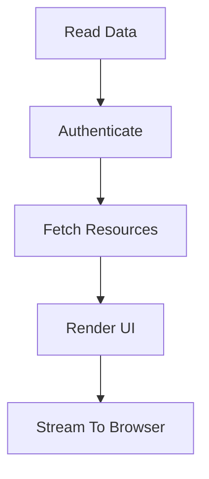

# Next.js 16 for Absolute Beginners

# Part 2 — Server Components: Why Next.js Moved Data Fetching Back to the Server

> **If React components taught us how to build interfaces, Server Components teach us where interfaces should be built.**

---

# Introduction

After learning that Next.js applications are built from multiple execution environments, the next question naturally becomes:

> **Why are Server Components the default?**

For many React developers, this feels backwards.

After all, we spent years learning that the browser should:

* fetch data
* manage state
* render UI
* synchronize APIs
* handle loading

A typical React application often looked like this:

```text
Browser
    ↓
Download JavaScript
    ↓
Render Empty UI
    ↓
Execute useEffect()
    ↓
Call API
    ↓
Wait
    ↓
Update State
    ↓
Render Data
```

This became so common that many developers assumed:

> **This is simply how web applications work.**

But Next.js asks a provocative question:

> **What if the browser didn't have to do all that work?**

---

# Meet the Reader

In Next.js, the primary responsibility of a Server Component is simple:

> **Read information and render the user interface.**

Think of Server Components as the **research department** of your application.

Their job is to:

* gather information,
* prepare the data,
* build the UI,
* and deliver the finished result.

---

## Server Components Are Responsible For

* fetching data
* rendering pages
* performing authentication
* reading files
* calling APIs
* generating HTML

Their defining characteristic is:

> **They execute entirely on the server and send almost no JavaScript to the browser.**

This is one of the biggest architectural shifts in modern web development.

---

# The Old React Mental Model

Many React developers learned data fetching like this:

```tsx
'use client';

import { useEffect, useState }
  from 'react';

export default function Posts() {

  const [posts, setPosts] =
    useState([]);

  const [loading, setLoading] =
    useState(true);

  useEffect(() => {

    fetch('/api/posts')
      .then(res => res.json())
      .then(data => {
        setPosts(data);
        setLoading(false);
      });

  }, []);

  if (loading) {
    return <p>Loading...</p>;
  }

  return (
    <ul>
      {posts.map(post => (
        <li key={post.id}>
          {post.title}
        </li>
      ))}
    </ul>
  );
}
```

This approach works.

But notice how much code exists simply to get data onto the screen.

You need to manage:

* `useState`
* `useEffect`
* loading states
* API endpoints
* network requests
* synchronization

---

# The Server Component Mental Model

Server Components reverse the entire process.

Instead of:

```text
Render
   ↓
Fetch
   ↓
Update
```

we do:

```text
Fetch
   ↓
Render
   ↓
Display
```

---

## The Next.js Way

```tsx
async function getPosts() {

  const response =
    await fetch(
      'https://api.example.com/posts',
      {
        next: {
          revalidate: 3600,
        },
      }
    );

  return response.json();
}

export default async function PostsPage() {

  const posts =
    await getPosts();

  return (
    <ul>
      {posts.map(post => (
        <li key={post.id}>
          {post.title}
        </li>
      ))}
    </ul>
  );
}
```

Notice what's missing:

❌ `useEffect`

❌ `useState`

❌ loading state management

❌ API boilerplate

❌ client-side fetching

---

# Visualizing the Difference

## Traditional React



---

## Server Components



Instead of shipping an application that still needs data, we ship the finished result.

---

# Why Is This Better?

Server Components provide several major advantages.

| Benefit             | Why It Matters                        |
| ------------------- | ------------------------------------- |
| 🚀 Faster rendering | Data loads before the browser renders |
| 🔒 Better security  | Secrets stay on the server            |
| 📦 Smaller bundles  | Less JavaScript shipped               |
| 🔍 Better SEO       | Search engines get HTML               |
| ⚡ Automatic caching | Built into Next.js                    |
| 🧩 Simpler code     | Less boilerplate                      |

---

# Server Components Are Excellent For

Whenever your primary responsibility is:

> **Read information and display it**

a Server Component is usually the correct choice.

---

## 🗄️ Database Queries

Server Components can query databases directly.

```tsx
export default async function UsersPage() {

  const users =
    await prisma.user.findMany();

  return (
    <ul>
      {users.map(user => (
        <li key={user.id}>
          {user.name}
        </li>
      ))}
    </ul>
  );
}
```

---

### Traditional Architecture



---

### Server Component Architecture



No API required.

---

## 🔐 Authentication

Authentication naturally belongs on the server.

```tsx
import { redirect }
  from 'next/navigation';

export default async function Dashboard() {

  const session =
    await auth();

  if (!session) {
    redirect('/login');
  }

  return (
    <h1>
      Welcome,
      {session.user.name}
    </h1>
  );
}
```

---

### Why?

Because the server can access:

* secure cookies
* sessions
* secrets
* permissions
* private APIs

without exposing anything to the browser.



---

## 🔍 SEO

Search engines prefer HTML.

Traditional SPA:

```text
Search Engine
      ↓
Loads Empty App
      ↓
Waits For JavaScript
      ↓
Maybe Finds Content
```

Server Components:

```text
Search Engine
      ↓
Receives HTML
      ↓
Indexes Content
```

---

## 🏗️ Layouts

Layouts are almost always Server Components.

```tsx
export default async function DashboardLayout({
  children,
}) {

  const user =
    await getCurrentUser();

  return (
    <>
      <Sidebar user={user} />
      <main>
        {children}
      </main>
    </>
  );
}
```

Why?

Because layouts usually:

* read data
* authenticate users
* render navigation
* don't require interaction

---

## 🏷️ Metadata

Server Components generate metadata dynamically.

```tsx
export async function generateMetadata(
  { params }
) {

  const post =
    await getPost(params.slug);

  return {
    title: post.title,
    description: post.summary,
  };
}
```

This powers:

* SEO
* OpenGraph
* Twitter cards
* social previews

---

## 📁 Reading Files

Because Server Components execute on the server, they can access the filesystem.

```tsx
import fs
  from 'fs/promises';

export default async function Docs() {

  const file =
    await fs.readFile(
      './README.md',
      'utf8'
    );

  return (
    <pre>{file}</pre>
  );
}
```

The browser can never do this.

---

## 🌐 Calling External APIs

Server Components can call APIs securely.

```tsx
export default async function Weather() {

  const response =
    await fetch(
      'https://api.weather.com',
      {
        headers: {
          Authorization:
            process.env.API_KEY!,
        },
      }
    );

  const weather =
    await response.json();

  return (
    <div>
      {weather.temperature}
    </div>
  );
}
```

Notice:

```text
API Key
    ↓
Server
    ↓
External API
```

The secret never reaches the browser.

---

# The Most Important Rule

Ask yourself:

> **"Am I primarily reading data and displaying it?"**

If the answer is:

```text
YES
```

then you probably want a Server Component.

---

# The Reader Workflow



---

# The New Mental Model

Server Components are not really interactive components.

A better way to think about them is:

> **Server-side render functions that happen to return React.**

Or even simpler:

> **Server Components read and render.**

They do not:

❌ handle clicks

❌ maintain state

❌ run animations

❌ access browser APIs

❌ respond to events

They simply:

✅ read

✅ fetch

✅ authenticate

✅ render

---

# Why Server Components Became the Default

Most applications spend the majority of their time doing one thing:

> **Reading information and showing it to users.**

Examples:

* blog posts
* products
* dashboards
* profiles
* reports
* analytics
* documentation
* search results

And the best place to perform those operations is:

> **The server.**

This is why Next.js 16 made Server Components the default.

---

# Key Takeaways

✅ Server Components are the **readers**

✅ They execute entirely on the server

✅ They send very little JavaScript

✅ They replace much of `useEffect`

✅ They excel at:

* databases
* authentication
* SEO
* layouts
* metadata
* file access
* API fetching

Remember:

> **Server Components read.**

In the next part, we'll meet their opposite:

# **Client Components — The Interactive Layer**

Where we'll answer the question:

> **If Server Components can't handle clicks, then who can?**
