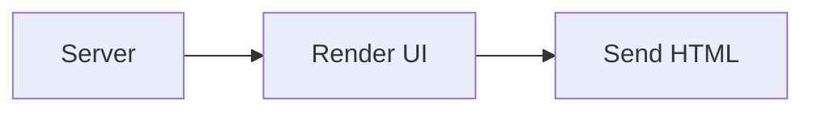
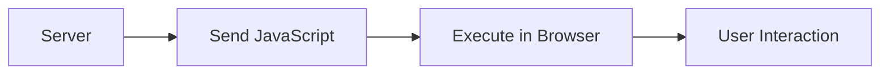
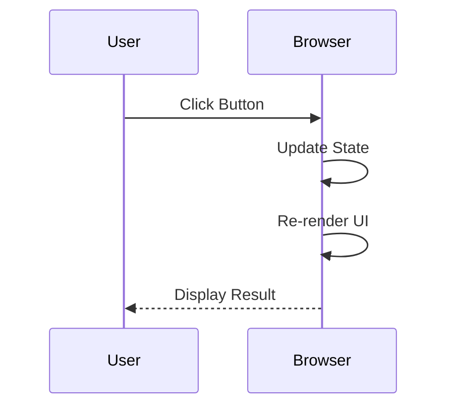
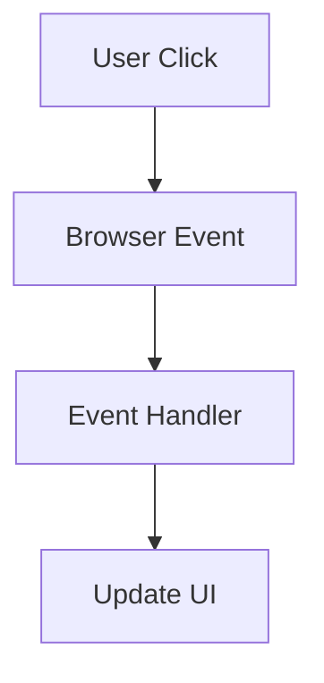
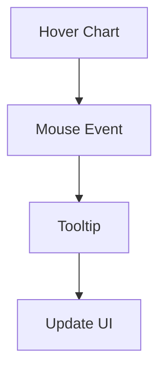
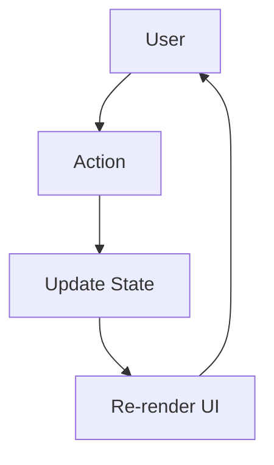
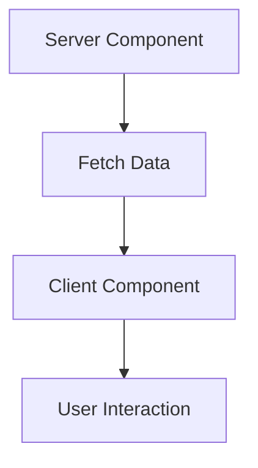

# Next.js 16 for Absolute Beginners

# Part 3 — Client Components: The Interactive Layer of Your Application

> **If Server Components decide what the user sees, Client Components decide what happens when the user does something.**

---

# Introduction

In Part 2, we learned that **Server Components are the readers of your application**.

They excel at:

* fetching data
* authentication
* rendering pages
* SEO
* accessing databases
* calling APIs

But eventually, every beginner asks the same question:

> **If Server Components do everything, why do Client Components exist?**

The answer is simple:

Because users don't just look at applications.

They interact with them.

Users:

* click buttons
* type into forms
* open menus
* drag items
* switch tabs
* play videos
* zoom charts
* upload files

And none of those things happen on the server.

They happen inside the browser.

---

# Meet the Actor

If Server Components are the **readers**, then Client Components are the **actors**.

Their job is simple:

> **Respond to user interaction and create dynamic experiences.**

Think of Client Components as the customer service department of your application.

They:

* listen,
* react,
* remember,
* and interact.

---

# What Makes a Component a Client Component?

A Client Component declares one line:

```tsx
'use client';
```

This tells Next.js:

> **Ship this component to the browser.**

For example:

```tsx
'use client';

export default function Button() {
  return (
    <button>
      Click Me
    </button>
  );
}
```

That single line fundamentally changes where the code executes.

---

# Visualizing the Difference

## Server Component



---

## Client Component



The browser receives JavaScript and executes it locally.

---

# Why Can't Server Components Handle Clicks?

Consider this Server Component:

```tsx
export default function Counter() {

  function increment() {
    console.log('clicked');
  }

  return (
    <button onClick={increment}>
      Click
    </button>
  );
}
```

This won't work.

Why?

Because the component executes here:

```text
Server
```

while the click occurs here:

```text
Browser
```

The server cannot listen for events happening on the user's computer.

A useful mental model is:

```text
Server Components
        ↓
Build the house

Client Components
        ↓
Live inside the house
```

---

# The Simplest Example: State

State is one of the primary reasons Client Components exist.

```tsx
'use client';

import {
  useState,
} from 'react';

export default function Counter() {

  const [count, setCount] =
    useState(0);

  return (
    <>
      <p>{count}</p>

      <button
        onClick={() =>
          setCount(
            count + 1
          )
        }
      >
        Increment
      </button>
    </>
  );
}
```

---

## What Actually Happens?



No server involved.

No network request.

No database call.

Just browser interaction.

---

# Client Components Are Excellent For

Whenever your application needs to:

> **React to something the user does**

you probably need a Client Component.

---

# 📝 Forms and User Input

Forms are perhaps the most common Client Components.

Users expect:

* immediate feedback
* validation
* loading indicators
* dynamic behavior

```tsx
'use client';

import {
  useState,
} from 'react';

export default function LoginForm() {

  const [email, setEmail] =
    useState('');

  return (
    <form>

      <input
        value={email}
        onChange={(e) =>
          setEmail(
            e.target.value
          )
        }
      />

      <button>
        Login
      </button>

    </form>
  );
}
```

---

## Why Client Components?

Because forms require:

```text
User Types
      ↓
Browser Event
      ↓
Update State
      ↓
Re-render UI
```

The server cannot do this in real time.

---

# 🖱️ Event Handlers

Server Components cannot respond to:

* clicks
* mouse movement
* keyboard events
* touch events

Client Components can.

```tsx
'use client';

export default function DeleteButton() {

  function handleDelete() {
    console.log('Deleting');
  }

  return (
    <button
      onClick={handleDelete}
    >
      Delete
    </button>
  );
}
```

---

## Event Flow



---

# ✨ Animations

Animations require JavaScript executing continuously in the browser.

```tsx
'use client';

import {
  motion,
} from 'framer-motion';

export default function Card() {

  return (
    <motion.div
      whileHover={{
        scale: 1.1,
      }}
    >
      Product
    </motion.div>
  );
}
```

Examples include:

* hover effects
* page transitions
* loading animations
* interactive feedback

---

# 🌐 Browser APIs

Some APIs exist only inside the browser.

Examples:

* `window`
* `document`
* `localStorage`
* `sessionStorage`
* `navigator`
* `geolocation`
* `clipboard`
* camera access
* microphone access

---

## Example: Geolocation

```tsx
'use client';

export default function Location() {

  function getLocation() {

    navigator
      .geolocation
      .getCurrentPosition(
        console.log
      );
  }

  return (
    <button
      onClick={getLocation}
    >
      Get Location
    </button>
  );
}
```

---

## Why?

Because this only exists:

```text
Browser
```

and not:

```text
Server
```

---

# 📊 Charts and Visualizations

Charts are highly interactive.

They require:

* resizing
* animations
* tooltips
* filtering
* zooming

```tsx
'use client';

import {
  BarChart,
  Bar,
} from 'recharts';

export default function SalesChart() {

  return (
    <BarChart
      width={400}
      height={300}
      data={sales}
    >
      <Bar
        dataKey="revenue"
      />
    </BarChart>
  );
}
```

---

## Chart Interaction Flow



---

# 🖱️ Drag-and-Drop

Drag-and-drop interfaces require continuous browser interaction.

Examples:

* Kanban boards
* Trello clones
* sortable lists
* page builders
* dashboard widgets

```tsx
'use client';

export default function Kanban() {

  return (
    <div>
      Drag items here
    </div>
  );
}
```

---

# 🧠 State Management

This is perhaps the most important use case.

If your component needs to remember something after rendering, it needs to run in the browser.

Examples include:

* counters
* modal visibility
* selected tabs
* search filters
* shopping carts
* accordions
* dropdown menus

```tsx
'use client';

const [isOpen, setIsOpen] =
  useState(false);
```

---

# The Browser Memory Model



This entire loop happens inside the browser.

---

# A Common Beginner Mistake

Many beginners do this:

```tsx
'use client';

export default function Dashboard() {

  const users =
    await prisma.user.findMany();

  return <div />;
}
```

This is incorrect.

Why?

Because:

```text
Browser
    ↓
Database
```

is impossible.

The browser cannot:

* access databases
* access secrets
* access environment variables
* access private networks

---

# The Golden Rule

Ask yourself:

> **"Does this component need to react to something the user does?"**

If the answer is:

```text
YES
```

then you probably need a Client Component.

---

# Server Components vs Client Components

| Question             | Server Component | Client Component |
| -------------------- | ---------------- | ---------------- |
| Query database?      | ✅                | ❌                |
| Access secrets?      | ✅                | ❌                |
| Fetch data?          | ✅                | ⚠️ Sometimes     |
| Render HTML?         | ✅                | ✅                |
| Handle clicks?       | ❌                | ✅                |
| Use state?           | ❌                | ✅                |
| Use effects?         | ❌                | ✅                |
| Access browser APIs? | ❌                | ✅                |
| Run animations?      | ❌                | ✅                |

---

# The Two Work Together

One of the most important things to understand is:

> **Client Components don't replace Server Components.**

They work together.

Example:



Example:

```tsx
// Server Component
export default async function ProductsPage() {

  const products =
    await getProducts();

  return (
    <ProductList
      products={products}
    />
  );
}
```

```tsx
// Client Component
'use client';

export function ProductList({
  products,
}) {

  const [filter, setFilter] =
    useState('');

  return (
    <>
      <SearchBox
        onChange={setFilter}
      />

      {/* interactive filtering */}
    </>
  );
}
```

Notice the workflow:

```text
Server Reads
      ↓
Browser Interacts
```

---

# The Mental Model

A useful way to remember Client Components is:

> **Server Components answer:**
>
> "What should the user see?"

> **Client Components answer:**
>
> "What should happen when the user does something?"

---

# Key Takeaways

✅ Client Components run in the browser

✅ They are enabled with:

```tsx
'use client'
```

✅ They handle:

* forms
* events
* animations
* browser APIs
* charts
* drag-and-drop
* state management

Remember:

> **Server Components read.**

> **Client Components interact.**

---

In the next part, we'll meet the third pillar of modern Next.js:

# **Server Actions — The Mutators**

Where we'll answer one of the most surprising questions in Next.js:

> **How can a browser call a server function without writing a REST API?**
