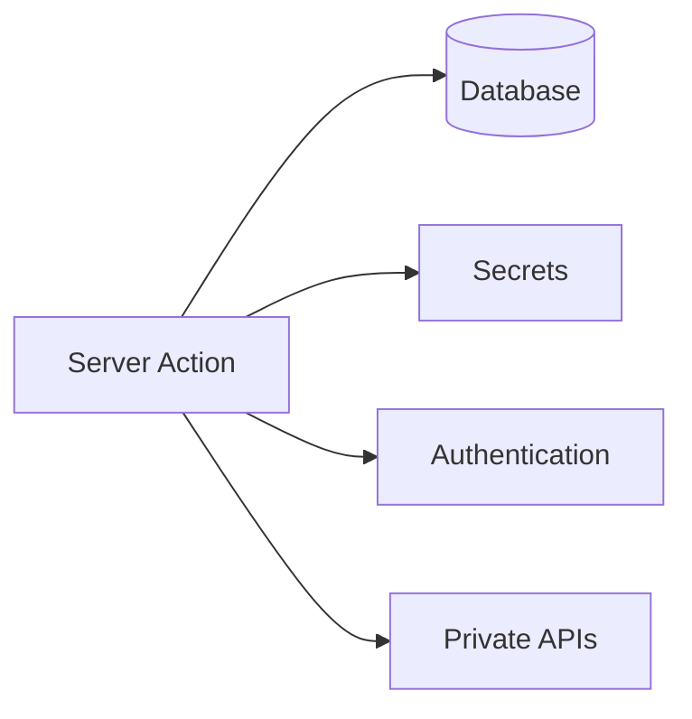
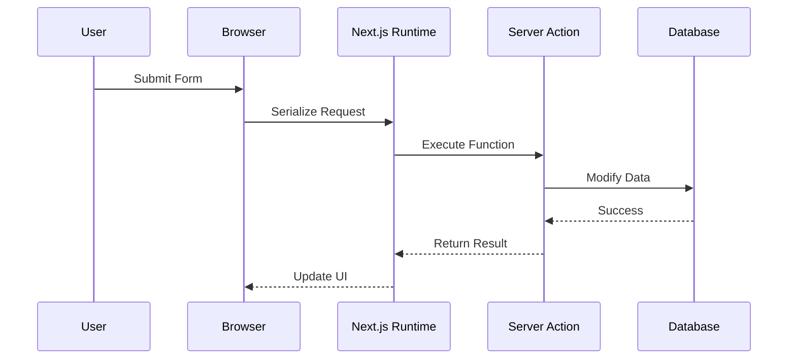
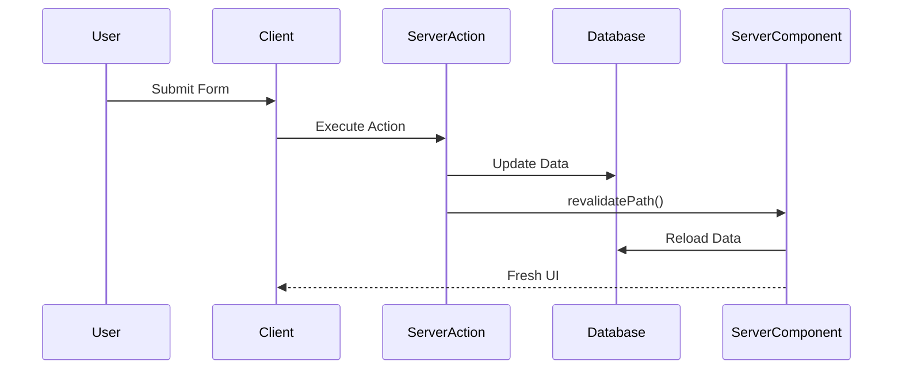
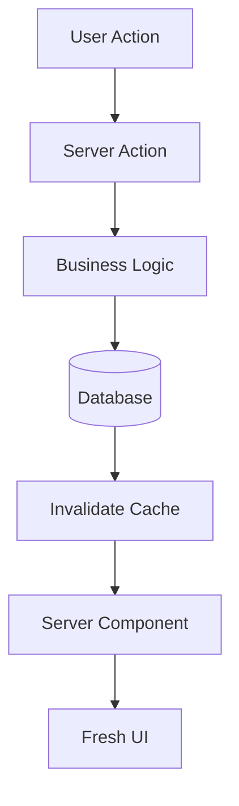
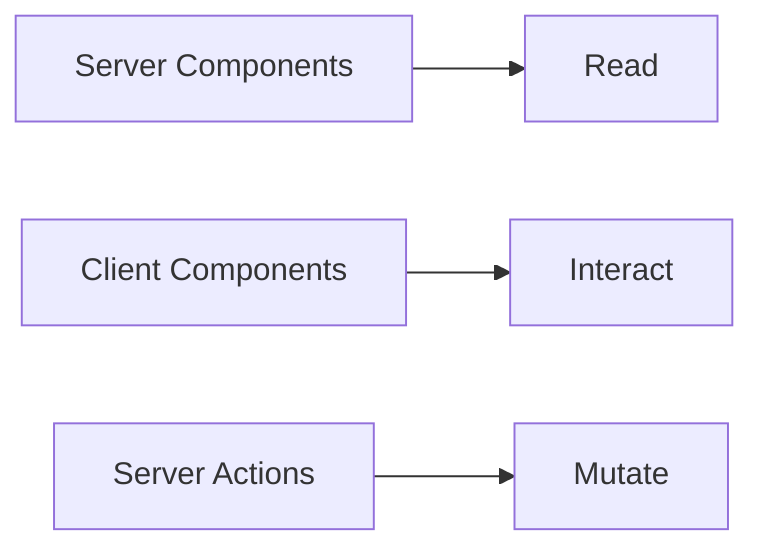

# Next.js 16 for Absolute Beginners

# Part 4 — Server Actions: How Next.js Eliminated Much of the API Boilerplate

> **If Server Components are the readers of your application, Server Actions are the writers.**

---

# Introduction

By now, we've learned that:

* **Server Components read**
* **Client Components interact**

But eventually every application needs to do something more important:

> **Change data.**

Users don't just read information.

They:

* create accounts
* update profiles
* add products to carts
* submit forms
* upload files
* place orders
* send messages

In traditional React applications, this usually meant building an API.

A simple "Create Post" workflow often looked like this:

```text
User Click
      ↓
onSubmit()
      ↓
fetch()
      ↓
REST API
      ↓
Controller
      ↓
Business Logic
      ↓
Database
      ↓
JSON Response
      ↓
Refresh UI
```

This architecture works.

But it also means developers spend enormous amounts of time building infrastructure that exists primarily to move data around.

Next.js introduces a different approach.

---

# Meet the Mutator

If Server Components are the **readers**, then Server Actions are the **mutators**.

Their responsibility is simple:

> **Change the state of your application.**

A useful mental model is to think about SQL.

| SQL Operation | Next.js Primitive |
| ------------- | ----------------- |
| `SELECT`      | Server Components |
| `INSERT`      | Server Actions    |
| `UPDATE`      | Server Actions    |
| `DELETE`      | Server Actions    |

Or even simpler:

> **Server Components read.**
>
> **Server Actions write.**

---

# Why Server Actions Exist

Before Server Actions, updating data required several layers.

```mermaid
graph TD

    USER[User]

    USER --> FORM[Submit Form]

    FORM --> FETCH[fetch()]

    FETCH --> API[API Endpoint]

    API --> LOGIC[Business Logic]

    LOGIC --> DB[(Database)]

    DB --> RESPONSE[JSON Response]

    RESPONSE --> STATE[Update State]

    STATE --> UI[Refresh UI]
```

This architecture requires developers to manually build:

* API endpoints
* serialization
* deserialization
* validation
* error handling
* cache invalidation
* UI synchronization

In other words:

> **Developers had to build the communication layer themselves.**

---

# The Server Action Mental Model

Server Actions simplify the workflow.

Instead of:

```text
Browser
    ↓
REST API
    ↓
Backend
    ↓
Database
```

we now think:

```text
Browser
    ↓
Call Function
    ↓
Server
    ↓
Database
```

This feels almost impossible the first time you see it.

But that's exactly what Next.js provides.

---

# Creating a Server Action

A Server Action is simply a function marked with:

```tsx
'use server';
```

For example:

```tsx
'use server';

import {
  revalidatePath,
} from 'next/cache';

export async function createPost(
  formData: FormData
) {

  const title =
    formData.get('title');

  // Save to database

  revalidatePath('/posts');
}
```

That one line:

```tsx
'use server';
```

tells Next.js:

> **This function must always execute on the server.**

---

# Why Is This Important?

Because server code can safely access:

* databases
* environment variables
* secrets
* authentication
* business logic
* private APIs



None of this information ever reaches the browser.

---

# Calling It From The Browser

Here's where things become interesting.

You can invoke the Server Action directly from a form.

```tsx
'use client';

import {
  createPost,
} from './actions';

export function CreateForm() {

  return (
    <form action={createPost}>

      <input
        name="title"
        required
      />

      <button>
        Create Post
      </button>

    </form>
  );
}
```

Read that carefully.

There is:

* no `fetch()`
* no API endpoint
* no `axios`
* no JSON serialization
* no REST controller

The browser simply calls a server function.

---

# Wait... How Is This Possible?

It feels like magic.

But it's actually a sophisticated Remote Procedure Call (RPC) system.

Behind the scenes, Next.js performs all the networking for you.



The important thing to understand is:

> **Server Actions are not magic.**

They are:

> **Automatically generated secure RPC endpoints.**

---

# A Real Example: Creating a Blog Post

Let's imagine a blogging application.

## Traditional React

```text
Submit Form
      ↓
POST /api/posts
      ↓
Validate Request
      ↓
Save Database
      ↓
GET /api/posts
      ↓
Update useState()
      ↓
Refresh UI
```

---

## Next.js Server Actions

```text
Submit Form
      ↓
Server Action
      ↓
Save Database
      ↓
revalidatePath()
      ↓
Fresh UI
```

Much of the infrastructure disappears.

---

# Server Actions Are Business Operations

One of the biggest beginner misconceptions is:

> "Server Actions are CRUD functions."

Not exactly.

Server Actions are better thought of as:

> **Business operations expressed as server functions.**

For example:

---

## 👤 Register User

```text
Validate Input
       ↓
Hash Password
       ↓
Create User
       ↓
Create Session
       ↓
Redirect User
```

---

## 💳 Checkout

```text
Validate Payment
       ↓
Charge Card
       ↓
Create Order
       ↓
Send Receipt
```

---

## 📦 Submit Order

```text
Validate Inventory
        ↓
Reserve Stock
        ↓
Create Order
        ↓
Update Analytics
```

Notice:

These are not simple database operations.

They are entire business workflows.

---

# The Biggest Feature: Automatic Revalidation

One of the hardest problems in web development is:

> **Keeping the UI synchronized with the database.**

Traditional React often requires:

* calling APIs again
* updating state
* invalidating caches
* refreshing components

Server Actions automate this.

---

# The Revalidation Cycle



---

# What Does `revalidatePath()` Actually Mean?

Consider:

```tsx
revalidatePath('/posts');
```

You're telling Next.js:

> **"The data for this page is now stale. Please fetch it again."**

Think of it like this:

```text
Database Changed
        ↓
Invalidate Cache
        ↓
Server Component Re-runs
        ↓
Fresh UI
```

---

# Example: Shopping Cart

Imagine an e-commerce site.

### Step 1

The Server Component renders:

```text
Cart Total: $100
```

---

### Step 2

The user clicks:

```text
Add Product
```

---

### Step 3

The Client Component calls:

```text
Server Action
```

---

### Step 4

The Server Action:

```text
Updates Cart
        ↓
Recalculates Total
        ↓
Calls revalidatePath()
```

---

### Step 5

The Server Component runs again:

```text
Cart Total: $129
```

The developer never writes:

```tsx
setCart()
```

or

```tsx
fetch('/api/cart')
```

or

```tsx
useEffect(...)
```

The framework handles synchronization automatically.

---

# The Mutation Lifecycle

A useful mental model is:



This creates a beautiful cycle:

```text
Read
  ↓
Interact
  ↓
Mutate
  ↓
Revalidate
  ↓
Read Again
```

---

# Server Actions Are Excellent For

### ➕ Creating Data

* users
* posts
* orders
* comments

---

### ✏️ Updating Data

* profiles
* products
* inventory
* settings

---

### ❌ Deleting Data

* cart items
* files
* records
* accounts

---

### 🔐 Authentication

* login
* logout
* registration
* session creation

---

### 💼 Business Workflows

* checkout
* approvals
* notifications
* payment processing

---

### ♻️ Cache Revalidation

* `revalidatePath()`
* `revalidateTag()`
* UI synchronization

---

# A Useful Rule of Thumb

Ask yourself:

> **"Am I changing the state of my system?"**

If the answer is:

```text
YES
```

then you probably need a Server Action.

---

# The Four Pillars So Far



---

# Key Takeaways

✅ Server Actions execute on the server

✅ They are marked with:

```tsx
'use server'
```

✅ They replace much API boilerplate

✅ They automatically synchronize the UI

✅ They represent business operations, not just CRUD

Remember:

> **Server Components read.**

> **Client Components interact.**

> **Server Actions mutate.**

---

In the next part, we'll explore the final pillar of modern Next.js architecture:

# **Route Handlers — The Bridge**

Where we'll answer the question:

> **If Server Actions already modify data, why do we still need APIs?**
