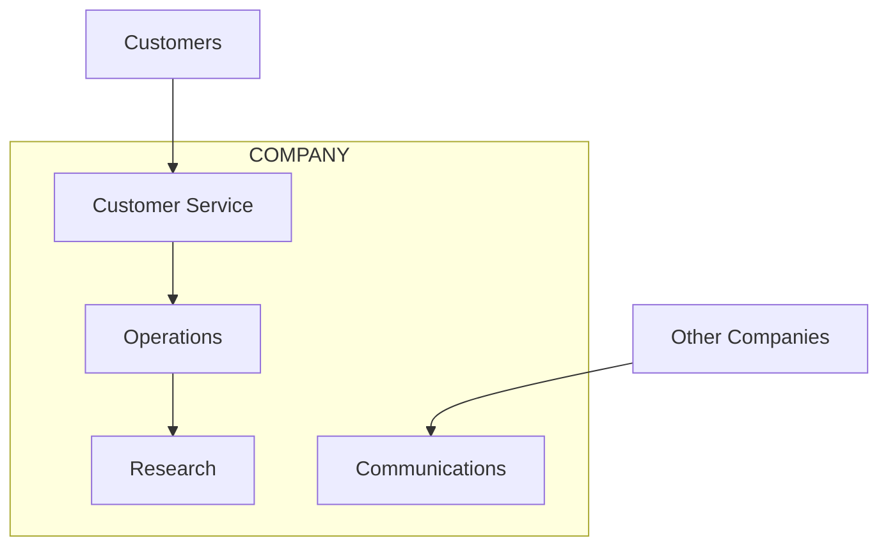
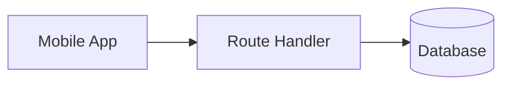
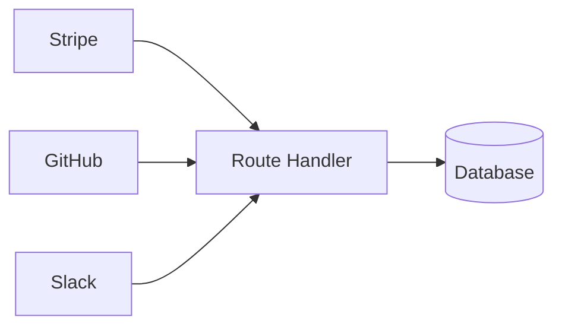
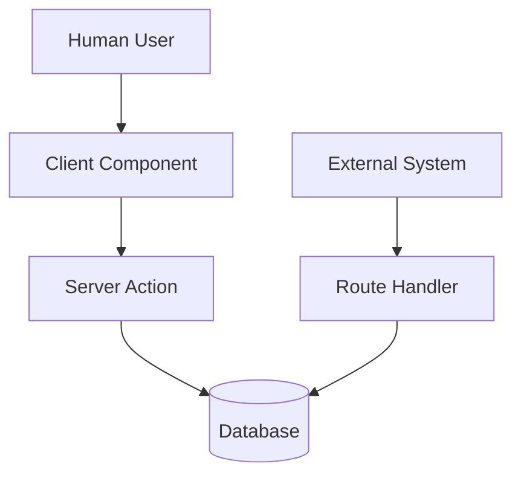

# Next.js 16 Architecture Series

# Part 5 — Route Handlers: The Bridge Between Your Application and the Outside World

> **Server Components read. Client Components interact. Server Actions mutate. Route Handlers communicate.**

After learning about:

* **Server Components** (the readers),
* **Client Components** (the interactive layer), and
* **Server Actions** (the mutators),

we arrive at perhaps the most misunderstood part of Next.js architecture:

> **Route Handlers.**

Many beginners look at Route Handlers and immediately think:

> "Oh, so this is just Express.js inside Next.js."

That's understandable.

But Route Handlers aren't simply API routes.

They solve a very specific architectural problem:

> **How does your application communicate with other machines?**

---

# Most Applications Don't Only Talk To Humans

When learning React, most examples look like this:

```text
User
   ↓
Browser
   ↓
React UI
   ↓
Application
```

This makes it seem like applications only interact with people.

But in production systems, applications spend a surprising amount of time talking to other applications.

Examples include:

* payment providers,
* authentication providers,
* mobile applications,
* webhooks,
* internal microservices,
* external APIs,
* enterprise systems.

For example:

```text
Stripe
    ↓
Your App
```

```text
GitHub
    ↓
Your App
```

```text
Google OAuth
       ↓
Your App
```

```text
Mobile App
       ↓
Your App
```

None of these systems understand React.

They only understand one thing:

> **HTTP.**

---

# Why Server Actions Aren't Enough

After learning Server Actions, beginners often ask:

> "Why do we need Route Handlers at all?"

It's a good question.

Consider a Server Action:

```tsx
'use server';

export async function createOrder() {
  // business logic
}
```

This works beautifully when the caller is:

```text
Browser
   ↓
Client Component
   ↓
Server Action
```

But what happens if Stripe wants to call your application?

```text
Stripe
   ↓
???
```

Stripe cannot:

* import your React code,
* invoke your Server Action,
* understand React Server Components,
* participate in the RSC protocol.

Stripe only knows how to send:

```http
POST /something HTTP/1.1
```

That "something" is a Route Handler.

---

# Think of Route Handlers as the API Department

Imagine your application is a company.

Every department has a specialized role.

| Department        | Responsibility          |
| ----------------- | ----------------------- |
| Server Components | Research                |
| Client Components | Customer Service        |
| Server Actions    | Operations              |
| Route Handlers    | External Communications |



Notice something important:

* humans enter through Client Components,
* machines enter through Route Handlers.

---

# What Exactly Is A Route Handler?

A Route Handler is simply a server function that responds to HTTP requests.

For example:

```text
GET    /api/users
POST   /api/orders
PUT    /api/profile
DELETE /api/cart
```

In Next.js, these are created inside:

```text
app/api/.../route.ts
```

For example:

```text
app/api/users/route.ts
```

---

# Creating Your First Route Handler

```tsx
// app/api/users/route.ts

export async function GET() {
  return Response.json({
    users: [
      {
        id: 1,
        name: 'John',
      },
    ],
  });
}
```

This creates:

```text
/api/users
```

which can be called by:

* browsers,
* mobile applications,
* curl,
* Postman,
* external services,
* other servers.

---

# Receiving Data

Route Handlers can also receive incoming data.

```tsx
export async function POST(
  request: Request
) {
  const body =
    await request.json();

  return Response.json({
    success: true,
    received: body,
  });
}
```

This behaves exactly like a traditional backend endpoint.

---

# The Most Important Use Case: Webhooks

One of the biggest reasons Route Handlers exist is webhooks.

A webhook is simply:

> **One server notifying another server that something happened.**

For example:

```text
Customer Pays
        ↓
Stripe
        ↓
HTTP POST
        ↓
Route Handler
        ↓
Database Update
```

---

# Example: Stripe Webhook

```tsx
// app/api/webhooks/stripe/route.ts

export async function POST(
  request: Request
) {
  const payload =
    await request.json();

  const signature =
    request.headers.get(
      'stripe-signature'
    );

  if (
    isAuthorized(signature)
  ) {
    // update database

    return Response.json({
      success: true,
    });
  }

  return Response.json(
    {
      error: 'Unauthorized',
    },
    {
      status: 401,
    }
  );
}
```

---

# Why Verification Matters

Webhook endpoints are public.

Without verification:

```text
Attacker
    ↓
POST /api/webhook
    ↓
Fake Payment
    ↓
Database Corruption
```

With verification:

```text
Stripe
    ↓
Signed Request
    ↓
Verify Signature
    ↓
Process Event
```

Always verify webhook signatures.

---

# OAuth Callbacks

Another common use case is authentication.

```text
User Clicks Login
        ↓
Google
        ↓
OAuth Redirect
        ↓
Route Handler
        ↓
Create Session
        ↓
Redirect User
```

Examples include:

* Google,
* GitHub,
* Microsoft,
* Okta,
* Auth0.

---

# Mobile Applications

Mobile apps cannot call:

* Server Components,
* Client Components,
* Server Actions.

They only understand HTTP.



This allows your Next.js application to serve as a backend for:

* iOS,
* Android,
* React Native,
* Flutter,
* desktop applications.

---

# File Uploads

Route Handlers are also useful for processing files.

```text
Upload File
      ↓
Route Handler
      ↓
Validate
      ↓
Store
      ↓
Update Database
```

Examples include:

* images,
* PDFs,
* videos,
* CSV files,
* documents.

---

# Third-Party Integrations

Many enterprise systems communicate exclusively through APIs.

Examples include:

* Stripe,
* GitHub,
* Slack,
* Shopify,
* Salesforce,
* SAP,
* AWS services.



---

# Humans vs Machines

A useful mental model is:



Notice the distinction:

| Actor    | Uses                               |
| -------- | ---------------------------------- |
| Humans   | Client Components + Server Actions |
| Machines | Route Handlers                     |

---

# Route Handlers Are Excellent For

✅ Webhooks

✅ REST APIs

✅ OAuth callbacks

✅ Mobile applications

✅ File uploads

✅ Third-party integrations

✅ Machine-to-machine communication

---

# A Useful Rule of Thumb

Ask yourself:

> **"Is another machine communicating with my application using HTTP?"**

If the answer is **yes**, then you probably need a Route Handler.

```text
External System
        ↓
HTTP
        ↓
Route Handler
        ↓
Business Logic
        ↓
Database/API
        ↓
HTTP Response
```

---

# The Mental Model To Remember

The four pillars of Next.js architecture can now be summarized as:

> **Server Components read.**

> **Client Components interact.**

> **Server Actions mutate.**

> **Route Handlers communicate.**

Or even shorter:

> **Humans use Server Actions.**
>
> **Machines use Route Handlers.**

---

# Next Up

In **Part 6**, we'll finally put everything together and answer the question:

> **How do Server Components, Client Components, Server Actions, and Route Handlers work together to create a self-synchronizing application?**
