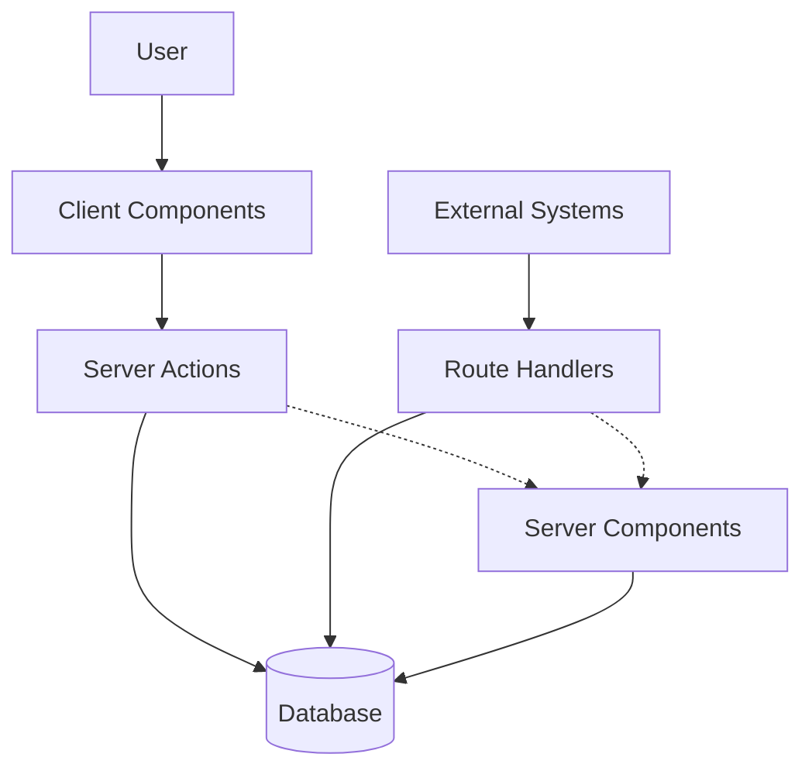
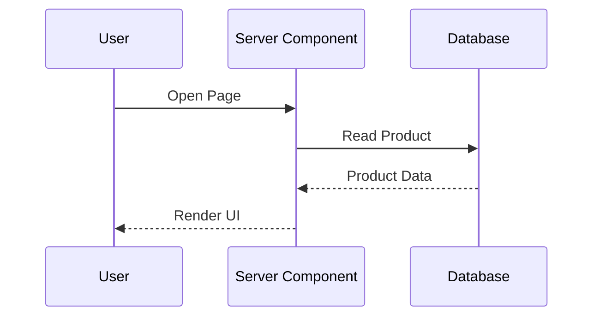
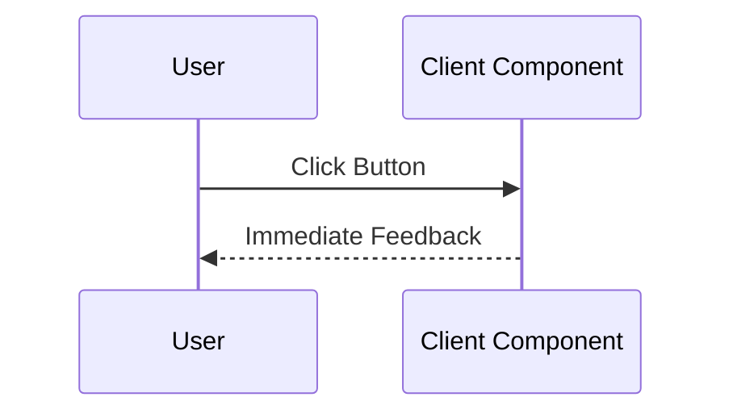
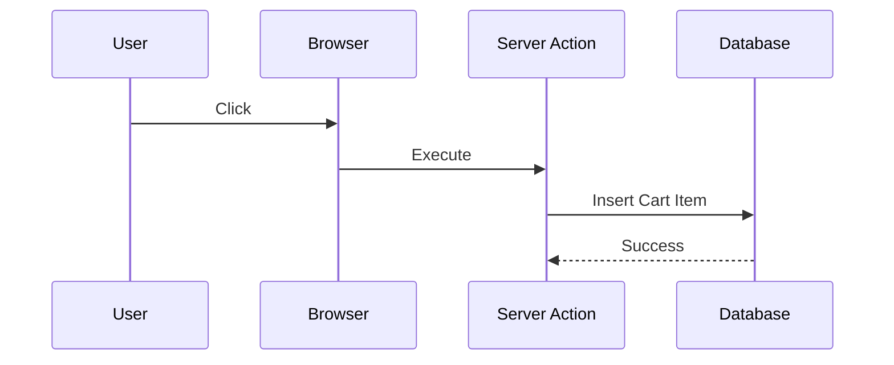
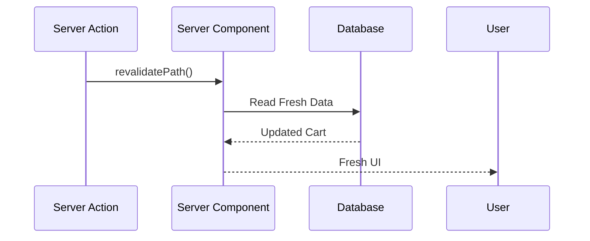
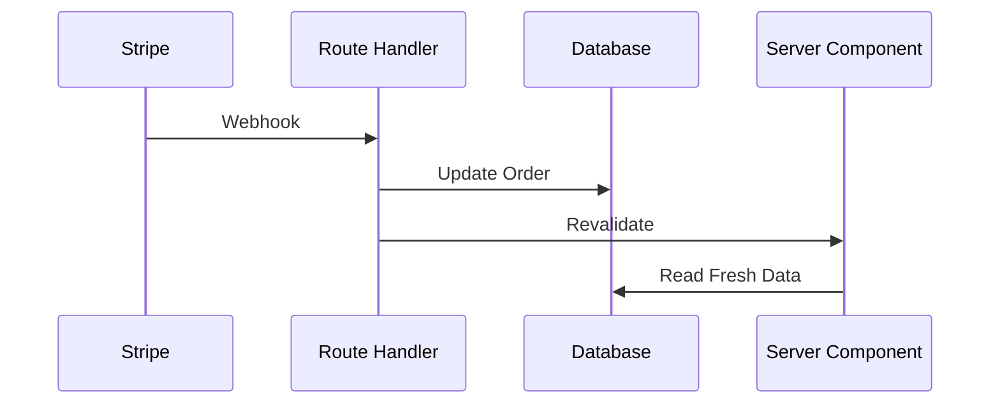
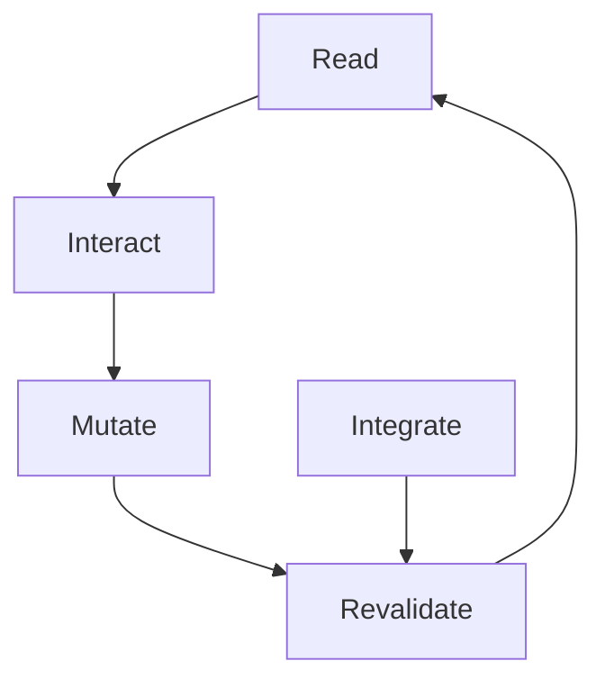
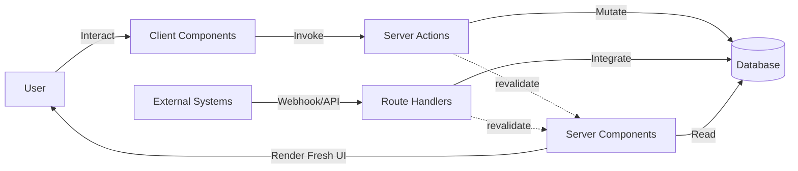

# Next.js 16 Architecture Series

# Part 6 — How the Four Pillars Work Together

> **Server Components read.**
>
> **Client Components interact.**
>
> **Server Actions mutate.**
>
> **Route Handlers communicate.**
>
> Individually, these concepts make sense.
>
> The real magic happens when they work together.

---

# Up Until Now, We've Been Studying The Departments

In the previous parts of this series, we've examined each architectural pillar separately:

| Pillar            | Responsibility |
| ----------------- | -------------- |
| Server Components | Read           |
| Client Components | Interact       |
| Server Actions    | Mutate         |
| Route Handlers    | Communicate    |

But real applications don't use these features in isolation.

A real application looks more like this:



This is where Next.js stops feeling like a framework and starts feeling like an operating system.

---

# The Biggest Misunderstanding About Next.js

Many beginners think the architecture works like this:

```text
Frontend
     ↓
Backend
     ↓
Database
```

But that's not how modern Next.js applications operate.

The actual flow looks more like this:

```text
Read
   ↓
Interact
   ↓
Mutate
   ↓
Integrate
   ↓
Revalidate
   ↓
Read Again
```

This cycle is the secret behind why Next.js applications feel synchronized without writing enormous amounts of client-side state management code.

---

# Example: Building An Online Store

Let's imagine we're building an e-commerce application.

Our application supports:

* product pages,
* shopping carts,
* checkout,
* payment processing,
* Stripe webhooks,
* order tracking.

The question is:

> Which execution environment handles each responsibility?

---

# Step 1 — Server Components Read

The user opens a product page.

```text
User Opens Product Page
           ↓
Server Component
           ↓
Database
           ↓
Render UI
```

```tsx
export default async function ProductPage() {
  const product =
    await db.product.findFirst();

  return (
    <>
      <h1>
        {product.name}
      </h1>

      <AddToCartButton
        id={product.id}
      />
    </>
  );
}
```

The Server Component performs the read.



Notice:

* no API endpoint,
* no loading spinner,
* no useEffect,
* no client fetch.

---

# Step 2 — Client Components Interact

The user clicks:

```text
Add To Cart
```

The browser handles the interaction.

```tsx
'use client';

export function AddButton() {
  return (
    <button>
      Add To Cart
    </button>
  );
}
```

The Client Component's job is simple:

```text
User Action
      ↓
Capture Event
```



---

# Step 3 — Server Actions Mutate

The Client Component invokes a Server Action.

```tsx
'use server';

export async function addToCart(
  productId: string
) {
  await db.cart.create({
    data: {
      productId,
    },
  });

  revalidatePath('/cart');
}
```

The flow becomes:



The important point:

> The browser never touches the database.

The Server Action becomes the secure mutation layer.

---

# Step 4 — Revalidation Happens

This is where Next.js becomes special.

After the mutation:

```tsx
revalidatePath('/cart');
```

Next.js automatically performs:

```text
Invalidate Cache
        ↓
Re-read Data
        ↓
Re-render Server Component
        ↓
Update UI
```



This means the developer never writes:

```tsx
setCart()

fetch('/api/cart')

useEffect()

invalidateQueries()

refreshPage()
```

The framework handles synchronization.

---

# Step 5 — External Systems Join The Party

Now imagine the customer pays using Stripe.

```text
Customer Pays
       ↓
Stripe
       ↓
Webhook
       ↓
Your Application
```

Stripe cannot call:

* React,
* Client Components,
* Server Actions,
* hooks.

Stripe only understands HTTP.

---

# Route Handlers Handle External Communication

```tsx
// app/api/webhooks/stripe/route.ts

export async function POST(
  request: Request
) {
  const payload =
    await request.json();

  await updateOrder(
    payload.orderId
  );

  revalidatePath(
    '/orders'
  );

  return Response.json({
    success: true,
  });
}
```

The flow becomes:



Again:

> No client-side synchronization code exists.

---

# The Self-Synchronizing Architecture

This creates one of the most elegant loops in modern web development:



Everything continuously refreshes itself.

---

# Visualizing The Entire System



This diagram is arguably the single most important diagram in modern Next.js.

---

# Why Does This Feel So Different?

Traditional React applications often required:

```text
User Action
      ↓
API Call
      ↓
Update Database
      ↓
Fetch Again
      ↓
Update State
      ↓
Update Cache
      ↓
Refresh UI
```

Next.js reduces this to:

```text
User Action
      ↓
Server Action
      ↓
Database
      ↓
Revalidate
      ↓
Fresh UI
```

The framework performs the synchronization.

---

# The Secret: Separation By Responsibility

The breakthrough isn't:

> Server-side rendering.

The breakthrough is:

> Separation by responsibility.

| Responsibility         | Execution Environment |
| ---------------------- | --------------------- |
| Read data              | Server Components     |
| Handle interaction     | Client Components     |
| Modify data            | Server Actions        |
| Communicate externally | Route Handlers        |

---

# The Four Questions Every Next.js Developer Should Ask

Whenever you write code, ask:

### Question 1

> Am I reading data?

Use:

```text
Server Components
```

---

### Question 2

> Am I handling user interaction?

Use:

```text
Client Components
```

---

### Question 3

> Am I changing system state?

Use:

```text
Server Actions
```

---

### Question 4

> Am I communicating with another machine?

Use:

```text
Route Handlers
```

---

# The One Sentence To Remember

If this entire series could be reduced to a single sentence, it would be this:

> **Next.js applications are not frontend applications talking to backend applications.**
>
> **They are distributed applications executing specialized responsibilities in different environments.**

And that is why:

> **Server Components read.**
>
> **Client Components interact.**
>
> **Server Actions mutate.**
>
> **Route Handlers communicate.**

Once you understand this cycle, Next.js stops feeling magical and starts feeling inevitable.

---

# Next Up

In **Part 7**, we'll build the **Architect's Mental Model**—a practical decision framework that answers the question every Next.js developer eventually asks:

> **"How do I know which execution environment I should use?"**
